# Item Reservations

## Item Reservations 

PrintVis enables users to create official item reservations for materials needed for jobs, as well as replacements for those materials. This functionality is available on the 

### Material Requirements 
Material Requirements page, which displays two lists:
- The top list: Material requirements for the job.
- The bottom list: Item reservation entries for the selected item (reservations appear as negative numbers).

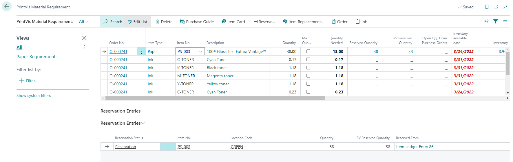

**Tip:** It is recommended to create a custom view for "Paper Requirements" to filter the list to items with an Item Type of Paper.

 Key Fields

| Field                    | Description                                                                 |
|--------------------------|-----------------------------------------------------------------------------|
| Quantity                  | The quantity estimated for the job.                                          |
| Quantity Needed           | Estimated quantity minus reserved and consumed quantity (never goes below 0).|
| Reserved Quantity         | Base quantity of the item reserved.                                          |
| PV Reserved Quantity      | Quantity reserved based on reservation factor.                               |
| Open Qty From POs         | Quantity on open purchase orders yet to be received.                         |

### Creating the Reservations

There are two ways to create manual item reservations from the material requirements list:

#### Reserve Exact Item and Amount from Cost Center Location
- Highlight the material requirement line.

- Click the **Reserve** button to display item details and ledger entries.

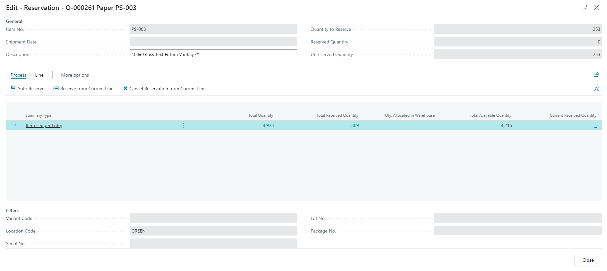

- Highlight the item ledger entry to use for the reservation and click **Process → Reserve from Current Line**.

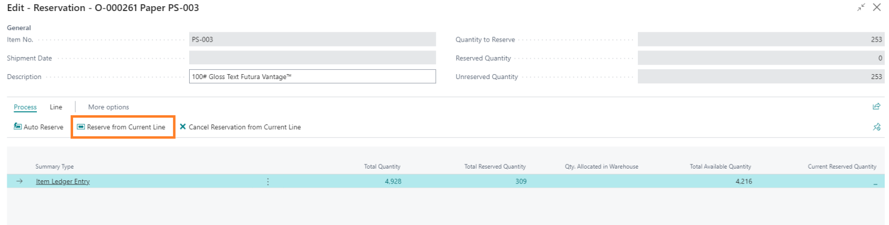

- The reserved quantity will be updated on the **Item Ledger Entry**.

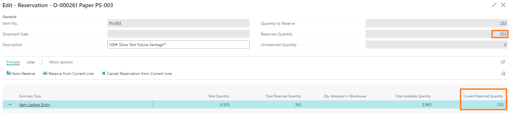

#### Reserve Different Item, Different Amount, or Item from a Different Location
- Highlight the material requirement line.

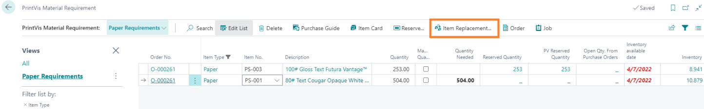

- Click the **Item Replacement** button.

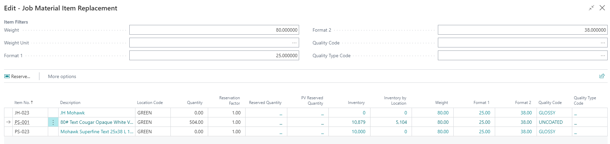

- Update the filters and select an item from the list.
- Update the quantity, location, and reservation factor (if needed).

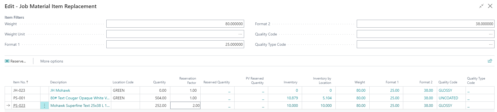

- Click **Reserve**, then **Reserve from Current Line**.

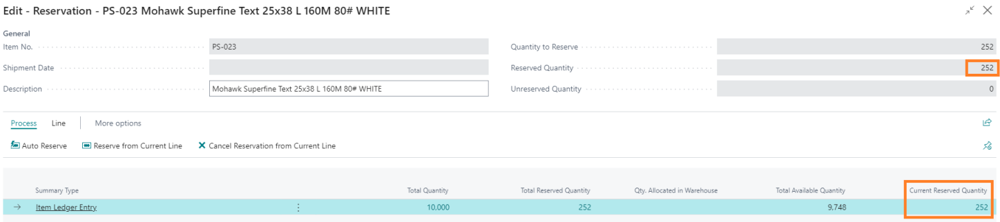

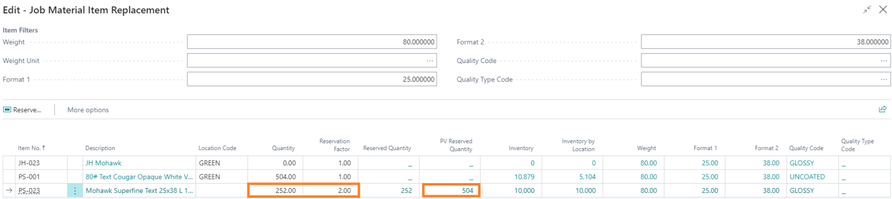

**Example:** If reserving item PS-023 with a factor of 2, reserving 252 units of PS-023 will display a **PV Reserved Quantity** of 504 units.

### Purchase Order

#### Setup or Item Card

The **Reserve** field on the item card determines whether PrintVis creates reservations automatically on Purchase Orders:

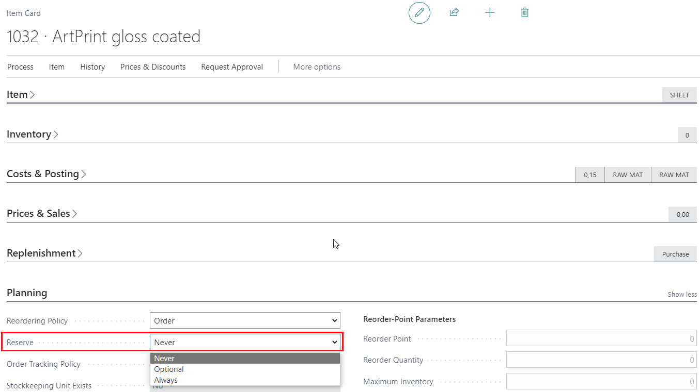

- **Never**: No automatic reservations are created.
- **Optional** (default): No automatic reservations, but items can be reserved via the material requirements page.
- **Always**: Automatic reservations are created when a PO is received, and a PV Order number is assigned.

#### Automatic Reservations on Purchase Orders

When a purchase order is received with a PV Order number, PrintVis reserves the required quantities for that order until the quantity on the PO is exhausted. This occurs only when the item's Reserve policy is set to **Always**.

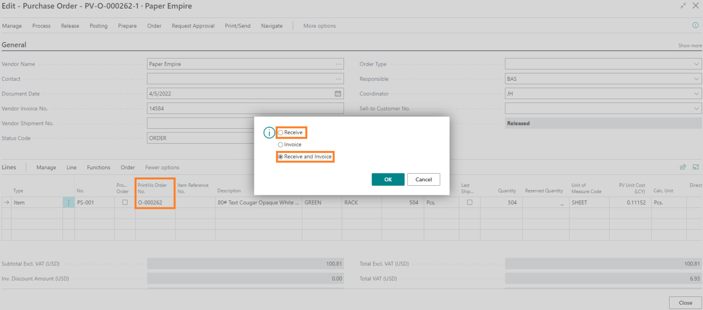

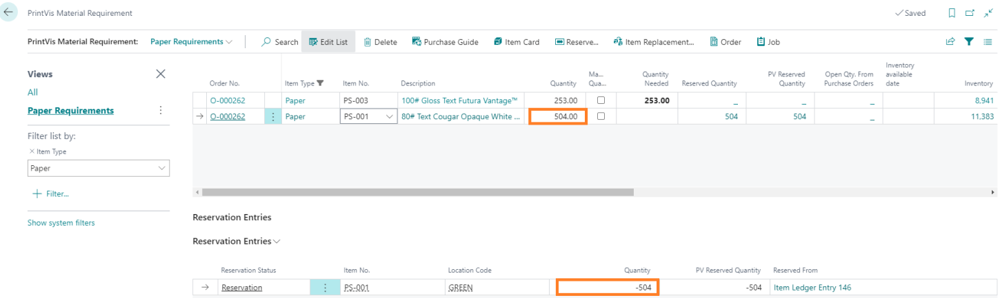

### Item List
A new field called **Reserved Qty on Inventory** shows the total quantity reserved for each item. Clicking the number shows all reservation entries for that item.

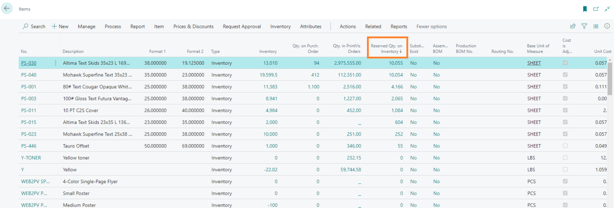

### Job Material Movement/Pick
This process pulls in all needed materials based on filter settings, including replacement reservation items. 

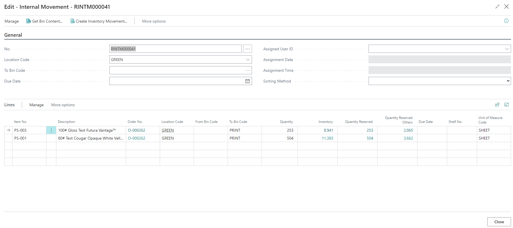

 Key Fields

| Field                    | Description                                                                 |
|--------------------------|-----------------------------------------------------------------------------|
| Inventory                 | Total current inventory of the item. Clicking the number shows item ledger entries.|
| Quantity Reserved         | Quantity reserved for the order. Clicking the number shows reservation entries.|
| Quantity Reserved Others  | Quantity reserved for other orders. Clicking the number shows those reservations. |

### Job Costing Journal

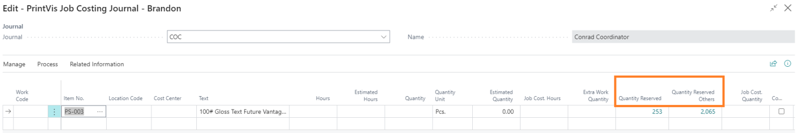

| Field                    | Description                                                                 |
|--------------------------|-----------------------------------------------------------------------------|
| Quantity Reserved         | Quantity reserved for the order and item.                                   |
| Quantity Reserved Others  | Quantity reserved for all other orders for that item.                       |

### Material Consumption

Material consumption through the **Job Costing Journal** and **Consume Material Shop Floor** pages remains unchanged, but checks are made in the background:

1. **Reservation Check**: If there are reservations for the item/order, they are reduced first.
2. **Reduce Reservation**: Reservation quantity is reduced until it reaches 0.
3. **No Reservation**: If no reservation exists, material is consumed normally.
4. **Quantity Needed**: The "Quantity Needed" field is reduced but never goes below 0.

### Examples:

**Example 1:**
- Job calls for 8,000 of item X.
- Reserved Qty is 2,000.
- Quantity Needed is 6,000.
- Inventory is 10,000.
- User posts 2,100.
  - Reserved Qty is reduced to 0.
  - Quantity Needed is reduced to 5,900.

**Example 2:**
- Job calls for 8,000 of item X.
- Reserved Qty is 2,000.
- Quantity Needed is 6,000.
- Inventory is 10,000.
- User posts 8,500.
  - Reserved Qty goes to 0.
  - Quantity Needed goes to 0 (value never goes negative).
  - Inventory is reduced to 1,500.
  - Both Reserved and Quantity Needed on the material requirements page are reduced to 0.
