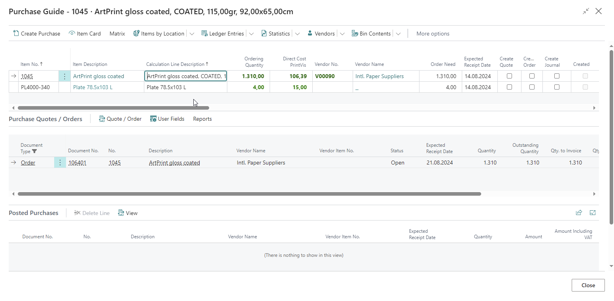
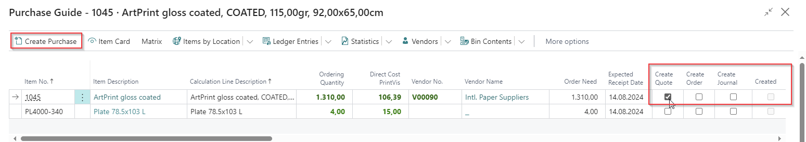
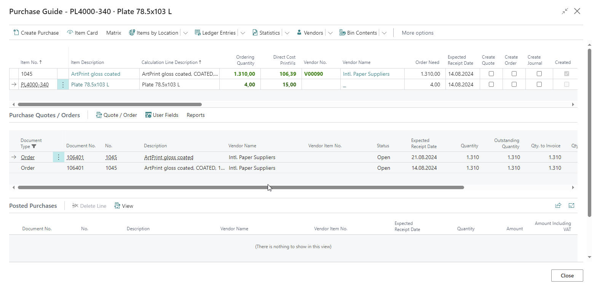
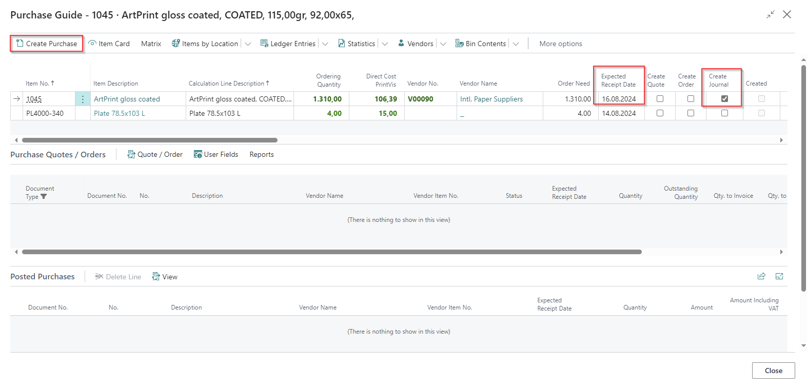
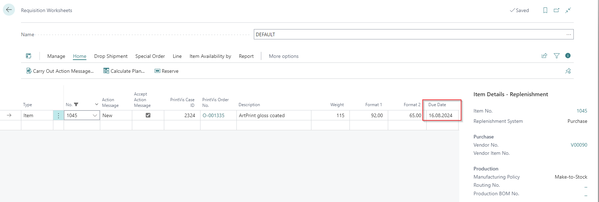
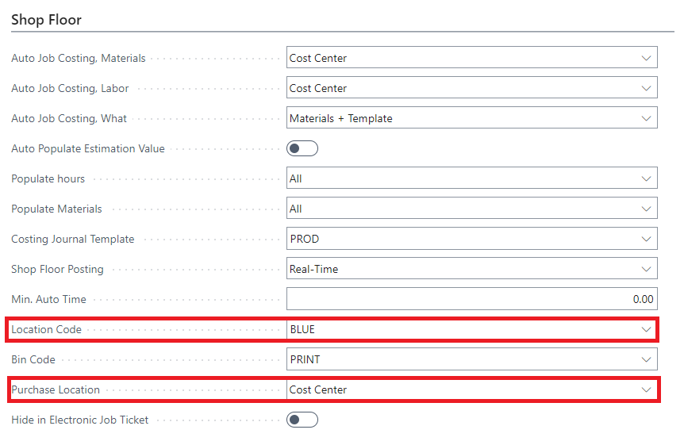

# Purchase Guide

## Summary

Via the Purchase Guide, it is possible to order necessary items for an order directly from the Case Card. The Purchase Guide is typically used for creating purchase orders/quotes for the purchase of items and services such as sub-contracting, items purchased specifically for the order, and in a few cases, the purchase of inventory-controlled items.

To be able to order an item via the Purchase Guide, you must ensure that the item has a quality attached on the Item Card that is selected for "use purchase guide." Furthermore, it is a requirement that the Case has reached order status or has “No Material Availability” on the status code set to “No.”

The window is divided into 3 sections: 
- At the top, the material lines are displayed, which are included in the calculation and which need to be purchased (by setup on Quality Code).
- In the middle part, the purchase orders or quotes that have actually been created via the purchase guide are displayed.
- Finally, at the bottom, the posted purchases for the Case are shown.

If more purchase lines are created for the same vendor, they will be collected in one purchase order.

## Process

### Prepare the Purchase Guide line

To process the Purchase Guide lines, the lines need to have the ordering quantity and vendor number completed. The Expected Receipt Date is calculated by taking the Lead Time Calculation value from the Item or Item Vendor into consideration. The Expected Delivery Date can be modified manually and will be used as "Due Date" on the requisition worksheet and Expected Delivery Date on the purchase line.

You can use the matrix by scrolling to the right-hand side to see information about the items, availability by selected date range, usage on PrintVis cases, sales orders, and purchase orders.

Next, enable one of the following Booleans to set the result when hitting the action "Create Purchase":

- **Create Quote**: This will create a Purchase Quote line for the related item.
- **Create Order**: This will create a Purchase Order line for the related item.
- **Create Journal**: This will create a Requisition Worksheet line for the related item.

The requisition worksheet to be used for this process is set up in the PrintVis User.

### Create Quote or Order

The system will find the last Purchase Order against the vendor. If that is released, it will create a new Purchase Quote/Order. If the last Purchase Quote/Order is open and refers to the same vendor, then the system will add the quantity to that Purchase Order. The Status field shows the status of the Purchase Order/Quote. This is beneficial if there are multiple Purchase Quotes/Orders with a single vendor for a case.  

In the example below, two purchase lines were created in the same purchase order because of different Expected Receipt dates, which means the user could arrange a partial shipment earlier than the other purchase line.

### Create Journal

Create Journal is used in case the coordinator shall not do a purchase quote/order by themselves. With this option, they can publish a line in a Requisition Worksheet that is used by a centralized purchaser who will do the purchase.

Mark the field "Create Journal" to YES and use action Create Purchase—then a purchase line is created in the Requisition Worksheet.

The result on the Requisition Worksheet looks like the following, for the example above:

Once the purchase has created a purchase quote/order from the Requisition Worksheet line, the purchase lines are displayed in the purchase guide.

### Locations

The location for the purchase order is based on the Purchase Location setting on the cost center setup page. If the Purchase Location is set to Vendor, then the purchase guide will use the location code set up from the vendor card. If the Purchasing Location is set to cost center, then the purchase guide will use the location code set up from the cost center.

## PrintVis Actions

### Create Purchase

To create a Purchase Order or an Internal Purchase Quote, you must activate the Create Purchase button in the menu. When you do this, one or more lines are created in the Purchase table below.

### Quote/Order

Open the created Purchase Order from the middle section of this page.

### Item Card

Opens the item card for the selected line.

### Matrix

From the matrix menu, you can select the period and values that are displayed on the line. Periods include: None, Days, Weeks, Months. Values include: Available, PrintVis, Sales Order, Purchase Order.
