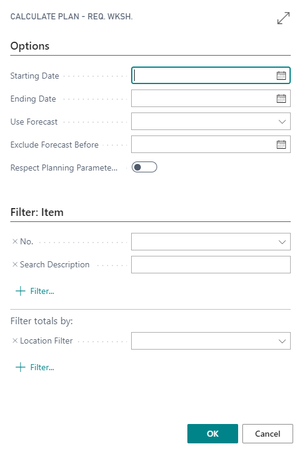
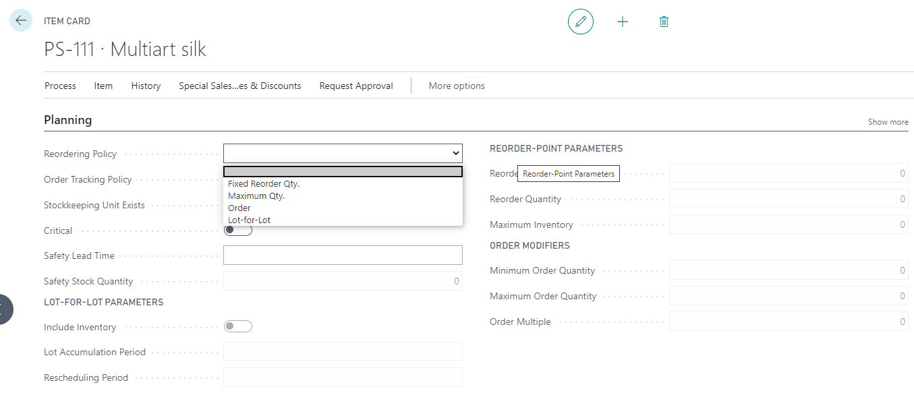

# Requisition Worksheet

## Summary

PrintVis uses the standard Business Central requisition worksheet but extends the functionality to include PrintVis cases

## Usage

The requisition worksheet calculate plan function looks at the reorder policy on the item, case status code fields “Reserve Material” and “No Material Availability”, PrintVis planning dates, and requested shipment date to decide what materials are needed.

Normally, the status code fields “Reserve Material” and “No Material Availability” should be left at their default value “No” in the case the material needed will be calculated when a case becomes an order and the availability date will be taken from the plan – or if no plan exists, the system will use the requested shipment date (minus the inventory days specified on the capacity unit).

- **“No Material Availability”** field is used for orders where you do not want the material to be included in the calculation of needed inventory. This could be internal test orders, orders on hold, etc.

- **“Reserve Materials”** field is used for cases where you want the calculated material to be regarded as needed on inventory regardless of order/quote status and plan. This could be certain quotes that are not orders yet, but you want materials assigned or internal orders that you don’t plan but always want material ready, etc.

To calculate materials, enter a starting date and ending date (which looks at the information explained above). These are the only required fields, but item filters can also be used such as Item Type Code or Item Quality.

## Setup

### Item

On the item card, whether an item appears on the requisition worksheet plan is based on the reordering policy.

- A blank reordering policy always excludes the item on the requisition worksheet plan.
- **Fixed Reorder Qty** uses the reorder point parameters to determine reordering (see standard BC documentation on these fields).
- **Maximum Qty** uses reorder point parameters to determine reordering (see standard BC documentation on these fields).
- **Order** uses standard BC orders and PrintVis cases to pull quantities directly based on needs. The PrintVis order number will be assigned to the requisition worksheet line(s). This does not utilize the reorder parameters or the order modifiers.
- **Lot-for-Lot** uses standard BC orders and PrintVis cases to pull quantities directly based on needs, but groups order needs together into a single line based on the lot-for-lot parameters. This does not utilize the reorder parameters or the order modifiers.

### Cost Center

On the cost center, it is determined what location is used by the requisition worksheet.

The Purchase Location field has 2 options: **Cost Center** and **Vendor**.
- When **Cost Center** is selected, the requisition worksheet will use the cost center location code based on where the material is to be used.
- When **Vendor** is selected, the requisition worksheet will use the vendor location code.
