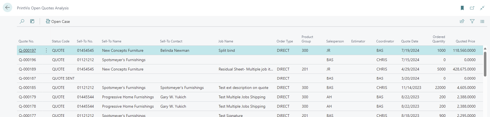
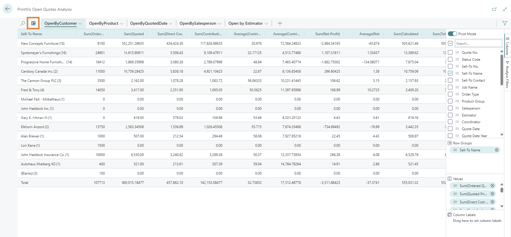
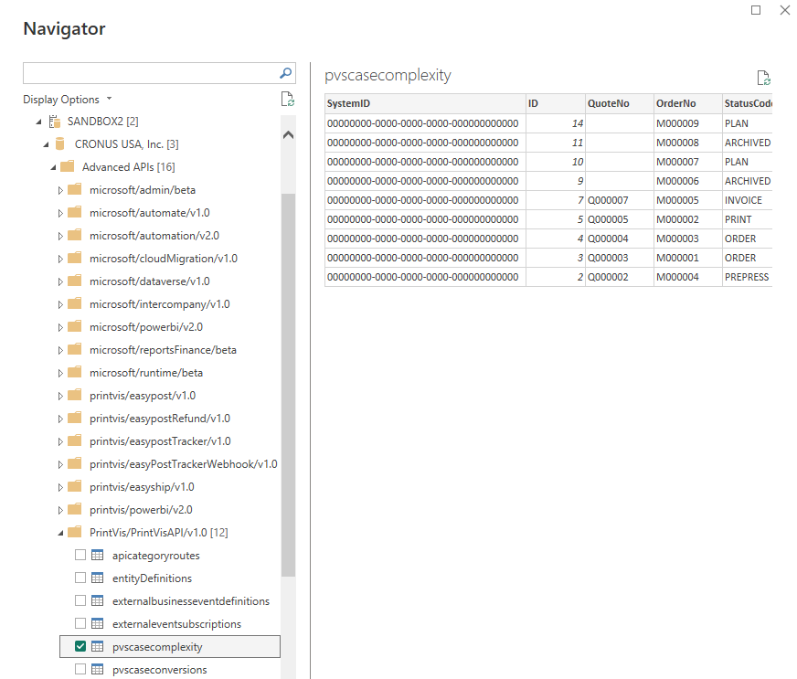
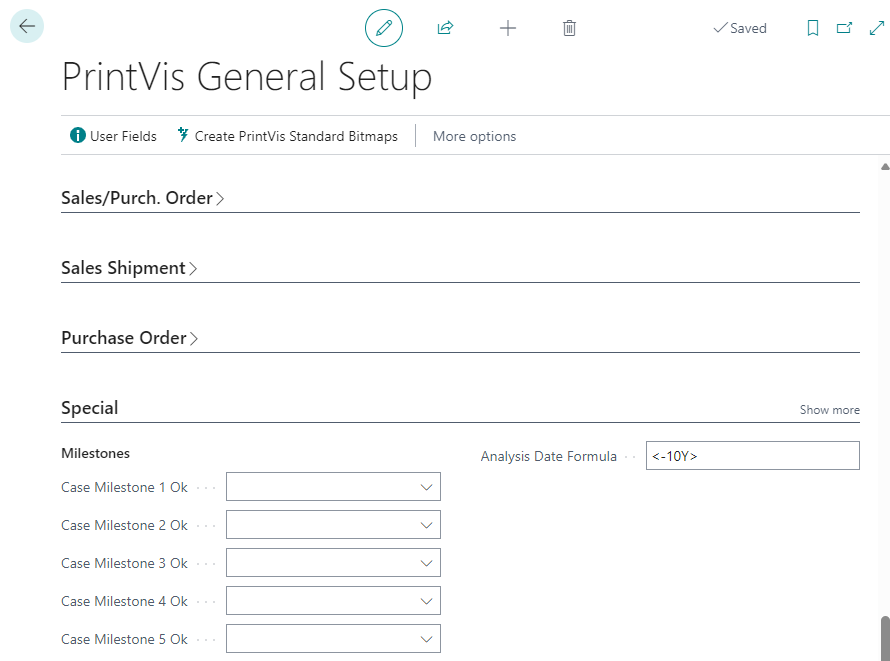

**PrintVis Analysis Pages / API**

Overview

The PrintVis Analysis pages and API provide users with the ability to
analyze important PrintVis data within Business Central and through
external tools.

The following analysis pages are currently available:

-   PrintVis Open Quotes Analysis

-   PrintVis Rejected Quotes Analysis

-   PrintVis Case Complexity Analysis

-   PrintVis Case Conversion Analysis

-   PrintVis Job Costing Analysis

-   PrintVis Material Analysis

-   PrintVis Production Analysis

-   PrintVis Capacity Analysis (has a filter page prior to loading so
    the user can reduce the records loaded and assist with performance)

Page Usage

Analysis pages can be found by searching "PrintVis Analysis" and they
will be located in the Reports and Analysis section. 

Each page displays important fields for the selected analysis.
Additional fields are available and can be added using personalization.
Filters can be used within these pages to limit data you are evaluating.

The Business Central analyze functionality can be used by clicking the
Analyze icon at the top of the list. This functionality allows the user
to group by selected values and see the data as most appropriate. You
can create many different analysis views and save them for your user.

API Usage

Each analysis page has a corresponding API page that allows users to get
data in external reports and systems. The below example shows how to
find the API pages within PowerBI. Selecting Business Central and
logging in as your user shows the companies the user has access to.
Drill down to Advanced APIs then PrintVis/PrintVisAPI/v1.0 to find the
similarly named APIs.

Setup

The only setup for analysis pages is on the PrintVis General Setup page
in the Special section. There is a new field called Analysis Date
Formula. This field will limit the results that are generated when
opening the page so you are not loading an entire system worth of data
unless necessary. Enter a date formula in the format of &lt;-10Y&gt;
where this formula will result in loading the last 10 years of data.
Always enter this value as a - value to pull the "last" years (Y),
months (M), weeks (W), or days (D). Remember that this limits the total
number of results that are generated but filters can be used on these
pages to evaluate the data at smaller increments. If no date formula is
entered in this field the default filter will be &lt;-1Y&gt; or the last
year's worth of data.

