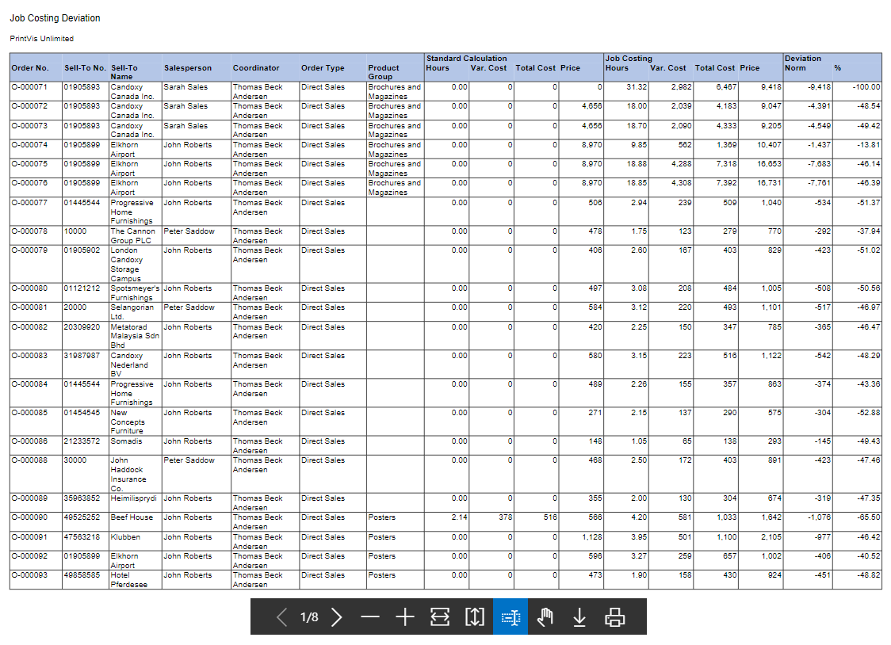

**Orders with Deviation Report**

Summary

The Orders with Deviation Report is a PDF and/or Excel report that
displays the orders with a deviation larger than the percentage entered
in the report options.

Usage

To run the report search "PrintVis Orders with Deviation"

<table>
<colgroup>
<col style="width: 26%" />
<col style="width: 73%" />
</colgroup>
<thead>
<tr>
<th>Min. Deviation %</th>
<th>Enter the percentage to include in the report. This will include +/-
deviations. For example: if I enter 10 in the field, the report will
include all orders with a job costing deviation of greater than and less
than 10% of estimated amount. </th>
</tr>
</thead>
<tbody>
<tr>
<th>Excel Export</th>
<td>If this is checked, an Excel version of the report will be generated
with the report. If unchecked, the report will only display as a
PDF.</td>
</tr>
<tr>
<th>Filter: Case</th>
<td>This section will allow for filtering out specific cases based on
any attribute of the case.</td>
</tr>
</tbody>
</table>

Report Samples

