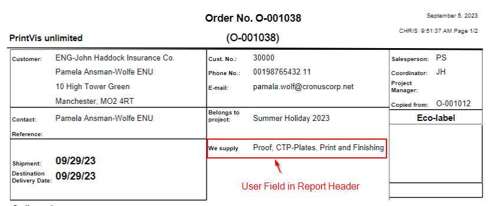

**Job Ticket Report Setup**

About setup changes

When making setup changes, what does it take before it pulls through to
Job Ticket?

<table>
<colgroup>
<col style="width: 12%" />
<col style="width: 47%" />
<col style="width: 39%" />
</colgroup>
<thead>
<tr>
<th>1</th>
<th>User Fields</th>
<th>straight away</th>
</tr>
</thead>
<tbody>
<tr>
<th>2</th>
<td>Calculation Units</td>
<td>straight away</td>
</tr>
<tr>
<th>3</th>
<td>Planning Units</td>
<td>straight away</td>
</tr>
<tr>
<th>4</th>
<td>Department card changes</td>
<td>straight away </td>
</tr>
</tbody>
</table>

However, when you are making many changes and testing straight on in the
same session, you may want to consider the following refreshing options:
Report 6010303 reads the setup with each generation and print.

-   Close and reopen Case Card

-   Recalculate job

-   Deactivate and reactivate active version (Planning units)

Report Selection

There are different PrintVis Job Tickets. Report No. 6010303, 6010370,
and 6010900 (newer version). The newer version has a different
formatting and also allows users to what fields/information is being
used in the RDLC file easier.

In order to see the different reports, see the different layouts, and
make changes to the layout in the Report Layout Selection page:

How and what to do

1\. PV General Setup

2\. Setup on Department Card

Report Group (normally 1)

Presentation of data (only print processes and paper on print dept.)

Connect to User Field Groups

3\. Fields filling in from Job/case

-   Job name

-   External Description

-   Customer data

-   Shipment data

4\. Printing Process Line

5\. Internal comments placed under its department

6\. User fields

Control placement: header/body/footer

Print when: never/if data/always

Section placement

Easy to tick all and then peel off the unnecessary ones later. Easy to
make this a customer superuser job to do this.

**Note: If you have an Initial Value defined, the field "Report Print"
must be "Always".**

7\. Calculation Unit setup

Easy to tick all and then peel off the unnecessary ones later. Easy to
make this a customer superuser job to do this.

8\. Planning unit setup

Easy to tick all and then peel off the unnecessary ones later. Easy to
make this a customer superuser job to do this.

Setup results

**Header:**

 
**Body:**

Picture points out location of the following:

-   Internal comment

-   User Fields in body (going through Group 3)

-   Calculation lines from Price unit with quantity

-   Planning units with planned time and start/stop

Please job ticket example here: <a href='https://learn.printvis.com/Legacy/Reports/assets/Job%20Ticket%20Example.pdf' target='_blank'>Job Ticket Sample</a>
