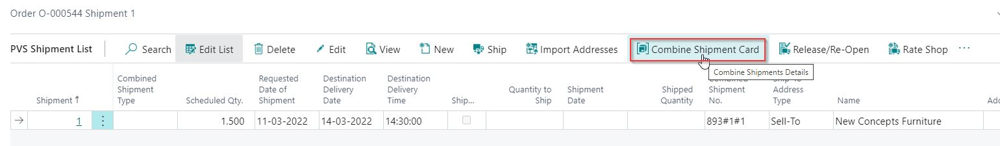

# Combine PrintVis Shipments

## Introduction

PrintVis has the ability to combine shipments from:

- Jobs (of type Order/Production Order) within the same Case
- Different Cases

There are 2 scenarios for combining shipments:

1. Customer service prepares known shipments during the stage of order creation/handling from the Case Card. Functions to combine shipments are available on the PrintVis Shipment List.
2. The shipping department is preparing a shipment and adds jobs for the same customer and shipping address. Functions to combine shipments are available on the PrintVis Shipment Overview page.

## Prerequisites

To be able to combine shipments, it is necessary that the shipments are for the same:

- Customer / Sell-to No.
- Shipping address

## Required Setup

**General Setup Shipment No. Series**

In the General Setup, if you use the function "Always" in Copy Shipments, the Combined Shipment Type will be copied over to the new Shipments! 

Our recommendation is to use "Never" in Copy Shipments if you want to use the functionality of Combine Shipments.

### Requested Date of Shipment on Job is mandatory 

It is only possible to run the combine shipments functions for jobs where the field “Requested Date of Shipment” is not empty. The value of this field will be transferred as the default value to the shipment field “Requested Date of Shipment.” The “Get Shipments” function is only filtered to jobs of the same “Requested Date of Shipment.” 

However, combining shipments by manual selection is still possible if no shipment date is available.

## How to combine shipments?

The Combine Shipments Card must be used to combine shipments. It can be accessed from the following pages:

- **PrintVis Job Shipments - Customer Service Role**: PrintVis Job Shipments are typically prepared by the customer service department, and known shipments could be combined at this point already.
- **Case Card**: "Shipments" Action (on Job subpage)

- **PrintVis Shipment Overview - Shipping Department Role**

### Combine Shipments Card

| Field                         | Description                                                                                                                                                  |
|-------------------------------|--------------------------------------------------------------------------------------------------------------------------------------------------------------|
| **No.**                       | For system use: PrintVis creates a No. for every shipment line. The No. is created by the following logic: `<CaseID>#<Job>#<Internal Shipping no.>` Example: 269#1#1 |
| **Shipments No.**            | This is the shipment assigned from the Serial No. series set up in the PrintVis General Setup. The No. will be assigned when the shipment is released.      |
| **Customer No.**             | Customer/Sell-to No. from this case/order.                                                                                                                 |
| **Requested Date of Shipment**| This field is set by default with the “Requested Shipment Date/Time” from the Job and can also be entered manually in case of partial shipments before the final shipment date. |
| **Requested Time of Shipment**| Optional if a time for the shipment is agreed/required.                                                                                                    |
| **Shipment Date**            | Date when the shipment has to be/were shipped.                                                                                                            |
| **Shipped**                   | Boolean: Indicates if the shipment is shipped or not.                                                                                                     |
| **Shipment Method**          | Shipping method for this shipment. Can be set by the Shipment Method on the PrintVis Case.                                                                 |
| **Status**                   | Indicates if the shipment is Released or Open.                                                                                                            |
| **Destination Delivery Date** | This field is set by default with the “Destination Delivery date” from the Job and can also be entered manually in case of partial shipments before the final delivery date. |
| **Destination Delivery Time** | This field is set by default with the “Destination Delivery time” from the Job and can also be entered manually in case of partial shipments before the final delivery date. |

 Actions on General Tab

| Action   | Description                                                                                                                                                                            |
|----------|----------------------------------------------------------------------------------------------------------------------------------------------------------------------------------------|
| **Release** | Function to Release the Shipping Lines. A Shipment No. is picked from the Shipment No. Series and assigned to this shipment. A released shipment cannot be changed anymore unless it is reopened. The status “Released” is displayed in the Status field. |
| **Reopen**  | Function to Reopen the shipment after it was released. A shipment can be modified only if the Status is Open. The status “Open” is displayed in the Status field.                     |
| **Ship**    | A shipment is being created/performed based on the “Case Shipments Method” that is set up in the PrintVis General Setup.                                                            |
| **Get Shipments** | Opens PrintVis Shipment Overview. Here, you can see other shipments to the same customer and can choose from the list.                                                             |
| **Reports** | Select a report for print or preview.                                                                                                                                               |

 Fields on Shipping Tab

| Field               | Description                                                      |
|---------------------|------------------------------------------------------------------|
| **ID**              | PrintVis Case ID from the Shipment Line                          |
| **Job**             | PrintVis Job from the Shipment Line                              |
| **Order No.**      | PrintVis Order No. from the selected Case ID                    |
| **Shipment**        | PrintVis Case ID from the Shipment Line                          |
| **Item No.**       | Optional: Finished Goods Item no. if an item will be shipped    |
| **Job Name**        | Job name from the selected Job                                   |
| **Job Quantity**    | Ordered Quantity from the selected Job                          |
| **Quantity to Ship**| Quantity that is being shipped with the current Shipment Line    |
| **Location**        | Optional: In case an Item is being shipped                      |
| **Bin Code**        | Optional: In case an Item is being shipped                      |

 Actions on Shipping Tab (behind Manage)

| Action       | Description                                                 |
|--------------|-------------------------------------------------------------|
| **New Line** | This will create a new shipment line                        |
| **Remove**   | This will remove the shipment from the Combined Shipment but not from the Case |

#### Manual selection of Shipments

The first line on the Combined Shipment card is the shipment from the current shipment. To find additional shipments:

- Use action **Process** and **Get Shipments**

#### Get Shipments function

This function opens the “PrintVis Shipment Overview” and filters on all existing shipments. Filters that are set:

- Active orders
- Customer No. = Customer No. from Current shipment
- Requested Date of Shipment = Requested Date of Shipment from Current shipment
- Shipment lines that are not already combined with other shipments

With this page, it is possible to find customer-related shipments and combine them with the possibility of multi-selection.

You can clear the filter to "Requested Date of Shipment," then all shipments (only shipments that are not ticked as Shipped) for the same Sell-To will be shown on the overview.

Select one or more shipments from the overview. If necessary, use the "Select More" function if you want to select more shipments.

Now, the selected shipments are imported into the Combined Shipment Card and appear as new lines with Release Status "Modified." The entire Combined Shipment Card has the Status of Open.

#### Release / Reopen

By default, a new combined shipment is on status “New.” After all shipment lines have been added and the quantity to ship has been entered, the Release action should be used to assign a shipment number from the number series and to store the shipment lines. Without releasing, the combined data will be removed when closing the page.

If the combined shipment needs to be modified, it can be reopened.

If you want to remove a shipment, you can reopen the Combined Shipment Card and remove a Shipment. The removed shipment will be marked as "Removed," and you can Release the Combined Shipment again.

## How to change a combined shipment?

In case a combined shipment must be changed because parts of it must be shipped differently, they are not ready yet, or other shipments must be added later, it is possible to reopen and change a combined shipment.

Open the combine shipments card:

- Hit "Reopen": 

Now, lines can be added. When lines need to be removed, please use the remove action. This will indicate which line will be deleted from the combined shipments after releasing it again: Release Status = "Deleted."

Without releasing it again, the changes will be ignored!

 Result after releasing and reopening the page:

## Shipments Overview

Options on the PrintVis Shipment Overview:

 Action "Combine" has 4 functions:

| Action                     | Description                                                                                                           |
|----------------------------|-----------------------------------------------------------------------------------------------------------------------|
| **Combine Shipment Card**   | Opens the Shipment the cursor is on                                                                                 |
| **Combine Selected Lines**  | If you use "Select More," all the selected lines will be on a new Combined Shipment Card once you click on Combine Selected Lines |
| **Show Combine Shipments Details** | When you click this, the Combined Shipment Type will appear in the Combined Shipment Type column. The types are: Blank, Parent, or Child |
| **Suggest Combine Shipments** | Will group all the Shipments per Sell-To name                                                                       |

## Combine Shipment Type

PrintVis works with 2 types: "Parent" and "Child." The Shipment that you import extra shipments to gets the type "Parent." The imported shipments all get type "Child." At the same time, the Combined Shipment No. is changed to the ID number for "Parent" Shipment.

**Example**:

- Shipment No. JUN-00143:
    - Here, ID78#1#1 - Order No. O-000075 is Parent, and the shipment on Order No. O-000076 is Child.

If you open the Combined Shipment for this, you will see the original Shipment on Order No. O-000076 has ID 79#1#1.

## Reports, Boxes, and Pallets

Use Receipt to print the delivery note.  The individual Shipments will have "their own" section on the printout.

Quantity per Package and Quantity per Pallet must be filled in as "Always" on the individual shipments.
