# EasyPost Shipping Integration

## 1. Setup

### 1.1 Service Connections Setup

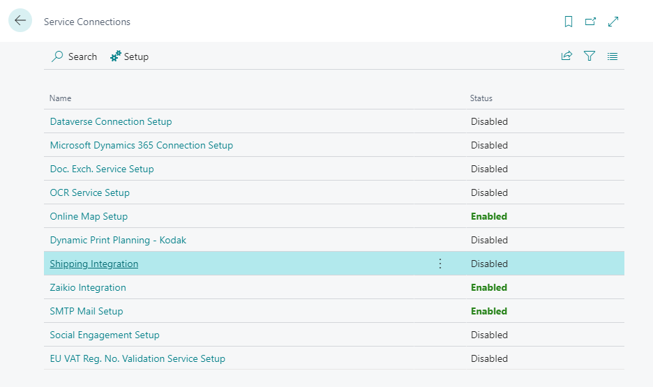

- Navigate to **Service Connections** and select **Shipping Integration**.

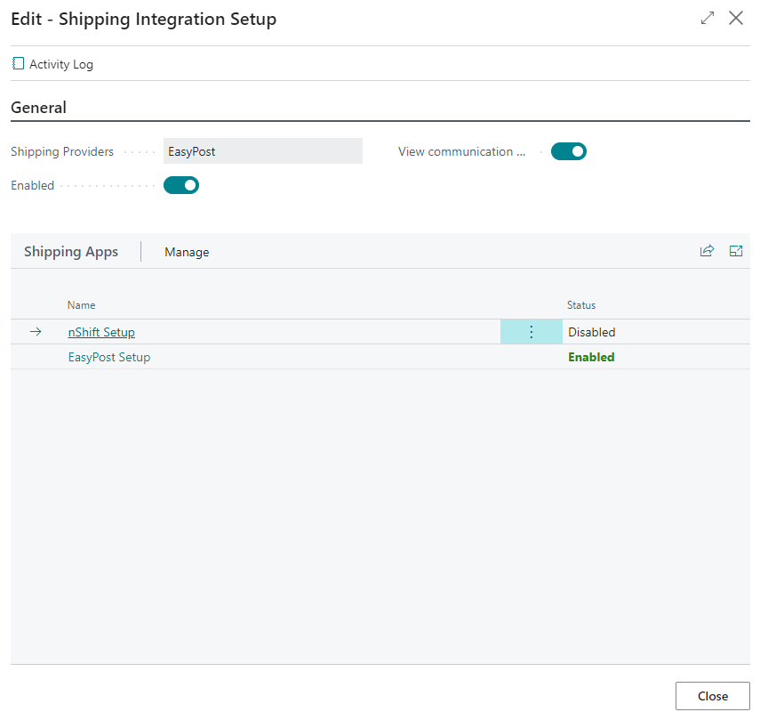

- Set the default shipping service and configure detailed service setups, including **API Endpoint**, **Key**, **Ship From location**, and **Label Type**.

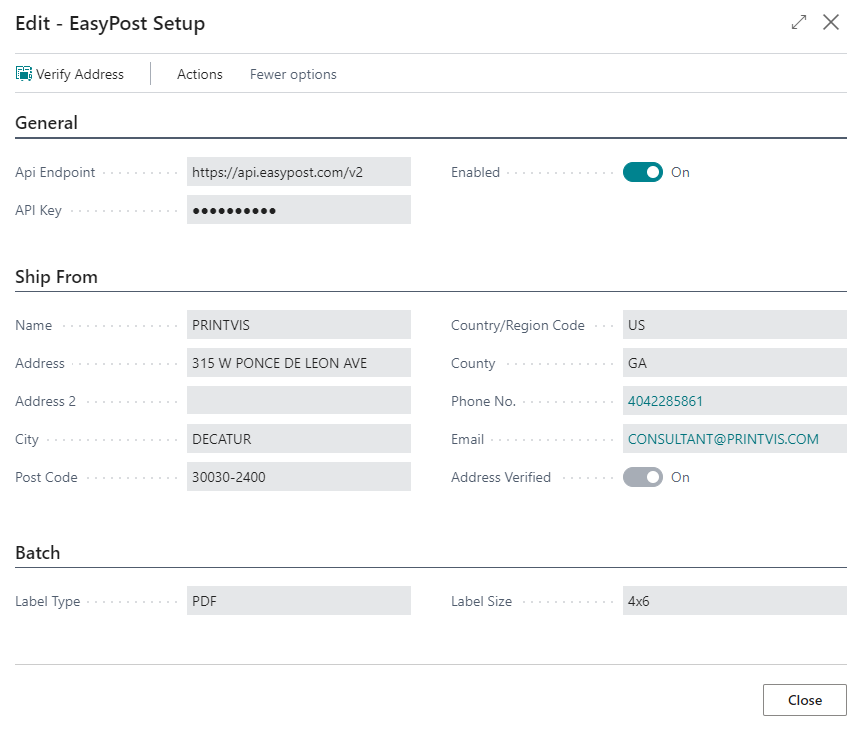

- Use the **View communication** checkbox for testing API calls.

### 1.2 Shipping Agent Setup
- On the **Shipping Agents** page, enter the **Carrier Account ID** (matching EasyPost's ID). Ensure that the agent and services match the carrier guide.

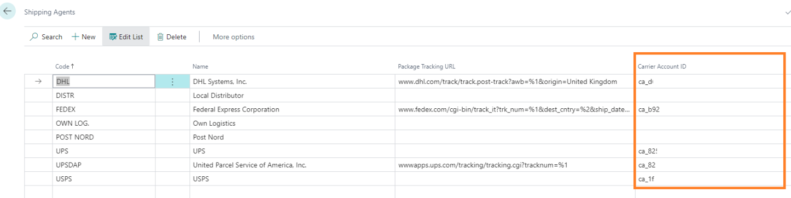

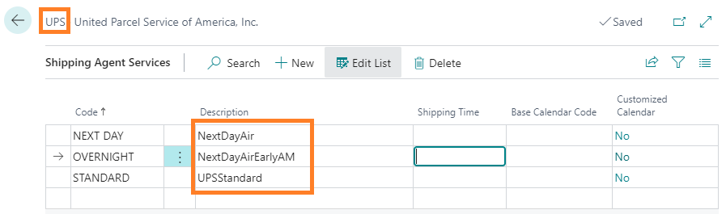

### 1.3 EasyPost Account Setup
- Create an account at [EasyPost](https://www.easypost.com).

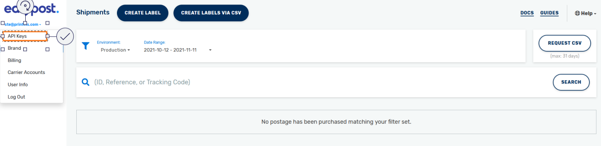

- Access **API Keys** and **Carrier account settings**.
- Add the API key to the **EasyPost setup** in PrintVis.

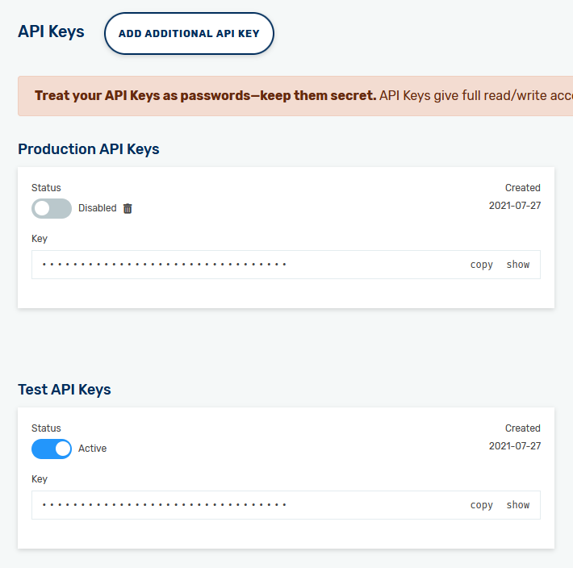

### 1.4 Predefined Packages/Custom Label Code Setup
- For carriers requiring predefined packages or custom label codes, configure them in **EasyPost Options** on the **Shipping Agents** page.

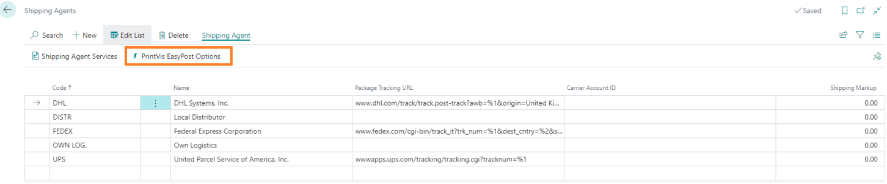

- Set **Predefined Packages** and **Custom Label Reference Codes** based on EasyPost API guides.

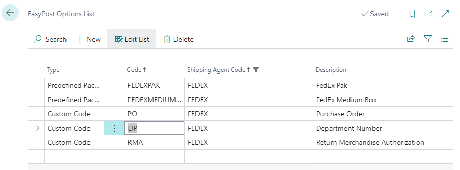

## 2. Usage

### 2.1 Overview
- With shipping integration enabled, new actions (e.g., **Verify Address**, **Rate Shop**, **Buy Shipment**, etc.) appear on the **Shipment Overview**, **Shipment List**, and **Shipment Card**.

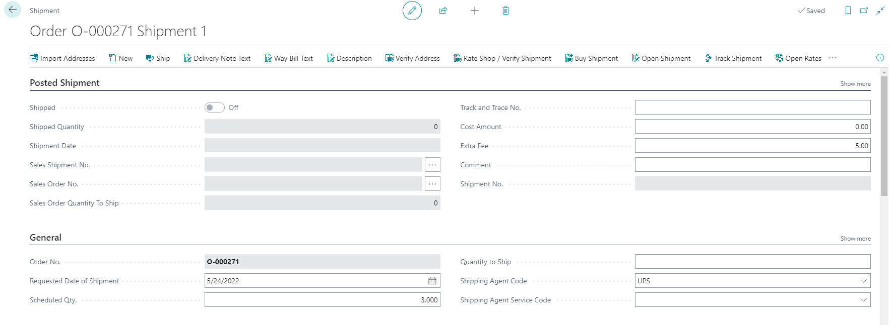

### 2.2 Verify Address
- This action checks if the ship-to address is correctly formatted and enables the **Address Verified** checkbox if valid.

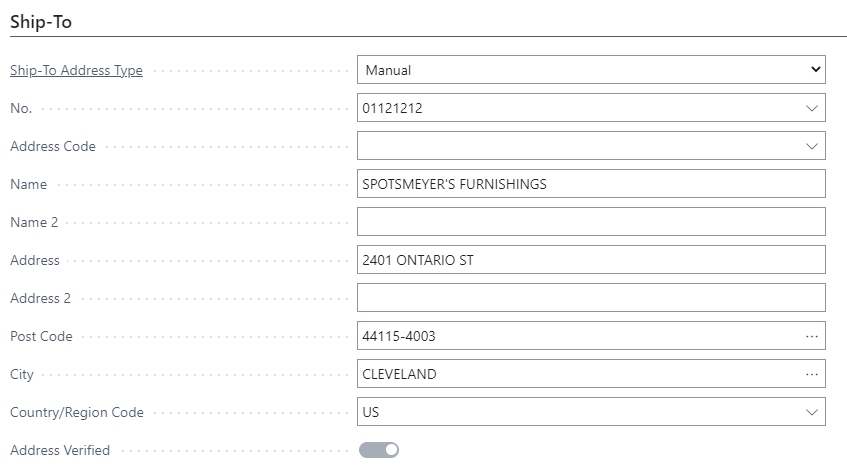

### 2.3 Rate Shop / Verify Shipment
- Displays rates for all setup shipping agents. The rates are filtered if an agent/service is already selected.

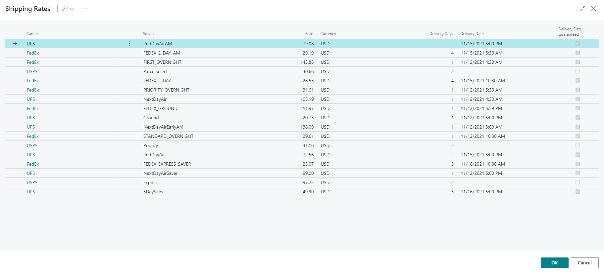

- Once a rate is selected, the **Shipping Agent**, **Service**, and **Cost** are filled in.

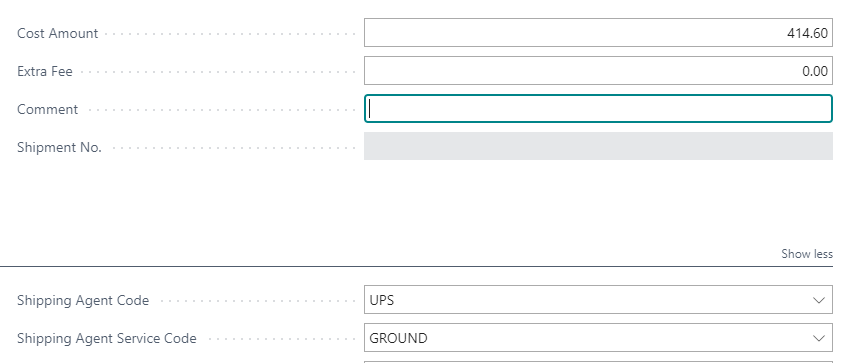

### 2.4 Buy Shipment
- Submits the shipment, purchases it, and returns labels. Also marks the shipment as shipped and fills in the **Track and Trace Number**.
- Multiple shipments can be purchased at once if all shipping details are complete.

### 2.5 Open Shipment
- Displays details about packages in a shipment, including **ID**, **Fees**, and **Tracking Code**.
- Options include reprinting labels, tracking, or refunding the shipment.

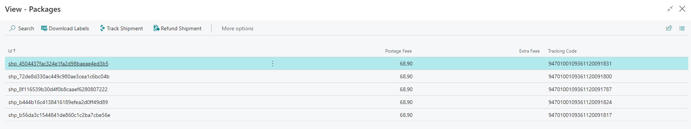

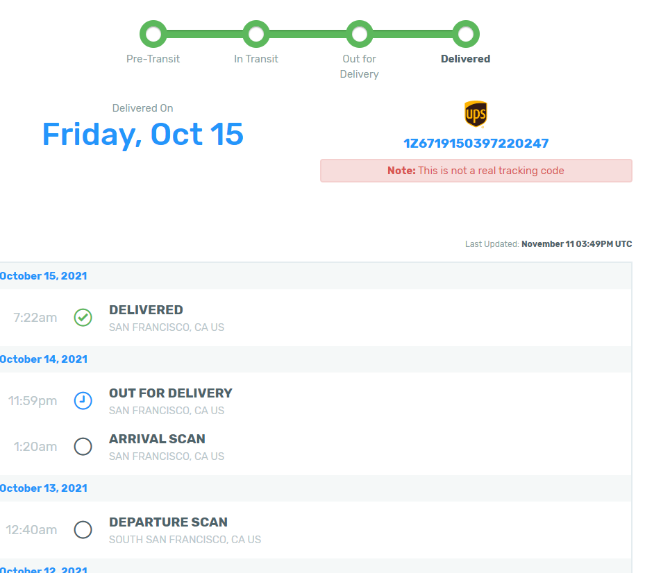

### Shipment from Customer

Generates labels with the **Sell-To** customer’s name and address instead of the company.

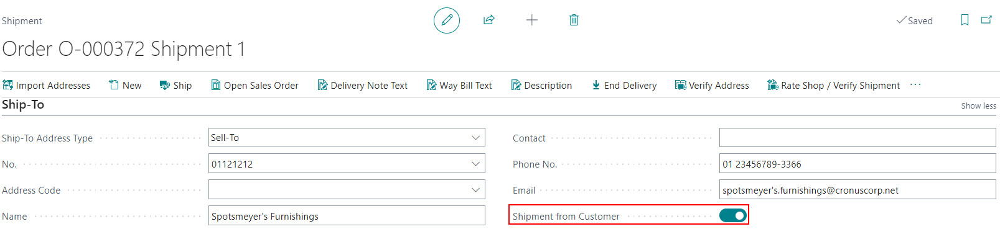

### Combined Shipments
Multiple shipments can be submitted simultaneously, and their labels are compiled into a single PDF.

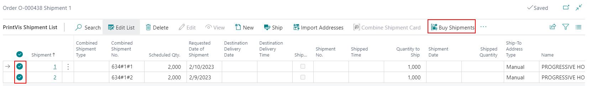

### Label Fields 

#### Reference Fields for Labels

Up to three reference fields can be added to the label, pulled from the EasyPost setup.
- **Predefined Packages**: Pulled from the EasyPost setup to determine the correct rate based on package type.

There are 3 fields on the shipment card called:

- **Label Reference 1** / **Reference Code 1**
- **Label Reference 2** / **Reference Code 2**
- **Label Reference 3** / **Reference Code 3**

These are optional fields that can be filled out to be displayed on the label when it is printed.

The **reference code fields** are pulled from the **EasyPost Options setup**. This list is:

- Filtered if a **Shipping Agent** is selected on the shipment.
- Shows **all codes** if no shipping agent is selected.

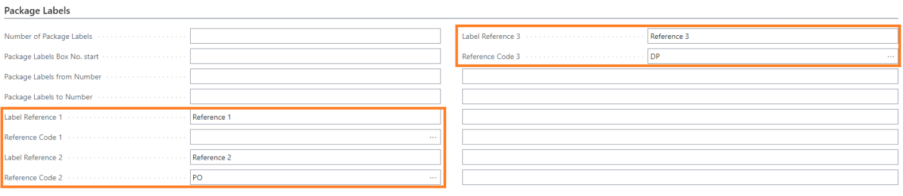

 How the Reference Fields Appear on the Label

> *Text, letter – Description automatically generated*

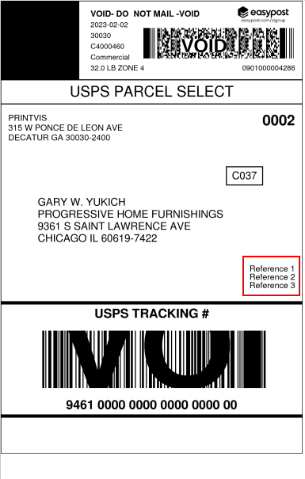

#### Name and Contact

**Name** and **Contact** fields on the Shipment card are mapped to be printed on the label when printed. This allows:

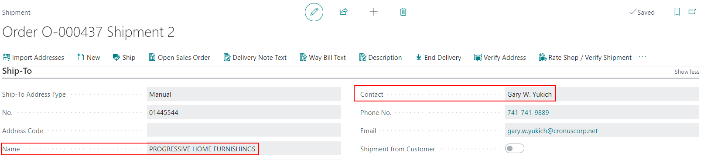

- The **ship-to name** of the company to be displayed on the label.
- The **ship-to contact** field to display which person at the ship-to customer should receive the package(s).

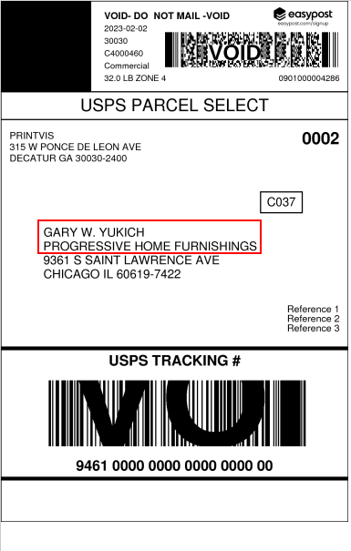

> *Graphical user interface, text, application, email – Description automatically generated*

 How the Reference Fields Appear on the Label

> *Text, letter – Description automatically generated*

#### Predefined Packages

The **Predefined Packages** field values in the **Details** section of the Shipment Card are pulled from the **EasyPost Options setup**. This list is:

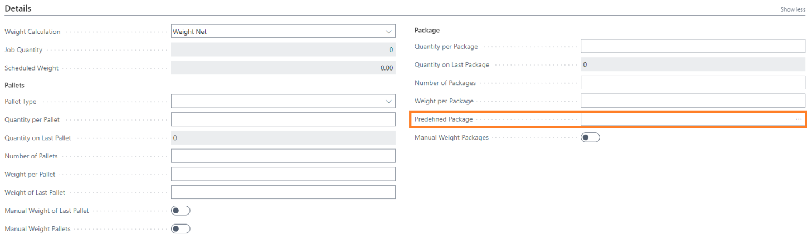

- Filtered if a **Shipping Agent** is selected on the shipment.

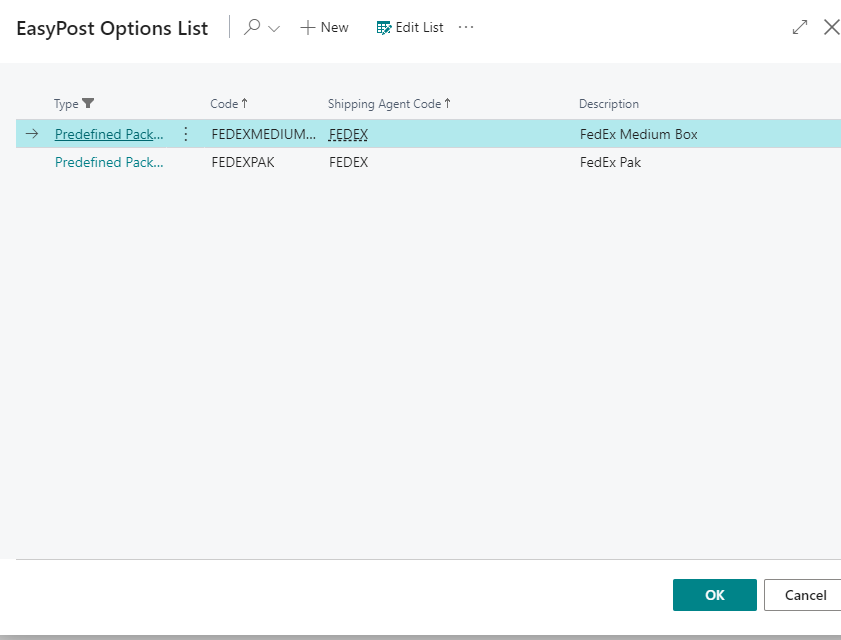

- Shows **all packages** if no shipping agent is selected.

The predefined package is sent to **EasyPost** when verifying the shipment to pull the appropriate rate for that package type.

### Customs

At the bottom of the Shipment card, there is an **EasyPost FastTab** that holds the information for **customs** when sending a shipment to an **international address**.

The information placed in the fields will be passed to **EasyPost**. The **commercial invoice** gets returned with the shipping label in the PDF sent back by EasyPost when customs information is included.

More information about EasyPost customs can be found in the article:

👉 [EasyPost Customs Guide](https://docs.easypost.com/guides/customs-guide#step-1-creating-custom-items)

