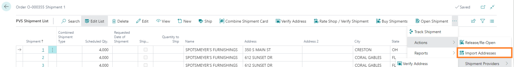
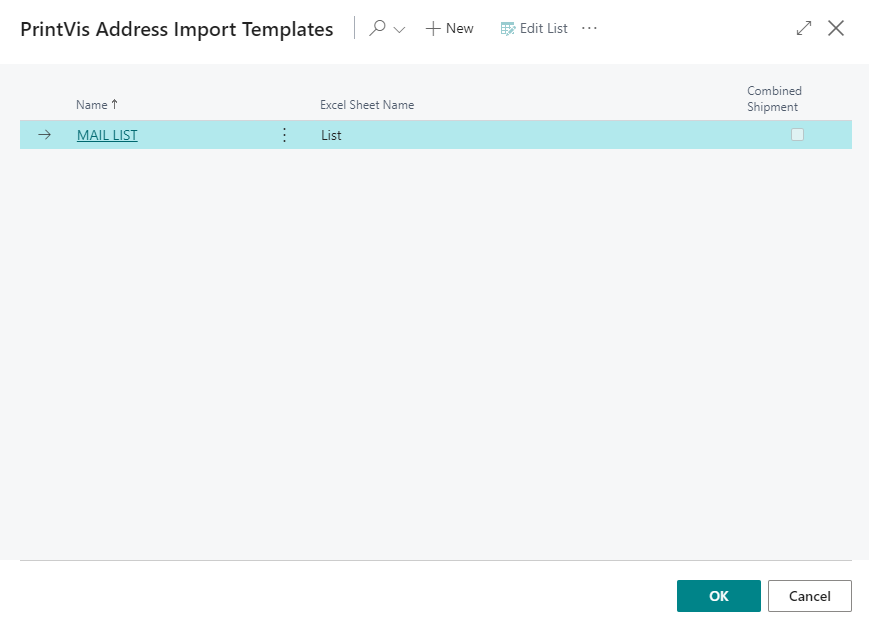
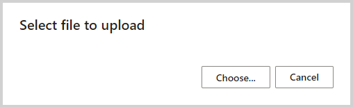
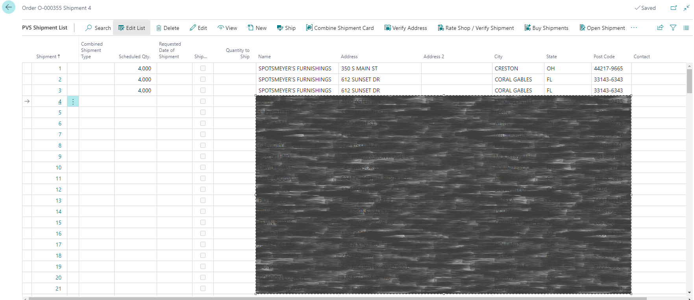
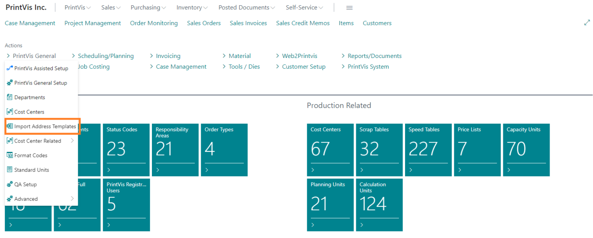
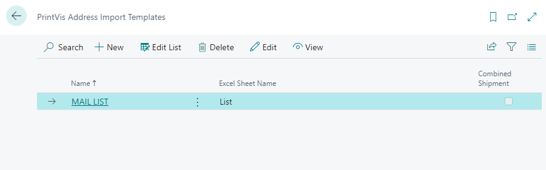
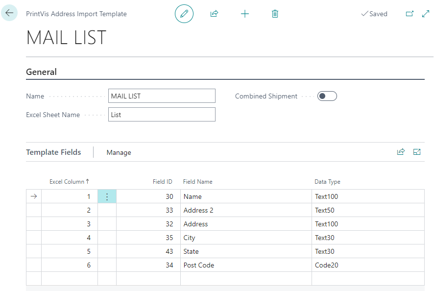

# Import PV Shipments

## Usage

On the PrintVis Shipment list for a Case, there is an **Import Addresses** action that allows for the import of a spreadsheet with shipment information.

This will open a list of spreadsheet templates that can be used as part of the import process.

1. Select the template that matches the spreadsheet you want to import and click **OK**.

2. Click **Choose** and select the Excel file to import, then press **Open**. The system will read the Excel spreadsheet and import the shipments.

## Setup

In the PrintVis General menu on the PrintVis Admin Role Center, there is an **Import Address Templates** action for managing the spreadsheet templates used for shipping.

The list of existing templates is displayed. An existing template can be edited, or a new template can be created by selecting the **New** action.

Fields:

| Field                     | Description                                                                                                                                                       |
|---------------------------|-------------------------------------------------------------------------------------------------------------------------------------------------------------------|
| **Name**                  | Give the template a name that users will recognize.                                                                                                            |
| **Excel Sheet Name**      | This must match the tab of the Excel spreadsheet being imported.                                                                                                |
| **Combined Shipment**      | If this is checked, the imported addresses will be combined with the first address being the parent shipment and the remaining addresses being child shipments. |
| **Excel Column**          | This is the column in the spreadsheet. 1 = A, 2 = B, etc.                                                                                                      |
| **Field ID**             | This is the field number from the PrintVis Shipment table. There is a lookup on this field to select the correct shipment field to match the Excel column.     |
| **Field Name**           | Once the Field ID is chosen, this field will fill in with the field description.                                                                                  |
| **Data Type**            | Once the Field ID is chosen, this field will fill in with the data type/length available in the field.                                                           |
