# Invoice Template Shipment on Invoice lines

## Introduction

There are multiple ways to create invoice lines using the shipment line of a case to be pulled in using an invoice template. This article will go through the different examples of how invoice templates can be set up and how the invoice looks based on examples of posted shipments on a case.

The different approaches include:

- Using manual fields on a shipment card
- Shipment Addresses
- All Shipment Addresses
- Building an invoice from posted shipments

## Example

### Case Card

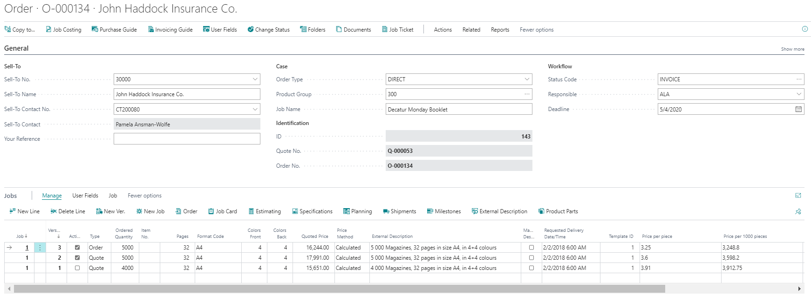

### Shipments

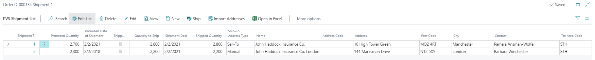

### Invoice Example 1

**Manual fields from a shipment card**

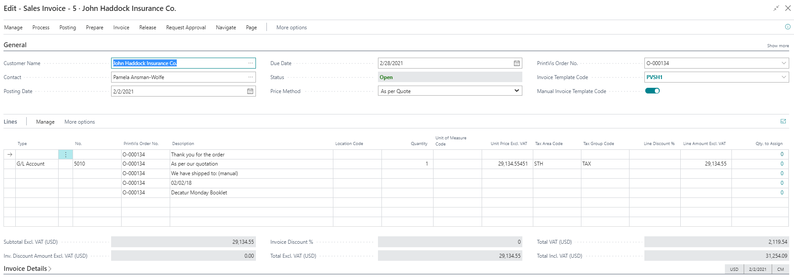

- Invoice template code is **PVSH1**

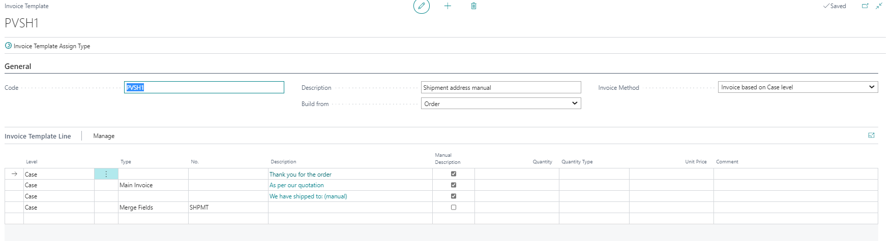

- The template is using Merge Fields Code **SHPMT**

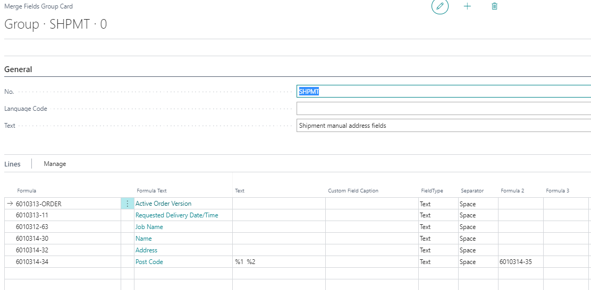

As you can see, there is no data coming from the shipments to the invoice lines because there are more shipments and no direct link from the invoice to here.

### Invoice Example 2

**Using Merge Code 6010314 - Shipment Addresses**

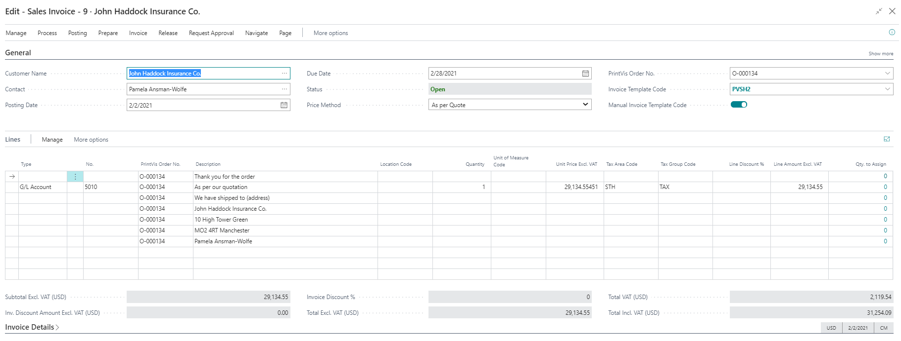

- Invoice template code is **PVSH2**

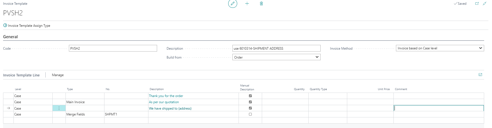

- The template is using Merge Fields Code **SHPMT1**

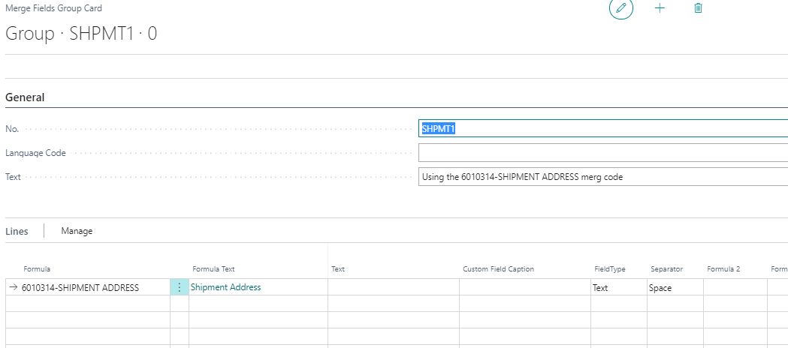

The Merge Field Code **6010314-SHIPMENT ADDRESS** will pull data from the first shipment.

### Invoice Example 3

**Using Merge Code 6010314 - All Shipment Addresses**

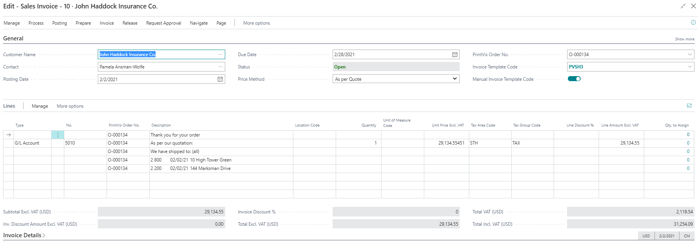

- Invoice template code is **PVSH3**

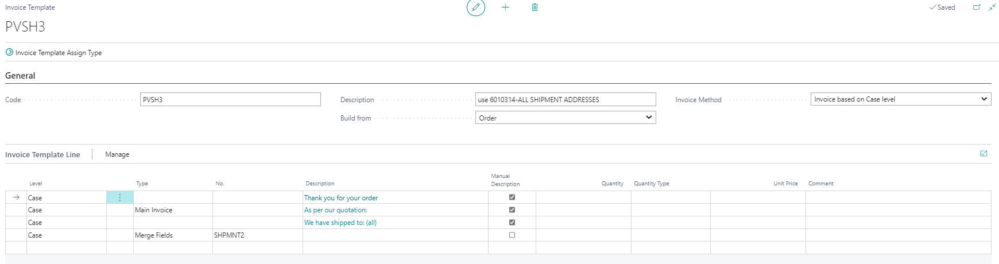

- The template is using Merge Fields Code **SHPMNT2**

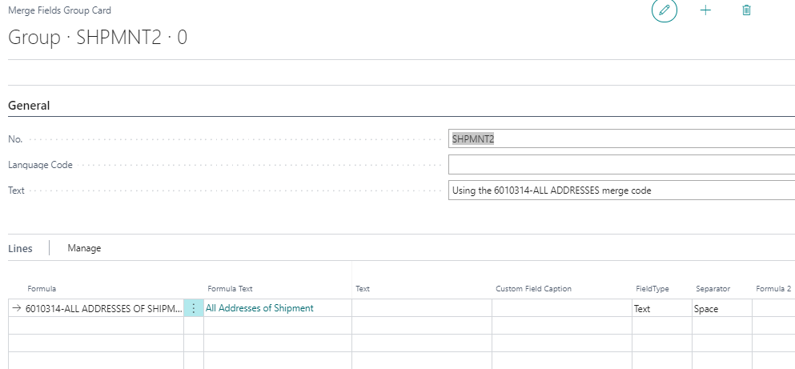

The Merge Field Code **6010314-ALL SHIPMENT ADDRESSES** will pull certain information to a line for each posted invoice.

### Invoice Example 4

**Building data from the posted shipments**

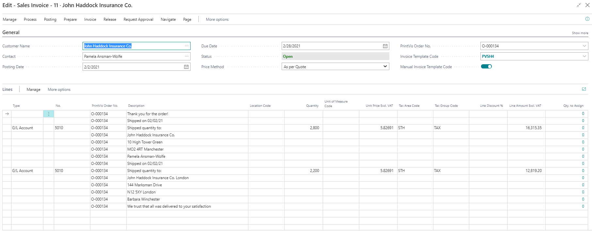

- Invoice template code is **PVSH4**

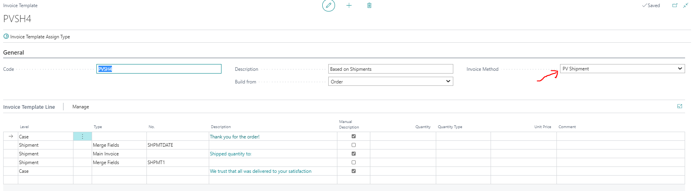

- The template is using Merge Fields Codes to get more information, and we can get it because we are linked to each shipment:

  - **SHPMTDATE:**

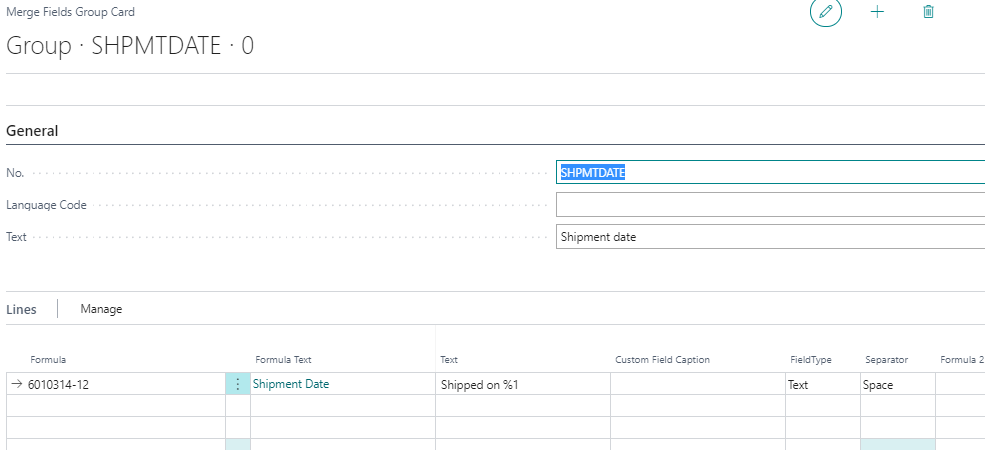

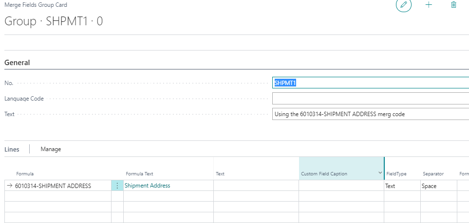
