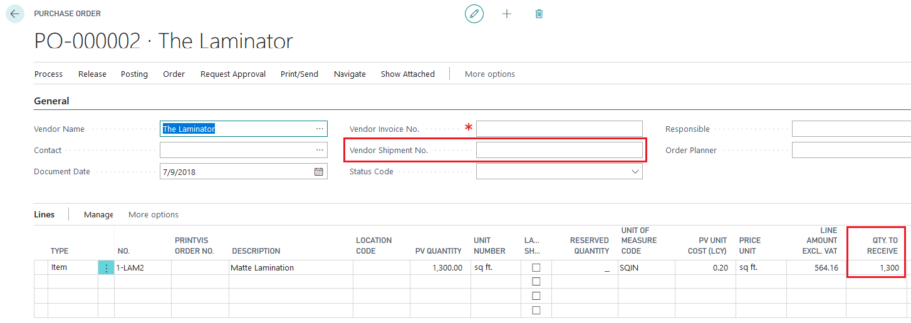
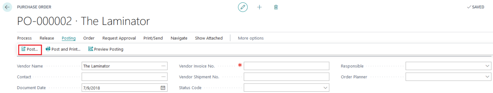
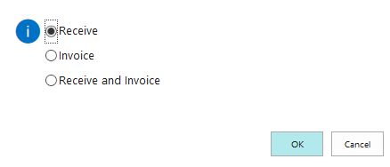
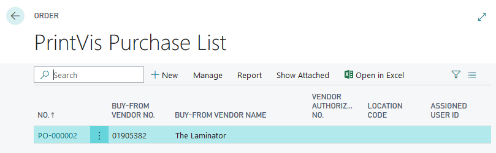
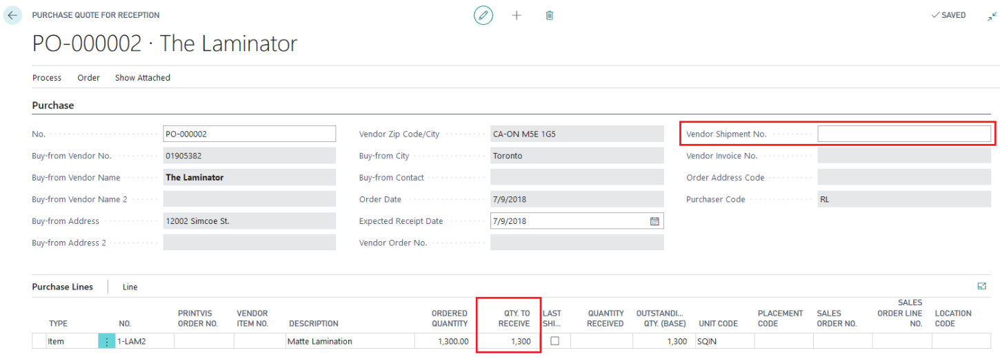
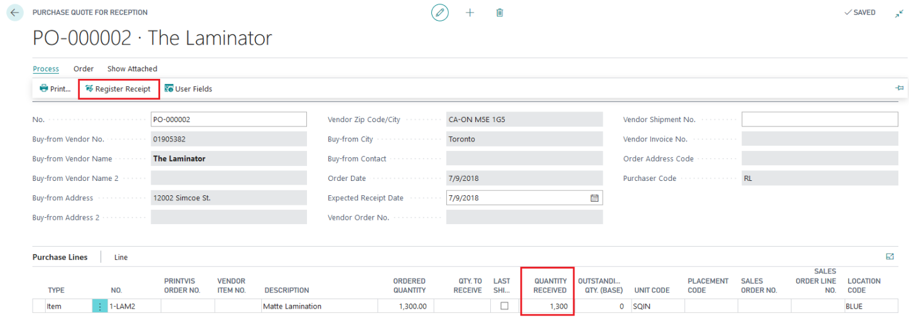
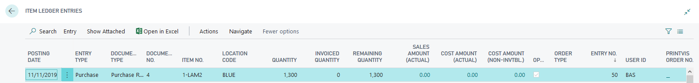
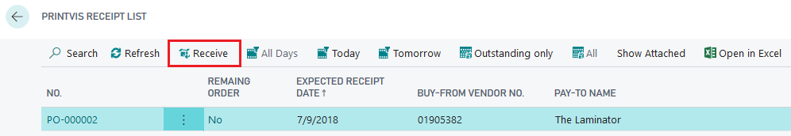

# Register Receipts in PrintVis

This article explains how to register receipts in PrintVis. The standard Business Central functionality is not the scope of this document.

## Register Receipts

PrintVis has three possible methods to register receipts:
1. From the Purchase Order
2. Use Purchase Receipt List
3. Use Receipt Overview

### From a Purchase Order
1. Search **Purchase Orders** - Open the purchase order

2. Check / Enter Qty. to Receive
3. Enter Vendor Shipment No. (optional)
4. Post / Register Receive:

### Use Purchase Receipt List
1. Search **Purchase List** - Set filter to the relevant vendor

2. Open the purchase order

The advantage of the PrintVis Purchase Receipt page is that all fields irrelevant to the Shipping department are locked, so the document can only be posted as a "Receipt" and not accidentally as an invoice, which is possible on the standard purchase order.

3. Check / Enter Qty. to Receive
4. Enter Vendor Shipment No. (optional)
5. Register Receipt (use the button on top)

The quantities are now posted to the Item Card.

### Use Receipt Overview
1. Search **Receipt List** - Set Filter:

   - All Days
   - Today
   - Tomorrow
   - Outstanding Only
   - All

2. Select the purchase line

3. Click the **Receive** button

)

4. Check / Enter Qty. to Receive
5. Enter Vendor Shipment No. (optional)
6. Go to **Process** -> Click **Register Receipt**
