# Release Finished Goods

## Summary

You can use the window **Release Finished Goods** to release a finished item from production to inventory. The PrintVis Finished Goods page is directly written into an item journal (item journal line table) and the sub-table for item tracking lines if item tracking is enabled for the given item. The entry type for those entries and postings is **Purchase**.

## Use PrintVis Release Finished Goods

### Generic run for “Release Finished Goods”

 Search **Release Finished Goods**.

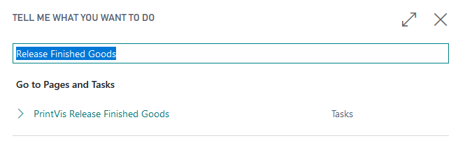

#### Step 1 - Order Number
   
- Running the generic run for Released Finished Goods page will pull in all Item Numbers that are associated with every job line marked as Order (or Production Order) and active from the Order Number entered.

#### Step 2 - Select Location 

Select the location codewhere the finished goods will be released. The bin code will be automatically completed based on the "from production bin code" field on the location card. The bin code can also be manually selected.

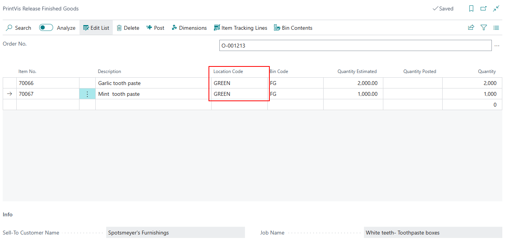

#### Step 3 - Quantity

Enter the quantity to release to inventory

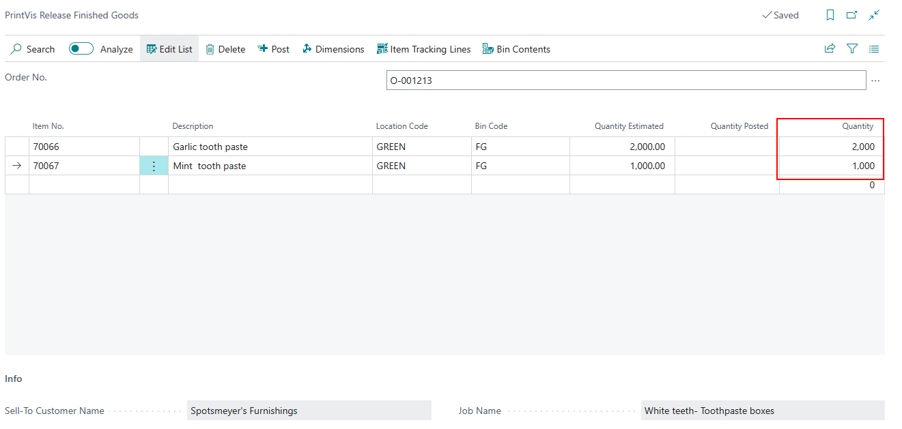

#### Step 4 - Post
 
Click Post.

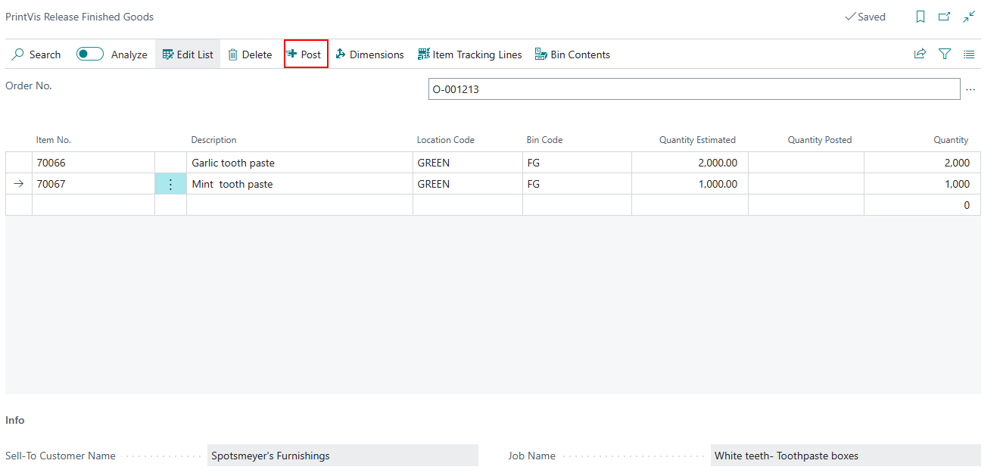

| Field            | Description                                                                                                                                                                                                                                                                                                                                                         |
|------------------|---------------------------------------------------------------------------------------------------------------------------------------------------------------------------------------------------------------------------------------------------------------------------------------------------------------------------------------------------------------------|
| Order No.        | The order number. If there is an item number on the order line, the item number and quantity will be filled out automatically.                                                                                                                                                                                                                                        |
| Item No.         | The item number of the item to be released. The item number can be filled out in advance.                                                                                                                                                                                                                                                                            |
| Description      | Description from the item card. The Item No. field relates to the Item card, from which the description is pulled.                                                                                                                                                                                                                                                   |
| Location Code    | The location to which the item must be moved. This can be filled out in advance and changed if necessary.                                                                                                                                                                                                                                                            |
| Bin Code         | The specific bin code for each location. If the "from production bin code" field on the location card is completed, this will be filled out. If no placements exist, the field can be manually entered.                                                                                                                                                             |
| Quantity Estimated | The quantity from the job (order) line.                                                                                                                                                                                                                                                                                                                              |
| Quantity Posted  | The quantity already released from production.                                                                                                                                                                                                                                                                                                                      |
| Quantity         | The quantity suggested to be released, calculated as the job line quantity minus the already released quantity.                                                                                                                                                                                                                                                     |

### Shop Floor Usage for “Release Finished Goods”

On the Shop Floor, after logging in and selecting a cost center, select a job. The **Metro** page opens, and here the **Release Finished Goods** functionality is available (as long as the Cost Center setup allows for visibility).

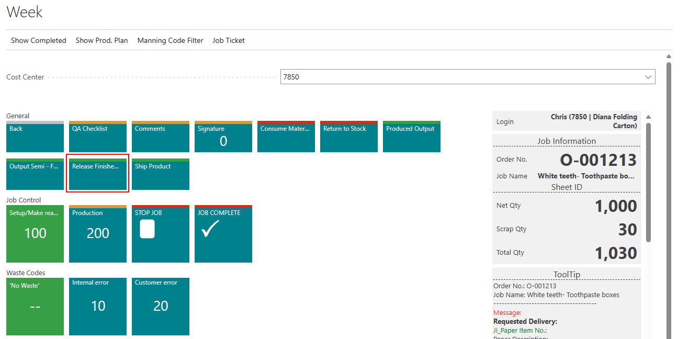

- **Order Number** is automatically filled in based on the logged-in order.
- Only item numbers assigned on the job line will show on the page.
- For posting quantities from all jobs with active orders, use the **generic run** for the Released Finished Goods page.

## Setup Item Quality

A quality must be assigned to each item. For items that will be put into stock as finished goods, choose one of the following options in the "Put-in-stock-value" field:

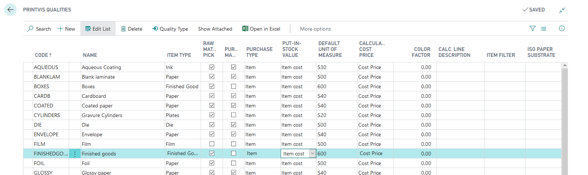

| Field               | Description                                                                                                                                                                            |
|---------------------|----------------------------------------------------------------------------------------------------------------------------------------------------------------------------------------|
| Estimated Direct Cost | Transfers direct cost (no overhead) from the estimate of tagged items.                                                                                                                                                         |
| Estimated Total Cost  | Transfers total cost (including overhead) from the estimate of tagged items.                                                                                                                                                  |
| Job Costing Direct  | Transfers direct cost (no overhead) from the job costing of tagged items.                                                                                                                                                       |
| Job Costing Total   | Transfers total cost (including overhead) from job costing of tagged items.                                                                                                                                                     |
| Item Cost           | Transfers the unit cost from the item card of tagged items.                                                                                                                                                                     |
| Item Standard Cost  | Transfers the standard cost from the item card of tagged items.                                                                                                                                                                 |
| Zero Value          | Posts unit cost as 0.                                                                                                                                                                                                          |

 Calculation of Unit Cost (if setting is Estimated/Job Costing):
- **Unit Cost** = Actual cost (Estimate/Job Costing at the moment of posting) / PV Job Quantity x Quantity (put into stock).

**Note:** PrintVis takes the cost at the moment when finished goods are posted to G/L. The item cost is not adjusted after changes to Estimate/Job Costing/Item cost.

Refer to the "PrintVis Qualities" article for more information.

Release Finished Goods with Lot Numbers

Required Setup:
1. **PrintVis General Setup** 
2. **Logistics**

Add information on the **Item Journal Batch**:

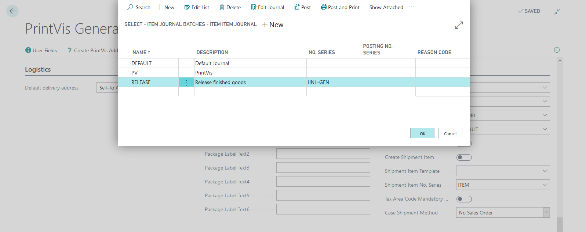

3. Prepare the item with **LOT Number Control** and number series:

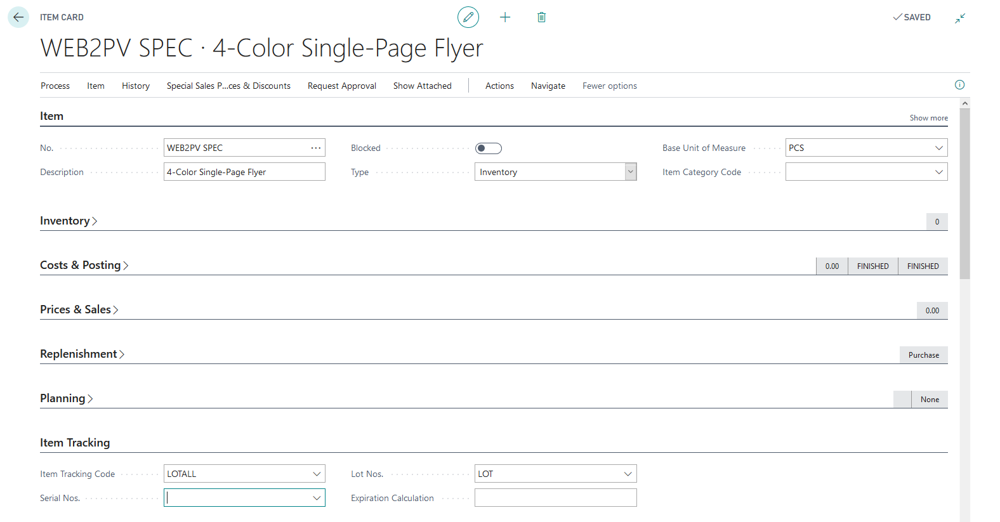

4. Use this item number in the **Item No.** field on the Case Card, job line.

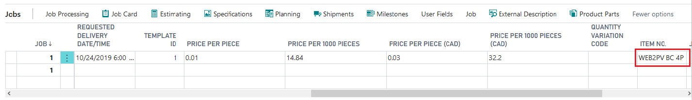

5. Let the job flow to Production until ready for storage.

6. Search **Release Finished Goods**.

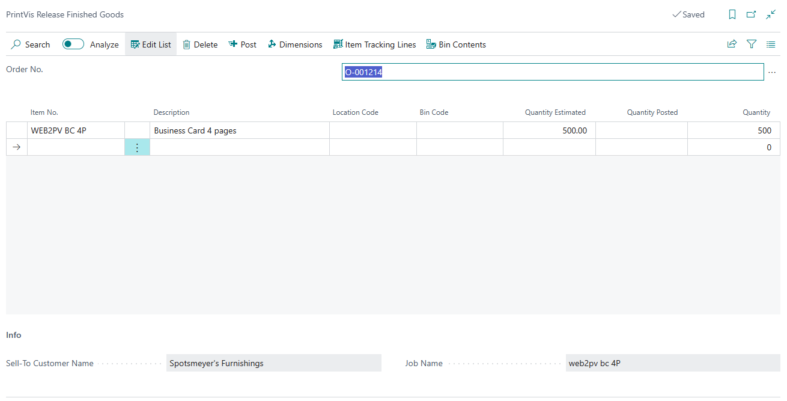
 
7. Enter the order number, location, and bin code (if relevant).
8. Enter or verify the quantity to release at this point.
9. Use the **Item Tracking Lines** button to open the standard NAV feature.

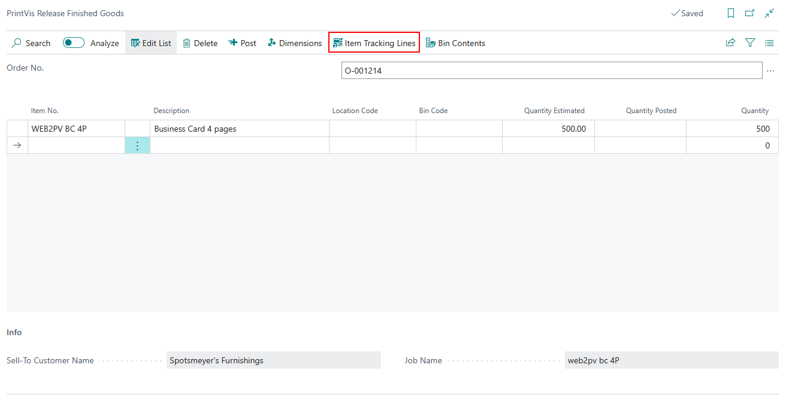

10. Click **Post** when all is entered. The system will post positive adjustments with Lot tracking.
