# Shipment

## Summary

Via the shipment function, you can create and dispatch shipments of graphic products or create a free shipment (manual shipment without attachment to an order or production).

## Shipment List/Overview

The Shipment List can be found by searching "Shipment Overview".

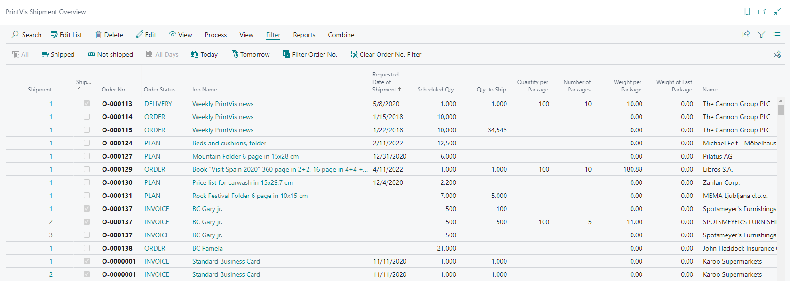

Through this function, the user can get an overview of what is ready for shipment. At the top of the window, you can define what is displayed in the list and, by personalizing the page, fields can be added and removed.

The definition options are divided into two groups: Promised date of shipment and whether the shipment has been made or not. Only one option may be selected per group.

If you choose to display according to the Promised shipment date, you may choose to see All days, Today, or Tomorrow. Based on the selected shipment date, you can view All, Shipped, or Not shipped. Typically, you would choose to view orders that are not shipped with a shipment date of today or tomorrow.

It is also possible to filter by a specific Order No. by clicking the Filter Order No. "Clear Order No. Filter" will clear the filtering on the desired Order No.

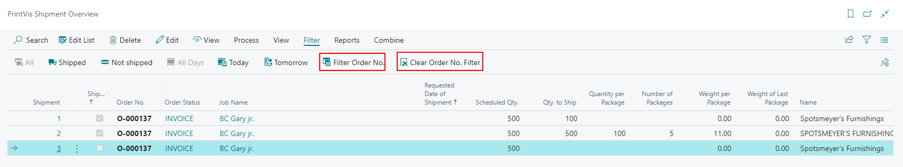

In the table, the shipments that exist in the system are displayed based on the selected definitions. If you click Edit or View buttons in the menu, the Shipment window opens. Alternatively, you may open the case card by clicking the View menu and selecting Order.

The Process menu allows the user to ship a shipment directly from the Shipment Overview. If a shipping integration is enabled, those menu actions will be available as well. Users can select multiple shipments and mark them as shipped all at once. This is also possible with the EasyPost integration, provided the shipping address information, quantity to ship, quantity per package, weight per package, shipping agent, and shipping agent service are completed for all selected shipments.

## Shipment Options

Based on the Case Shipment Method selection in the logistics section of the PrintVis General Setup page, the shipment menu will vary slightly.

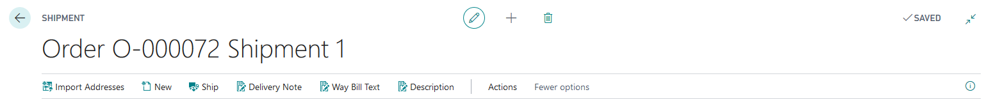

- When "No Sales Order" is the selected option, the menu will display a "Ship" button that marks the shipment as shipped.

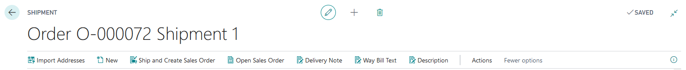

- When "Create Sales Order Per Shipment" or "Create Sales Order Per Shipment And Release" is selected, the menu will display "Ship and Create Sales Order" and "Open Sales Order" buttons. Clicking "Ship and Create Sales Order" creates a standard Business Central sales order, either open or released. When this standard sales order is shipped, the PrintVis shipment card will be updated accordingly.

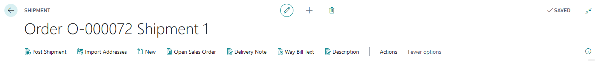

- When "Create Sales Order Per Shipment and Post" is the selected option, the menu will display a "Post Shipment" button. Clicking "Post Shipment" will create a standard Business Central posted sales shipment. To remove the $0 posted invoice from the case, the Sales & Receivables setup page must have a future date in the Allow Document Deletion Before field.

## Shipment Card

**Note:** The function "Undo Shipment" works only with this PrintVis General Setup.

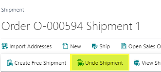

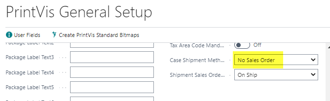

 Posted Shipment Fast-Tab

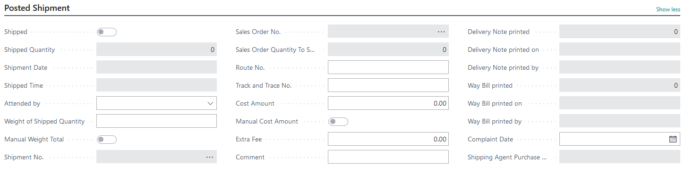

| Field                      | Description                                                                 |
|----------------------------|-----------------------------------------------------------------------------|
| Shipped                     | Used as a filter on shipment overviews, lists, and build-ups in the system. Marks the shipment as shipped or sent to a standard Business Central sales order for shipment. |
| Shipped Quantity            | The number of units shipped.                                               |
| Shipment Date/Shipped Time  | The date and time the shipment was marked as shipped.                      |
| Attended by                | Manually selected individual responsible for the delivery.                 |
| Weight of Shipped Quantity  | Weight of the shipped quantity.                                           |
| Shipment No.               | Posted sales shipment number, if applicable.                              |
| Sales Order No.            | Sales order number, if applicable.                                        |
| Sales Order Quantity to Ship| Quantity sent to a standard Business Central sales order but not yet posted as shipped. |
| Route No.                  | Manually entered route number for the shipment.                          |
| Track and Trace No.        | Manually entered tracking number for the shipment.                       |
| Cost Amount                | Cost associated with the shipment.                                       |
| Extra Fee                  | Additional fee associated with the shipment.                              |
| Comment                    | Comment entered for the shipment.                                         |
| Delivery Note fields       | Number of delivery notes printed, when they were printed, and who printed them. |
| Way Bill fields            | Number of way bills printed, when they were printed, and who printed them. |
| Complaint Date             | Date a complaint was entered associated with this shipment.                |
| Shipping Agent Purchase Order| Purchase order number, if created for this shipment.                    |

 General Fast-Tab

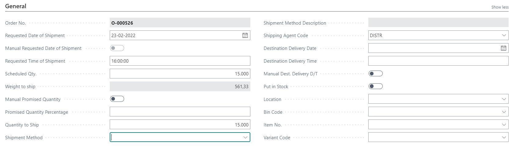

| Field                         | Description                                                                 |
|-------------------------------|-----------------------------------------------------------------------------|
| Order No.                     | The order number associated with the case.                                |
| Requested Date of Shipment    | Automatically filled when the Requested Shipment Date field on the case card is filled. Transferred to the sales order or posted shipment when applicable. |
| Requested Time of Shipment     | Automatically filled when the Requested Shipment Date field on the case card is filled. Transferred to the sales order or posted shipment when applicable. Takes time from the setting in PrintVis General Setup. |
| Scheduled Qty.                | State the scheduled quantity for the shipment.                            |
| Weight to ship                | Display the weight of the Scheduled Qty.                                   |
| Promised Quantity Percentage   | Give a percentage value for a partial delivery.                           |
| Quantity to Ship              | The actual quantity used to post the shipped quantity or the quantity transferred to a sales order or posted shipment. |
| Shipment Method               | Select a shipment method from the list.                                   |
| Shipping Agent Code           | Select the Shipping Agent from the list (Shipping Agent Setup needed).    |
| Destination Delivery Date     | Automatically filled when the Destination Delivery Date field on the case card is filled. Does not influence planning. Information indicating when the job should arrive at the end user. |
| Destination Delivery Time     | Automatically filled when the Destination Delivery Time field on the case card is filled. Does not influence planning. Information indicating when the job should arrive at the end user. |
| Put in Stock                  | By selecting this field, the quantity to ship will be placed in inventory. |
| Location                      | The location used to inventory the item if put in stock is selected.      |
| Bin Code                     | The bin code used to inventory the item if put in stock is selected.      |
| Item No.                     | The item used to inventory if put in stock is selected.                   |
| Variant Code                 | If the item has variants set up, the variant code can be looked up here. |

 Details Fast-Tab

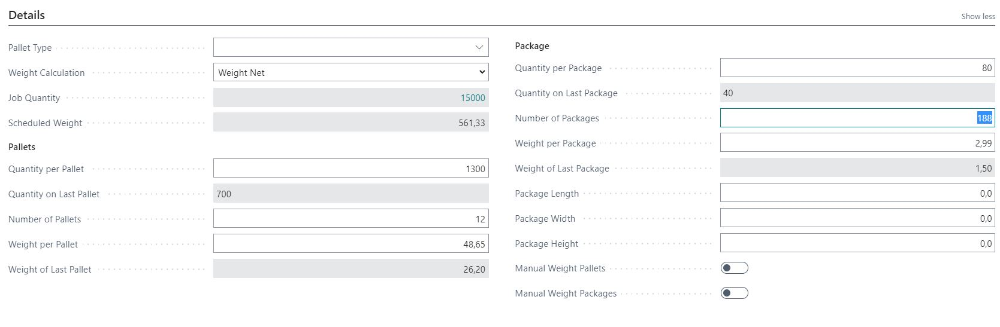

The details fast-tab holds pallet and package details for the shipment, including quantities per, number of, and weight. Pallet type requires shipping agent setup. The weight calculation field helps in determining the weight of packages and pallets, including the weight of the Last Pallet and Last Package. The options are:

- Weight Net - uses clean cut format
- Weight Net Printed Sheets - uses the net printed sheets for the job (excluding scrap)
- Weight Gross Printed Sheets - uses the gross weight of the job (including scrap)

 Ship-To Fast-Tab

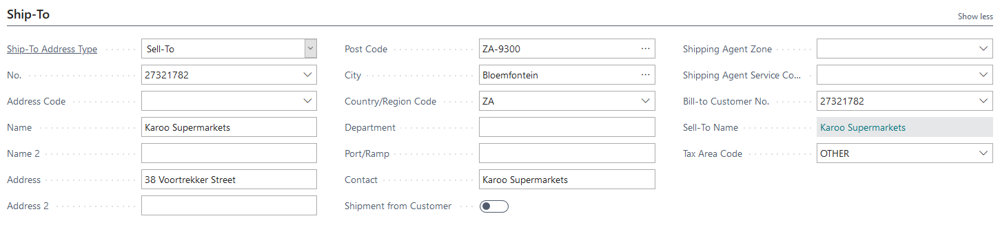

| Field                         | Description                                                                 |
|-------------------------------|-----------------------------------------------------------------------------|
| Ship-To Address Type          | Desired address type selected via look-up field.                           |
| Address Code                  | Shipment addresses created for the customer can be selected via look-up field. |
| Address Fields                | Displays information according to the selected address type.               |
| Shipment from Customer        | Selection here means way bills are created with the name and address of the customer as sender. |
| Shipping Agent Zone           | Select the Shipping Agent Zone from the list (Shipping Agent Setup needed). |
| Shipping Agent Service Code   | Select the Shipping Agent Service from the list (Shipping Agent Setup needed). |
| Bill-To Customer No.          | The customer to be billed for the shipment.                                |
| Tax Area Code                 | The tax code to be used for the shipment.                                  |

 Address Labels Fast-Tab

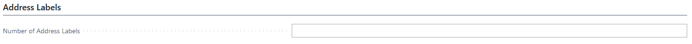

This section determines the number of address labels to be printed, which can be printed from the Actions menu.

 Package Labels Fast-Tab

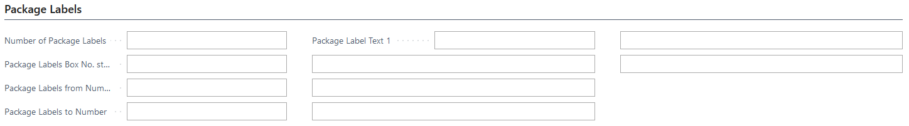

If you want to use Package labels instead of Address labels, use the Package labels fast-tab, which has more automation.

| Field                         | Description                                                                 |
|-------------------------------|-----------------------------------------------------------------------------|
| Number of Package Labels       | Determines the number of package labels to be printed.                     |
| Package Labels Box No. start  | Shall be filled in using figures if the print shall not start in the first table. |
| Package Label from/to Number   | Specify the from and to numbers used on the package label.                |
| Package Label Text 1-6        | Allows writing up to 6 lines of text to be printed on the label.          |

These labels can be printed from the Actions menu.

 Binder Fast-Tab

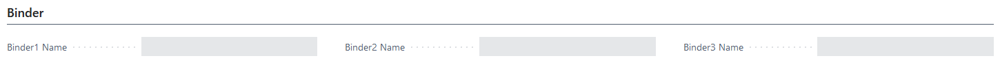

The vendor name for the first three calculated Items/Services of the type subcontracting is displayed. Information is found in Calculation related to the order and serves as information for the shipment attendant regarding which external suppliers/items should be sent for further processing.

 Delivery Note, Way Bill Text, Description

Via the Delivery Note, Way Bill Text, and Description menu buttons, you can build text lines for the print of receipts, way bills, and shipment descriptions. 

The Build text button is linked to merge codes created specifically for this in the PrintVis General Setup page. The text build will populate lines on this shipment alone, and the user can overwrite or add more information as needed.

To print the information, the relevant reports must be programmed to include this information. These reports are available but will require some Word Layout work in each customer installation to match the customer's requirements, document preferences, and label sizes. Word layout data sets are available.
