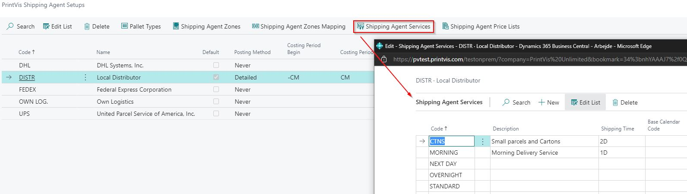

# Shipping Agent

## Summary

### Standard Shipping Agents Setup

Two additional fields have been added to the standard Shipping Agents setup page:

- **Carrier Account ID** is used with the EasyPost integration and holds the EasyPost Carrier ID for that shipping agent.
- **Shipping Markup** has been added and is used with the PV Shipment Freight function on the invoice templates. When building the invoice, if the PV Shipment Freight function is part of the template, the system pulls the shipment cost and extra fee amounts from each shipment and marks them up according to the value in the Shipping Markup field on the Shipping Agent.

 This functional area for calculating and posting "Freight Costs" without an integration includes the following setup:
- Shipping Agents
- Shipping Agents Pricelists
- Shipping Agents Services
- Automatic posting of Freight Cost upon Shipment

### PrintVis Shipping Agent Setups
Search for **PrintVis Shipping Agent Setup**.

Shipping Agent Setup

#### Setup
The Setup of the function from "Shipping Agent" - the button on top is related to the selected Shipping Agent.

| Field                | Description                                                                                                           |
|----------------------|-----------------------------------------------------------------------------------------------------------------------|
| Code                 | Select the Shipping Agent Code from the list.                                                                         |
| Name                 | Shipping Agent name.                                                                                                  |
| Default              | Which Shipping Agent should be the Default Agent.                                                                     |
| Posting Method       | Posting Method of purchase order: **Never**, **Total Amount**, **Detailed**.                                           |
| Costing Period Begin/End | For which period the book entry lines of the single deliveries on an invoice should be summarized. Possible options are:  - **D** - day  - **WD** - week day  - **W** - week  - **M** - month  - **Q** - quarter  - **Y** - year  - **C** - current time unit based on date, can be specified as a prefix to the time unit. The date formulas should include a number. |
| Costing Item No.     | Item no. defined as "External Finishing" item.                                                                         |
| Vendor No.           | Vendor no. comes from the selected item no.                                                                            |
| Status Code          | From which status code it is possible to create the purchase order.                                                    |
| Special Service Hours From |                                                                                                                |
| Special Service Hours To   |                                                                                                                |
| Special Service Code  | Which special services with from and to time have this shipping agent. It can be set up to 10.                        |

#### Pallet Types

| Field                | Description                                                                                                           |
|----------------------|-----------------------------------------------------------------------------------------------------------------------|
| Code                 | Code is the identification field for the palettes.                                                                    |
| Description          | A meaningful description that explains to the user what this is.                                                       |
| Max. Weight          | Maximal weight of the palette. This is used in the calculation of the number of palettes.                              |
| Pallet Weight        | Dead weight of the palette.                                                                                           |
| Recycle              | If the palette is recyclable: yes or no.                                                                               |
| Recycle Unit Cost    | Expenses for recycling.                                                                                               |
| External Pallet Code | Pallet Code from the Shipping Agent.                                                                                   |

#### Shipping Agent Zones

#### Shipping Agent Zones Mapping

#### Shipping Agent Services

### Shipping Agent Price List

#### Quantity Prices
The Quantity Prices are the prices to be added to the shipment based on the Shipping Agent and Shipping Agent Service. For each Shipping Agent Service (blank if no service is selected on the shipment), build the price for that service on the Quantity Prices page.

There is also an option to **Copy Quantity Prices to...** another service. Highlight the Shipping Agent Service you want to copy, select the Shipping Agent Service you want to receive that copy, and click **Ok**. This will add and/or modify all the entries from the highlighted service to the one selected. If entries exist in the new service that don't exist in the one being copied, they will remain in the service.

#### Additional Fee
Additional fees are to be set up exactly as the base 'Quantity prices'; however, you must add the Additional fee to the setup as well - in other words, Additional Fees for Shipping Agent Services must contain both the basic quantity prices as well as the additional fee.

From the **Additional Fee** window, set up the fee/rate (to be charged only once).

