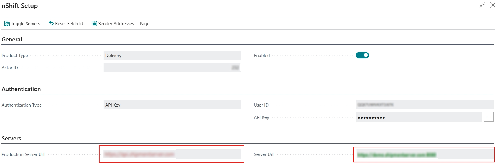
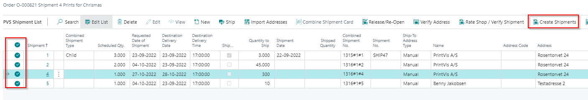
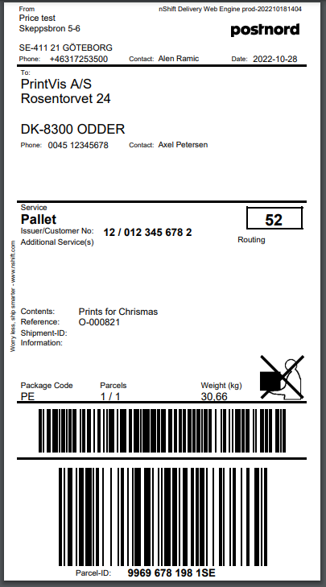

# nShift Delivery Integration

## Summary

**nShift** is a third-party system used to integrate with Scandinavian Carrier/Freight companies. The integration involves two systems:
- **nShift Delivery**: Handles initial setup (API keys, sender/receiver info).
- **PrintVis**: Sends and receives data to and from nShift (create shipments, get prices, track shipments).

 Key Features
- Create nShift Waybills from PrintVis with one click.
- Waybills can be edited and exported to nShift.
- nShift returns a "Track'n Trace" number.
- Create multiple waybills for a PV Job.
- Manual waybills that are not connected to PrintVis.
- Option to resubmit waybills if changes are made.

## System Requirements
- **PrintVis PV21** or higher.
- **nShift Account** at [nShift Delivery](https://nshift.com/).
- **nShift Documentation**: [API Connect](https://help.unifaun.com/uo-se/en/integrations/apiconnect.html).

## Setup

### General Setup
1. Navigate to **Service Connections** and select **Shipping Integration**.

2. Enable the nShift provider.

3. If changes are needed, disable the setup, make changes, and re-enable.

### Configure nShift Specific Setup
Fill in necessary fields like:

| Tap              | Field                           | Description |
|------------------|----------------------------------|-------------|
| General          | Product Type                     | Delivery and Ship are the two options to select from. When doing an integration with nShift Delivery, the correct option is Delivery. |
|                  | Actor ID                         | nShift Actor ID that is provided by nShift support team. |
|                  | Enabled                          | If enabled, then fields on the nShift Setup page will be locked. If any fields need adjusted, then first check off the Boolean. Once changes have been completed, make sure to turn the Boolean back on. |
| Authentication   | Authentication Type              | Specifies how the system will authenticate the connection between PrintVis and nShift portal. Options are API Key or OAuth, but ONLY use API Key for nShift Delivery. |
|                  | User ID                          | nShift User ID |
|                  | API Key                          | nShift Password |
| Servers          | Production Server URL            | In the Servers group insert URL that nShift provides. Set the same value in both fields (Server Url and Production Server Url). Green color represents active URL; red represents inactive. Use page action Toggle Server to switch between test and prod. |
|                  | Server Url                       | Same as above. |
| Sender Address   | Sender Address Type              | Select the preferred sender address used on a shipment card and passed to nShift portal when creating a shipment: **Default Address** – Shows additional address fields. Only Quick ID is needed to send to nShift Delivery. Other fields are reference-only in PrintVis. **Sender Address** – Multiple addresses can be set in the list. Default is used but can be changed on shipment card. **Location** – Uses sender address from the last cost center. Quick ID from location is passed to nShift when creating a shipment. |
| No. Series       | All fields                       | In the No. Series group, create and set No. Series that will be used for Prices and Consolidated Shipments. |
| Track and Trace  | Language Codes                   | Show the language |
| Labels           | Return Label Type                | This field determines the file type for the shipment labels sent from nShift Delivery portal. Various options available. |
|                  | Download Shipment Labels Automatically | If checked on, shipment labels will be downloaded automatically when using "Create Shipment." If off, the user must open the Shipment Labels table to download them. |

#### API Key Connection
- Set the API Key by generating it from the nShift Delivery portal and entering it into PrintVis.

#### Sender Address Setup
- There are three options:
  1. **Default Address**: Fixed sender address (cannot be changed on the shipment card).
  

  2. **Sender Address**: Can be modified on the shipment card.
  

  3. **Location**: Based on the last cost center in the process.

The Quick ID is the only sender address information that is passed from PrintVis to nShift, which is also displayed on labels. On the Location card is where the Quick ID is stored.

Sender address will need to be created for all locations with Quick IDs that are setup in PrintVis will also need to be created in nShift Delivery portal. 

#### Enabling Setup

When we enabled **nShift Setup** and **Shipping Integration Setup**, we are ready to send data to nShift.

### Creating Shipping Agent and Pallet Type for nShift Shipment

PrintVis Shipping Agent Setups must be updated with information that nShift uses.

Per **Shipping Agent Code**; **Pallet Type** and **Shipping Agent Services** must be set up for nShift to create an nShift Shipment.

This setup must be done for **each Shipping Agent**. Setup in **Pallet Type** and **Shipping Agent Services** are **mandatory**, the rest is optional.

#### Pallet Type Setup

| Field               | Description |
|---------------------|-------------|
| Code                | Pallet Type Code for use on PrintVis Shipment Card |
| Description         | Description for use in PrintVis |
| Package             | **Yes**: Then PrintVis and nShift know that this is a Package, even though it is set up in Pallet Type. **No**: This is a Pallet. |
| Max. Weight         | PrintVis uses the value to calculate the number of pallets based on the Shipment weight |
| Pallet Weight       | PrintVis uses the value to calculate Total Weight on the Pallet |
| Recycle             | Some countries have a system where certain approved Pallets are recycled—if you deliver one pallet to your Shipping Agent, they return one empty pallet when collecting your shipment. If this field is set to 'yes', such recycling is suggested. |
| Recycle Unit Cost   | Enter the cost of a recycled unit in your local currency, to estimate the cost if your Shipping Agent does not return a recycled pallet. |
| External Pallet Code| nShift's Code for that Pallet Type for that Shipping Agent |

**New field `Package` is added to Pallet Types**, which defines whether a Pallet Type is a package or not.

- If Pallet Type Code has `Package` selected:  
  → **Number of Packages** and **Weight per Package** values will be sent in the shipment.
  
- In other cases:  
  → **Number of Pallets** and **Weight per Pallet** values will be sent.

#### Shipping Agent Services Setup

| Field               | Description                                                                                  |
|---------------------|----------------------------------------------------------------------------------------------|
| Code                | Shipping Agent Code for use on PrintVis Shipment Card                                       |
| Description         | Description for use in PrintVis                                                             |
| Shipping Time       | Define the time that is used for when an item is shipped from the warehouse to when it is ready to be sent out for delivery. |
| Base Calendar Code  | Setup a calendar that is specific for the Shipping Agent Service, such as holidays and specific working days. |
| Customized Calendar | Specifies if a customized calendar is setup and used in base calendar code field.            |
| External Service Id | nShift Code for that Service                                                                |

### Applying Shipping Cost

Price list setup can be applied to Shipping Agent through the PrintVis Shipping Agent Setup. If shipment cost needs to be invoiced to customers, then it is also possible to setup the costing period on the PrintVis Shipping Agent Setup page. The following article discusses the setup in more detail: **Shipping Agent Setup**.

## Creating nShift Shipment from PV Shipment Card

### Mandatory Fields

Creating nShift Shipment can be done from the PrintVis Shipment Card or PrintVis Shipment List, calling the **Create Shipment** page action.

PrintVis Shipment Card must be filled with all necessary data. If you try to create an nShift shipment without filling all necessary data, the user will get a list of missing mandatory fields, which must be completed in order to send data to nShift.

 Mandatory fields on PV Shipment Card:

- Quantity to Ship
- Shipping Agent Code
- Shipping Agent Service Code
- Pallet Type *  
- Number of Pallets
- Number of Packages * (only mandatory if the selected Pallet Type is marked as "Package")
- Ship-To Name
- Ship-To Address
- Ship-To Post Code
- Ship-To City
- Ship-To Country/Region Code
- Ship-To Email
- Ship-To Phone No.

*User will receive a message about missing data when the action **Create Shipment** is used.*

### Creating nShift Shipment

Use the action **Create Shipment** to send information to nShift. It is possible to use **Create Shipment** from an individual shipment card or from the shipment list where multiple shipments are selected and created at the same time.

Options:

#### PV Shipment Card 

Create shipment from a single shipment.

#### PVS Shipment List

 Create shipment for one or several selected shipments.

### PVS Combined Shipment Card

Consolidate shipments.

#### Pallet Section

If you have combined several shipments on a Combined Shipment Card and they have different Pallet Types, you must change to one correct Pallet Type to create a correct nShift Shipment. (nShift cannot receive a shipment with different pallet types, so they must be sent individually.)

Update the red fields, as they will be used for nShift.

#### Agent Section

Shipping Agent information is defaulted from the first shipment on the combined shipment card, but changes can be made for the entire shipment.

#### Sender Address

Sender address for the combined shipment is pulled from the first shipment, but there is an option to change the Sender Code if another location is needed.

#### Create nShift Shipment

After opening the PrintVis Combined Shipment card:

1. Use the **Get Shipments** function to assign other shipments to the combined shipment card.
2. Once all shipments are in place, use the **Release** functionality.
3. Use **Send Consolidated Shipments** to purchase the shipment from nShift.

#### Shipment Labels

Shipment labels for the combined shipment can be accessed from the **Shipment Labels** function, but can also be accessed from each individual shipment.

### nShift Label
  
  nShift label will be ready to print for all selected shipments. A PDF will be created.

### Shipment Created or Not

A new option field **Shipment Status** was added on the Shipment Card, visible only if nShift setup is enabled.

- Default value: **Not Created**
- If shipment is successfully created: status changes to **Printed**
- If shipment is cancelled: status changes to **Cancelled**

### Track Shipment

If you have an nShift license for Track & Trace, you can get tracking information into PrintVis.

- From PV Shipment Card:  

 

 nShift Portal will open in a browser; our reference is the Order No.

- If using combined shipment, then the Shipment No on the shipment card is filled in on all shipment cards that were part of the combined shipment.

This number will be used as a reference on the tracking URL (instead of the Order No).

