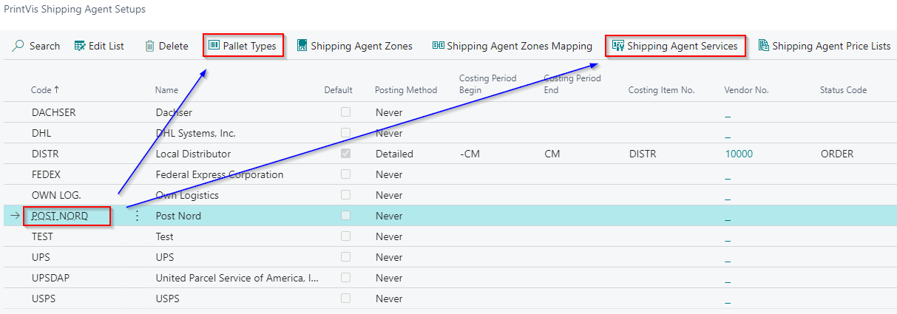

# nShift Ship Integration

## Summary

nShift is a third-party system for integration with Scandinavian Carrier-/Freight Companies.

nShift integration contains two parties: **nShift Ship** and **PrintVis**. nShift Ship is used to create the initial setup, like generating the API key, creating senders, receivers, etc. From PrintVis, we are sending data to nShift (create shipments, consolidated shipments, get prices, alerts) and reading responses.

The nShift Integration is easy to work with and has the following functionality:

- Shipment Labels exported from nShift.
- Create shipments in PrintVis, and information is posted to nShift with a click of a button.
- Combine shipments easily sent together to nShift, along with shipment labels.
- Creating/shipping multiple shipments in PrintVis, and also generated in nShift.

> The nShift Ship portal is not described in extensive detail in this article. For more information about the nShift Ship portal, please contact nShift.

## System Requirements

- **PrintVis PV21** or higher
- **Customer Account** at nShift Ship (more links below)
- nShift webpage is available at [nshift.com](https://nshift.com/)
- nShift Ship is available at [consignorportal.com/ui](https://www.consignorportal.com/ui), and adding credentials allows you to log in to the nShift Ship portal.
- nShift documentation:
  - [Shipmentserver](https://helpcenter.nshift.com/hc/en-us/sections/5402776930972-API-Version-2)
  - [Shipmentdata API](https://helpcenter.nshift.com/hc/en-us/articles/360021438180-Getting-started-with-ShipmentData-API)

## Setup

### General

The general setup for nShift is done using the **Service Connections** page.

On the **Service Connections** page, you can find the **Shipping Integration** link, where the initial setup is completed.

On the **Shipping Integration Setup** page, we select the shipping provider that should be used. In this case, select **nShift Setup**, and once setup is complete, click on the **Enable** Boolean to enable Shipping Integration functionality on PrintVis. When the **View Communication Messages** Boolean is checked, the system will display messages when using nShift functionality (such as Create Shipment) on the PrintVis Shipment card.

If setup is already enabled and changes are needed, first **Disable** setup, make the changes, and **Enable** it again.

### Configure nShift Specific Setup

The next step is to configure the nShift-specific setup and enter all necessary information for communication with the nShift interface.

| Tab             | Field                       | Description                                                                                                                                                                                                                                                                                    |
|-----------------|-----------------------------|------------------------------------------------------------------------------------------------------------------------------------------------------------------------------------------------------------------------------------------------------------------------------------------------|
| General         | Product Type                | Delivery - Uses the nShift Delivery integration with associated functionality.  
Ship - Uses the nShift Ship integration with associated functionality.                                                                                                                  |
|                 | Actor ID                   | nShift Actor ID                                                                                                                                                                                                                                                                                 |
|                 | Enabled                    | When Boolean is activated, fields lock and initiate info into the system. To make changes on nShift Setup page, first uncheck Boolean.                                                                                                                                                            |
| Authentication  | Authentication Server URL  | The server nShift provides to receive a new token when sending a shipment request.                                                                                                                                                                                                              |
|                 | Authentication Type        | API Key - Uses User ID and API Key to connect PrintVis and nShift portal (only for nShift Delivery).  
OAuth - Uses Client ID and Client Secret to connect PrintVis and nShift portal (only for nShift Ship).                                                                                                                                |
| OAuth           | Client ID                  | Client ID generated in nShift portal.                                                                                                                                                                                                                                                          |
|                 | Client Secret              | Client Secret generated in nShift portal.                                                                                                                                                                                                                                                      |
| Servers         | Production Server URL      | Insert URL provided by nShift. Set the same value in both Server URL and Production Server URL fields.  
Green color represents active URL (used in communication), red color represents inactive URL. Page action "Toggle Server" switches between test and prod URLs.                                                                   |
|                 | Server URL                 | Same as Production Server URL explanation above.                                                                                                                                                                                                                                              |
| Sender Address  | Sender Address Type        | Specifies the sender's address used when creating a shipment. Options:  
- Default Address: uses setup on nShift Setup page for all shipments; sender address fields locked on shipment card.  
- Sender Address: uses default from Sender Address page; sender address can be changed before shipment creation.  
- Location: uses location code from last cost center before shipping (only if Default Address selected).                             |
|                 | Quick ID                   | Connection ID used for nShift Delivery and PrintVis. Not used for nShift Ship.                                                                                                                                                                                                                 |
|                 | Name                       | Sender name used on shipment label and sent to nShift Ship portal.                                                                                                                                                                                                                            |
|                 | Name 2                     | Alternate sender name added in addition to Name field.                                                                                                                                                                                                                                        |
|                 | Address                    | Sender address used on shipment label.                                                                                                                                                                                                                                                        |
|                 | Address 2                  | Secondary sender address used on shipment label.                                                                                                                                                                                                                                              |
|                 | City                       | City for sender address used on shipment label.                                                                                                                                                                                                                                              |
|                 | Post Code                  | Post Code for sender address used on shipment label.                                                                                                                                                                                                                                         |
|                 | Country/Region Code        | Country/Region Code for sender address used on shipment label.                                                                                                                                                                                                                               |
|                 | Phone No.                  | Phone number printed on shipment label.                                                                                                                                                                                                                                                      |
|                 | Mobile Phone No.           | Mobile phone number for sender.                                                                                                                                                                                                                                                              |
|                 | Email                      | Email printed on shipment label.                                                                                                                                                                                                                                                             |
| No. Series      | Prices No. Series          | No. Series used for assigning prices.                                                                                                                                                                                                                                                        |
|                 | Consolidated No. Series    | No. Series used for assigning consolidated shipments.                                                                                                                                                                                                                                       |
| Track and Trace | Language Codes             | Language used for track and trace information.                                                                                                                                                                                                                                               |
|                 | Tracking URL               | URL provided by nShift for direct connection to Track Shipment function on shipment card. Opens webpage for specific shipments.                                                                                                                                                              |
|                 | Package Tracking URL       | URL provided by nShift for direct connection on Shipment Label page correlated to specific packages.                                                                                                                                                                                         |
| Labels          | Return Label Type          | Determines the label type used when shipment is created and label is sent back from nShift to PrintVis.                                                                                                                                                                                     |
|                 | Download Shipment Labels Automatically | If Boolean is checked, shipment labels download automatically when creating shipment. If unchecked, user must open Shipment Label table to download labels.                                                                                                                       |

Before using Enable on nShift setup, it is important to set OAuth, Client ID, and Client Secret.

If setup is already Enabled, and we want to do any changes, we will need first to Disable setup, do the changes and Enable it again.

#### Sender Address Setup
- **Default Address**: Uses the address from the nShift Setup page. Sender address fields are locked on the shipment card.

- **Sender Address**: Allows changing the sender code on the shipment card.

Sender Address is setup on the Sender Address List page. The line with default check box marked will be the automatic default on the shipment card. Note that the Quick ID is not used for nShift Ship, it is only used for nShift Delivery.

- **Location**: Uses the location code from the last cost center before shipping.

Location setup on that cost center will pull the sender address to the shipment card.

Name, Address, Post Code, City, Country/Region Code are mandatory fields used for the sender address. All other fields are optional fields.

#### Enabling Setup

Once the setup is completed, enable the Boolean fields for nShift Setup and Shipping Integration Setup.

### Creating Shipping Agent and Pallet Type for nShift Shipment

 PrintVis Shipping Agent Setup

Each carrier that will be used for shipping must be created in the system.

| Field                         | Description                                                                                                                                                                                                                                                                                     |
|-------------------------------|-------------------------------------------------------------------------------------------------------------------------------------------------------------------------------------------------------------------------------------------------------------------------------------------------|
| Code                          | Shipping Agent for use on PrintVis Shipment Card.                                                                                                                                                                                                                                               |
| Name                          | Description for use in PrintVis.                                                                                                                                                                                                                                                                |
| Default                       | If this shipping agent handles most shipments, check this field. It will auto-insert as default when a shipment card is created.  
Note: There’s also default setup for shipping agent on the customer card and sender address associated with it.                                      |
| Posting Method                | Determines the level of detail displayed on the Purchase Order for shipment cost.                                                                                                                                                                                                               |
| Costing Period Begin          | Beginning date for accumulating shipment cost for the carrier. Costs are applied to the Purchase Order once the shipment is marked as 'shipped'.                                                                                                                                                |
| Costing Period End            | End date for accumulating shipment cost for the carrier. Costs are applied to the Purchase Order once the shipment is marked as 'shipped'.                                                                                                                                                     |
| Costing Item No.              | Links the carrier to its specific item. Each carrier should have a unique item to ensure proper freight cost assignment.                                                                                                                                                                       |
| Vendor No.                    | Assign an individual vendor for each carrier to create a 1:1 relationship between freight costs and the carrier.                                                                                                                                                                                |
| Status Code                   | Purchase Orders generated will inherit this Status Code.                                                                                                                                                                                                                                        |
| Special Service Hours 1 From  | Default pickup **start time** for carriers requiring specific pickup windows (used by nShift).                                                                                                                                                                                                 |
| Special Service Hours 1 To    | Default pickup **end time** for carriers requiring specific pickup windows (used by nShift).                                                                                                                                                                                                   |
| Special Service Code 1        | Not required for the nShift integration.                                                                                                                                                                                                                                                        |

Per Shipping Agent Code, Pallet Type and Shipping Agent Services must be set up for nShift to create a shipment from PrintVis into the nShift portal.

This setup must be done for each Shipping Agent. Setup in Pallet Type and Shipping Agent Services are mandatory, the rest is optional.

### Pallet Type Setup

| Field                | Description                                                                                                                                                                                                                                                                                              |
|----------------------|----------------------------------------------------------------------------------------------------------------------------------------------------------------------------------------------------------------------------------------------------------------------------------------------------------|
| Code                 | Pallet Type Code for use on PrintVis Shipment Card.                                                                                                                                                                                                                                                      |
| Description          | Description for use in PrintVis.                                                                                                                                                                                                                                                                         |
| Package              | **Yes**: PrintVis and nShift treat this as a Package, even though it is set up in Pallet Type.  
**No**: This is a Pallet.                                                                                                                                                                                       |
| Max. Weight          | PrintVis uses the value to calculate the number of pallets based on the shipment weight.                                                                                                                                                                                                                |
| Pallet Weight        | PrintVis uses the value to calculate Total Weight on the Pallet.                                                                                                                                                                                                                                         |
| Recycle              | Some countries recycle approved pallets—if this is set to 'yes', the system assumes the pallet will be returned by the shipping agent upon collection.                                                                                                                                                  |
| Recycle Unit Cost    | Enter the cost of a recycled unit in your local currency. Used to estimate cost if the shipping agent does not return a recycled pallet.                                                                                                                                                                |
| External Pallet Code | nShift's code for the pallet type related to the selected shipping agent.                                                                                                                                                                                                                               |
| Default Length       | Default length (in mm) of the specified pallet type. Automatically populated on the shipment card when the pallet type is used.  
**Note**: Must be in **mm** unless a customization allows another unit.                                                                                                                                                      |
| Default Width        | Default width (in mm) of the specified pallet type. Automatically populated on the shipment card.  
**Note**: Must be in **mm** unless a customization allows another unit.                                                                                                                                                        |
| Default Height       | Default height (in mm) of the specified pallet type. Automatically populated on the shipment card.  
**Note**: Must be in **mm** unless a customization allows another unit.                                                                                                                                                       |

New field Package is added to Pallet Types, which define whether Pallet Type is package or not. This is important because if Pallet Type code has selected package, then No. of Packages and Weight per Package values will be sent in shipment. 

In other cases, Number of Pallets and Weight per Pallet values are being sent.

#### Shipping Agent Services Setup

| Field                | Description                                                                                                                                                                                                                                                          |
|----------------------|----------------------------------------------------------------------------------------------------------------------------------------------------------------------------------------------------------------------------------------------------------------------|
| Code                 | Shipping Agent Code for use on PrintVis Shipment Card.                                                                                                                                                                                                               |
| Description          | Description for use in PrintVis.                                                                                                                                                                                                                                     |
| Shipping Time        | Defines the time used between when an item is shipped from the warehouse to when it is ready for delivery.                                                                                                                                                          |
| Base Calendar Code   | Sets up a calendar specific to the Shipping Agent Service (e.g., holidays, specific working days).                                                                                                                                                                   |
| Customized Calendar  | Specifies whether a customized calendar is set up and used in the Base Calendar Code field.                                                                                                                                                                          |
| External Service Id  | nShift code for that Service.                                                                                                                                                                                                                                        |
| Default Pallet Type  | Pallet type most commonly used with this Shipping Agent Service. If selected, it auto-fills on the shipment card when the Shipping Agent Service is populated.                                                                                                       |
| Normalize Post Code  | Check this if the Post Code format in the system differs from the format required by the carrier (e.g., to remove a dash).                                                                                                                                           |

 Additional Setup

 On Customer Card:
Default setup for Shipping Agent and Service can be applied for specific customers. 

This default setup will be used whenever this customer is linked to a shipment.

Note: The setup on the Ship-To address associated with a customer will overrule the setup done on the customer card. This especially information if there are multiple shipping addresses for a customer, which can be selected on a Shipment card for specific occasions.

### Creating nShift Shipment

Use the "Create Shipment" action to send information and create a shipment in the nShift Ship portal.

#### PV Shipment Card

One selected Shipment :

#### PVS Combined Shipment Card

If combining several shipments on a Combined Shipment Card and they have different Pallet Types, you must change to one correct Pallet Type in order to create a correct nShift Shipment. (nShift cannot receive a shipment with different pallet types, so they must be sent individually.)

Update the red fields, they will be used for nShift.

#### nShift Shipment Label

Shipment labels will be ready to print for all selected shipments, and PDFs will be created. Access labels via the "Shipment Labels" action.

It is also possible to access the label by selecting "Shipment Labels" action in the top menu from the Shipment card. All package labels will be present for redownloading, if needed.

#### Shipment created or not

New option field Shipment Status was added on Shipment Card, and it is visible only if nShift setup is Enabled. By default it has value Not Created. 

If Shipment is successfully created it will change value to Printed, or Cancelled if it’s cancelled.

### Applying Shipping Cost

Price list setup can be applied to the Shipping Agent through the **PrintVis Shipping Agent Setup**.  
If shipment cost needs to be invoiced to customers, it is also possible to set up the costing period on the **Shipping Agent Setup** page.  
Refer to the article **Shipping Agent Setup** for more detailed setup instructions.

Receiving Freight Cost from nShift

There are **2 options** for obtaining pricing from nShift:

 1) Create Rates

- This function retrieves rates for:
  - Shipping Agent
  - Shipping Agent Service
  - Pallet Type  
  (as selected on the Shipment Card)

- After selecting this function, a page pops up showing the rate from the carrier via nShift.

> ⚠️ **Important:**  
> The **Create Rates** function does **not** create the shipment in the nShift portal.  
> It allows users to _rate shop_ before creating the shipment.  
> The retrieved rate is automatically entered into the **Cost Amount** field on the shipment card.

 2) Create Shipment

- This function **sends the shipment data to nShift**.
- If available, a rate is returned and automatically populated in the **Cost Amount** field.

> 💡 If a rate was previously pulled via **Create Rates**, it will be **overwritten** with the rate returned from **Create Shipment** — ensuring the **most current value** is used.

- Additional shipment costs can be added manually using the **Extra Fee** field.

 Note:

- Availability of cost data from nShift depends on:
  - Your agreement with nShift.
  - The carrier’s ability to provide cost information through the integration.

Tracking Information

Shipment Tracking:
Tracking numbers are populated on the Shipment card, which can be used to track shipments through nShift.

 Package Tracking:
Multiple packages can be tracked through individual tracking links in the "Shipment Labels" action.

