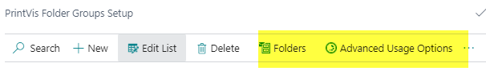

# Folder Group Setup and Usage

## Summary

This article describes the setup and use of PrintVis Folders. These are
used to assign an external document to a case and/or to save documents
created by the system.

## Setup

**Cloud Storage Setup**

1\. Search for “PrintVis Cloud Storage Setup”

or open this setup direct from "Folder Group Setup":

2\. PrintVis allows for 2 folder connection options.

A. Use a PrintVis-based App Registration for connecting to your cloud
storage environment (standard and skip to next OneDrive Sign In step).

B. Use your own Microsoft Entra App Registration for connecting to your
cloud storage environment.

            If you want to use your own Microsoft Entra App
Registration, configure the app registration with the permissions you  
            want to use for the connection. Then, on the PrintVis Cloud
Storage Setup page check the Use Own App checkbox                    
and fill in the Tenant ID, Client ID, and App Secret:

3\. Click the action OneDrive Sign-In.

-   Make sure your browser allows **pop-ups** for this page. By default,
    this is disabled, and the login dialog cannot be displayed.

If pop-ups are allowed for this page, you will get to the screen below.
Follow the screen and enter all required data. Ask your admin for
details!

4\. After successfully logged in, select the Documents Site, Document
Drive, and Base Folder for the setup.

5\. Click Actions and Test Connection to verify proper access to the
location.

**Local File Mgt Extension Management**

If using PrintVis OnPrem, you have the possibility to use PrintVis Local
File Mgt (Local Storage). This would make PrintVis able to create
folders on your network UNC-path.

**Local Network**

Does not require any additional base setup.

**Folder Group Setup**

Search “PrintVis Folder Groups”

Storage Types can be set up for use.

<table>
<colgroup>
<col style="width: 26%" />
<col style="width: 73%" />
</colgroup>
<thead>
<tr>
<th>OneDrive/SharePoint</th>
<th>This setup is for the Cloud version. (Can also be used at on-prem
installation). 
This setup is the future!</th>
</tr>
</thead>
<tbody>
<tr>
<th>Local Network</th>
<td>
This is <strong>only working on an on-prem
installation</strong> and the account that runs the instance need to
have full access to the local network folder. The client will get the
file from the network location and then the user could download it. The
user could also upload and delete files. 
Both NAV/BC server and the client need access to the network share (up
to BC13). 
In PV2020 (using the modern client), it should be possible to reach the
share without VPN to the client, but this is generally not recommended
considering security and vulnerabilities of such solution.

<strong>Note:</strong> In modern client, it's no longer possible to
open the file explorer from the client (since it's a web browser-based
client).

PrintVis will still generate and create folders at local network.

The suggestion is that the user needs to navigate to the correct
folder in file explorer.
</td>
</tr>
</tbody>
</table>

**Please note: **If the Storage type is "OneDrive/SharePoint," do not
enter or copy/paste the path into the "Root Path" field. It is required
to lookup the path to get the Cloud Root ID from the storage. Otherwise,
you might get "Error 404" when PrintVis is trying to create folders.

## Setup Examples

To complete the folder setup, you need to define Folders and Usage
(Advanced Usage Options).

**Folders**

The folder setup involves setting up the structure beyond the root.
Folders can use % codes to utilize data from the case. See the setup
instructions in the info box to see the available % codes.

These are often combined with fixed text to build a structure. For
example: %11 would create a folder for customer number. Then, you might
want %15 to create a folder for the Quote Number, then use "Documents"
to create a document folder. The Increase/Decrease Indent menu actions
can help organize the structure.

<table>
<colgroup>
<col style="width: 25%" />
<col style="width: 74%" />
</colgroup>
<thead>
<tr>
<th><strong>Function</strong></th>
<th><strong>Description</strong></th>
</tr>
</thead>
<tbody>
<tr>
<th>Path Folder</th>
<td>
To create a set of folders, folder structure can be built so
there is a logical structure. The available variables in the structure
are:

%1=Customer No.

%2=Customer Letter

%3=Customer Name

%4=Order Type

%5=Product Group

%6=Order ID

%7=Order No

%8=Year

%9=Jobname

%10=Quarter

%11=Month

%12=Week

%13=Customer No. first character only

%14=Product Group Description

%15=Quote No.

%16=Finished Good Item No.

%17=Finished Good Item No. Low Range

%18=Finished Good Item No.
</td>
</tr>
<tr>
<th>Description</th>
<td>This is the folder name.</td>
</tr>
<tr>
<th>Folder Level</th>
<td>
It is possible to create folders which have significance on
different levels. The best route is to keep things as simple as
possible, but it may make sense for more complex jobs.

<ul>
<li>
<strong>Case</strong> 
Normal level, if there is just 1 job on the case.
</li>
<li>
<strong>Job</strong> 
If you often have more jobs on 1 case card, there may be a need to
create folders for each job. The folders will then link to the job they
are created for. For example, there is a job for the brochures and a job
for the posters on the same case card.
</li>
<li>
<strong>Component</strong> 
Companies producing items with imagery or special information but can
set up files for each component in the same production run. This could
be for images and artwork. It could also be print files with variable
data.
</li>
</ul></td>
</tr>
<tr>
<th>Copy Case</th>
<td><ul>
<li>
<strong>Blank:</strong>
</li>
</ul>

No copying of the documents.

<ul>
<li>
<strong>Copy Files</strong>
</li>
</ul>

When a case is copied, these documents are also copied.
</td>
</tr>
<tr>
<th>Copy CIM job files</th>
<td>This field is a part of PV CIM Extension.</td>
</tr>
<tr>
<th>Copy CIM Add file extension</th>
<td>This field is a part of PV CIM Extension.</td>
</tr>
<tr>
<th>Open CIM file</th>
<td>This field is a part of PV CIM Extension.</td>
</tr>
<tr>
<th>Blocked</th>
<td>If you block a folder, it will stop being created when the other
folders are created.</td>
</tr>
<tr>
<th>Available on Shop Floor</th>
<td>if checked this folder will appear on the shop floor electronic
ticket.</td>
</tr>
</tbody>
</table>

**Usage**

At least general usage must be created for folder management to
function.

The usage can also be assigned to the different types. If folders are
required in any stage based on the Customer Group, Order Type, etc.,
please enable all Boolean case fields.

**Status Code Setup**

Before testing the folder setup, the actual creating of the folders must
be set up. This is on the Status code setup page.

Navigate to Status Codes and find an appropriate status code which
should be triggering the folder creation:

When the case card is assigned to this status code for the first time, the
system will create the folders according to setup.

Delete Empty Folders can be used to delete any folders not used. This is
often performed at the archiving step to clean up the folder structure
on the server when the folder has no files in it.

**Usage on Case Card**

Folders

After "Open" folders, it's possible to upload or modify document.

Files can be accessed at any time, no matter if a case is open or
archived.

If a folder is missing, this could be due to the setup to "Delete Empty
Folders" and the folder was empty.
