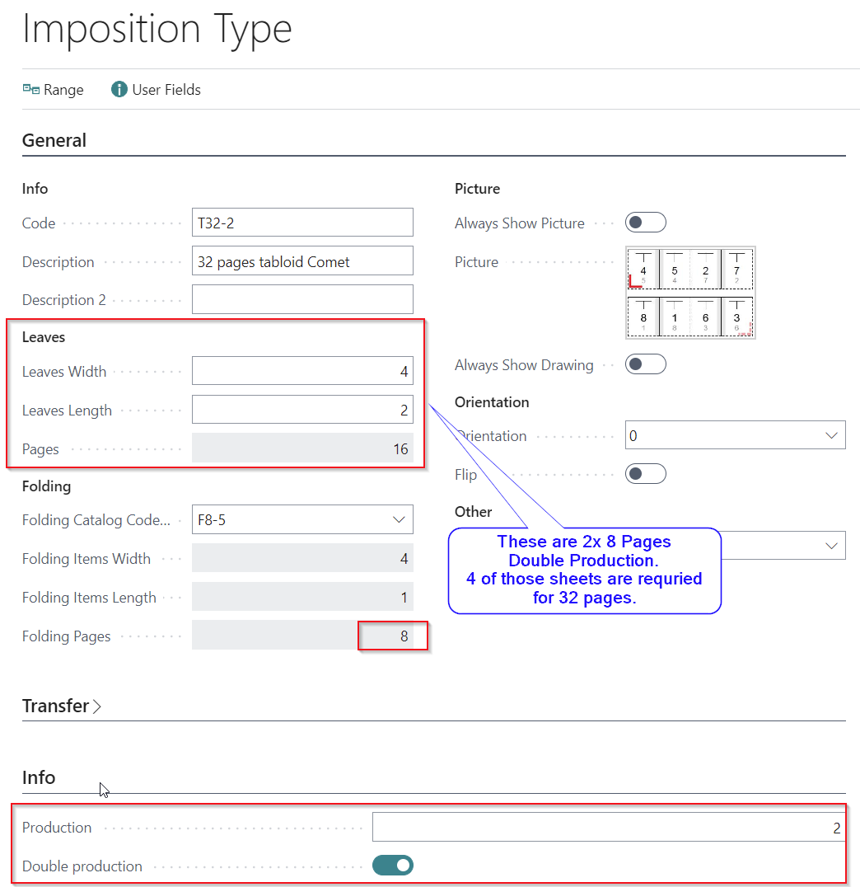

# Imposition Types

## Summary

The imposition page is used to create the fixed impositions which are
used in the production description already. These impositions can relate
to the product itself or to the machines and tools used in the
production. There are no fixed rules for creating an imposition type,
although within several sub-industries some impositions are standard.

For instance, a normal commercial printer will often have some
impositions where 16, 8 and 4 pages are imposed under different
circumstances. An imposition for 16 pages is not one and the same
regardless of printing machine. 

Some details of paper and post-press treatment will also change the
specifics of the sheet imposition. Thus the library of PrintVis
imposition types may well contain several imposition options for the
same number of pages.

In a JDF-based workflow, imposition types are mandatory to be used on
each sheet/ job item, in case a prepress system is involved.

The Imposition Page holds information which governs the imposition onto
the printing area in different ways and forms.

## Field Description

FastTab General

<table>
<colgroup>
<col style="width: 20%" />
<col style="width: 79%" />
</colgroup>
<thead>
<tr>
<th><strong>Code</strong></th>
<th>The Code field of the imposition card in question 
 Code is the identification field for the Imposition Type. Length is
max. 20 characters.</th>
</tr>
</thead>
<tbody>
<tr>
<th><strong>Description</strong></th>
<td>A meaningful description that explains to the user what this
is.</td>
</tr>
<tr>
<th><strong>Leafs Length</strong></th>
<td>Quantity of pages (1-sided-&gt;Leafs) to be imposed upwards on the
printing area. This quantity helps calculate the total no. of pages back
and front on this imposition.</td>
</tr>
<tr>
<th><strong>Leafs Width</strong></th>
<td>Quantity of page (-1sided-&gt;Leafs) to be imposed across the
printing area. This quantity helps calculate the total no. of pages back
and front on this imposition.</td>
</tr>
<tr>
<th><strong>Pages</strong></th>
<td>
No of physical pages on the Sheet.

This field is not editable.
</td>
</tr>
<tr>
<th><strong>Description 2</strong></th>
<td>A meaningful description that explains to the user what this
is.</td>
</tr>
<tr>
<th><strong>Orientation</strong></th>
<td>
The orientation is mainly a JDF field and signals the text
orientation on the printed item. The options are degrees to vertical
text as seen from the front of a printing machine when the sheet goes
in. 90 and 270 will be sideways whereas 0 and 180 will be normal and
up-side-down placement. 
 
<em>Orientation</em> can be one of the following options: 
 

· 0

· 90

· 180

· 270
</td>
</tr>
<tr>
<th><strong>Flip    </strong></th>
<td>This field is to set (or set by default from a folding type which
are flipped by definition) if the imposition should be turned in the
sheet. It doens't matter if this means turned by 90° or 270°. 
This field can be used in combination with the Orientation Field. For
example if a prepress system (JDF) complains that page 1 is on the back
side of the sheet.</td>
</tr>
<tr>
<th><strong>Folding Catalog Code (CIP4)</strong></th>
<td>Choice if relevant of folding method which is intended for the
imposition in question. The folding has great impact on the imposition.
The choices in the underlying table refer to JDF folding codes .</td>
</tr>
<tr>
<th><strong>Folding Items Depth</strong></th>
<td>This field states if relevant how many separate folding sheets there
is upwards on the printing area.</td>
</tr>
<tr>
<th><strong>Folding Items Width</strong></th>
<td>This field states if relevant how many separate folding sheets there
is across the printing area.</td>
</tr>
<tr>
<th><strong>Folding Pages</strong></th>
<td>No. of physial Pages on the Folding Sheet.</td>
</tr>
<tr>
<th><strong>Type</strong></th>
<td>
<em>Type</em> can be one of the following options: 
 

<table>
<colgroup>
<col style="width: 25%" />
<col style="width: 74%" />
</colgroup>
<thead>
<tr>
<th><strong>Type  </strong></th>
<th><strong>Function</strong></th>
</tr>
</thead>
<tbody>
<tr>
<th>Print</th>
<td>This will transfer the imposition data to the estimation exactly as
they are described in this card. It does not consider the size of paper
chosen and will impose itself tight. Typically this is used for
impositions which match a precise template in the prepress
workflow.</td>
</tr>
<tr>
<th>Print Dynamic</th>
<td>This imposition is flexible in terms of using the paper. The
distances between the printing items will flexibly change as to focus on
the no. of pages rather than the precise data from the imposition. This
will allow the prepress workflow system to take over and fill in the
relevant information.</td>
</tr>
<tr>
<th>Die</th>
<td>This imposition is based on a die.</td>
</tr>
</tbody>
</table></td>
</tr>
<tr>
<th>Picture</th>
<td>With this field it is possible to assign a picture to the imposition
type. To assign a picture just click on the field and a dialog shows up
to upload a picture from your computer. 
In case a Folding Catalog Code is selected the picture is by default the
Folding Catalog picture. 
 
<strong>Default picture/drawing on specification card</strong> 
PrintVis creates a drawing (if possible for a non-nested layout) on the
specification page, if no imposition type is selected. In case an
imposition type is selected with a Folding Catalog Code assigned, the
folding catalog picture is being displayed by default without any extra
setting. 
 
Based on the fields "Always Show Picture/Drawing" it can be defined
whether the standard drawing should be displayed on the specification
page or the picture that is stored for this imposition type.</td>
</tr>
<tr>
<th>Always Show Picture</th>
<td>If this field is set to "TRUE" (switched on) and a picture is
assigned to the selected imposition type, the specification card will
display the picture that is stored on this imposition type. 
 
This is a recommended setting in case PrintVis is not able to show a
drawing (for example) of a nested layout. It can be also used to show a
product picture to make sure the user has chosen the right imposition
type for the calculated product. 
 
If this field is set to "FALSE" (switched off) the specification card
will display the standard drawing even if a Folding Catalog Code is
selected. 
 
This is a recommended setting in case a the imposition type is being
setup with a Folding Catalog Code and the user want to proof the setting
on the imposition will create a drawing that looks ok. Some Folding
Catalog Codes have an orientation that is turned by default and this
could lead to a wrong setup on the imposition type setup. Also if the
product is too big for the sheet this is visualized only if the drawing
is displayed instead of the picture.</td>
</tr>
<tr>
<th>Always Show Drawing</th>
<td>If this field is set to "TRUE" (switched on) the specification card
will display the standard drawing even if a Folding Catalog Code is
selected. 
 
This is a recommended setting in case a the imposition type is being
setup with a Folding Catalog Code and the user want to proof the setting
on the imposition will create a drawing that looks ok. Some Folding
Catalog Codes have an orientation that is turned by default and this
could lead to a wrong setup on the imposition type setup.</td>
</tr>
</tbody>
</table>

Examples for Imposition Drawings and Pictures

**Imposition type without a picture that was assigned manually, but a
Folding Catalog Code selected that contains a default picture.**

Always show picture/drawing = false

Result:

**Imposition type with a picture that was assigned manually, No Folding
Catalog Code selected**

Always show picture/drawing = false

Result: PrintVis is not able to do a nested drawing and the flat size
and no. up is greater than the sheet size.

Always show picture = true

Always show picture/drawing = false

Result: This is the recommended setting for nested layouts used (e.g.
for folding carton products).

How to Remove Picture

If there is an Imposition Picture that is desired to be deleted, then
click on Related (in top menu ribbon) -&gt; Imposition -&gt; Remove
Picture.

A message will pop up to confirm that the Imposition Picture should be
deleted. If "Yes" is selected, then it will be deleted. If "No" is
selected, then the picture will not be deleted.

FastTab Transfer

<table>
<colgroup>
<col style="width: 20%" />
<col style="width: 79%" />
</colgroup>
<thead>
<tr>
<th><strong>Transfer margins</strong></th>
<th>This field determines whether or not the information with regards to
these fields on the printing item record should be transferred to the
JDF file when generated from the estimation. If not ticked, the Prepress
Workflow system is expected to fill out the blanks from its own library
or calculation.</th>
</tr>
</thead>
<tbody>
<tr>
<th><strong>Stripping parameter Fields</strong></th>
<td>
Stripping parameters are the fields for various trimmings, bleeds
etc. which will impact the size of the printed object on the substrate.
Each value will add information and possibly add to the size so the
object to print becomes larger. The fields include: 
<strong>Trim/Cut values:</strong> How much space to allow for a cutting
machine to make it look nice after assembly.

<strong>Trim left:</strong> Value for the trim margin on the left
side for unfolded products. It will not be in use if the job item is
folded! Field is not editable if folding item length or width &gt;1. The
value will be copied to the spine field on the job item. Apogee and
Prinergy reading the spine value from a JDF for the left trim of
unfolded products. 

<strong>Milling Depth:</strong> How much paper to add for binding in
the binding of a product.

<strong>Overfold:</strong> The distance of extra paper needed for a
bindery machine to grip the job item when binding the product.

<strong>Bleed: </strong>Not adding an object size change but will add
to the area on which to print, so more ink needed.
</td>
</tr>
<tr>
<th><strong>Transfer format</strong></th>
<td>This field determines whether or not the information with regards to
these fields on the printing item record should be transferred to the
JDF file when generated from the estimation. If not ticked, the Prepress
Workflow system is expected to fill out the blanks from its own library
or calculation.</td>
</tr>
<tr>
<th><strong>Format 1/2</strong></th>
<td>This field states the width length of the final format of the
printing item which intended to be imposed by this Imposition Type. This
value will serve as an aid for filtering in the imposition library.</td>
</tr>
<tr>
<th><strong>Transfer Colors</strong></th>
<td>This field determines whether or not the information with regards to
these fields on the printing item record should be transferred to the
calculation.</td>
</tr>
<tr>
<th><strong> </strong></th>
<td> </td>
</tr>
<tr>
<th><strong>Colors front/back</strong></th>
<td>Determine the no. of colors, if this imposition type is selected and
value set to be transferred.</td>
</tr>
<tr>
<th><strong>Format 2</strong></th>
<td>This field states the depth of the final format of the printing item
which intended to be imposed by this Imposition Type. This value will
serve as an aid for filtering in the imposition library.</td>
</tr>
<tr>
<th><strong>Pages with Print</strong></th>
<td>This field will calculate how many pages with print this imposition
code has. If there are 8 leaves on the imposition in field Pages (on
General Pane) then this field will be 16 pages with print, provided
there is print on both sides.</td>
</tr>
<tr>
<th><strong>Transfer Sheet Info</strong></th>
<td>This field determines whether or not the information with regards to
these fields on the printing item record should be transferred to the
calculation.</td>
</tr>
<tr>
<th><strong>Sheet length/width</strong></th>
<td>Determine the sheet size (section/cut-off size if web paper), if
this imposition type is selected and value set to be transferred.</td>
</tr>
<tr>
<th><strong>Strip</strong></th>
<td>In this field you can determine a fixed Strip size which must be
used in the imposing.</td>
</tr>
<tr>
<th><strong>Placement, Strip</strong></th>
<td>In this field you can determine the placement of the strip for this
Imposition Type.</td>
</tr>
<tr>
<th><strong>Gripper Edge</strong></th>
<td>In this field you can determine the placement the area of the
gripper for the press. </td>
</tr>
</tbody>
</table>

FastTab Info

<table>
<colgroup>
<col style="width: 20%" />
<col style="width: 79%" />
</colgroup>
<thead>
<tr>
<th><strong>Production</strong></th>
<th>Enter the number of production items: e.g. Double Production = 2;
Triple production = 3 ...</th>
</tr>
</thead>
<tbody>
<tr>
<th><strong>Double Production</strong></th>
<td>Enable if Double Production</td>
</tr>
<tr>
<th><strong>Pagination, Front</strong></th>
<td>If applies, enter which pages are dedicated to this imposition type,
e.g.: 1,16,13,4,8,9,12,5</td>
</tr>
<tr>
<th><strong>Pagination, Back</strong></th>
<td>If applies, enter which pages are dedicated to this imposition type,
e.g.: 2,15,14,3,7,10,11,6</td>
</tr>
<tr>
<th><strong>Plates Length</strong></th>
<td>
If applicable, enter the plate's length.

This field is used for impositions for very large machines where more
plates are used on one cylinder to cover the printing area. This would
often be Newspaper printing machines.

The field value should be how many plates are used along the length
of the cylinder to cover it with plates. Do not include blind
plates.
</td>
</tr>
<tr>
<th><strong>Plates Width</strong></th>
<td>
If applicable, enter the plate's width.

This field is used for impositions for very large machines where more
plates are used on one cylinder to cover the printing area. This would
often be Newspaper printing machines.

The field value should be how many plates are used along the width
the cylinder to cover it with plates.
</td>
</tr>
<tr>
<th><strong>Signatures per Stroke</strong></th>
<td>If applicable, enter the signatures per stroke. 
in this field you can write the information of how many signatures or
folding sheets 1 printing rotation or stroke of a sheet fed printer will
yield.</td>
</tr>
<tr>
<th><strong>External Imposition Template</strong></th>
<td>If applicable, enter the template code. This is used for example if
a JDF prepress workflow from Kodak is connected to PrintVis via JDF</td>
</tr>
<tr>
<th><strong>External Imposition Description</strong></th>
<td>If applicable, enter the template code. This is used for example if
a JDF prepress workflow from Kodak is connected to PrintVis via JDF</td>
</tr>
</tbody>
</table>

FastTab Automation

<table>
<colgroup>
<col style="width: 20%" />
<col style="width: 79%" />
</colgroup>
<thead>
<tr>
<th><strong>Priority</strong></th>
<th>
Setup a priority number: In case the "Auto Use" field is enabled,
PrintVis filters, which imposition types might fit for a sheet. Based on
the priority number the one with lowest priority number will be
assigned. This means for example use prio 1,2,3 for imposition types
with only 1 up; 10, 20, 30 for imposition types with 2-up; 100,200,300
for imposition types with 4-up. 
 
For example, on a 16-pg sheet the following imposition types could be
used:

<table>
<colgroup>
<col style="width: 54%" />
<col style="width: 45%" />
</colgroup>
<thead>
<tr>
<th><strong>Type             </strong></th>
<th><strong>Priority</strong></th>
</tr>
</thead>
<tbody>
<tr>
<th>16p-1up</th>
<td>1</td>
</tr>
<tr>
<th>8p-Double</th>
<td>20</td>
</tr>
<tr>
<th>8p-2up</th>
<td>10</td>
</tr>
<tr>
<th>4p-4up</th>
<td>100</td>
</tr>
</tbody>
</table>

In the above example the imposition type 16p-1up would be
automatically assigned to the sheet.
</th>
</tr>
</thead>
<tbody>
<tr>
<th><strong>Auto Use</strong></th>
<td>Enable if auto selection of imposition types is desired and make
sure the field "Priority" is setup and tested well!</td>
</tr>
</tbody>
</table>

FastTab Advanced Filtering

Assisted Lookup on Imposition Type Field

The field above will be used for some advanced filters that takes place
for the "Auto Use" function and for the Assisted Lookup in the
imposition types field on the job items:

Open the assisted lookup here:

Assisted lookup page:

Imposition Range Setup

This setup is typically used for web presses for newspapers etc. when it
is necessary to use more printing units to capture a certain no. of
pages.

The example below shows an imposition type example of a 32 pages for a
newspaper press and 4 printing towers/units are required to print the
total of 32pages in double production (2x8pages per tower) and then
being gathered and folded in one folding unit.

**Range Setup:**

With this setup, PrintVis will create 3 residual sheets from the first
sheet, in total 4 sheets of 8 pages double production.

**Calculation Units Setup:**

Make sure for this to setup a list if calculation units that will pick
in the row the next tower for each residual sheet.

The result will be 

-   1 sheet with 2x8p  using list of units L\_6000-2

-   residual sheet 1 with 2x8p using list of units L\_6000-3

-   residual sheet 2 with 2x8p using list of units L\_6000-4

-   residual sheet 3 with 2x8p using list of units L\_6000-5

**PrintVis Folding Catalog**

The PrintVis folding catalog is a list of folding schemes that is
provided by the JDF Specification from the CIO4 organization. All the
default codes are predefined and known in in a JDF environment and
typically used for commercial sheet print.

If there are special folding schemes in use in your company, you can
just create additional entries and provide the required information in
the existing fields. This is common for example for web printers and
their folding units.

If the table is empty, the basic intialisation of PrintVis hasn't run
(new company) . Come back later after setup of the PrintVis geenarls
setup etc. has been made.

If it does not show any pictures hit the action "Create PrintVis
Standard Bitmaps".

The list contains information about how many leaves are existing in the
widths and in the length/height of the folding sheet and if the pages of
the folding sheets are turned by default meaning the page is not
standing upright, which is the default. 

The Folding Codes sub page contains additional information for the
selected folding code in the upper table. The information is about:

-   The processing direction of the sheet into the folding machine

-   After how much travelling of the sheet in percent a fold is being
    processed

-   About the folding direction which can be: up, down, left, or right.

<table>
<colgroup>
<col style="width: 23%" />
<col style="width: 76%" />
</colgroup>
<thead>
<tr>
<th><strong>Field</strong></th>
<th><strong>Description</strong></th>
</tr>
</thead>
<tbody>
<tr>
<th>Code</th>
<td>The code for the current line. It is build from: 
"F&lt;No. of pages for the folding sheet&gt;-&lt;Increment number per
no. of pages&gt;"</td>
</tr>
<tr>
<th>Picture Code</th>
<td>Picture code from the PrintVis Bitmap Table. For your custom folding
schemes it is possible to add pictures to this table. 
Pictures selected on a folding scheme are displayed by default on the
specification page of a case.</td>
</tr>
<tr>
<th>Horizontal</th>
<td>
If not enabled, the pages are standing upright within the print
section in the paper processing direction into the press.

If enabled, the pages are turned 90 degrees clockwise within the
print section in the paper processing direction into the press.
</td>
</tr>
<tr>
<th>X</th>
<td>No. of leaves in Y direction (width).</td>
</tr>
<tr>
<th>Y</th>
<td>No. of leaves in Y direction (length/height).</td>
</tr>
<tr>
<th>Front Overfold Factor</th>
<td>This is a factor that is being multiplied with the given front
overfold value to calculate the usage of the sheet for the product.</td>
</tr>
<tr>
<th>Back Overfold Factor</th>
<td>This is a factor that is being multiplied with the given back
overfold value to calculate the usage of the sheet for the product.</td>
</tr>
<tr>
<th>Fold From</th>
<td>The processing direction of the sheet into the folding machine.</td>
</tr>
<tr>
<th>Fold Relative Travel</th>
<td>After how much travelling of the sheet in percentage a fold is being
processed.</td>
</tr>
<tr>
<th>Fold To</th>
<td>The direction of the folding sheet in the folding machine for this
fold. Options are: Up, Down, Left, Right.</td>
</tr>
</tbody>
</table>

An imposition type can contain more than 1 up of the folding sheet. 

Example for a folding scheme for a folded 4p cover: F4-1. This could be
existing 4x on a pages that can handle 16p of the given size.
