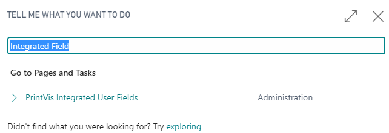
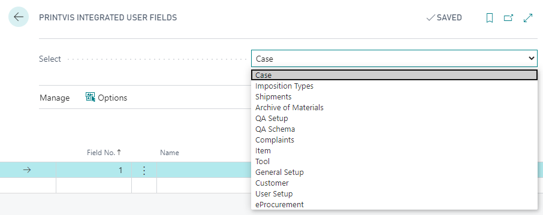
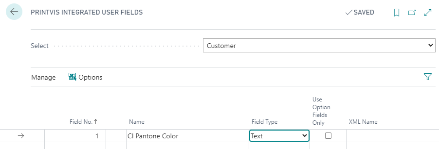
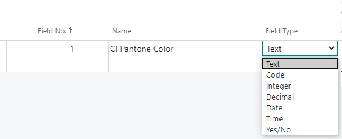
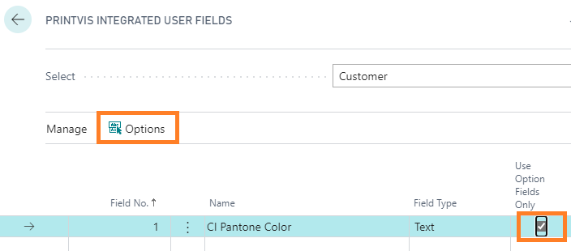
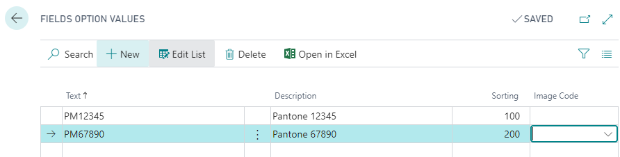
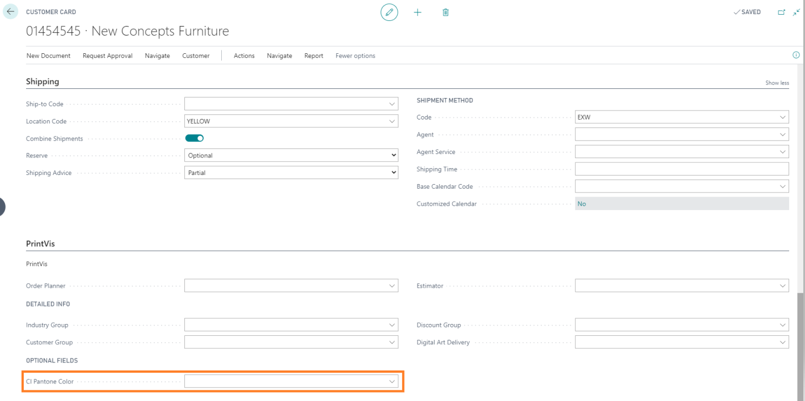
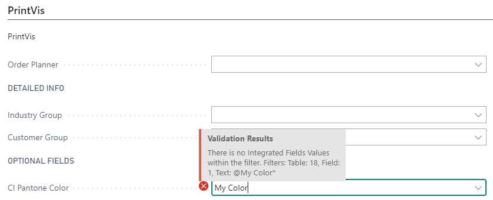

# Integrated Fields

## Summary

It is sometimes required to have custom fields on certain tables to
store data.

With the PrintVis User Fields, it is possible to create as many fields
as needed for a given area like the Job, the items, or a customer. The
downside is that it is not possible to search and filter for those
fields, because they are in a different table.

For this, PrintVis provides 10 fields on some tables that can be enabled
by setup with a desired caption and field parameters. After setup, those
fields will appear on the standard page (page view) for this table.

On the tables and when using a Configuration Package to import and
export data, the fields are called: "Optional Field 1…Optional Field 10"
rather than showing the caption from the integrated field setup.

## Setup

In this example, a field is required on the customer card:

Search for "Integrated Fields" and click on "PrintVis Integrated User
Fields":

In the screenshot below, you can see which tables are prepared for this
setup. On other tables, there are no Integrated Fields available.

Choose "Customer" and enter a name as caption for the first field:

The field number will be displayed and cannot be edited. Only field 1-10
are possible:

Choose a field type for the data that can be entered. It is not possible
to show a calendar for selection if the field is a date field. It is
still a field for input only.

If the field should provide options to choose from, set them up as shown
below.

If the field "USE OPTION FIELDS ONLY" is enabled, only available option
can be chosen or entered.

Setup the options for field no. 1:

## Result

Browsing to the customer card, the new CI Pantone Color field is now
available.

If a field is limited to option values, there will be an error if
another value is being entered:

## Removing / Renaming Fields

PrintVis provides 10 fields on different tables. The field are called
Optional field 1-10 on the table view.

If fields are no longer in use, it is possible to remove the setup for
these fields. The field can be deleted from the list and will disappear
from the related page. However, the data will be kept in the field and
can be enabled again.
