# PrintVis Products

## Introduction

A new alternative to Finished Good items when no inventory is required,
the new PrintVis Product card shares most of the parameters of the
standard Item card. As a PrintVis *table*, it allows products
(equivalent to Finished oods) to be added to individual cases without
the standard Business Central requirements for posting, inventory
management, etc.

Many PrintVis users today use the PrintVis Finished Goods Items
functionality only as a template and data carrier.  
  
Additionally, the Business Central Team Member user type can create
PrintVis Products, whereas they cannot create Items in Business Central.
It is also possible to see the PrintVis Products for a specific customer
from an action on the customer card.

## Highlights

-   Replacement for FG Item if **no **inventory is required

-   Template and data carrier does not need a BC Item anymore

-   BC Team Member users can create PV Product

-   Acts exactly as if it is a FG Item in PrintVis

-   When used in combination with FG Item:

    -   It ignores all PrintVis FG Item fields on the item card.

    -   Finished Good Item fields on item card might be
        decremented/replaced in the future.

## Item vs Product

Finished Good fields on Business Central item card.

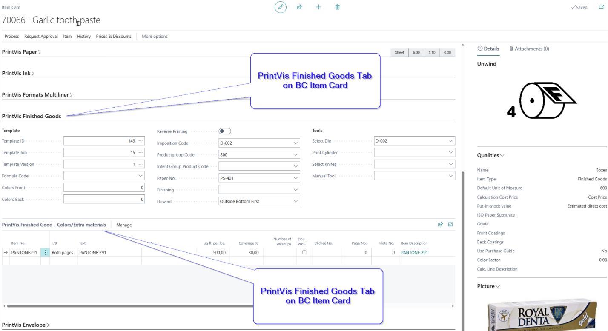

Product Card

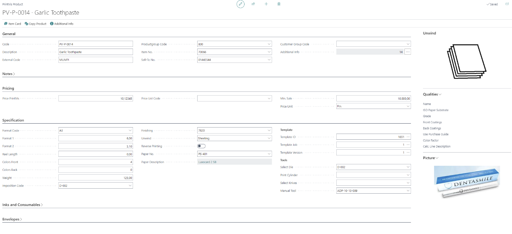

Product Card Fields

General Tab

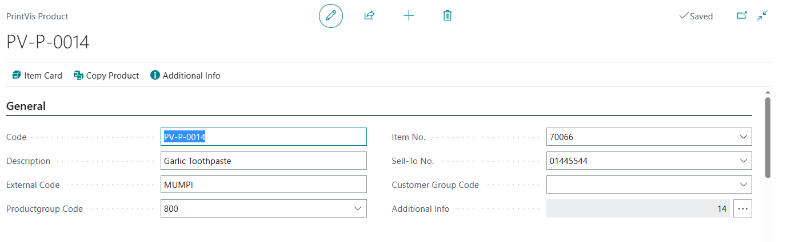

<table>
<colgroup>
<col style="width: 18%" />
<col style="width: 81%" />
</colgroup>
<thead>
<tr>
<th><strong>Field</strong></th>
<th><strong>Description</strong></th>
</tr>
</thead>
<tbody>
<tr>
<th>Code</th>
<td>Code for the current Product</td>
</tr>
<tr>
<th>Description</th>
<td>Description for the current Product</td>
</tr>
<tr>
<th>External Code</th>
<td>External description for the current Product that can be used on
customer reporting or for Web- Front-Ends.</td>
</tr>
<tr>
<th>Product Group Code</th>
<td>Displays the product group selected for the product, to populate
automatically and to link statistics properly.</td>
</tr>
<tr>
<th>Item</th>
<td>This is a lookup to the item table and links an item in case
inventory is required. 
Please note: Available FG Item fields on the item card will be
ignored!</td>
</tr>
<tr>
<th>Sell-To No.</th>
<td>This is a lookup to the customer table in case the product is for
one specific customer only.</td>
</tr>
<tr>
<th>Customer Group Code</th>
<td>This is a lookup to the customer groups table in case the product is
for one specific customer group.</td>
</tr>
<tr>
<th>Additional Info</th>
<td>This field shows the no. of additional parameters for the current
item, which can be looked-up with the assisted button to the right of
this field and the Additional Info action on the top action ribbon.</td>
</tr>
</tbody>
</table>

Notes Tab

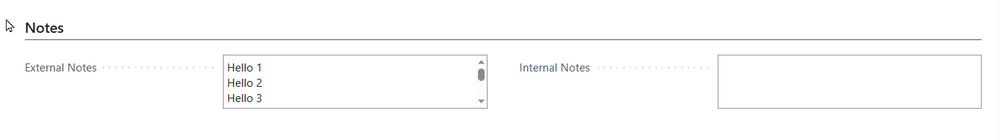

<table>
<colgroup>
<col style="width: 18%" />
<col style="width: 81%" />
</colgroup>
<thead>
<tr>
<th><strong>Field</strong></th>
<th><strong>Description</strong></th>
</tr>
</thead>
<tbody>
<tr>
<th>External Notes</th>
<td>Free text field to enter notes. It is not used in other areas but
can be used for special needs.</td>
</tr>
<tr>
<th>Internal Notes</th>
<td>Free text field to enter notes. It is not used in other areas but
can be used for special needs.</td>
</tr>
</tbody>
</table>

Pricing Tab

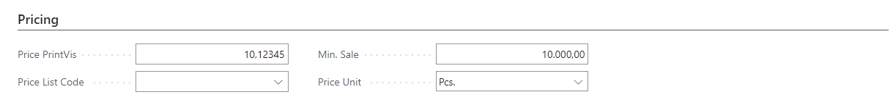

<table>
<colgroup>
<col style="width: 18%" />
<col style="width: 81%" />
</colgroup>
<thead>
<tr>
<th><strong>Field</strong></th>
<th><strong>Description</strong></th>
</tr>
</thead>
<tbody>
<tr>
<th>All</th>
<td>Not in use but can be used for special needs.</td>
</tr>
</tbody>
</table>

Specification Tab

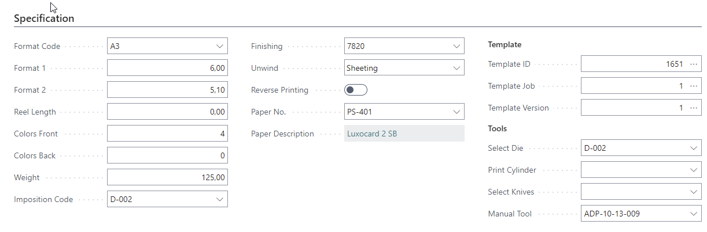

<table>
<colgroup>
<col style="width: 18%" />
<col style="width: 81%" />
</colgroup>
<thead>
<tr>
<th><strong>Field</strong></th>
<th><strong>Description</strong></th>
</tr>
</thead>
<tbody>
<tr>
<th>Format Code</th>
<td>Rather than using Format 1 and 2, a Format Code may be entered to
give the size of the Product.</td>
</tr>
<tr>
<th>Format 1</th>
<td>Size value for length or width of the product (dependent on PrintVis
general setup)</td>
</tr>
<tr>
<th>Format 2</th>
<td>Size value for length or width of the product (dependent on PrintVis
general setup)</td>
</tr>
<tr>
<th>Reel Length</th>
<td>Reel length in case of a role.</td>
</tr>
<tr>
<th>Colors Front</th>
<td>Enter the no. of colors.</td>
</tr>
<tr>
<th>Colors Back</th>
<td>Enter the no. of colors.</td>
</tr>
<tr>
<th>Weight</th>
<td>Enter the weight if relevant for the current product.</td>
</tr>
<tr>
<th>Imposition Code</th>
<td>Select an imposition type if relevant for the current product.</td>
</tr>
<tr>
<th>Finishing</th>
<td>Select a finishing type if relevant for the current product.</td>
</tr>
<tr>
<th>Unwind</th>
<td>Select an unwinding option if relevant for the current product. The
related picture will be displayed on the fact box.</td>
</tr>
<tr>
<th>Reverse Printing</th>
<td>Enable field if relevant for the current product. Used e.g. in JDF
relation to prepress workflow systems.</td>
</tr>
<tr>
<th>Paper/Substrate No.</th>
<td>Select an item no. if relevant for the current product.</td>
</tr>
<tr>
<th>Template 
ID/Job/Version</th>
<td>Select template if relevant for the current product. This template
will be copied to a new job on the case when the product is being
selected on the job.</td>
</tr>
<tr>
<th>Tool 1-4</th>
<td>Select a tool if relevant for the current product.</td>
</tr>
</tbody>
</table>

Inks and Consumables Tab

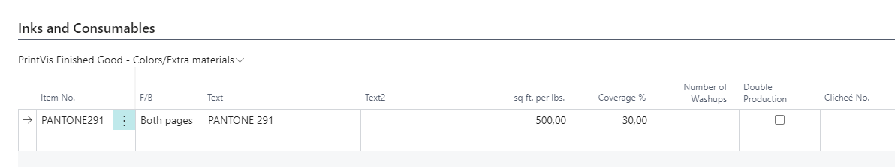

On this tab it is possible to add specific inks or consumables that will
be added to every new case/job that is created from the product.

Envelopes Tab

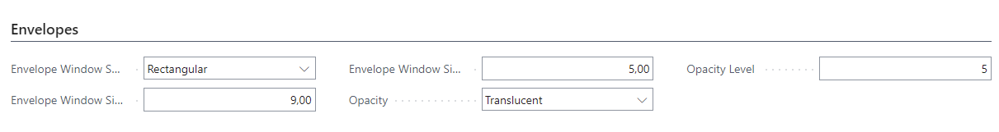

<table>
<colgroup>
<col style="width: 18%" />
<col style="width: 81%" />
</colgroup>
<thead>
<tr>
<th><strong>Field</strong></th>
<th><strong>Description</strong></th>
</tr>
</thead>
<tbody>
<tr>
<th>All</th>
<td>Specifies the parameter for envelopes, in case the product is an
envelope.</td>
</tr>
</tbody>
</table>

Additional Info

When hitting the action "Additional Info", the following page will be
presented which can be used to product specific parameters. Those
parameters are also required in JDF relation to prepress workflow
systems. The code must be equal to the parameter code in the workflow
system.

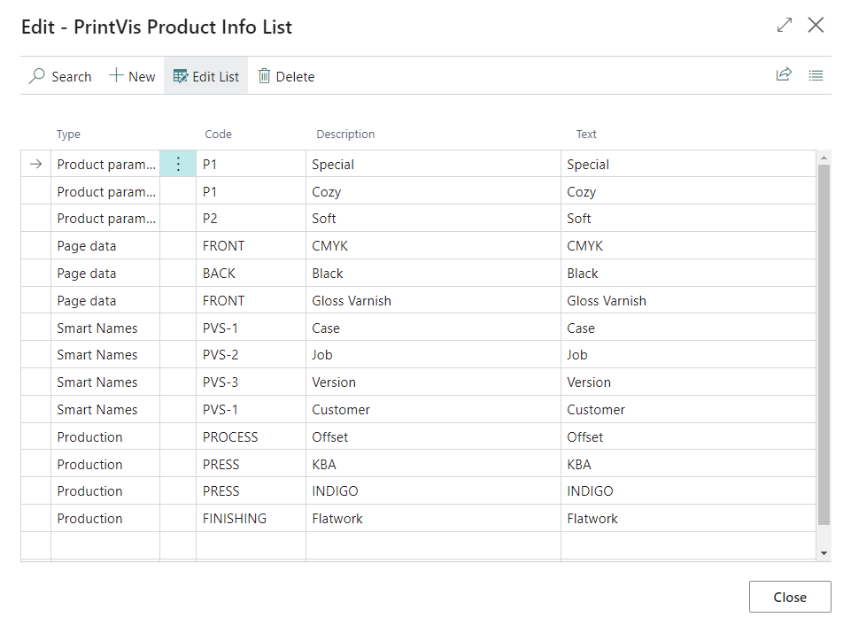

<table>
<colgroup>
<col style="width: 18%" />
<col style="width: 81%" />
</colgroup>
<thead>
<tr>
<th><strong>Field</strong></th>
<th><strong>Description</strong></th>
</tr>
</thead>
<tbody>
<tr>
<th>Type</th>
<td>Specifies the type of parameter.</td>
</tr>
<tr>
<th>Code</th>
<td>Enter the code for the given parameter.</td>
</tr>
<tr>
<th>Description</th>
<td>Enter the description for the given parameter.</td>
</tr>
<tr>
<th>Text</th>
<td>Enter the text value for the given parameter. This is the value that
is being transferred to the prepress workflow system in combination with
the Code.</td>
</tr>
</tbody>
</table>

## Usage of a PrintVis Product on a case

The PrintVis Products can be used as template and data carrier for
re-runs, in case the product doesn't need to be put on stock and tracked
as inventory. In case the product must be put on stock and tracked as
inventory, a Business Central Item can be linked with the product and
will be added to the case/job as well, to able to release finished goods
to the inventory after the production is completed.

This is an example for a product that is linked with Template
ID/Job/Version 399/1/1, see specification tab.

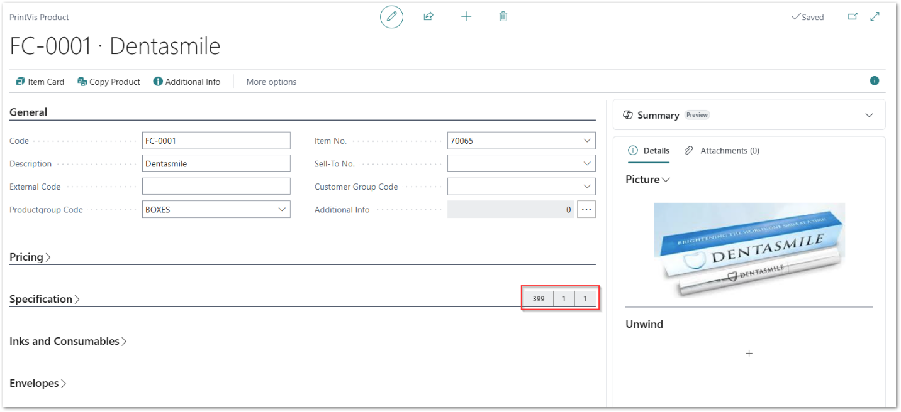

Selecting the product on a new PrintVis job

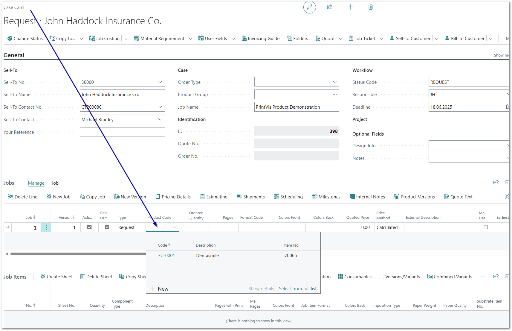

Result:

Template was copied and the user only need to enter the desired
quantity. All related data for a re-run is copied from the template +
data from the product specification.

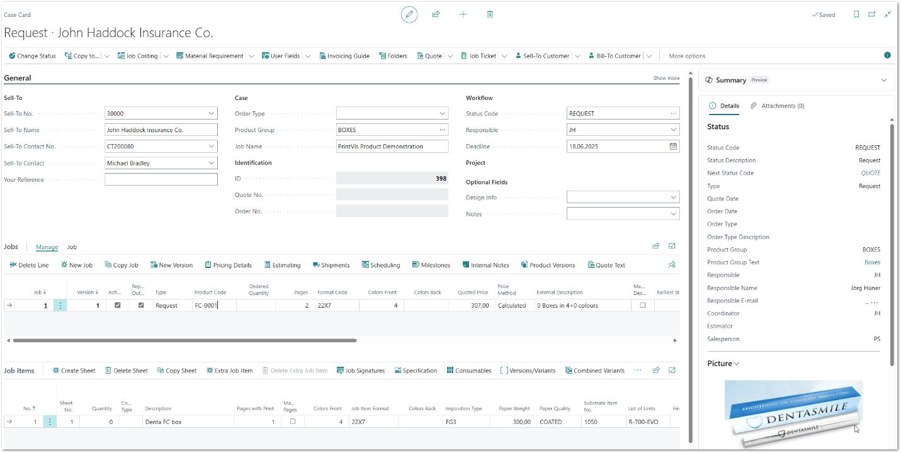

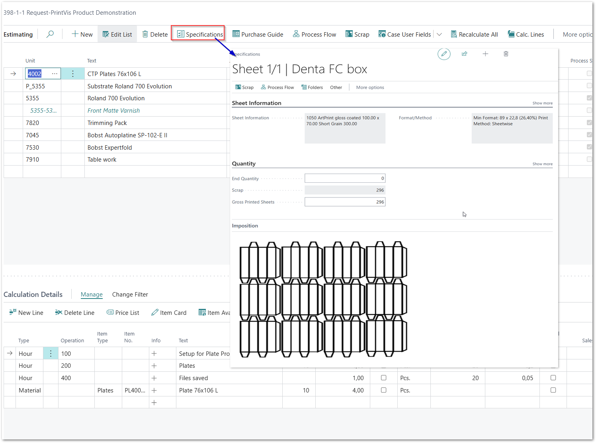
