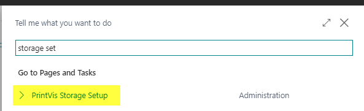
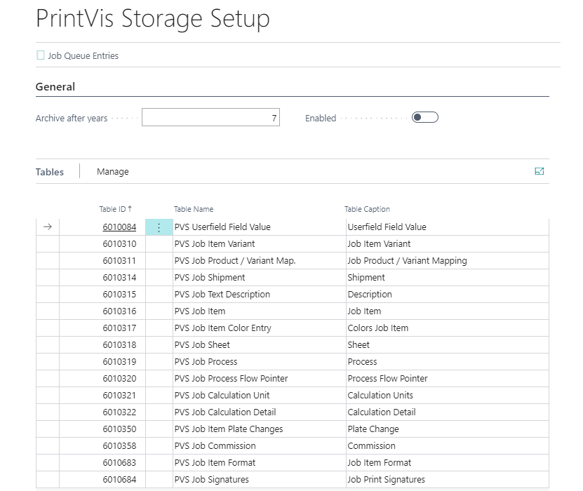
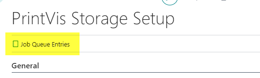
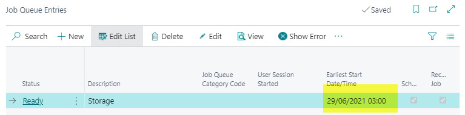
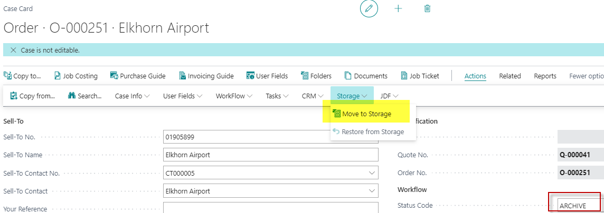
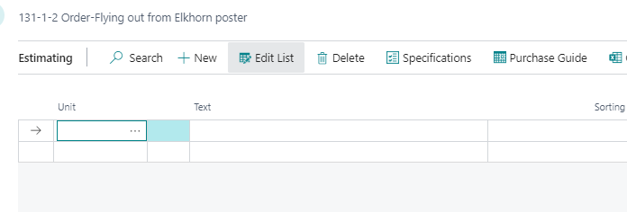
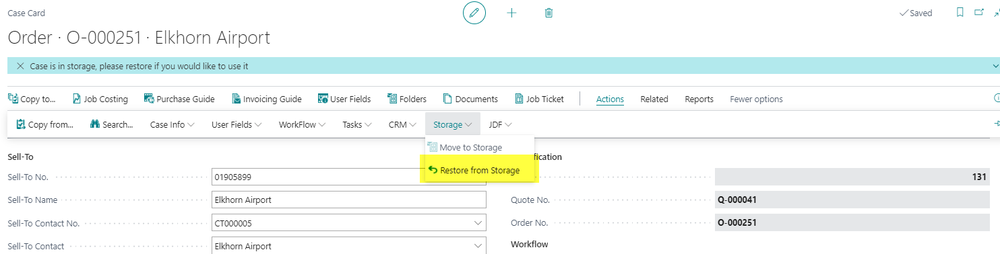
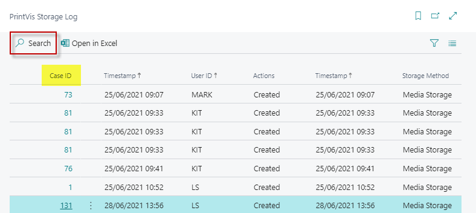

# PrintVis Storage

## Introduction

With the PrintVis Storage function, Case Cards, Job tables, and other
related tables such as Job item, Estimation details, etc., are archived
in the cloud providing a deep library for Cases and their related data –
which in turn frees up performance capacity. These Cases can be restored
when necessary.

The system can be set up for automatic filing of Cases and their data
based on their age (days, months, or years). For example, very large
print companies may have a team of estimators who create dozens of Cases
every day through quoting, many of which do not become active Orders.
Such inactive data is ideal for deep archiving with PrintVis Storage.

[Learn more about Microsoft Database
Capacity](https://docs.microsoft.com/en-us/dynamics365/business-central/dev-itpro/administration/tenant-admin-center-capacity)

## Setup

**PrintVis Storage Setup**

Open page “PrintVis Storage Setup”

Select:

-   Archive after years: Enter the years (the system looks at the
    archive date from case card)

-   Enabled: this function

**Note:** The list shows all case tables which are a part of this
storage function.

**Job Queue Entries setup**

Open Job Queue Entries

Here you can modify the start time:

## Move a Case to storage

**Automatic move to storage**

The system stores all Cases based on the PrintVis Storage setup. Job
queue will run every night at 3am as default.

The system will store all Cases that are:

-   Not already in Storage

-   Status Code “Archive” (or any status code that is of type archive)

-   Not a template:

    -   Job is not marked as template

    -   Is not used on an item as template

    -   Is not used on product group as template

-   An archive date that is older than X years (see storage setup)

**Manually move to storage**

On a case that is archived, there are actions “Move to Storage” and
“Restore from Storage”.

After “Move to Storage” check the estimation:

For example, if a case is in storage, no calculation data are visible.

## Restore a Case

**Restore from Case Card**

From the Case Card, use the action “Restore from Storage”.

## Important:

**If a Case is restored, change the status to something that is not
archived or copy the case, otherwise it will be archived again the next
night.**

**Restore from the list**

Open “PrintVis Storage log”

-   Use “Search” to find your case

-   Click on Case ID to open the case

-   Use the case card action “Restore from Storage”
