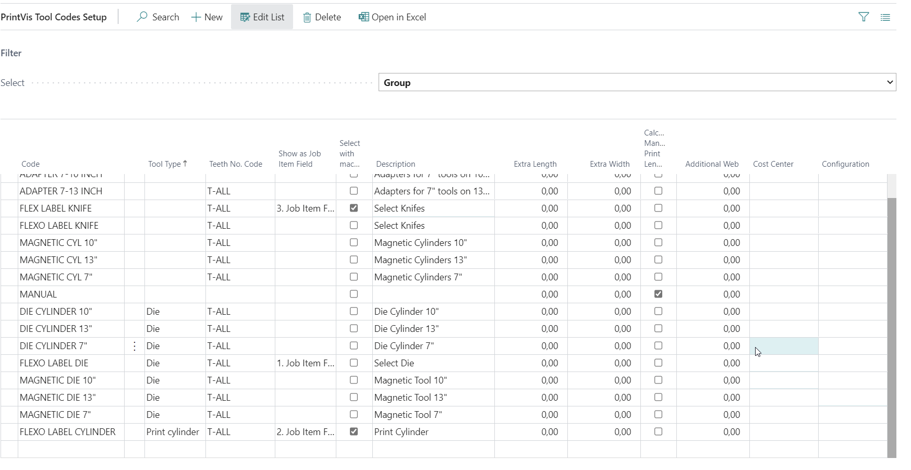
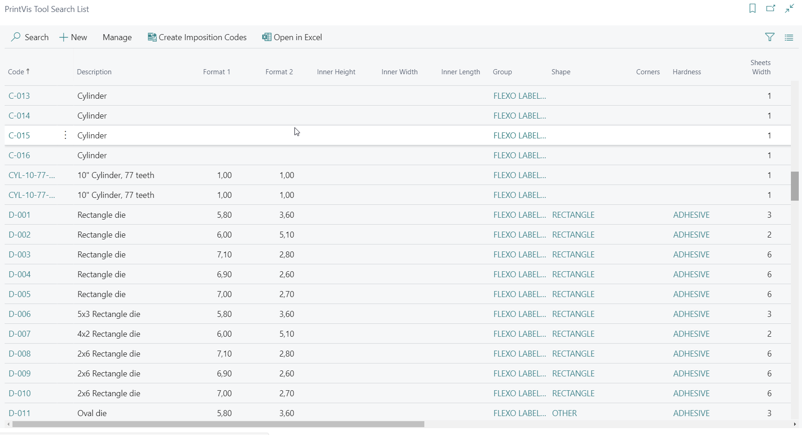
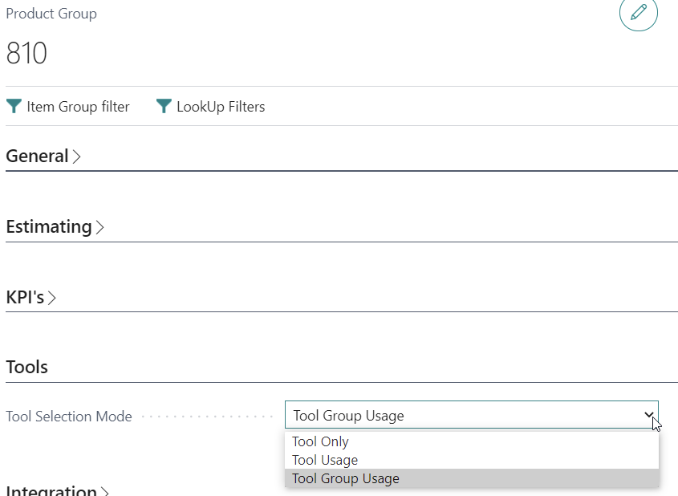
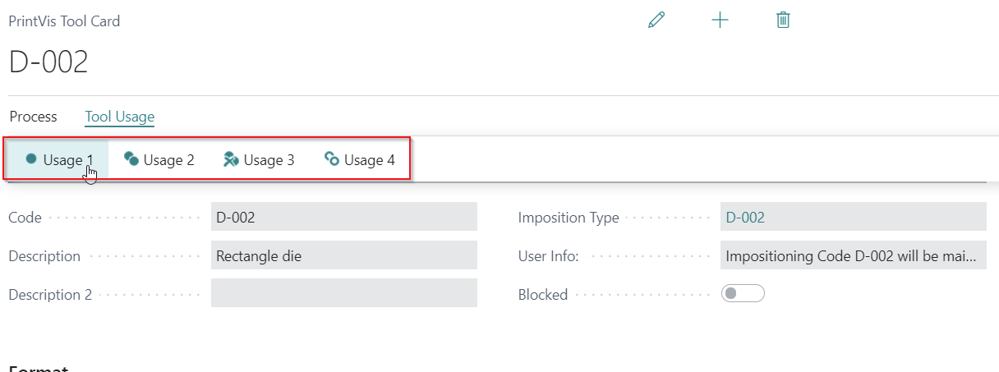
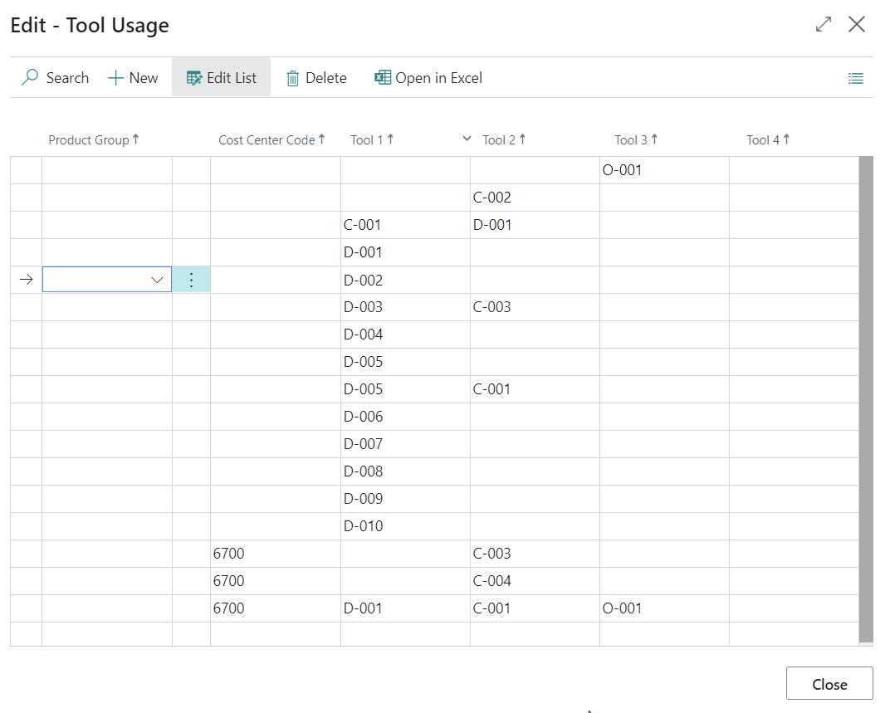
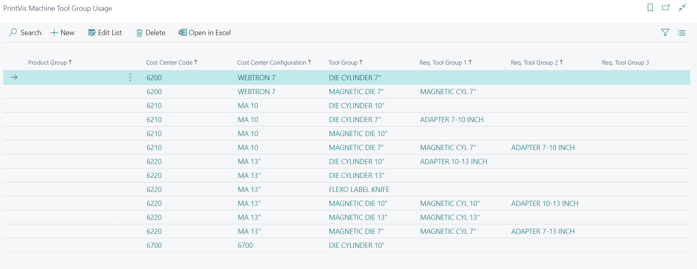
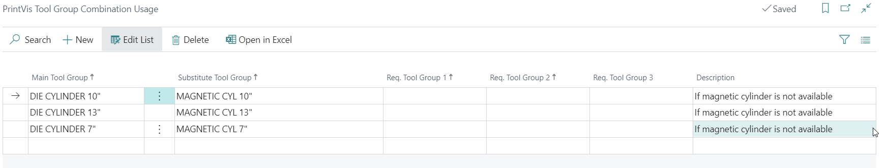

# PrintVis Tool Functionality

## Introduction

The **PrintVis Tool functionality** has been developed with increasing
capabilities since its first appearance as “Die” functionality. It has
been expanded with a good deal of input from existing customer projects
in the narrow web-label business and packaging industries.

The intention behind Tool Functionality is to be able to set up
additional tools inline for a printing machine or a subsequent process.
A tool can be a die (flat, rotary or other), a printing cylinder, tools
for perforation, cutting and more.

## Setup

All setup for tools can be found in the path COMPANY
NAME/Departments/Administration/PrintVis Setup/Company/Tools. 

The Tool Selection Mode is to be defined on the Product Group setup. 

 

This is the detailed description for the different setup options.

Tools Codes

The Tool Codes setup is the basic structure of parameters which can be
selected when entering the tool’s master data. 

The following options are available for the setup structure: 

-   Group

-   Teeth Code

-   Teeth

-   Shapes

-   Hardness

-   Status

-   Shelf / Bin No.

Group

The following fields are available for the Groups setup: 

<table>
<colgroup>
<col style="width: 24%" />
<col style="width: 27%" />
<col style="width: 48%" />
</colgroup>
<thead>
<tr>
<th><strong>Field Name </strong></th>
<th><strong>Data </strong></th>
<th><strong>Description </strong></th>
</tr>
</thead>
<tbody>
<tr>
<th><strong>Code </strong></th>
<td>Code for the Tool Group</td>
<td>Enter a code</td>
</tr>
<tr>
<th><strong>Show as Job Item </strong> 
<strong>Field </strong></th>
<td>
Possible options: 
 

1. Job Item Field 

2. Job Item Field 

3. Job Item Field

4. Job Item Field
</td>
<td>
The captions for these 3 fields are replaced by the escription of
the Group. 

The lookup for these fields is filtered on this Group
</td>
</tr>
<tr>
<th><strong>Select with Machine </strong></th>
<td>Yes/No</td>
<td>With the selection of the "List of Units" 
 (Machine) on the Job Item the selected tools will be added to the given
Tool field</td>
</tr>
<tr>
<th><strong>Description </strong></th>
<td>Text</td>
<td>Description for the Group which will be used as caption for the Job
Item Tool field</td>
</tr>
<tr>
<th><strong>Teeth No. Code </strong></th>
<td>Code lookup on Teeth</td>
<td>Select the Teeth code for this Group if available. Teeth codes are
only required for rotary tools.</td>
</tr>
<tr>
<th><strong>Extra Length </strong></th>
<td>Decimal</td>
<td>This distance will be added to the calculated length of the tool.
The data is being 
 synchronized with the Trim Foot field and Trim Head field of a linked
imposition type, where each field will be filled with ½ of the Extra
Length value.</td>
</tr>
<tr>
<th><strong>Extra Width </strong></th>
<td>Decimal</td>
<td>This distance will be added to the calculated width of the tool. The
data is synchronized with the Milling Depth field and Trim Face field of
a linked imposition type, where each field will be filled with ½ of the
Extra Width value.</td>
</tr>
<tr>
<th><strong>Additional Web </strong></th>
<td>Decimal</td>
<td>This field is used if a wider print substrate roll is needed, then
it can be calculated with the data from the Tools card. The Additional
Web value will be added to the calculated Smallest Width on the Tool
Card.</td>
</tr>
<tr>
<th><strong>Calculate Manual Print Length </strong></th>
<td>Yes/No</td>
<td>When this field is ticked the Field "Distance Front" on the Tool
card is editable to manually calculate the print length, when there is
no Teeth no. available. This is typically used for flat tools.</td>
</tr>
<tr>
<th><strong>Cost Center </strong></th>
<td>Code for Cost Center</td>
<td>If this Group is only to be used for certain Cost Centers (Only
Filter for Assist Button)</td>
</tr>
<tr>
<th><strong>Configuration </strong></th>
<td>Code for Cost Center Configuration</td>
<td>This Group is only to be used for certain 
 Configurations (Only Filter for Assist Button)</td>
</tr>
</tbody>
</table>

## Setup Example

Teeth Code

Teeth Code needed for tool cylindrical cylinders.

This is to setup a code and description for the available list of teeth
in the Teeth setup.

 

Teeth

Teeth are only needed for cylindrical tools.

This is the list of available gear steps and their print length
(circumference, cut-off), cliché length and shrink ratio. 

For narrow web label printing the print length is 1/8 inch (3,175mm) x
No. of Teeth.

 

Shapes

The shape can be used as filter during the tool search and is mentioned
e.g. for the shape of each single up: examples circle, square,
rectangular, flat.

Hardness 

The hardness can be used as a filter during the tool search.

 

Status

The status can be used as filter during the tool search. Examples:
Quote, In-house, Re-order

For instance you can have the status “Quote” which says that the actual
die does not exist but is only set up for calculation.

 

Shelf / Bin No.

Here there can be a setup where the tool is or needs to be stored.

PrintVis Tool Search List

The PrintVis Tool Search List is the list page for all tools that are
setup. Just search for this term to find the
list.

Tool Card

For every tool or tools type (if more than 1 is existing like print
cylinders) a tool must be setup.

**FastTab General **

<table>
<colgroup>
<col style="width: 13%" />
<col style="width: 12%" />
<col style="width: 74%" />
</colgroup>
<thead>
<tr>
<th><strong>Field Name </strong></th>
<th><strong>Data </strong></th>
<th><strong>Description </strong></th>
</tr>
</thead>
<tbody>
<tr>
<th><strong>Code </strong></th>
<td>Code for Tool</td>
<td>Enter a code for the tool</td>
</tr>
<tr>
<th><strong>Description 1 / 2 </strong></th>
<td>Text</td>
<td>Enter a description for the tool</td>
</tr>
<tr>
<th><strong>Imposition Type </strong></th>
<td>Lookup to Imposition codes</td>
<td>Imposition code linked to the tool which will be attached to the Job
Item by selecting the tool</td>
</tr>
<tr>
<th><strong>User Info </strong></th>
<td>Text</td>
<td>This field is just for information and displays in case the tool is
connected to an imposition type, the info that the imposition will be
maintained by the tool fields</td>
</tr>
</tbody>
</table>

**FastTab Format **

<table>
<colgroup>
<col style="width: 10%" />
<col style="width: 9%" />
<col style="width: 80%" />
</colgroup>
<thead>
<tr>
<th><strong>Field Name</strong></th>
<th><strong>Data Type</strong></th>
<th><strong>Description</strong></th>
</tr>
</thead>
<tbody>
<tr>
<th><strong>Format 1 </strong></th>
<td>Decimal</td>
<td>Width of single item format</td>
</tr>
<tr>
<th><strong>Format 2 </strong></th>
<td>Decimal</td>
<td>Length of single item format</td>
</tr>
<tr>
<th><strong>Sheets Width </strong></th>
<td>Integer</td>
<td>No. of items in width of the tool</td>
</tr>
<tr>
<th><strong>Sheets Length </strong></th>
<td>Integer</td>
<td>No. of items in length of the tool</td>
</tr>
<tr>
<th><strong>Group </strong></th>
<td>Code</td>
<td>Select a Group for this tool. If the Group is setup with a Teeth
Code, the Teeth code field will be prefilled with a code and when
entering formats etc. a matching teeth no. will be added from the
selected Teeth Code.</td>
</tr>
<tr>
<th><strong>Teeth Code </strong></th>
<td>Code</td>
<td>The Teeth Code that is set up on the selected Group is
displayed.</td>
</tr>
<tr>
<th><strong>Distance Across </strong></th>
<td>Decimal</td>
<td>Distance between each single item in width</td>
</tr>
<tr>
<th><strong>Step Across </strong></th>
<td>Decimal</td>
<td>Format of a single up in the width of the tool + Distance
Across</td>
</tr>
<tr>
<th><strong>Optimal Width </strong></th>
<td>Decimal</td>
<td>Will be transferred to Sheet Width field on Imposition Type. This is
a for a manual input if different from Smallest Width</td>
</tr>
<tr>
<th><strong>Smallest Width </strong></th>
<td>Decimal</td>
<td>Will be calculated by Sheets Width x (Format 1+ Distance
across)</td>
</tr>
<tr>
<th><strong>Distance front </strong></th>
<td>Decimal</td>
<td>Distance between each single item in length 
 -This field is only editable if "Calculate Manual Print Length" is
ticked on the selected Group code otherwise it will be calculated</td>
</tr>
<tr>
<th><strong>Step </strong> 
<strong>Around </strong></th>
<td>Decimal</td>
<td>Format of 1 up in the length of the Tool + Distance Around</td>
</tr>
<tr>
<th><strong>Optimal Height </strong></th>
<td>Decimal</td>
<td>Will be calculated by Sheets Length x (Format 2+ Distance front) or
by the Print Length from No. of teeth</td>
</tr>
<tr>
<th><strong>Corner </strong></th>
<td>Decimal</td>
<td>Corner radius of tool shape</td>
</tr>
<tr>
<th><strong>Inner Height </strong></th>
<td>Decimal</td>
<td>3D format e.g. for boxes when they are glued ready as box</td>
</tr>
<tr>
<th><strong>Inner Width </strong></th>
<td>Decimal</td>
<td>3D format e.g. for boxes when they are glued ready as box</td>
</tr>
<tr>
<th><strong>Inner Length </strong></th>
<td>Decimal</td>
<td>3D format e.g. for boxes when they are glued ready as box</td>
</tr>
<tr>
<th><strong>Teeth </strong></th>
<td>Integer</td>
<td>The no. of teeth that are related to the optimal height. The no. of
teeth code will be added/updated after entering/altering the fields that
are given to calculate the Optimal Height. When overwriting the value
the Teeth and Optimal Height stays fixed unless the “Manual Teeth” field
is being reset.</td>
</tr>
<tr>
<th><strong>Max. No of colors </strong></th>
<td>Integer</td>
<td>If a limited no. of items for this tool is important for the
selection please enter a value. 
For example when the tool is a printing cylinder it is required to have
as many cylinders available as the no. of colors of the job. 
E.g. a tool describes a certain set of printing cylinders and 4
cylinders of the same type are available - this means 1 code has to be
created and the “Max. Number of Colors” field has to be set to 4. 
 </td>
</tr>
<tr>
<th><strong>Vendor No. </strong></th>
<td>Code</td>
<td>Select the vendor no. the tool is purchased from</td>
</tr>
<tr>
<th><strong>All other fields </strong></th>
<td> </td>
<td>Lookups on the given codes to limit the selection or link the tool
to Customers, Items etc.</td>
</tr>
</tbody>
</table>

**Tool Selection Mode on Product Group Setup – 3 Setup
modes/scenarios**  

Tools Only mode

On the Tools Only mode only the group settings have effect. All tools
and machines can be combined on the Job Item. To find the needed tools
and machines use the standard 365 Business Central Advanced Filter.

Tool Usage Mode Setup

Tool Card -&gt; Button Tool -&gt; Usage 1/2/3/4

The Tool Usage is to specify the usage of tools in combination and with
limitations on certain machines.

-   The tool usage is supported to be used in case: 

- A tool can be only used in combination with one or more other tools 

- A tool cannot be used on all Cost Centers o The tool can only be used
on one machine 

-   Possible combinations of Tools can be limited by Product Groups

-   Possible combinations of Tools can be set up which limits the list
    of available tools for the selection on the Job Item

-   The tool usage can be set up to choose a different imposition type
    from the one which is set on the tool 

 

The Tool Usage setup is a 1-1 setup of possible tool and machine
combinations. If on the setup for Product Groups the option TOOL USAGE
SETUP is selected, only combinations from the Tool Usage setup can be
selected. Tools that have no entry in the TOOL USAGE SETUP are not
available for selection on Job Items.

 

**Please Note: **The setup of the Tool Usage will be always taken into
concideration, no matter which Tool Selection Mode is chosen.

## Setup Example:

Tool Group Usage Mode Setup

The Tool Group Usage is set up by the Machine Tool Usage and the Tool
Combination Usage. It supports the user in determining possible
combinations of tools, and on which machines these tools are able to
run. 

 

The setup only needs groupings - no 1-1 tool setup is required. Many
companies have hundreds of dies and other tools on stock – so the setup
should be detailed and structured yet still easy to understand and
navigate. 

 

It is also possible to set up which tools can be replaced by others in
case they are not available in the moment of the production.

 

When selecting the tools and List of Units on the Job Item the available
tools and machines might be reduced with each selection step based on
the Machine Tool and Tool Combination setup.

Machine Tool Usage

The machine Tool Usage is the definition of the machine capability to
run specific tools. By this setup, available tools and machines (List of
Units) might be reduced by each selected of Tool 1 – 4 and a List of
units.

If additional tools are required in combination with a specific tool,
for example a Magnetic Cylinder is required to run a Magnetic die, or an
adapter is required to run a 10” cylinder on a 13” press, this can be
set up with the fields “Req. Tool Group 1-3”. These tools will not be
selected on the Job Item in the estimate. But with this information a
job ticket can be built that includes all relevant tools. This report is
not available as standard PrintVis report and needs to be built as a
custom report for the customer.

Tool Group Combination Usage Setup

The Tool Combination Usage setup provides the definition for which tools
can be 

replaced by others in the event that they are not available at the time
of production.

The Tool Combination Usage setup provides the definition for which tool
groups can be combined in case:

1.  They can be replaced by others in the event that they are not
    available at the time of production.

2.  If combinations with other tools groups are possible.

Please note: This is for information only that can be used for
production!
