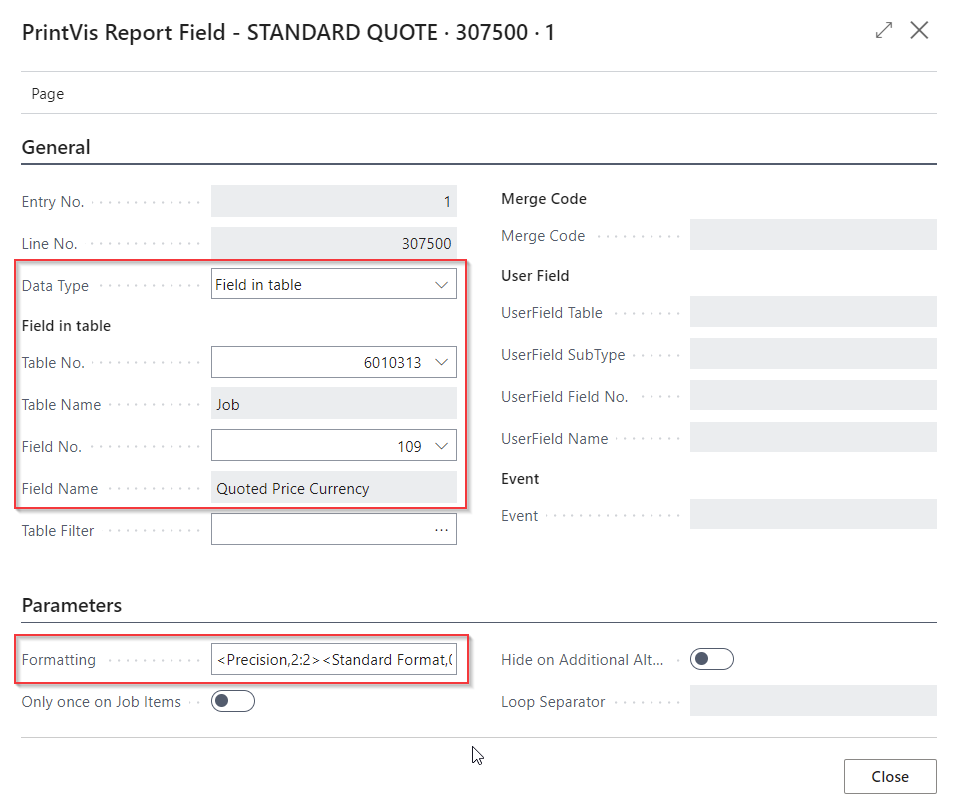

# PrintVis Report Setup - PrintVis Case Reports

## Introduction

PrintVis Report Setup is a tool for creating customer-facing documents
by using PrintVis standard reports, a setup to build the data for the
dataset, and a (custom) report layout. The cases are mainly used to run
from a case or in combinatio with a case (Purchase Order report requires
a case ID in the header). This is why they are also called PrintVis Case
Reports.

In this documentation, you'll find information on how to set up the text
components to be transferred to the reports, and how to edit the report
layout.

## Setup Areas

The following areas can be used to build the content and layout for a
report.

-   PrintVis Report Selection Setup / Report Selection - Purchase 

    -   Choose the report objects for the specific report type.

    -   Setup for the PrintVis Purchase Order report by using the Report
        Selection - Purchase.

-   PrintVis Report Setup

    -   To choose the fields and areas for the product description in
        the report.

    -   This is building the data for the dataset for the report.

-   Custom Report Layouts / Report layouts

    -   To edit the layout for the PDF and email.

    -   In simple words: This is where to place the data from the
        PrintVis Report Layout. Standard Business Central.

-   Report Layout Selection

    -   To select the standard or custom layout. Standard Business
        Central.

## PrintVis Report Selection Setup

The PrintVis report selection setup offers the user the choice of the
report object ID for the selected report type. If more than one report
is selected per type, PrintVis will come up with the question to choose
the desired report. If only one report per type is selected, on most
areas this selection will not be shown and the report started right
away.

For setup, search for "PrintVis Report Selection Setup."

These are the released Report Types:

## Supported Report Objects

The actual available/supported standard reports are:

-   PrintVis Quote Report

    -   Report 6010061

        -   Supports 1 job only with multiple versions

-   PrintVis Order Confirmation Report

    -   Report 6010060

        -   Supports 1 job only with multiple versions

-   PrintVis Case Report 1

    -   Report 6010054

        -   Supports 1 job only with multiple versions

-   PrintVis Case Report 2

    -   Report 6010056

        -   Supports 1 job only with multiple versions

-   PrintVis Case Report 3

    -   Report 6010059

        -   Supports 1 job only with multiple versions

-   PrintVis Case Report 4

    -   Report 6010066

        -   Supports 1 job only with multiple versions

-   PrintVis Case Report 5

    -   Report 6010067

        -   Supports 1 job only with multiple versions

-   PrintVis Purchase Order

    -   Report 6010058

    -   This report is made for sub-contracting and PrintVis
        order-specific purchases, to be able to integrate PVS Order
        information into the purchase document, that is e.g. sent to a
        sub-contractor who is doing lamination or other outsourced
        tasks.

    -   It is based on the Business Central 365 Purchase Order report
        but might not support all functionality of the current BC
        report.

        -   For standard Business Central 365  Purchase Orders it is
            recommended to use the standard BC Purchase report.

## PrintVis Report Setup

The reports come with a dataset that is common for all reports, where
fields such as document number or address can be chosen. Additionally,
there are special sections that can be set up to build a detailed
description on the report and for the product.

PrintVis Report Setup List and PrintVis Report Setup Header

The PrintVis Report Setup is the list of all existing report setups.

The fields from the PrintVis Report Setup List are also available on the
header of the report setup:

If you choose a line in the list of report setups and hit View or Edit,
or if you click "New," you get to the PrintVis Report setup.

<table>
<colgroup>
<col style="width: 24%" />
<col style="width: 75%" />
</colgroup>
<thead>
<tr>
<th><strong>Field</strong></th>
<th><strong>Description</strong></th>
</tr>
</thead>
<tbody>
<tr>
<th>Code</th>
<td>Enter a code for the setup line. A code must be unique.</td>
</tr>
<tr>
<th>Description</th>
<td>Enter a description for the setup line. </td>
</tr>
<tr>
<th>Report Type</th>
<td>
Select a report type for this setup. Options are:

<ul>
<li>
PrintVis Quote
</li>
<li>
PrintVis Order Confirmation
</li>
<li>
PrintVis Purchase Order
</li>
<li>
PrintVis Case Report 1
</li>
<li>
PrintVis Case Report 2
</li>
<li>
PrintVis Case Report 3
</li>
<li>
PrintVis Case Report 4
</li>
<li>
PrintVis Case Report 5
</li>
</ul></td>
</tr>
<tr>
<th>Job Item Loop</th>
<td>
With this setting, you can select if the text block is created
by:

<ul>
<li>
Group

<ul>
<li>
Creates a group for every label and loops through the job
items.
</li>
<li>
This is the recommended default setting.
</li>
<li>
Example:

<ul>
<li>
Pages      Cover 4 pages
</li>
<li>
               Text   16 pages
</li>
<li>
Paper      Cover 170 GSM Coated
</li>
<li>
               Text    135 GSM Matte
</li>
</ul></li>
</ul></li>
<li>
Split

<ul>
<li>
Create all lines grouped by Job items.
</li>
<li>
Example:

<ul>
<li>
Pages      Cover 4 pages
</li>
<li>
Paper      Cover 170 GSM Coated
</li>
<li>
Pages      Text   16 pages
</li>
<li>
Paper      Text    135 GSM Matte
</li>
</ul></li>
</ul></li>
</ul>

The default setting is "Group".
</td>
</tr>
<tr>
<th>Job Filter</th>
<td>
To set up which job version should be used to pick up the
data. 
Options are:

<ul>
<li>
Active Quote
</li>
<li>
Active Order
</li>
<li>
Active Production Order
</li>
</ul></td>
</tr>
<tr>
<th>Folder Group Code</th>
<td>Select a Folder Group Code if the report should be stored as file.
It is not mandatory to store the report as file.</td>
</tr>
<tr>
<th>Folder ID</th>
<td>Select a Folder ID (sub-folder in the Folder Group) if the report
should be stored as PDF file. It is not mandatory to store the report as
file.</td>
</tr>
<tr>
<th>Report Filename</th>
<td>Enter a custom file name if a different than the default name is
desired.</td>
</tr>
<tr>
<th>Report Format</th>
<td>Choose if the file should be stored as a PDF or MS Word file. 
 
Please note: The MS Word file might not support all details from the
layout. Please test your report layout if the layout looks identically
to the MS Word output.</td>
</tr>
</tbody>
</table>

<table>
<colgroup>
<col style="width: 24%" />
<col style="width: 75%" />
</colgroup>
<thead>
<tr>
<th><strong>Action</strong></th>
<th><strong>Description</strong></th>
</tr>
</thead>
<tbody>
<tr>
<th>Usage</th>
<td>To choose which setup is used in which relation. See Usage
description below.</td>
</tr>
<tr>
<th>Copy</th>
<td>To copy an existing setup to a new one.</td>
</tr>
<tr>
<th>Create Defaults</th>
<td>To create the PrintVis defaults for the Standard Quote and Order
Confirmation. Codes "STANDARD QUOTE" and "STANDARD ORDER" will be
created with the default setup. 
If those codes already exist, a dialogue will ask to overwrite the
existing ones. If the existing ones should be kept, please copy them by
using a different code.</td>
</tr>
<tr>
<th>Export Report Setup to JSON</th>
<td>To export the current setup into a JSON type file. This action can
be used if a setup was created and tested in a sandbox and should be now
moved to the production environment.</td>
</tr>
<tr>
<th>Import Report Setup to JSON </th>
<td>To import and JSON export file from a report setup. Make sure not to
import a file with a code that is already existing which will provoke an
error. If necessary, use a replace function from a text editor tool to
change the code in the JSON file.</td>
</tr>
</tbody>
</table>

 

## Usage Setup

\- To set up when to use which setup code.

For general use, it is recommended to set up a line by only using Report
Type and Setup Code for each Setup Code. After that, it is possible to
specify which Setup Code should be used per Order Type, Product Group,
etc.

Copy Function

If a setup should be copied to start a new setup code, you can use the
copy function:

Choose the code to copy from (Field: Copy From Code) and enter a code
(Field: Copy To Code) for the new setup and hit OK. A copy of the setup
has now been made with the new code and is ready to use or edit.

Create Defaults

By using this action, the user is able to create the PrintVis defaults
for the Standard Quote and Order Confirmation. Codes "STANDARD QUOTE"
and "STANDARD ORDER" will be created with the default setup of fields.  
If those codes already exist, a dialogue will ask to overwrite the
existing ones. If the existing ones should be kept, please copy them by
using a different code.  

PrintVis Report Setup lines - Description Section

In this section of the page, a setup can be made to describe details for
the report. There are sections in the report which can be individually
placed in the report. Each line can read values from up to 6 fields that
can be chosen from different tables and combined with fixed texts that
can also contain translations.

Setup example:

<table>
<colgroup>
<col style="width: 24%" />
<col style="width: 75%" />
</colgroup>
<thead>
<tr>
<th><strong>Description Section Field</strong></th>
<th><strong>Description</strong></th>
</tr>
</thead>
<tbody>
<tr>
<th>Sorting</th>
<td>Enter a sorting to bring the different types/sections into a desired
sequence. The lines are always grouped per type, which means it is not
possible for example to have 1 line of a type (e.g. Description 3) above
the pricing grid and another line of the same type (e.g. Description 3)
below the pricing grid. 
All lines are grouped per type and will be added to the report based on
the sorting number.</td>
</tr>
<tr>
<th>Type</th>
<td>
Choose one of the existing types to build the texts to
display. 
 
Options are:

<ul>
<li>
Description 1-20
</li>
<li>
Job Items
</li>
<li>
Price Columns
</li>
<li>
Shipment
</li>
<li>
Product Parts
</li>
</ul>

Please find a detailed description for every option below this
table.
</td>
</tr>
<tr>
<th>Label</th>
<td>This is the label (first column) for the description lines. It can
be a fixed text or use data with field variables (%1, %2...%6) described
in the Description field below. 
Every label is printed only once if the descriptions were looped. 
 
If the label field is not mandatory to be used in the report. 
 
If no label is desired just remove the "Label-Column" from the report
layout. If a label is desired, the "Label-Column" must exist/be added in
the report layout.</td>
</tr>
<tr>
<th>Description</th>
<td>
The description for the current setup line, which can build a
text block. 
 
If:

<ul>
<li>
It stays empty, the report will display the text from the first
selected field only.
</li>
<li>
Combinations of text and values should be displayed, a Text,
special functions and field variables (%1, %2...%6). 
Example:

<ul>
<li>
%1: [TAB]%2-%3 Pages, %4/%5 colors

<ul>
<li>
%1 = Value of the field selected in column "Field 1"
</li>
<li>
": " = A colon and space will be added after the field 1
value
</li>
<li>
[TAB] = A tabulator will be added to align the text
</li>
<li>
%2 = Value of the field selected in column "Field 2"
</li>
<li>
"-" = The character "-" will be added after the field 2
value
</li>
<li>
%3 = Value of the field selected in column "Field 3"
</li>
<li>
" Pages" = A space and the word "Pages" will be added after the
field 3 value
</li>
<li>
etc.
</li>
</ul></li>
<li>
Example output for the above setup:

<ul>
<li>
Cover:   Cover Description-4 Pages, 5/5 colors
</li>
<li>
Text:      Text Description-16 Pages, 4/4 colors
</li>
</ul></li>
</ul></li>
<li>
Special character functions that are supported:

<ul>
<li>
[TAB] 

<ul>
<li>
Adds a tab - to move the following text to the tab set in the MS
Word report layout.
</li>
</ul></li>
<li>
[CR]

<ul>
<li>
Adds a line break before following text.
</li>
</ul></li>
</ul></li>
</ul></td>
</tr>
<tr>
<th>Translations</th>
<td>To look-up and add translations for different language codes from
recipient. 
If a text block is setup, the easiest method is to copy the Description
field and then translate the fixed text only.</td>
</tr>
<tr>
<th>Show</th>
<td>Selects if a line should be displayed always or only if one of the
fields 1-6 is containing a value.</td>
</tr>
<tr>
<th>Field 1-6</th>
<td>Choose a field to read a value from.</td>
</tr>
</tbody>
</table>

Setup types

The special sections (Type field in the setup) that can be built by the
PrintVis Report Setup are the following:

-   Description 1-20

    -   

    -   These sections can be placed individually in the report layout
        and can be used for all kinds of data as well as variable intro
        and outro text blocks.

    -   These are lines of general descriptions that can be placed as a
        block somewhere in the report. Those lines can contain field
        values from the database and also hard-coded text with
        translations, if additional languages must be supported in the
        documents.

    -   **Please Note: **In the sample reports only Descriptions 1, 2, 3
        and 4 are setup and used. 

    -   If you need to use Descriptions 5-20 you have to add those
            fields to the report layout and the place you it to appear!

-   Job Items

    -   

    -   To choose job- and job items-related fields and build a product
        description.

        -   Field values can be chosen from job items and other places
            in case-related tables.

        -   The fields will be looped for all job items, e.g.

        -   To describe all components (Text, Cover, etc.) and their
            details, like no. of colors or print substrate.

-   Price Columns

    -   To build a pricing grid for all versions of a quote / or the
        order job lines.

    -   Max. 6 columns can be used. Make sure you only have as many
        columns in the report layout that are setup in the report setup.

    -    Result

    -   

-   Shipment

    -   To lookup values from shipments to add shipment information to
        the report.

    -   To build a grid with shipping information.

    -   Max. 6 columns can be used. Make sure you only have as many
        columns in the report layout that are setup in the report setup.

    -   The example below used 3 columns only. The setup is based on the
        default setup of Standard Quote and Order Confirmation.

    -    Result

    -   

-   Product Parts

    -   To create information product parts and versions

    -   Choose the type Product Parts and on the field setup: 

        -   "Field in Table" 

        -   Table ID 6010315 (table PVS Desciptions)"

        -   and on the field no. the desired field

        -   

        -   

    -   For the report layout choose the ProductPart fields, place and
        format them as desired in the MS Word template. Don't forget to
        set the looper on the table to get all lines from the product
        parts. 

        -   This section is by default in the shipped report layouts and
            must be removed if it should not be used and is taking
            space.

        -   

Each line:

-   Can read values from up to 6 fields that can be chosen from
    different tables and combined with fixed texts which can also
    contain translations.

-   Can be setup such that it always appears in the report section for
    standard descriptions - or only appears if one of the selected
    fields is in use and provides a value.

-   Can be sorted individually in its section.

Each Type should be placed in a table in the MS Word report layout and
can be set with 1 or more columns. See further down in the report
layout.

Field Setup

This setup can be used to choose from different tables and fields. Those
values can be displayed based on the setting in the Description field.

<table>
<colgroup>
<col style="width: 24%" />
<col style="width: 75%" />
</colgroup>
<thead>
<tr>
<th><strong>Field</strong></th>
<th><strong>Description</strong></th>
</tr>
</thead>
<tbody>
<tr>
<th>Entry No.</th>
<td>Entry No. for system use. This field is not editable.</td>
</tr>
<tr>
<th>Line No.</th>
<td>Line No. for system use. This field is not editable.</td>
</tr>
<tr>
<th>Data Type</th>
<td>
Choose where the value should be read from.

<ul>
<li>
Field in table
</li>
<li>
User field
</li>
<li>
Currency Code: This is a special function to pick up the currency
for this document from the contact's/customer's currency
</li>
<li>
Shipment Line(s): This is a special function to pick up values
from shipments
</li>
<li>
Price per piece in currency from the actual job
</li>
<li>
Price per 1000 pieces in currency from the actual job
</li>
<li>
Case Description (Multi-Line)
</li>
<li>
Job External Description (Multi-Line)
</li>
<li>
Job Internal Comments (Multi-Line) 
</li>
<li>
Event
</li>
</ul></td>
</tr>
<tr>
<th>Sections:</th>
<td>
The sections are grouping the setup fields for the selected Data
Type:

<ul>
<li>
Field in Table
</li>
<li>
Merge Code
</li>
<li>
User field
</li>
<li>
Event
</li>
</ul>

The fields become editable only if the related Data Type is
selected.
</td>
</tr>
<tr>
<th>Table No.</th>
<td>Choose from the available tables to look up a value.</td>
</tr>
<tr>
<th>Field No.</th>
<td>Choose from the available fields of the selected table to look up a
value.</td>
</tr>
<tr>
<th>Table Filter</th>
<td>Set up a filter for the given field if more than 1 record/entry
could exist for this field.</td>
</tr>
<tr>
<th>Merge Code</th>
<td>Choose a Merge Field Group to get the data from.</td>
</tr>
<tr>
<th>User Field</th>
<td>Choose the user field area to look up a value. 
User fields will only show once on a report (not looping with Job
Items), even with having "Only Once on Job Item" set to False. If Job
Item Loop is set to "Split", then the User field will be shown along
with first Job Item information.</td>
</tr>
<tr>
<th>User Field Sub Type</th>
<td>
For the user field type "Job" please choose the sub-types

<ul>
<li>
&lt;empty&gt;

<ul>
<li>
Job User Fields 1
</li>
</ul></li>
<li>
1

<ul>
<li>
Job User Fields 2
</li>
</ul></li>
<li>
2

<ul>
<li>
Job User Fields 3
</li>
</ul></li>
</ul>

For other user field groups different from "Job," this field is not
in use.
</td>
</tr>
<tr>
<th>User Field No.</th>
<td>Choose the user field number to look up the value.</td>
</tr>
<tr>
<th>Event</th>
<td>In case more complex functions are required, an event can be defined
that contains the code to return the desired values. Enter the Name into
the field to change the setup.</td>
</tr>
<tr>
<th><strong>Parameters Tab</strong></th>
<td>On this tab, some options for the selected data can be set.</td>
</tr>
<tr>
<th>Formatting</th>
<td>
If a decimal or date must be formatted, enter a formatting based
on the Business Central format options. 
Examples:

<ul>
<li>
&lt;Integer Thousand&gt;&lt;Decimals&gt;

<ul>
<li>
Number 15823,59 =&gt; Result 15.823,59
</li>
</ul></li>
<li>
Date example: 15th May of 2023
</li>
<li>
&lt;Day,2&gt;.&lt;Month,2&gt;.&lt;Year&gt; (European
formatting)

<ul>
<li>
Result: 15.05.2023
</li>
</ul></li>
<li>
&lt;Month,2&gt;/&lt;Day,2&gt;/&lt;Year&gt; (US formatting)

<ul>
<li>
Result: 05/15/2023
</li>
</ul></li>
<li>
Recommend for decimal values: &lt;Precision,2:3&gt;&lt;Standard
Format,0&gt;

<ul>
<li>
Set the precision as desired 
</li>
</ul></li>
</ul>

Find details for example here: <a
href="https://learn.microsoft.com/en-us/dynamics365/business-central/dev-itpro/developer/devenv-format-property">https://learn.microsoft.com/en-us/dynamics365/business-central/dev-itpro/developer/devenv-format-property</a>
</td>
</tr>
<tr>
<th>Only Once on Job Items</th>
<td>When using the setup type "Job Items", values will be looped as
often as job items are existing. If this field value is required to be
displayed only once (e.g. it is a user field value), no looping is
required. In this case, enable this field (set it to TRUE).</td>
</tr>
<tr>
<th>Hide on Additional Alternative</th>
<td>Only available for the Price Column Grid. 
Only affects job lines where the option "Additional option for the
alternative" is selected on a job. If this field is enabled on the field
setup, no value will be displayed for this line.</td>
</tr>
<tr>
<th>Loop Separator</th>
<td>If more values will be integrated on a field, they will be separated
by the value enterd in this field. If the field stays empty, the default
separator is ", " (comma&amp;space). 
 
This field is only available for the tables: Job Items Colors,
Calculation Unit, and Calculation Detail. 
 
See "Example for Loop Separator" below.</td>
</tr>
</tbody>
</table>

**Example for Loop Separator:**

Data: Calculation Units in Estimating page. Calculation unit 7999, which
is "manual hand work", is used 4 times and was renamed by the estimator.

Setup: Loop Separator is empty: Default separator ", ":

The setup is a filter on calculation unit 7999.

Same setup but Loop Separator = " / ":

Result: Default separator ", ": 

Result separator " / ":

**Example when choosing a field from a table with a decimal number**

For Decimal numbers we recommend using the Business Central standard
format "0"!

&lt;Precision,2:3&gt;&lt;Standard Format,0&gt;

-   &lt;Precision,2:3&gt; = Display minimum 2 decimals, max. 3 decimals.

-   &lt;Standard Format,0&gt; Standard formatting based on actual region
    settings.

Another example is: &lt;Sign&gt;&lt;Integer
Thousand&gt;&lt;1000Character,.&gt; or &lt;Sign&gt;&lt;Integer
Thousand&gt;&lt;1000Character,,&gt;

-   Here it is possible to decide about the "1000" Character which is
    "." or "," (Result: 1.000 or 1,000).

For more details search for "Business Central 365 Standard Decimal
Formats" on Google, Bing, etc.

**Example when choosing a User Field **

**Example when using an Event**

An event procedure might be required to build a more complex text block.
In the example below, you can create your own procedure "100PCS" and
build a custom text value with that.

Subscribe to the event: 

(ObjectType::Codeunit, Codeunit::"PVS Report Mgt", 'OnCustomEvent', '',
false, false)

Code example:

\[EventSubscriber(ObjectType::Codeunit, Codeunit::"PVS Report
Mgt ", 'OnCustomEvent', '', false, false)\]

    local procedure OnCustomEvent(QuoteOrderField: Record "PVS
QuoteOrder Field"; var outText: Text; JobRec: Record "PVS Job";
RecRefJobitem: RecordRef; RecRefJobSheet: RecordRef;
RecRefJobShipment: RecordRef);

    var

    begin

        if QuoteOrderField."Custom Event" &lt;&gt; '50PCS' then 

            exit;

 

        if JobRec.Quantity &lt;&gt; 0 then

            outText := Format(JobRec."Quoted Price" / JobRec.Quantity
\* 50, 0, 2);

        //example calculate "Price per 50 pcs"

 

    end;

Edit option for the text output

It is possible to edit the output before the report runs. On the report
dialog, there is a link to open the "Edit page."

The edit page shows the texts grouped by the different sections. The
idea for more complex products, is to be able to modify the product
description or to add text manually.

Only the sections for the price columns and shipments cannot be edited
here. They can only be modified on the job to make sure the job handling
data is correct.

Please note: 

-   As soon the "Edit page" was opened, the text is fixed and will not
    be updated by any data change on the case to keep the manual edits.

    -   If major changes have been made in the case data, it is possible
        to reload the case data which will remove all manual edits.

-   When copying a case, the edited text will **not **be copied to
    ensure the new copy can be used on any new case and to avoid wrong
    output.

-   Edit function creates the sorting, not the same sorting setup from
    the PrintVis Report Setup page. First sorting on the edit page
    starts with "Job Item." The Job Item section is on the top because
    it is viewed as the main part where edits are required, such as
    change the description for the product when it is more complicated
    or requires manual text. The next section descends down the page
    with Description 1, Description 2, etc. 

Permission setup on PrintVis Users

Not each user might be allowed to edit the report text. For that a
permission is set on every PrintVis User.

PrintVis User Card:

Built-in Report Layout - Custom Report Layout

The Built-in Report Layout looks similar to the example below and can be
modified with a custom report layout.

To edit the layout and see the dataset you can either:

-   Show the Developer tab in MS Word and open the XML mapping part

    -   The Developer tab isn't displayed by default, but you can add it
        to the ribbon.

        -   On the File tab, go to Options &gt; Customize Ribbon.

        -   Under Customize the Ribbon and under Main Tabs, select the
            Developer check box.

    -   Here you can choose the dataset and choose the desired fields

        -   e.g.: urn:microsft-
            dynamics-nav/reports/PVS\_Quote\_Report/6010061/

-   Install Jet-Reports Express as an external component for MS Word.
    The mapping and selection of fields is similar.

Every setup type appears with a table area for that type. The table
frames in the screenshot below are only for better visualization during
the setup phase.

\[!TIP\]  
Show the table gridlines so that you see the boundaries of table cells.
Remember to hide the gridlines when you are done editing. To show or
hide table gridlines, select the table, and then under **Layout** on the
**Table** tab, choose **View Gridlines**.

Areas in the layout:

0-4:    Fields that care taken from the commonly known dataset on most
documents for external communication.

5:        Area for Description 1 type from the PrintVis report setup.

6:        Area for Description 2 type from the PrintVis report setup.

7:        Area for Description 3 type from the PrintVis report setup.

                This is the only area that is setup with a label
column.  
                This can be removed if not required, or a column can be
added for the Description 1, 2, and 4.

8:        Area for Description 4 type from the PrintVis report setup. 

               The areas for Description 5-20 are not described here but
work the same way.  
               They are not part of the built-in example layout and must
be added manually if required.

9:        Area for Job Items setup type.

10:      Area for pricing grid header and value fields.

                Up to 6 columns are available

11:      Area for shipments grid.

                Up to 6 columns are available

The built-in report layout can be edited as any Word Report Layout, by 

-   Exporting and editing on MS Word

-   Saving in MS Word and 

-   Importing to the Business Central Layout again

The built-in report layout contains sections:

-   Description 1-4

-   Job Items

-   Price Columns

-   Shipments

which means only formatting of page size, margins, tabulators, etc. is
required for fine-tuning. When a whole section is not required, it can
be deleted from the layout. 

If more "Description" fields are required they can be added as a table
with 1 column only for the description, or as table with 2 columns if
the label and description should be displayed.

Some notes:

-   When deleting an entire area, highlight the line above and below
    before deleting, to make sure the whole area is properly deleted.

-   When adding an area again, make sure a loop is added if the area
    must loop through records. Otherwise, only the first line is
    displayed.

    -   The built-in report layout contains loops in all sections.

-   When adding or removing a column, make sure to use the same
    formatting.

-   The tables in the built-in report layout are setup without any
    merging to the text left and right to be aligned with all text
    areas.

-   Removes all table frames when the layout looks as desired. The
    framing is typically only added to have a better editing experience.

For more details, search for the following keywords in the MS learning
documentation for Business Central 365

-   Business Central Get Started Creating Report Layouts

    -   <https://www.google.com/search?q=Business+Central+Get+Started+Creating+Report+Layouts>

-   Business Central Work with Word Layouts

    -   <https://www.google.com/search?q=Business+Central+Work+with+Word+Layouts>

We cannot add full links here because the link might change due to MS
Versions.

Report Layout Selection

After creating a new Custom Report Layout, it is required to choose the
desired report layout on the Report Layout Selection.

Report Output option on Case Card for Jobs

To be able to select which jobs will be part of the report output, there
are 2 settings that are relevant:

1.  The Job that is active.

    -   This job will be used to read the data from. For sorting
        options, typically the first version contains the lowest job
        quantity, so this version should be active.

2.  The field "Report Output" is enabled by default. All lines with this
    field enabled are displayed as part of the Price Columns. This can
    be relevant if many versions have been calculated to find the best
    options and not all should be part of a quote.

The quote report does not display the Quote version 2 with quantity =
15.000. Only Version 1 and 3 will be displayed.

