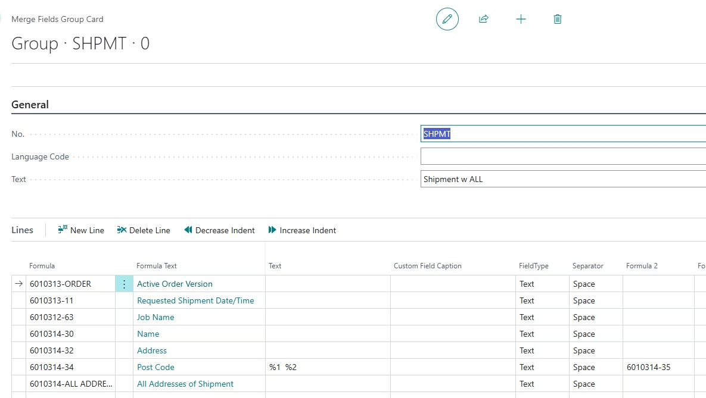
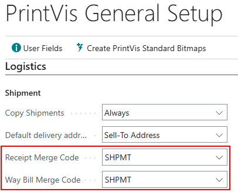
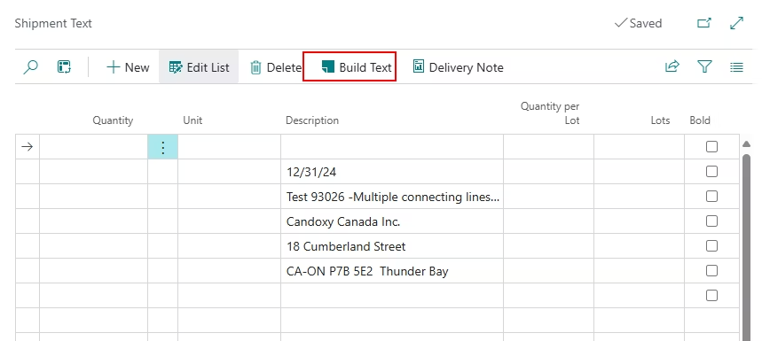
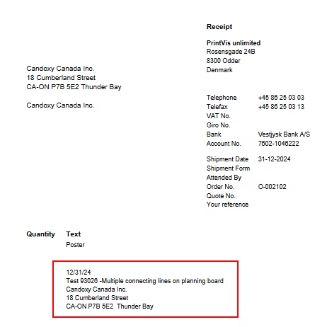

# Report Setup for Case Shipping Documents

## Summary

Waybill and Delivery note are important shipping documents. Waybill
provides legal proof that the shipper and carrier have evidence of the
contract. It also provides tracking/shipping progress, customs
clearance, and details of essential information about the goods being
transported. Delivery note is a document that lists the contents of a
package to ensure proper delivery. It also acts as a certification of
receipt of goods, proof of order delivery, and provides important
information (such as quantity, quality, and other delivery details).
This article will demonstrate setup and usage to automatically build
text to populate both Waybill and Delivery note.

## Setup

There is possibility to use merge fields to build waybill or delivery
note, which are also visible on the waybill/delivery note report. These
notes are used to reduce time to enter information manually, but text is
also editable after text is built.

Merge Field Group Setup

Create a new Merge Field Group that will be used on the Waybill or
Delivery note. Then add the lines necessary for display on the report.

PrintVis General Setup

Once the Merge Group is created. Add the merge code to the corresponding
field on the PrintVis General Setup page. Fields can be located under
the Logisitics fast tab.

- Receipt Merge Code= Delivery Note

- Way Bill Merge Code= Waybill

## Usage

Go to shipment list from the case card and select Delivery Note Text (or
Waybill). Here select the "Build Text" function, and the merge code
information will populate the text. Users can manually make changes if
needed.

The information displayed on the Shipment Text will be shown on the
report. 

For our default delivery note/waybill document, the text will show up on
the bottom of the document. This of course can be customized
