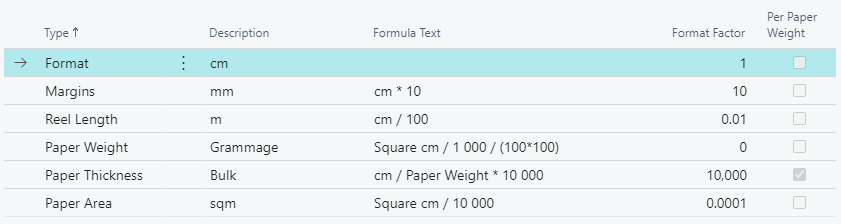
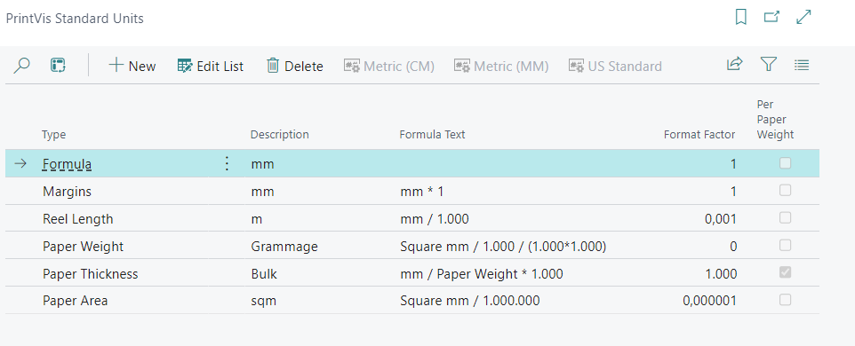
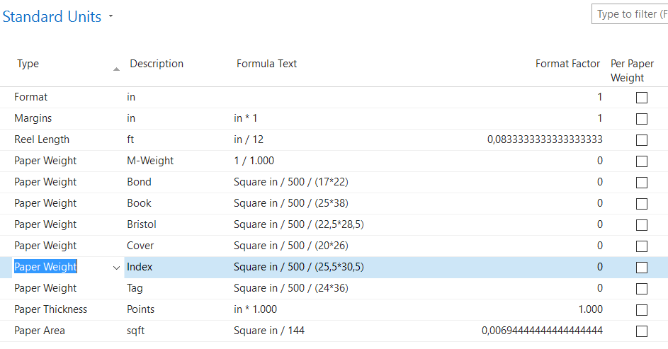

# Standard Units

## Summary

PrintVis Standard Units is an essential setup for the measuring units of
format sizes, paper weights and thicknesses.

This setup only needs to be done once, when setting up a new (empty)
company. It is the definition for which units of measure for the sizes
of machines, papers, products, their margins, and other parameters are
predefined.

This setup should **not** be changed after setup of paper or machines is
done, or if calculated jobs already exist in the system. The reason is
there is no routine that converts the values from one unit setup to
another.

There are 3 default setup settings that can be used:

1.  Metric Units in cm (Centimeter)

2.  Metric Units in mm (Millimeter)

3.  US Standard Units based on the Imperial System

This setup can be done on the **PrintVis Standard Units** setup page by
using the buttons below, or can be requested while using the PrintVis
RapidStart Worksheet:

**Default Metric Units**

**Centimeter (cm) Setup**

**Millimeter (mm) Setup**

**Default US Standard Units**

**Imperial Setup**

Because the paper weight in the United States is not defined by a
specific weight per area (grams per square meter, as in most of the
world (Grammage)), a Paper Weight setup is used to set up the needed
reference paper sizes.

Also, Yield is now part of the US standard. Yield is defined as number
of Sq ft per Pound of material.

Defaults are shown above, and further setup is possible:

In this setup, you can add more paper reference codes. For example, if
you want to use the term "BOOK" instead of the term "TEXT."

**Some examples for known equivalents**

Equivalents for Book paper:

-   Book

-   Bible

-   Coated

-   Offset

-   Text

Equivalents for Bond paper:

-   Bond

-   Duplicator

-   Ledger

-   Manifold

-   Mimeo

-   Onionskin

-   Rag Paper

-   Safety

-   Wedding

Others exist as well, and you can define any required weight by adding
the reference format and quantity.

**Please note:** The formula text is built automatically out of the
other existing fields. The description of the line of type "Format" will
be used as reference format code in the Formula Text field.

Also, Yield is now part of the US standard. Yield is defined as number
of Sq ft per Pound of material. With the last column, "Per Paper
Weight," the calculation is opposite: Sq ft per pound, and not pound per
sq ft.

It is possible to change the standard formulas or to create a custom
setup.

It is common for the definition of paper thickness to be modified in
cases.

-   Mil or caliper =&gt; a thousandth of an inch

-   Micron or micrometer (μm) =&gt; a thousandth of a mm or 1×10−6 of a
    meter.

Note that caliper here is expressed in thousandths of an inch or, in
some cases, as little as hundredths of thousandths of an inch. In the
paper industry, paper thickness is also expressed in points (a single
point is equal to .001”). To convert these decimal inch values into
points, divide the average caliper number by .001. For example, a sheet
of paper that is .0095″ thick has a caliper of 9.5 points.
