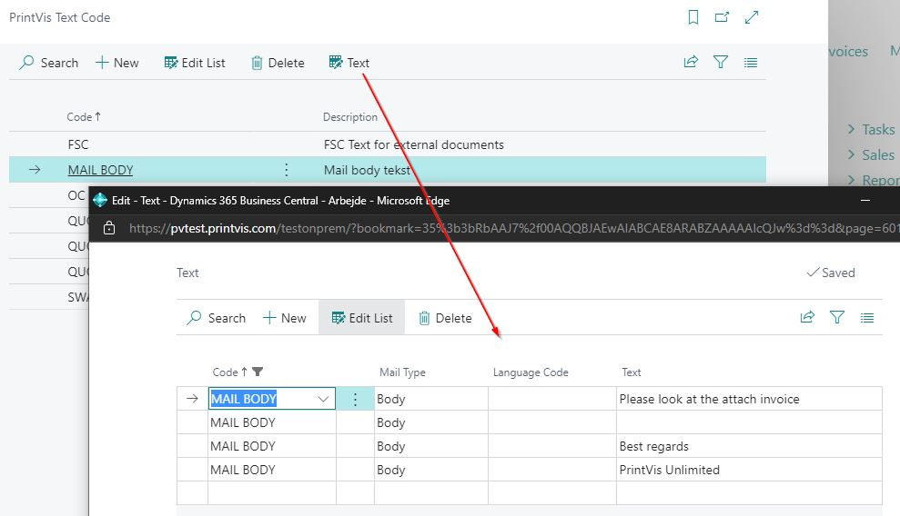

# Text Codes Setup

## Summary

"Text Codes" are user-defined codes with multi-line and multi-language
text constants.

These Text Codes can be used anywhere on reports in a generic manner
where longer and changeable text phrases are to be printed. The reports
must be customized before the Text Codes are supported.

For example, a Text Code could be named with the same name as Payment
Terms codes, and a report could use the Text Code instead of the simple
one-line description from the Payment Term.

The system currently supports these types of Text Codes:

-   Merge Fields

-   ECO Labels

## Merge Fields

Merge Fields support some selected Text Codes:

-   Text Code Customer - The Language Code from the Customer is used

-   Text Code Vendor - The Language Code from the Vendor is used

-   ECO Label Text Customer - Text Code from ECO Label, and Language
    Code from Customer

-   ECO Label Text Vendor - Text Code from ECO Label, and Language Code
    from Vendor

-   ECO Label Text Internal - Internal Text Code from ECO Label

ECO Labels

ECO Labels can have 3 different Text Codes for:

-   Customer Language Code

-   Vendor Language Code

-   Internal ECO Label Text for internal documents

## Setup

*Search for PrintVis Text Code*

*Text Code Setup*

**PrintVis Text Code**

<table>
<colgroup>
<col style="width: 27%" />
<col style="width: 72%" />
</colgroup>
<thead>
<tr>
<th><strong>Field</strong></th>
<th><strong>Description</strong></th>
</tr>
</thead>
<tbody>
<tr>
<th>Code</th>
<td>Code is the identification field for the Text Code. Length is 20
characters max.</td>
</tr>
<tr>
<th>Description</th>
<td>A meaningful description that explains to the user what this
is.</td>
</tr>
</tbody>
</table>

**Text**

<table>
<colgroup>
<col style="width: 27%" />
<col style="width: 72%" />
</colgroup>
<thead>
<tr>
<th><strong>Field</strong></th>
<th><strong>Description</strong></th>
</tr>
</thead>
<tbody>
<tr>
<th>Code</th>
<td>This field is automatically populated from the Text Code.</td>
</tr>
<tr>
<th>Mail Type</th>
<td>Select where on email to use the Text Code - Subject or Body</td>
</tr>
<tr>
<th>Language Code</th>
<td>
Language Code relates to the <em>Code</em> field in
table <em>Language</em>.

The Language Code can be selected from the Language table.
</td>
</tr>
<tr>
<th>Text</th>
<td>The Text itself (max 250 characters per line)</td>
</tr>
</tbody>
</table>
