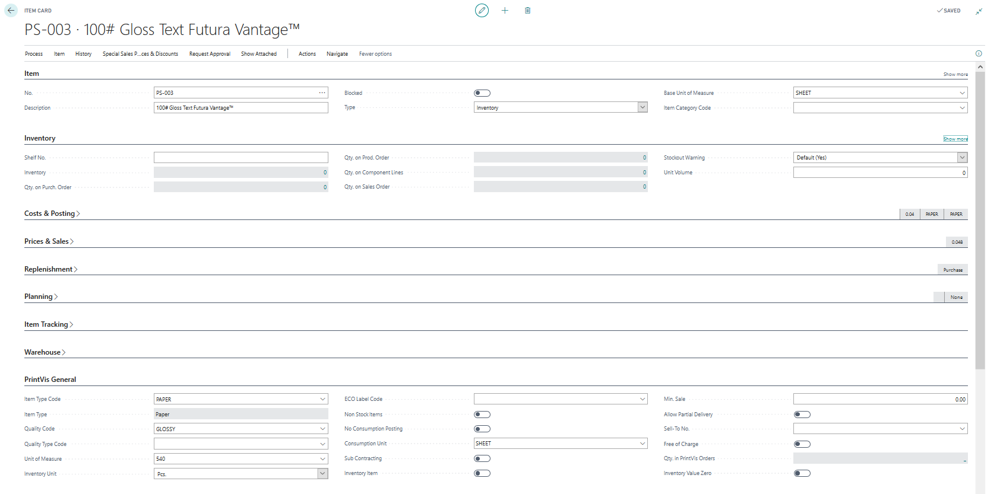
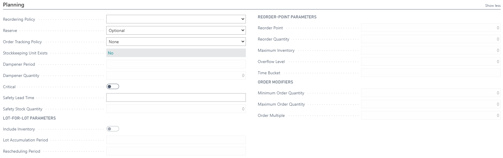
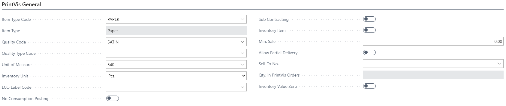
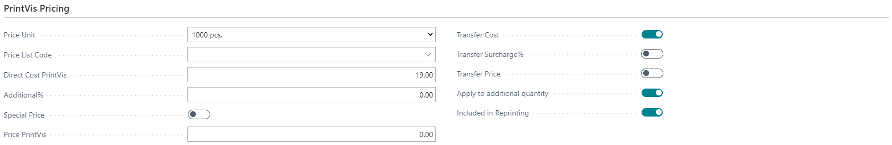
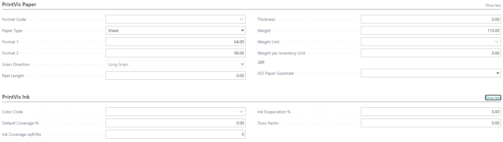
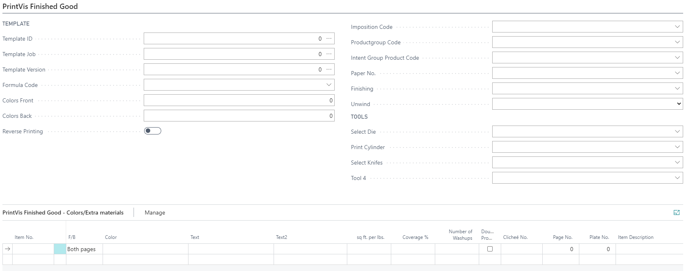
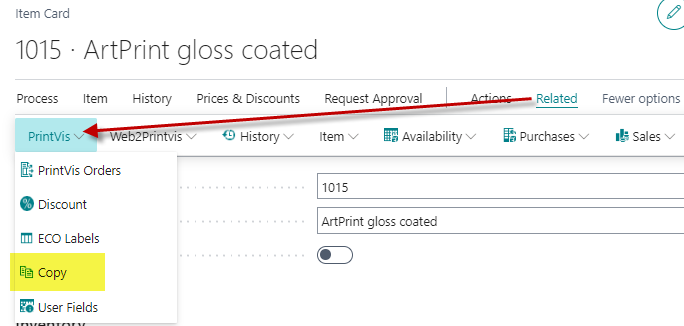
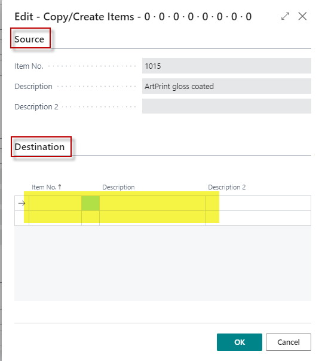

# Item Card

## Summary

Via the Item Card window, the company's items are created and maintained. This includes services, which in the system are treated as items.

PrintVis Item Card is an extension of a standard 365 Business Central item card, and many fields are therefore identical, particularly those concerning the handling of postings for specific items.

Several fields used in the PrintVis system have been added, and these fields are described in this help text.

The Item Card can be found by searching for "Items" and then selecting an item.

## General

**Note:** 
- Item numbers are alphanumeric, and you are free to use any combination of letters, numbers, and other characters.
- Do NOT use any of the search characters such as: `&`, `|`, `..`, `<>`, `>=`, `<=`.

## Planning

The planning section is used by the requisition worksheet. Additional information can be found [here](#).

## PrintVis General

| Field                        | Description                                                                                                                                                                                                                                  |
|------------------------------|----------------------------------------------------------------------------------------------------------------------------------------------------------------------------------------------------------------------------------------------|
| **Item Type Code**           | Used to categorize items and will set the ‘Item Type’ accordingly (e.g., paper, plates, etc.).                                                                                                                                           |
| **Quality Code**             | Corresponds with the Item Type Code. See the Quality Code article for more information.                                                                                                                                                     |
| **Quality Type Code**        | A sub-category of the selected Quality Code for the item used if further breakdown of the quality is required.                                                                                                                              |
| **Unit of Measure**          | Determines how you wish to Job Cost the item and how you want to present the information in the Job Costing report.                                                                                                                       |
| **Inventory Unit**           | How an item is handled and counted. This translates the BC Base Unit of Measure (which can be any code in any language) into a PrintVis unit like pcs, meter, square meters, etc.                                                          |
| **ECO Label Code**           | Displays the ECO label to which the item meets the requirements.                                                                                                                                                                            |
| **No Consumption Posting**    | Used for "non-stock" items, ensuring postings may only be done for Job Costing, posting purchase orders directly to a case without any consumption posting.                                                                                |
| **Sub Contracting**          | If the item is regarded as subcontracting, places it correctly on the case for Job Costing overview.                                                                                                                                       |
| **Inventory Item**           | If the item is a house stock item, making it easier to find these items.                                                                                                                                                                   |
| **Min. Sale**                | Displays the smallest quantity to sell for items sold directly (e.g., a box of 12 pens).                                                                                                                                                   |
| **Allow Partial Delivery**    | If partial deliveries are allowed for this item.                                                                                                                                                                                           |
| **Sell-To No.**              | If the item belongs to an individual customer, enter the customer number.                                                                                                                                                                   |
| **Qty. in PrintVis Orders**   | Displays the total quantity in PrintVis orders.                                                                                                                                                                                           |
| **Inventory Value Zero**     | If the inventory value of the item should be zero.                                                                                                                                                                                         |

## PrintVis Pricing

| Field                          | Description                                                                                                                                                                                                                                          |
|--------------------------------|------------------------------------------------------------------------------------------------------------------------------------------------------------------------------------------------------------------------------------------------------|
| **Price Unit**                 | How the unit is priced on the estimation. This is the price unit in relation to the PrintVis inventory unit by using the PrintVis parameters for conversion.                                                                                      |
| **Price List Code**            | If a price list is attached to the item, the corresponding code is selected or displayed here.                                                                                                                                                      |
| **Direct Cost PrintVis**       | Indicates the cost amount for estimation for this item (if no price list is set). The cost is per ‘PrintVis Price Unit’.                                                                                                                        |
| **Additional %**               | If the PrintVis Direct Cost is filled in, you may select a markup to be added. This is only used if "transfer additional" is also selected.                                                                                                         |
| **Special Price**              | If an item is NOT to be updated from the price list import, select this field.                                                                                                                                                                      |
| **Price PrintVis**             | Indicates the sales price for estimation for this item (if no price list is set). The price is per ‘PrintVis Price Unit’.                                                                                                                         |
| **Transfer Cost**              | Select this if the Direct Cost PrintVis should be transferred to the estimation.                                                                                                                                                                    |
| **Transfer Surcharge %**       | Select this if the additional % should be transferred to the estimation.                                                                                                                                                                            |
| **Transfer Price**             | Select this if the Price PrintVis should be transferred to the estimation.                                                                                                                                                                          |
| **Apply to additional quantity** | Select this if the item is to be calculated as part of the additional quantity. The formula used on the estimation must be set to do so.                                                                                                          |
| **Included in Reprinting**     | Select this if the item is to be calculated as part of the unchanged reprint.                                                                                                                                                                        |

## PrintVis Paper, Ink

 **If the Item Type = Paper and Paper Type = Sheet:**

| Field                | Description                                                                 |
|----------------------|-----------------------------------------------------------------------------|
| **Width, Centimeter**| First format of the paper (e.g., 88 for format 88 x 63).                   |
| **Depth, Centimeter**| Second format of the paper (e.g., 63 for format 88 x 63).                  |
| **Bulk**             | Thickness of paper in relation to its basis weight.                         |
| **Weight**           | Grammage of the selected paper (grams per square meter).                    |
| **Front Coatings**   | Coatings of the front side (important for JDF connection).                  |
| **Back Coatings**    | Coatings of the back side (important for JDF connection).                   |
| **Grade**            | Grade of paper (important for JDF connection).                              |

 **If the Item Type = Paper and Paper Type = Web:**

| Field                | Description                                                                 |
|----------------------|-----------------------------------------------------------------------------|
| **Width, Centimeter**| Width of the reel.                                                          |
| **Reel Length**      | Length of the paper reel in meters (used for estimating reel changes).      |

 **If the Item Type = Ink:**

| Field                | Description                                                                 |
|----------------------|-----------------------------------------------------------------------------|
| **Color Code**       | Color code from the color table (if imported).                             |
| **R G B**            | RGB values of this color.                                                  |
| **Mixed Color**      | Indicates if the color is mixed (yes/no).                                   |

**If the Item Type: Plates, Film, Die**

| Field                | Description                                                                 |
|----------------------|-----------------------------------------------------------------------------|
| **Width, Centimeter**| Width of the item.                                                         |
| **Depth, Centimeter**| Depth of the item.                                                         |

## PrintVis Finished Good

| Field                          | Description                                                                                                                                                                                                                                          |
|--------------------------------|------------------------------------------------------------------------------------------------------------------------------------------------------------------------------------------------------------------------------------------------------|
| **Template ID, Job, Version**  | Assign a template by adding the template ID, Job, and Version.                                                                                                                                                                                  |
| **Formula Code**               | Set a calculation formula if the item is ALWAYS to be calculated from this formula.                                                                                                                                                               |
| **Colors Front / Colors Back** | Display the number of colors on front/back.                                                                                                                                                                                                        |
| **Reverse Printing**           | Displays if the current finished good item has an imposition applied (used for ESKO Label integration only).                                                                                                                                     |
| **Imposition Code**            | Links a specific imposition type to the item (commonly used for label production).                                                                                                                                                                |
| **Productgroup Code**          | Displays the selected product group for the item to link statistics properly.                                                                                                                                                                      |
| **Intent Group Product Group** | Displays if an item is linked directly to a Product Configuration setup to allow estimation via the configuration or Quick Quote.                                                                                                                 |
| **Paper No.**                  | Displays which paper item number is given for the current finished goods item.                                                                                                                                                                     |
| **Finishing**                  | If a certain finishing type code is to be added to the estimation for the finished goods item, the required unit may be entered here.                                                                                                            |
| **Unwind**                     | Displays unwinding.                                                                                                                                                                                                                                |
| **Tools**                      | Displays up to 4 tools for the finished goods item to properly load the required tools when doing reruns of the item.                                                                                                                           |

## PrintVis Board Specification

This tab can be added to the page (not visible by default) if the "old" proprietary ESKO ArtiosCAD interface is in use. The "old" proprietary ESKO ArtiosCAD interface is no longer supported.

## Other Fields

Use the standard BC Online Help.

## Actions PrintVis

| Function                      | Description                                                                                                                                                         |
|-------------------------------|---------------------------------------------------------------------------------------------------------------------------------------------------------------------|
| **PrintVis Orders**           | Lookup in the field to see on which calculation lines the item has been used. Opens the Material Requirement list.                                                                                 |
| **Discount**                  | Opens the Discount Rates window for maintaining the company's discount policy.                                                                                                                   |
| **Eco Labels**                | Opens the Item Eco label table.                                                                                                                                                           |

## Edit - Copy/Create Items

