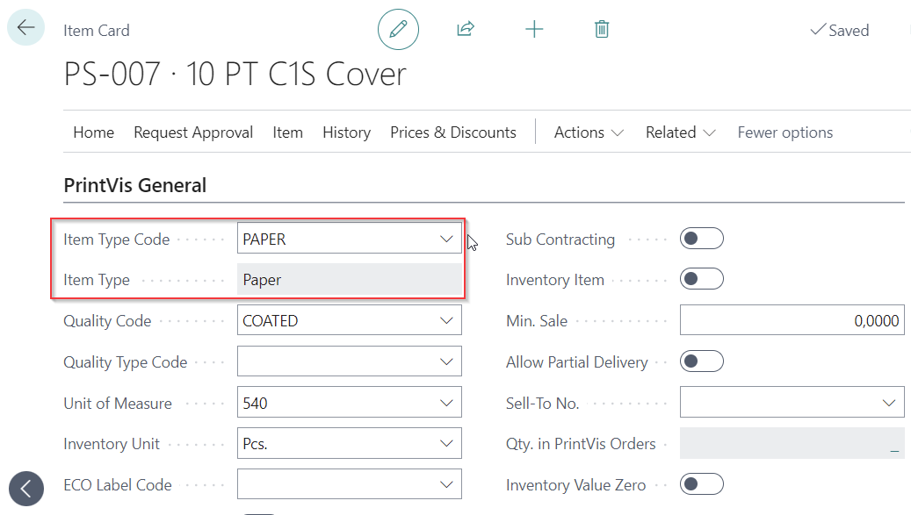
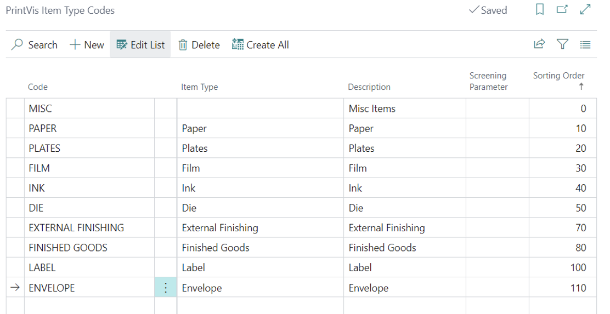
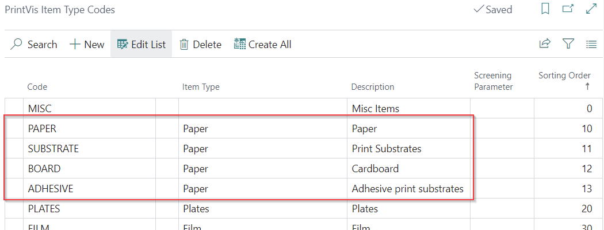
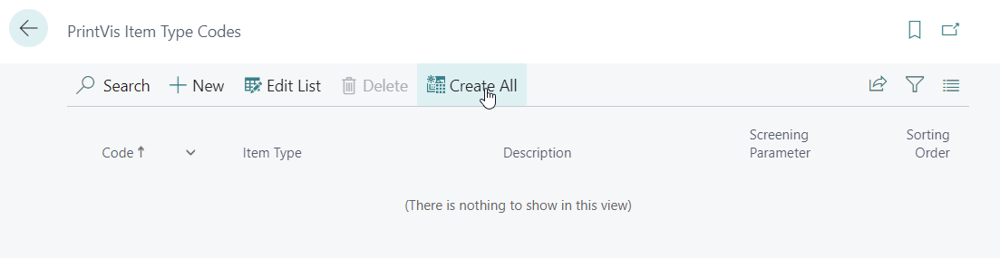
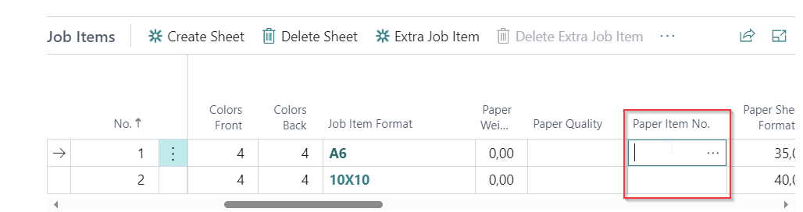
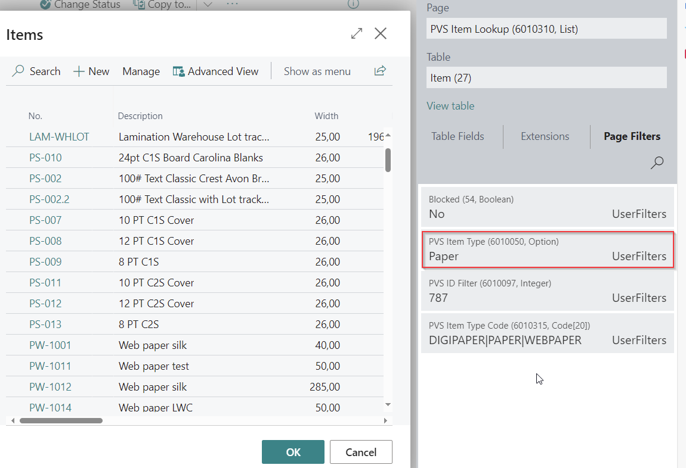
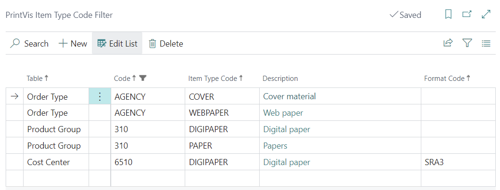

# Item Type Code and Item Type Code Filter

## Summary

Item Types and Item Type Codes are used to categorize items. While item types are fixed options that are used throughout the PrintVis application, item type codes can be set up but must be linked to an existing Item Type option.

Item Type Code Filters can be used to set up which Item Type Codes are available based on the current PrintVis Order Type, Product Group, or Cost Center. Cost center in this context is the selected press/machine on the PrintVis Job Item.

## Item Type Code

Item Type Codes are used to select and map PrintVis Item Types.

It is mandatory to have Item Type Codes set up because Item Types cannot be selected directly on the item card—the field is not editable. The Item Type is set by the selected Item Type Code and is a mandatory field for items used with PrintVis.

Below is a suggested default setup of Item Type Codes.

Variants for paper are common as well but not mandatory. See examples below.

 Action "Create All"

By default, it is possible to create all Item Types as Item Type Codes. This function will create an Item Type Code for each item type from existing items. It cannot be used in a new setup.

## Item Type

PrintVis Item Types are used in some places to filter the specific item. For example, on the "Paper Item No." lookup field on the PrintVis Job Item.

When hitting the lookup, there is always a fixed page filter on PrintVis Item Type "Paper":

 PrintVis options for Item Types are:

- **Paper**: Must be used for all print substrates, otherwise, no possibility to choose an item as a print substrate.
- **Plates**: All printing plates/cylinders, e.g., offset, flexo, flexo sleeves, screen, letterpress, rotogravure, etc.
- **Film**: For films used in prepress. Others not relevant anymore and could be used for something else.
- **Ink**: Must be used for all ink, varnish, or glue items, otherwise, no possibility to choose an item on the color/glue/ink/consumables table.
- **Die**: All items to handle dies and other tools.
- **Repro**: For repro items used in prepress. Others not relevant anymore and could be used for something else.
- **External Finishing**: Must be used for all items for subcontractors.
- **Finished Goods**: All finished products that are put on stock after production. See Label/Envelope.
- **Block**: Fixed use is not defined. Was named Cliché in former versions and is still filtered on table PVS Materials (6010389 on item card) and PVS Product Materials (6010209 on Product card).
- **Label**: All finished products that are labels that are put on stock after production.
- **Envelope**: All finished products that are envelopes that are put on stock after production.
- **Board**: This is a special board type only used for the ESKO ArtiosCAD integration. Do not use this item type if the item must be used as print substrate. Please see the option "Paper."

If an option is to be used on an item, it must be mapped with an Item Type Code in the Item Type Code setup!

## Item Type Code Filter

It is possible to set up filters on Item Type Code for:

- Order Types
- Product Groups
- Cost Centers

The Item Type Code filter setup is available on the setup page for order types/product groups/cost centers or can be called directly.

With this setup, it is possible to limit available materials (mostly paper/print substrates) for ease of use based on the current order type/product group/cost center. With this, the user must choose only from the list of relevant items for the current estimate.

A format code filter is available if only specific sizes should be available for cost centers/presses. The Format Code filter references the format code from the item card.

