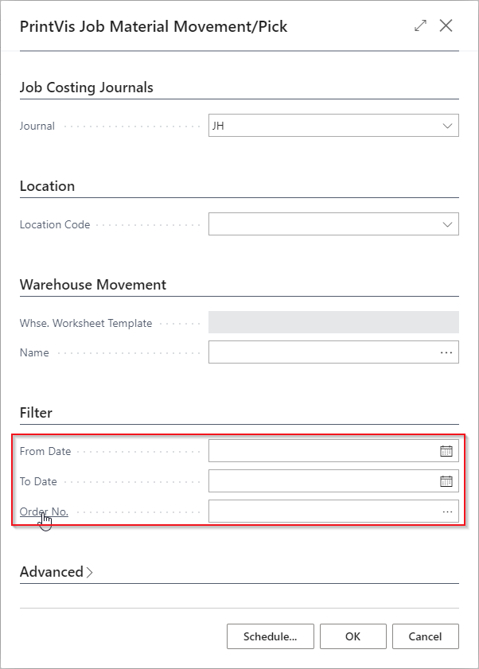
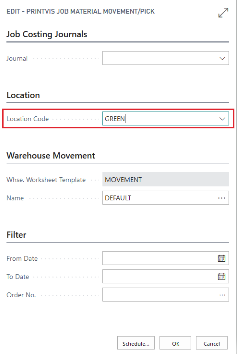
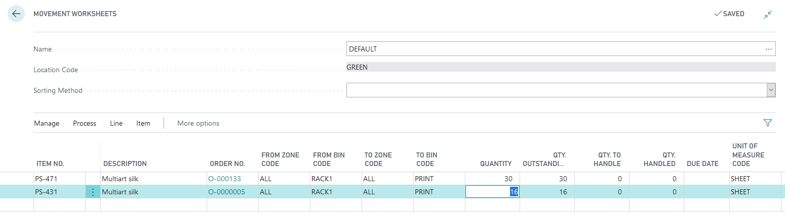
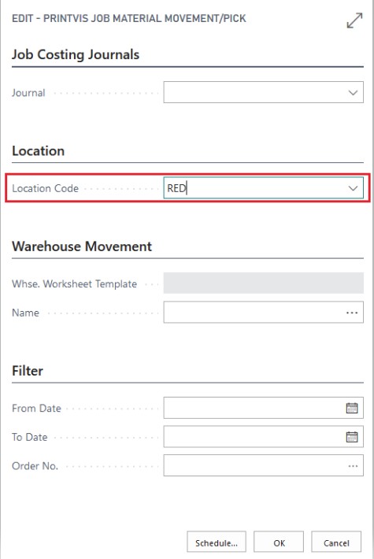
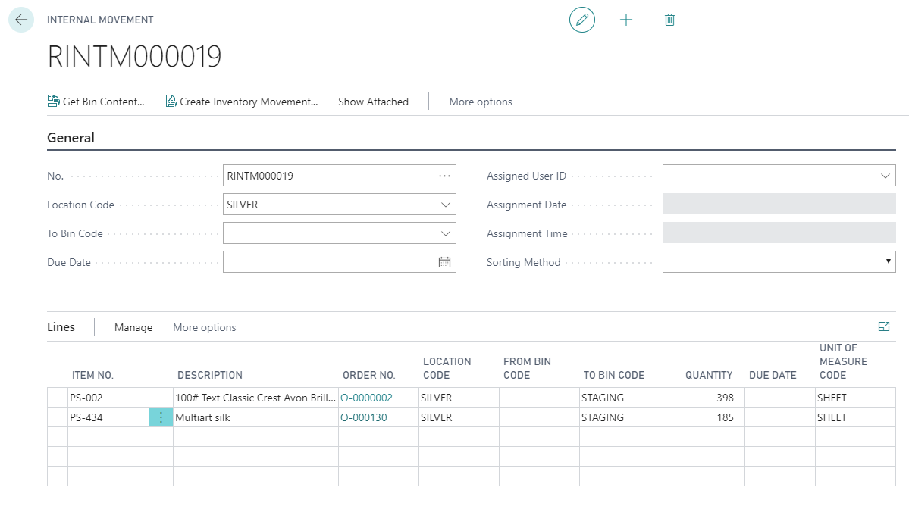
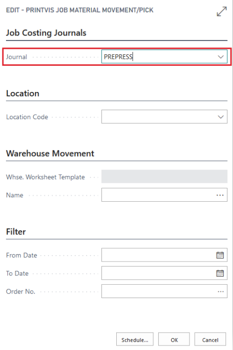
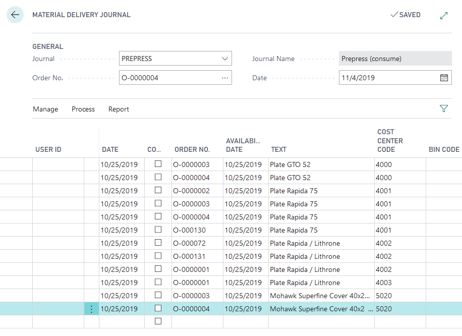

# Job Material Movement/Pick

## Summary

Formerly known as the **Material Delivery Journal**, this page is used to move raw materials to the cost centers for use or to consume the materials, depending on the company setup.

## Usage

To access this function, search for **Job Material Movement/Pick**.

The job material movement report behaves differently depending on how warehousing is set up in the system. The following fields are used across all warehousing setups:

| **Field**            | **Description**                                                                                                                                   |
|----------------------|----------------------------------------------------------------------------------------------------------------------------------------------------|
| **From Date**        | Use this field to find material needs based on a from date (no earlier than). Leave this field blank to pull from all orders.                    |
| **To Date**          | Use this field to find material needs based on a to date (no later than). Leave this field blank to pull from all orders.                        |
| **Order No.**        | Use this field to find material needs specific to an order. Leave this field blank to pull from all orders.                                       |
| **Use All Item Types** | When unchecked, it is possible to enter a specific item type when filtering materials to move.                                                   |
| **Item Quality Code** | Use this field to find material needs specific to the item quality code. Leave this field blank to pull from all orders.                         |

Note that the **Job Material Movement/Pick** process only considers items with a quality code where **Raw Material Pick** is checked.

## Directed Warehousing

When using **directed warehousing**, the job material movement report will generate the appropriate warehouse movement worksheet. The only required field is the **Location Code**, set to the directed warehouse in use.

A warehouse movement worksheet is generated, and the standard Business Central warehousing workflow is followed.

## Bin Mandatory Warehousing

When using **bin mandatory warehousing**, the job material movement report will generate the appropriate internal movement worksheet. The only required field is the **Location Code**, set to the bin mandatory warehouse in use.

An internal movement worksheet is generated, and the standard Business Central warehousing workflow is followed.

## Basic Inventory

When using **basic (inventory only) warehousing**, the job material movement report will generate the material delivery journal, which performs based on the job costing journal settings. The only required field is the **Job Costing Journal**, which must be set to the journal in use.

A material delivery journal is generated, and the job costing journal settings determine how the material is moved or consumed when posted.

