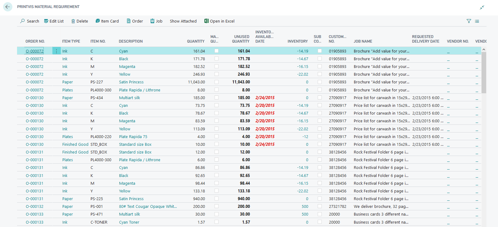

# Material Requirements

## Introduction to Material Requirements

The Material Requirement can be found by searching **Material Requirements**.

The list displays information on the item number and text, the estimated number, and the unit used for the estimation as well as the residual consumption in inventory units for each material. Then, the date from which the items are available in stock (if they are purchased via the Purchase wizard) is displayed, as well as a checkmark if the items have been picked/released from the inventory.

For example, paper is often estimated in either kilograms or per 1,000 pcs, but the paper inventory unit is pcs. Here, the system will show that 1,004 kilograms of paper equals 10,650 sheets.

## Inventory Available Date

The inventory available date is set based on the following order:

1. The planning start date of the calculation unit where that material is attached.
2. The requested shipment date.
3. Today's date.
