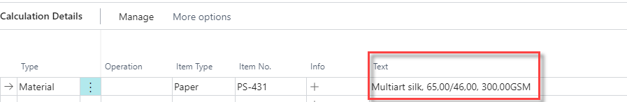
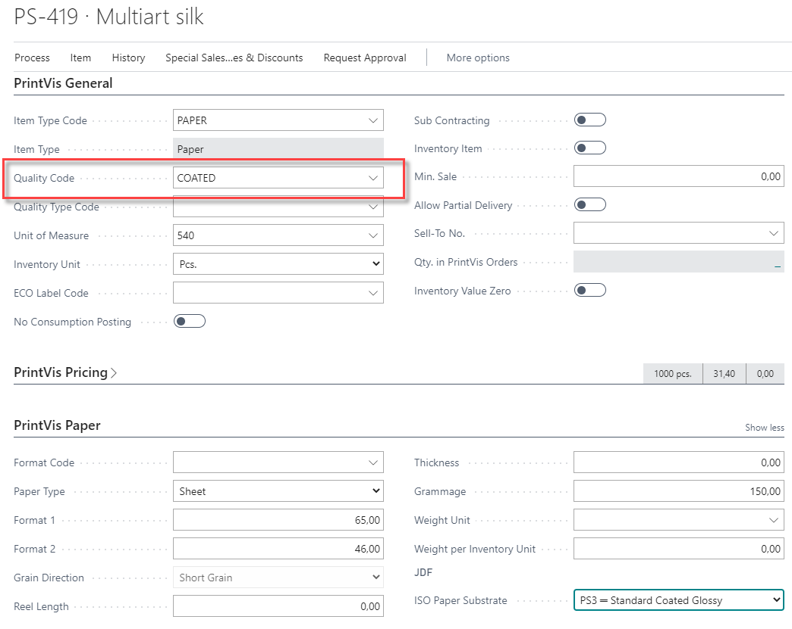

# PrintVis Qualities

## Summary

The PrintVis Qualities are used as a setting on items. Items that are used in PrintVis must have a quality assigned. If no quality is assigned, there might be some options in the calculation or other places that are not available. Qualities impact the following areas:

- Show an item in the Material Transfer list.
- Show an item in the PrintVis Purchase Guide.
- Definition of the PrintVis cost price (for calculation).
- Qualities can be used in Speed Tables as a speed-impacting parameter.
- … and more.

For each Quality Code, an Item Type must be selected because the PrintVis Qualities are a sub-type of the Item Type. After selecting an Item Type on the item card, only qualities assigned to the given Item Type are available.

## Setup Fields

| **Field**                  | **Description** |
|---------------------------|-----------------|
| **Code**                  | Enter a code for the Quality |
| **Name**                  | Enter a name for the Quality |
| **Item Type**             | Each Item Quality Code is linked to a fixed 'Item Type' in PrintVis to indicate its use. Options: - &lt;blank&gt; - Paper - Plates - Film - Ink - Die - Repro - External Finishing - Finished Good - Block - Label-Envelope  Only qualities assigned to the given Item Type will be available when selected on the item card. |
| **Raw Material Pick**     | Defines which items appear in Material Transfer/Job Material Movement and Pick List. Used typically for stock paper and Pantone inks, not for CMYK colors or CTP plates. |
| **Use Purchase Guide**    | If checked, the item will be included in the purchase guide on the case card. Common for Dies, Freight, Subcontracting, and non-stock paper. |
| **Consumables**           | When marked, this field enables item filtering on the Job Card. Used in: - Consumables on Job Item - Colors/Glue on Job Item |
| **Sheetwise Printing Only** | Forces sheetwise printing method if checked for the item quality. |
| **Purchase Type**         | Defines how to purchase items of this quality. Options: - &lt;blank&gt; - G/L Account - Item - Fixed Asset - Charge (Item) Item is the most common. |
| **Put-in-stock value**    | Defines the value used when items are put on stock via PrintVis Release Finished Goods: - Item cost - Zero value - Item standard cost - Estimated direct cost - Estimated total cost - Job Costing Direct - Job Costing Total  'Job Costing' should be selected if the actual production cost is to be used. No auto-adjustments are made after posting. |
| **Default Unit of Measure** | Relates to the "Code" in the "Unit of Measure" table. If assigned, the item will use the default from the Quality unless otherwise set. |
| **Calculation Cost Price** | Defines which item cost is used for PrintVis calculation: - Cost Price - Std. Cost Price - Last Cost Price - Avg. Cost |
| **Color Factor**          | Used for 'Ink' item types to define a standard coverage %. Not used in formula 160 but usable in custom formulas. |
| **Calc. Line Description** | Template for calculation detail line descriptions using variables: %1 = Item Description %2 = Item Quality Description %3 = Grammage/Weight %4 = Format1 %5 = Format2 %6 = Grain Direction  Example: "%1, %4x%5cm, %3GSM" → "Multiart Silk, 70x100cm, 135GSM"  See picture Below|
| **Item Filter**           | Relates to "No." in the "Item" table. Typically used in custom import functions for auto-assigning qualities. |
| **ISO Paper Substrate**   | Default substrate for JDF workflows. If set, item does not need its own assignment. Supports color profile adaptation in prepress. |

## Setup Example on Item card

