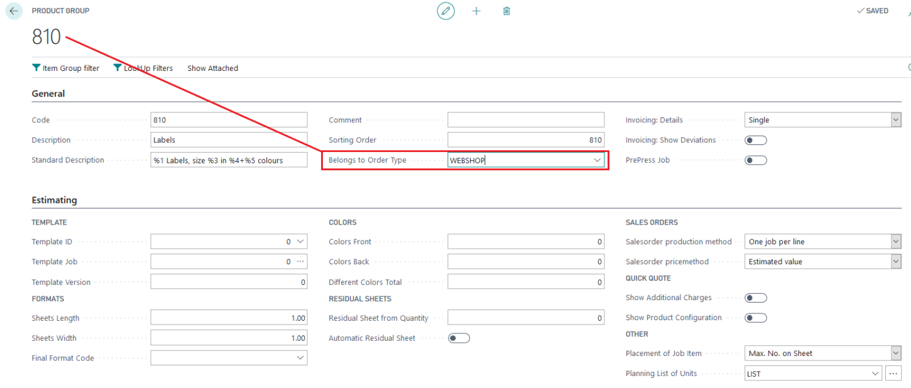
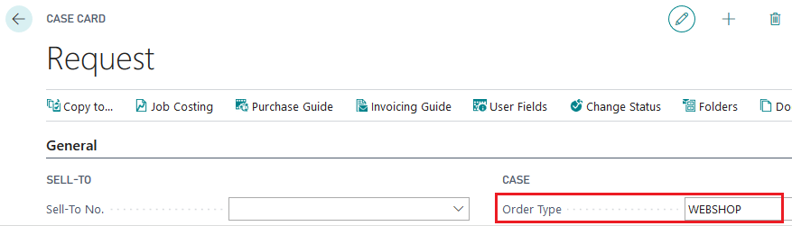
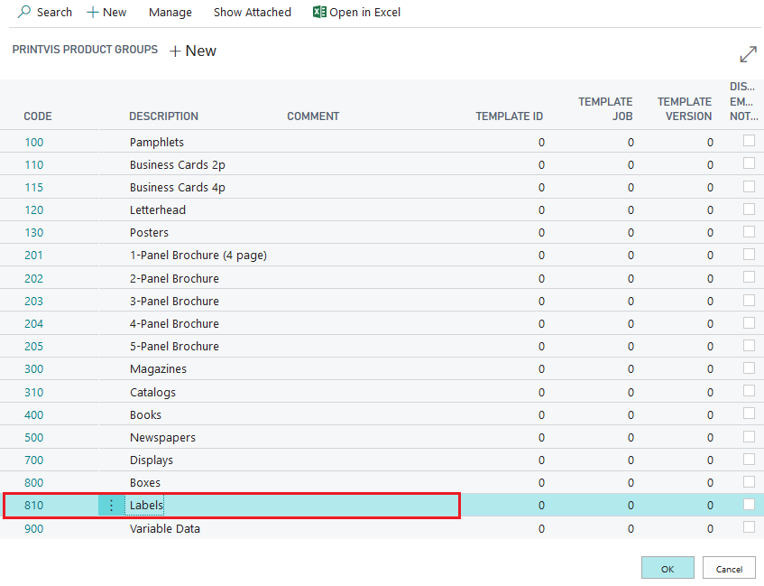
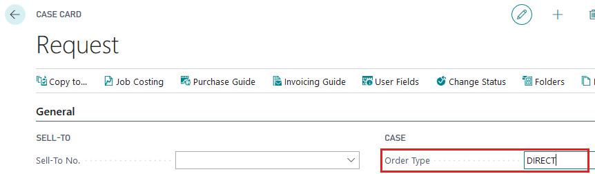
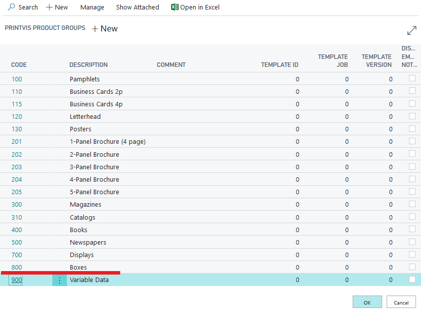

**Relationship between Order Type and Product Groups**

**Setup**

Select the Order type on the Product Group setup Field "Belongs to Order
Type." The Product Groups with this setting will now only be displayed
on the Order type they belong to. Also, they are hidden for the other
Order Types.

Example: On product groups 810 and 900 I have selected the order type
WEBSHOP:

**Result**

These will now be only displayed if I have selected the Order Type
WEBSHOP on the case:

When selecting a different order type 810 and 900 are not available as
they are belonging only to WEBSHOP:

