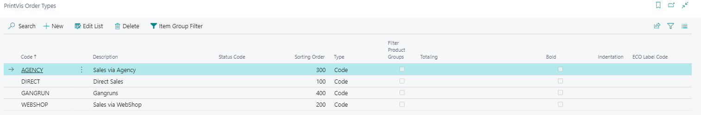
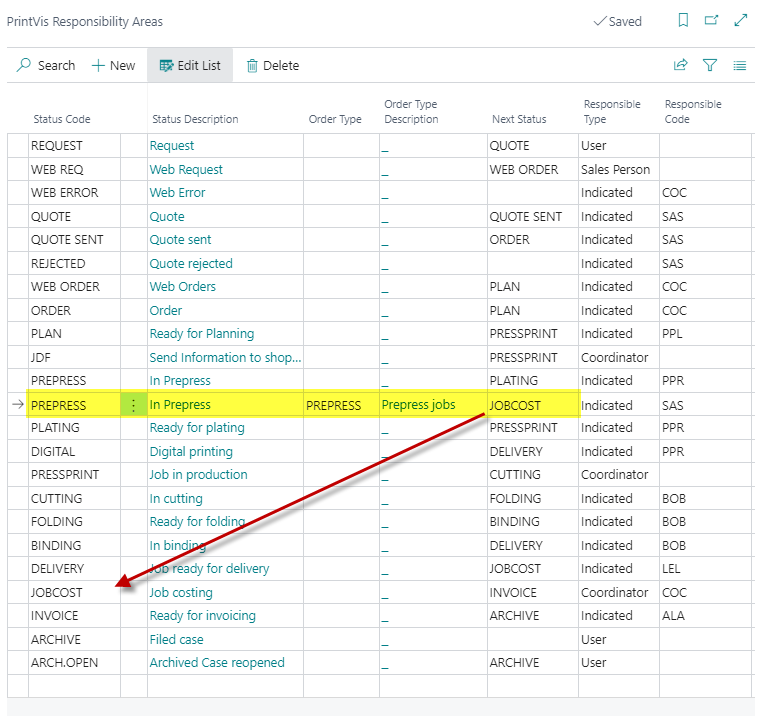

**Order Types**

**Summary**

Order types are used in the system as a general statistics dimension to
measure the production. Typically, the order type is combined with a
product group. Hereby, you may get an overview of how much each product
group sells per Order type . 

Furthermore, the setup of order types gives you the option - by marking
the field filter product group - that only the product groups which are
setup with affinity to the order type may be selected. Another option is
to let the selection Order Type control decide which Status Code a case
shall be started in - the required code is selected via the Status Code
field. Thus, all cases attached to the selected order type will
automatically be attached to the selected eco-label. You may also - via
the field Eco-labels - select between the system’s standard eco-labels. 

Order types are also used in the "Responsibility Areas" to control the
workflow of an order.

**Setup**

<table>
<colgroup>
<col style="width: 21%" />
<col style="width: 78%" />
</colgroup>
<thead>
<tr>
<th>Code</th>
<th>Order Type Code</th>
</tr>
</thead>
<tbody>
<tr>
<th>Description</th>
<td>Order Type description</td>
</tr>
<tr>
<th>Status Code</th>
<td>This option is to let the selection Order Type control decide which
Status Code a case shall be started in - the required code is selected
via the Status Code field.</td>
</tr>
<tr>
<th>Sorting Order</th>
<td>With this field, and alternative Sorting Order can be entered. The
LookUp forms will usually select this Sorting Order. If no sorting order
is defined, the lists will be ordered by the default primary key
order</td>
</tr>
<tr>
<th>Type</th>
<td>
You can select:

<ul>
<li>
Code: for an order type 
</li>
<li>
Heading: for grouping the order types
</li>
<li>
Totaling: build a summary at the column Totaling defined order
types
</li>
</ul></td>
</tr>
<tr>
<th>Filter Product Groups</th>
<td>The setup of order types gives you the option, by marking the field
filter product group, that only the product groups which are setup with
affinity to the order type may be selected.</td>
</tr>
<tr>
<th>Totaling</th>
<td>If the type = totaling: Enter the order types, e. g. order
type1|order type 2</td>
</tr>
<tr>
<th>Bold</th>
<td>Select yes (or check mark), if the text for this Order Type should
be presented in "bold”</td>
</tr>
<tr>
<th>Intension</th>
<td>This field can be used to make text indentation at the Order Type. 0
= no indentation1 = level 1 indentation2 = level 2 indentationetc</td>
</tr>
<tr>
<th>ECO Label Code</th>
<td>ECO Label Code relates to the "Code" field in table "Eco Label". The
ECO Label Code can be selected from the Eco Label table. All cases
attached to the selected order type will automatically be attached to
the selected eco-label.</td>
</tr>
</tbody>
</table>

**Example **

Workflow based on Order Types

