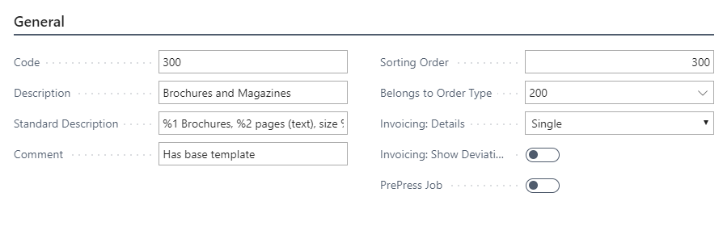
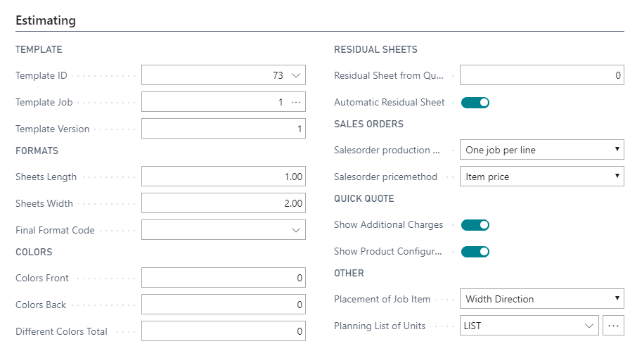
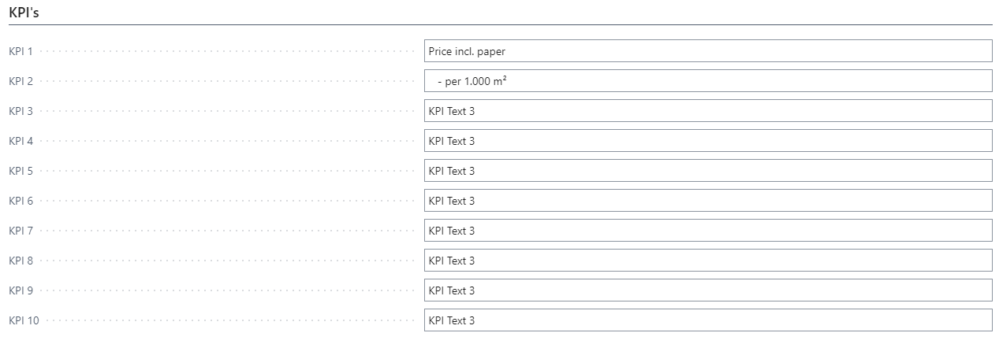
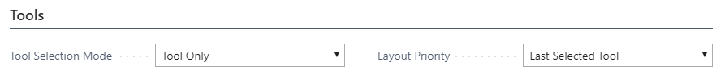
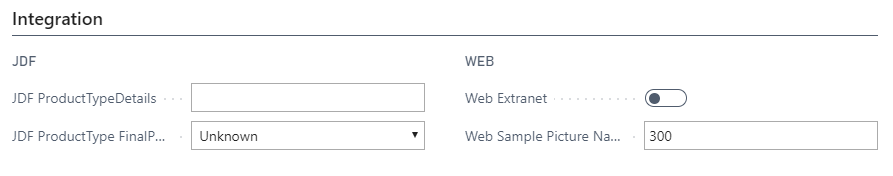
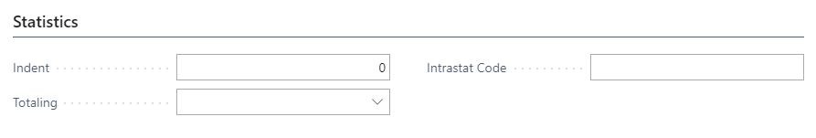
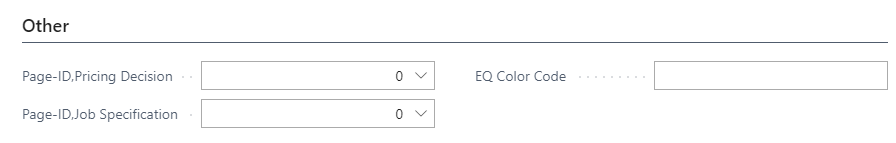
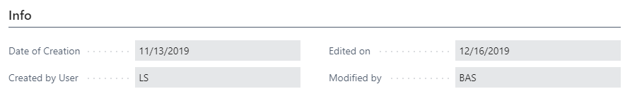
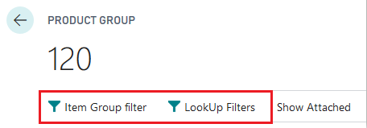
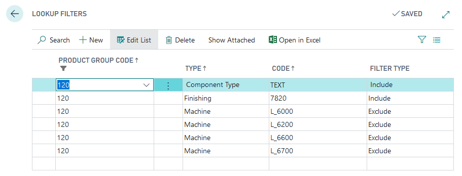

**Product Groups**

Product Groups are used to control a large part of basic information on
a graphic order, and also to categorize the company's different products
for statistical information - for example on production and sales.

 A Product Group is attached directly to a Case. The case is then,
statistically speaking, included in the selected Product Group, but may
also be used on specific job lines for the case - typically to control
imposition information and perhaps basic templates.

   
Product Groups may also be included as a parameter in e.g. the Scrap and
Speed calculations.

Generally, you control information on:

-   statistical grouping

-   standard texts

-   Eco-label

-   basic templates

-   imposition information

-   basic planning (Milestones)

-   invoice building

-   key figures via the company's Product Groups

**Setup**

**General**

Product Groups - General

<table>
<colgroup>
<col style="width: 14%" />
<col style="width: 85%" />
</colgroup>
<thead>
<tr>
<th><strong>Field</strong></th>
<th><strong>Description</strong></th>
</tr>
</thead>
<tbody>
<tr>
<th>Code</th>
<td>Code is the identification field for the Product Group. Length is
max. 20 characters</td>
</tr>
<tr>
<th>Description</th>
<td>A meaningful description that explains to the user what this
is.</td>
</tr>
<tr>
<th>Standard Description</th>
<td>
When you enter information on a graphic production job the system
may automatically create an External Description based on the set up of
this field. On the line, you state, by a combination of codes and fixed
text, which description text to be created for the job.

By placing the mouse cursor on the line all codes from %1 to %6 are
displayed along with the information each code will built up on the
line.

An example of a text build-up for a Brochure could be:

%1 Brochures "%6" of %2 pages of the format %3, printed in %4+%5
colors.

Subsequently, the text will be built up, as job information is
entered and the finalized text could, e.g., be (Job Name = Autumn);

8,000 Brochures "Autumn" of 24 pages of the format 21x21, printed in
4+4 colors.
</td>
</tr>
<tr>
<th>Comment</th>
<td>
Here, you insert an internal comment or text message for the
group which may help the user when selecting product group.

Particularly applicable for the start-up of a new system or when new
users work in the system.
</td>
</tr>
<tr>
<th>Sorting</th>
<td>If you do not want the company's product groups to be sorted
alphabetically/numerically according to the code, you may state the
desired sorting order for the Product Group in the field.</td>
</tr>
<tr>
<th>Belongs to Order Type</th>
<td>Select to which Order type is this Product Group releated. Belongs
to Order Type relates to the "Code" field in table "Order Type".The
Belongs to Order Type can be selected from the Order Type table.By an
inquiry the field, you may attach a product group directly to a specific
Order Type. If the Order Type is set up to delimit Product Groups, the
user will only be presented with the product groups belonging to the
selected Order Type when cases are created.</td>
</tr>
<tr>
<th>Invoicing: Details</th>
<td>
If the Invoice building specifications in the Graphic Account
Information are set to Job you must specify, per product group, how the
invoice building is to be specified. You have the following options:

<ul>
<li>
Single - One invoice line with the total price of the job is
built up.
</li>
<li>
Measuring UnitEstimating - The invoice is built up directly on
the basis of the estimate, and is specified per Unit of
measure.
</li>
<li>
Price Units - The invoice is built up with one invoice line per
Calculation unit in the job.
</li>
<li>
Calc Lines - The invoice is built up with one invoice line per
Calculation detail in the job.
</li>
</ul></td>
</tr>
<tr>
<th>Invoicing: Show Deviations</th>
<td>
If this field is selected deviations are displayed on a separate
line in the invoice draft.

Deviations are consumption registered for a case and which, with
regards to quantity or time, constitute more than the estimate.

Consumption not included in the estimate will be included in the
calculation of deviations.
</td>
</tr>
<tr>
<th>Prepress Job</th>
<td>This field is used if PV handle also Prepress jobs with this product
group. 
</td>
</tr>
<tr>
<th>Web Extranet</th>
<td>Show this Group in WebShop</td>
</tr>
<tr>
<th>Web Sample Picture Name</th>
<td>Picture for WebShop</td>
</tr>
</tbody>
</table>

 

**Estimating**

Product Groups - Estimating

<table>
<colgroup>
<col style="width: 19%" />
<col style="width: 80%" />
</colgroup>
<thead>
<tr>
<th><strong>Field</strong></th>
<th><strong>Description</strong></th>
</tr>
</thead>
<tbody>
<tr>
<th>
Template ID

Template Job

Template Version
</th>
<td>
You may attach a basic template per Product Group, so that only
the selection of the Product Group decides that the Calculation Units of
the basic template are included in the job.

Typically, those cases which are to be included as basic templates
are NOT marked as Template - as they are not to be selected equally from
the company's other calculation templates.

Typically, a Basic Template is used in order to secure that at least
the Calculation Units, always included in production, are selected by
default - this saves the user more selections. You would, e.g., always
(if you have your own book binding machine) have to fold, trim and
assemble a brochure and you must also always include shipment to the
customer. When producing writing paper, on the other hand, only trimming
and shipping are to be included.

If you have created a case with one or more jobs/versions which are
to function as Basic Template, you write the ID number of the desired
job in the field. You then write in the next field, the Template job
field, which job on the selected ID that is to be used, and in the
Template version field, you write which version of the job on the
selected ID to be used.

In this way, you may create all the company's Basic Templates on the
same ID number by creating different jobs and/or versions.
</td>
</tr>
<tr>
<th>Sheets Length</th>
<td>
In this field, you state the number of leaves connected in the
top/bottom of the finalized product, i.e., the number of pages connected
by a folding without intermediary edge.

Often, you will see 1 leaf in height but several leaves in width (see
below), but maps, e.g., may be connected 6 leaves in height and 8 leaves
in width, i.e., a total of 48 prima sides.
</td>
</tr>
<tr>
<th>Sheets Width</th>
<td>
In this field, you state the number of leaves connected in the
spine of the finalized product, i.e., the number of pages connected by a
folding without intermediary edge.

Brochures are, thus, most often connected 2 leaves in width, while
folders may have more conjugated leaves in width, depending on if it is
a 2, 3, 4 folded folder.
</td>
</tr>
<tr>
<th>Final Format Code</th>
<td>Final Format Code relates to the "Code" field in table "Format
Code".The Final Format Code can be selected from the Format Code
table.If you want the system to build up a certain Job item format code
automatically, you state the desired code in the field or you may, via
an inquiry in the field, select one of the systems Standard
Formats.</td>
</tr>
<tr>
<th>Colors Front</th>
<td>If you want to state standard Colors on a certain product group you
state this hear, the system does not check up on this.</td>
</tr>
<tr>
<th>Colors Back</th>
<td>If you want to state standard Colors on a certain product group you
state this hear, the system does not check up on this</td>
</tr>
<tr>
<th>Different Colors total</th>
<td>
If you want the system to build up a certain number of Different
colors automatically, you state the desired number of colors in the
field.

This function is used if different colors are used for Prima and
Second sides on the job.
</td>
</tr>
<tr>
<th>Resudual Sheet from Quantity</th>
<td>Here, you may state at what quantity in the system, residual sheets
on a sheet optimization is to be calculated. If, e.g., the value 3,000
is inserted the possibility of residual sheets below a quantity of 3,000
is not optimized. This might make it more financially attractive to
calculate with residual sheets.</td>
</tr>
<tr>
<th>Automatic Residual Sheet</th>
<td>
When selecting this field the system automatically creates
residual sheets for the job if the entire job cannot be printed on
your/identical imposed sheets.

A 20-page brochure in A4 format printed on a 88x63 cm paper will,
thus, at Automatic Residual Sheets, be imposed as a 16-page prima/second
sheet with one item on the sheet and a turning sheet with four items on
the sheet.
</td>
</tr>
<tr>
<th>Salesorder Production</th>
<td>
In the setups, where you use sales order integration, you have
the option of selecting by product group, how new lines on the sales
order are created on the same production order.

<ul>
<li>
One job per line - creates a new job line on the Case Card every
time a new line is created on the sales order and is attached to an
existing production order number.
</li>
<li>
One job item per line - creates a new line in the job item table
on the Case Card every time a new line is created on the sales order and
is attached to an existing production order number.
</li>
</ul>

This is often used in the printing of labels or packaging
production.
</td>
</tr>
<tr>
<th>Salesorder pricemethod</th>
<td>
In the setups, where you use sales order integration, you have
the option of selecting by product group, how the price of the
item/service you produce is to be determined. There are two
principles:

<ul>
<li>
The item price reads the item card and calculates the price on
the basis of the item price here.
</li>
<li>
Estimated Rate calculates an item unit price on the basis of the
value stated in the Offered Price field on the matching production order
line. Thus, this option is best suited for the principle of one job per
line in the the field above.
</li>
</ul></td>
</tr>
<tr>
<th>Show Additional Charges</th>
<td>Via an inquiry in the field, you select if the Additional Charges
should be shown at Quick Quote.</td>
</tr>
<tr>
<th>Show Product Configuration</th>
<td>Via an inquiry in the field, you select if the Product Configuration
should be shown at Quick Quote.</td>
</tr>
<tr>
<th>Placement of Job Item</th>
<td>
Via an inquiry in the field, you select if the item is to place
the job's items considering the sheet's web direction, or if the highest
possible number of items is to be imposed on the sheet.

If Width Direction is selected, the sheet's web direction the imposed
items will be placed so that the sheet's fiber direction complies with
the height of the item.

If Against Direction is selected, the sheet's web direction the
imposed items will be placed so that the sheet's fiber direction goes
against the height of the item.
</td>
</tr>
<tr>
<th>Planning List of Units</th>
<td>Via an inquiry in the field, you select a specific Planning Unit
from the list, which is always to be created to the product. The list is
filtered so that the user only sees the Planning Units which are set up
as Bills of Material.A Planning Bill of Material is typically a number
of Milestones which are to included in the job.</td>
</tr>
</tbody>
</table>

 

**KPI's**

PrintVis offers the possibility to add up to 10 KPI's to be
automatically calculated for each Job (meaning a case with multiple jobs
will have a set of KPI's for each job individually).

KPI's are to be linked to Productgroups - and the requested
Headings/Captions per KPI must be set on the Product Group Setup
individually.

For the current 'Modern Client', such KPI 'Event-subscriptions' must be
linked by using a Hook - which will typically be done by a developer. 

Until properly set up for each Product Group, the fields are nonvisible
in standard PV. Once the Event-Subscription is linked to the product
groups (tab Specials, top field) 

You can of course have different KPI's defined for different
productgroups, as they could easily require different info.

Examples of use: KPI fields are often used where specific price
calculations are needed. 

\- For wallpaper or boxliners the industry standard is to price the
products in LCY (or other) per 1000 squaremetres printed material
without cost of the paper. – or with the paper as an alternative to the
customer sending their own paper. 

\- Other companies want to display prices plus agent fee or salesperson
commission and use the KPI to do so. 

\- Other again for example weight per finished item - for postal for
shipping purposes.

\- You may also choose to display partial amounts, such as makeready
price or price for print only if desired.

**Tools**

Product Groups - Tools

<table>
<colgroup>
<col style="width: 13%" />
<col style="width: 86%" />
</colgroup>
<thead>
<tr>
<th><strong>Fields</strong></th>
<th><strong>Description</strong></th>
</tr>
</thead>
<tbody>
<tr>
<th>Tool Selection Mode</th>
<td>
There are 3 ways of setting up the usage for tools. To activate
the usage a setup has to be done on the Product Group setup: 
Options are:

<ul>
<li>
Tool Only
</li>
<li>
Tool Usage
</li>
<li>
Tool Group Usage
</li>
</ul></td>
</tr>
<tr>
<th>Layout Priority</th>
<td>
The settings on FastTab “Format”; in the Tool Card are used to
define the layout of the tools which will maintaining the imposition
code that can be attached to a tool. If no imposition type is attached,
just the cut-off (Optimal Height field on tool card) will be transferred
to the specification card. On a Job Item it possible to select up to 4
tools for production. In former versions the imposition type the last
selected tool was chosen for the layout on the specification card. Now
it is possible to setup, which tool will define the imposition/cut-off
for the production. 
Options are:

<ul>
<li>
Last Selected Tool
</li>
<li>
First Selected Tool
</li>
<li>
Tool 1 .. 4
</li>
</ul></td>
</tr>
</tbody>
</table>

**Integration**

Product Groups - Integration

<table>
<colgroup>
<col style="width: 26%" />
<col style="width: 73%" />
</colgroup>
<thead>
<tr>
<th><strong>Field</strong></th>
<th>Description</th>
</tr>
</thead>
<tbody>
<tr>
<th>JDF ProductTypeDetails</th>
<td>The JDF ProductTypeDetails value has to match one of the product
types to trigger a workflow template.</td>
</tr>
<tr>
<th>JDF ProductType FinalProduct</th>
<td>Select the type of "Final Product" for JDF connection.</td>
</tr>
<tr>
<th>Web Extranet</th>
<td>Mark this, if the product group should used at Web Extranet.</td>
</tr>
<tr>
<th>Web Sample Picture Name</th>
<td>This picture is used at the Web for this product group.</td>
</tr>
</tbody>
</table>

**Statistics**

Product Groups - Statistics

<table>
<colgroup>
<col style="width: 12%" />
<col style="width: 87%" />
</colgroup>
<thead>
<tr>
<th><strong>Field</strong></th>
<th><strong>Description</strong></th>
</tr>
</thead>
<tbody>
<tr>
<th>Indent</th>
<td>If you want to indent lines, e.g. under a Heading, you enter a
number of characters in fields and may immediately see that the text in
the Text field is indented.</td>
</tr>
<tr>
<th>Totaling</th>
<td>
If you have selected a line of the Totaling type you may perform
an inquiry in this field; this opens a similar window from which you
select the lines you want a Totaling of. These must all be of the Normal
type and be stated in the Type field.

In this way, you may select that a Totaling in statistics of, e.g.,
all product groups of the Folder type is to be done - typically, you
will need to create several different product groups of the Folder type,
as you will often produce 3-folded, 4-folded folders etc.
</td>
</tr>
<tr>
<th>Intrastat Code</th>
<td>
If the finalized products are often exported you need to know to
the Intrastat code to which the product belongs. The code may be entered
in the field. The information may then be used when making out an
invoice or drawing up shipment papers.

However, note, that the code is only included in the invoice print if
the company's invoice set up for this.
</td>
</tr>
</tbody>
</table>

 

**Other**

Product Groups - Other

<table>
<colgroup>
<col style="width: 15%" />
<col style="width: 84%" />
</colgroup>
<thead>
<tr>
<th><strong>Field</strong></th>
<th><strong>Description</strong></th>
</tr>
</thead>
<tbody>
<tr>
<th>Page-ID,Pricing Decision</th>
<td>If you want to use a special form for the pricing decision, select
the ID here.</td>
</tr>
<tr>
<th>Page-ID,Job Specification</th>
<td>If you want to use a special form for the job specification, select
the ID here.</td>
</tr>
<tr>
<th>EQ Color Code</th>
<td>Select the color Code which should be used in EQ-Plan for this
product group. If in PV General Setup selected EQ Color = Product
Groups, this group is indicated in the elective color.</td>
</tr>
</tbody>
</table>

**Info**

Product Groups - Info

<table>
<colgroup>
<col style="width: 20%" />
<col style="width: 79%" />
</colgroup>
<thead>
<tr>
<th><strong>Field</strong></th>
<th><strong>Description</strong></th>
</tr>
</thead>
<tbody>
<tr>
<th>
Date of ...

Mofify ...
</th>
<td>Some Info about the Setup modifications</td>
</tr>
</tbody>
</table>

**Filters on Product Groups**

In general, we are now able to make filters in a lot of areas,
influencing the estimation and the way we will be able to make choices
based on the setup of the new filters of order types and product-groups.

**Order Types**

On the order types we can filter on Item types and the product-groups.

Still you will be able to attach product-groups to the order types as
previously.

Now you also have the option to make filters on the Item groups on each
order type. And when you make a search on an Item, the filter will
automatically appear in the search windows.

**Product Groups**

The creation of the product groups are still the same, but now filter
settings are available. Be aware that what is described below will be in
effect for each product group. Thus, this is a powerful tool. If you
decide to NOT use filtering, the system will work as normal.

 

The "LookUp Filters" have 6 different Types and the belonging code
lookup. You can make more than one filter for each type.

<table>
<colgroup>
<col style="width: 13%" />
<col style="width: 86%" />
</colgroup>
<thead>
<tr>
<th><strong>Field</strong></th>
<th><strong>Description</strong></th>
</tr>
</thead>
<tbody>
<tr>
<th>Type</th>
<td>
The types are:

<ul>
<li>
Component Type: Link to description of Component Type
</li>
<li>
Calculation Unit: Link to description of Calculation
Unit
</li>
<li>
Finishing: Link to description of "List of finishing
calc.-unit"
</li>
<li>
Order type: Link to order type if any
</li>
<li>
Machine: (List of Calc.-unit): Link to List of
calc.-unit
</li>
<li>
Quality: Link to Item Quality if any 
</li>
</ul></td>
</tr>
<tr>
<th>Code</th>
<td>On this code-field you can make a lookup based on the type in the
field before.</td>
</tr>
<tr>
<th>Filter type</th>
<td>
Filter type has two options: Include and Exclude

Based on this field together with the other fields/option a bow, you
will be able to make strong filters, that will help the estimators to
make the right and fast decisions.

<em>Please note: </em>In the look-up filters you should only use for
the same "Type" either "Include" OR "Exclude". If you use both it will
show only the ones that are included.
</td>
</tr>
</tbody>
</table>

** **

**Item Groups**

As on the order types, it is possible to make filters based on the "Item
Groups". This filter will automatically be on all search for webpaper,
paper, ink etc. created with this Product Group.
