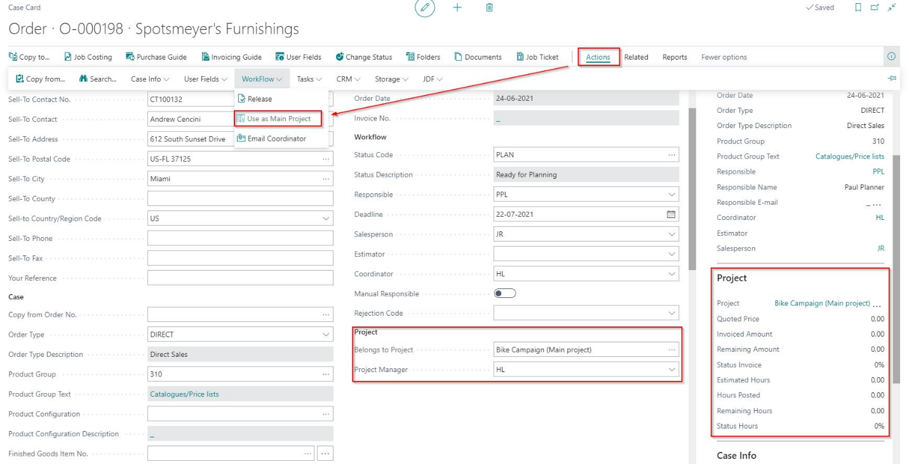
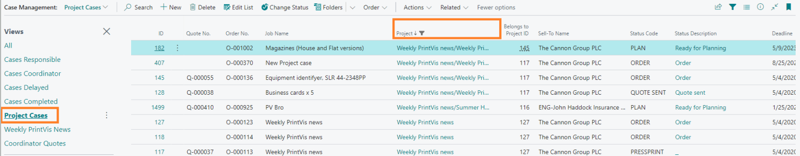
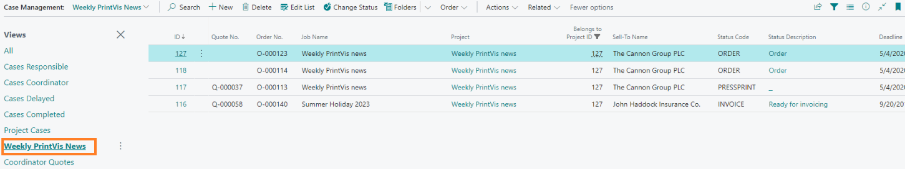
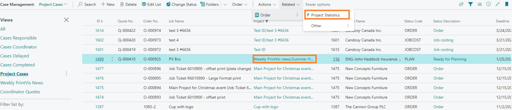
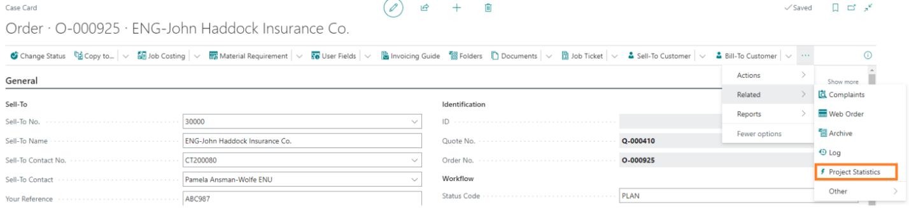
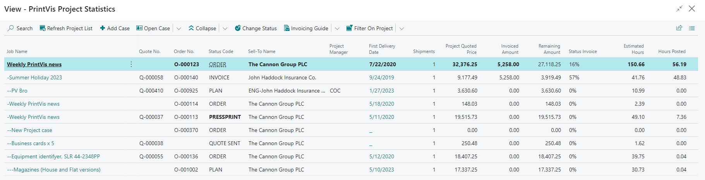

**Project Management in PrintVis**

**Introduction**

No matter what type of print business you run, you know that many jobs
are not as simple as ‘quote, print, ship, invoice – done.’

Printers and other related companies, such as design agencies, can
easily spend an entire year on a single campaign - consuming hours,
materials and other resources from multiple departments for the duration
of the order.

With this in mind, PrintVis gives you Project Management - a simple and
powerful way to oversee every facet of those elaborate projects that may
include extended consultancy hours, recurring design work, multiple
production runs and shipments – all the underlying elements of a large
campaign which needs to be properly managed for a successful business.

This document explains how to use the new PrintVis Project Management
functionality. Currently, no additional setup is required when using
this in Microsoft Dynamics 365 Business Central.

Projects are meant to be used with a single job on the case. The
individual jobs would be created as a single case that is then assigned
to a project case. 

The main case would sum up the values from each children case. Example
Quoted Price would sum up all the Quoted Price for the children cases to
give a total quoted price for the entire project.

Projects are meant to replace the need to have multiple jobs on a single
case.

**Case Card**

Fields and Buttons for Project Management on the Case Card

-   There is no setup needed to begin using Project Management.

-   On an order, insert the ID number on the field «Belongs to Project»

            If you use the same ID, so that the project belongs to
itself, then it will become a main project and marked in** bold**.

-   Also, the button in the ribbon and “action” can be used for creating
    a case to a main project.

-   A Project Manager can be designated in the field Project Manager
    (Have to be marked in PV User setup with Coordinator).

-   It can be shown in the Project Management list.

The Project name will be taken from "Job Name" on this Case Card.

To the right you will be able to see the fact box with the primary
information about the project.

**Invoicing Project Orders**

Basically you must decide with your customer how to invoice project
orders. There is by default no specific development done for Project
Orders for Invoicing, which leaves your options to:

-   Invoice each case under the project individually

-   Build invoices (drafts) for each case under the Project, but then
    use the combined invoicing features to combine the drafts into a
    single invoice

-   Custom build a 'special function' to be added to a specific
    'PrintVis Invoice Template' and have this function for example build
    up a single invoice combining all detailed cases under the project -
    or to automatically build invoices as per the two options above.

**Project Management**

Project Management Overview

Project Management cases are handled from the case management list like
any other PrintVis case. 

-   There is a View that can be selected called Project Cases which
    filters to only cases that are part of a project. 

-   There is also a field that can be shown on the case list called
    Project which will display the name of the project case. This field
    can be sorted to put all project cases together or filtered to look
    at only a single project.

-   Those working with projects might find it useful to create their own
    saved views for the different projects they are managing

**Project Statistics**

From the case list it is possible to click the Project Name or in the
menu click the Project Statistics action to access the statistics for
the entire project.

It is also possible to access the project statistics page from the case
card.

The project statistics page shows all of the cases connected to the
project with information such as Invoiced Amount, Remaining Amount,
Estimated Hours, Posted Hours, etc.

