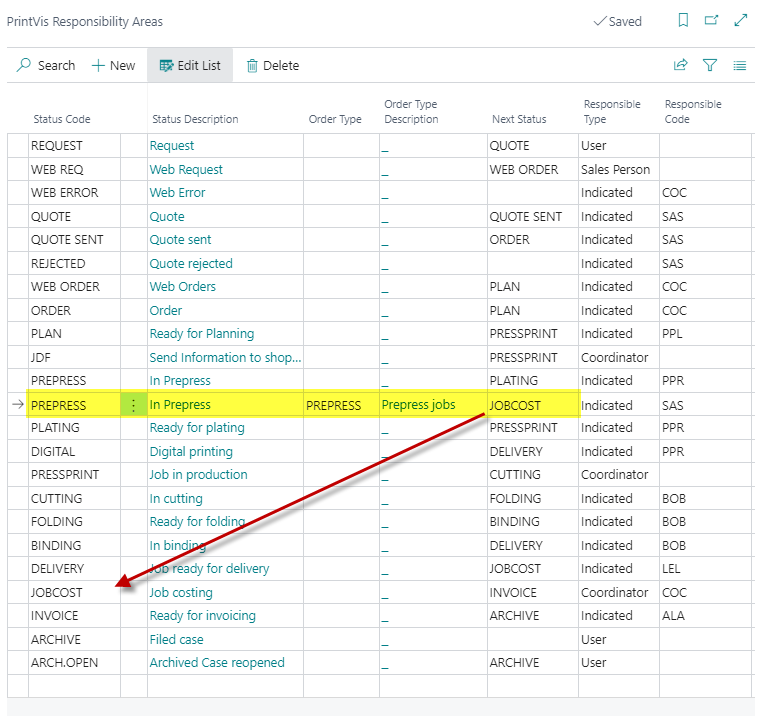

# Responsibility Areas

## Summary

Via this window, you set up and maintain the company case flow.
 Generally, this function is used for designating who becomes currently
responsible for a case when the case reaches a given Status Code, and
for defining Next status in the production process (Next status is
suggested in Graphic Case Card).

The setup of Responsibility Areas is a very general option in relation
to controlling case sequence and distributing the responsibility for the
case per Status Code.

## Setup

*The **Responsibility Areas Setup** can be found by searching
Responsibility Areas*

<table>
<colgroup>
<col style="width: 13%" />
<col style="width: 86%" />
</colgroup>
<thead>
<tr>
<th><strong>Field</strong></th>
<th><strong>Description</strong></th>
</tr>
</thead>
<tbody>
<tr>
<th>Status Code</th>
<td>By a look-up, retrieve the desired Status Code from the list.</td>
</tr>
<tr>
<th>Status Description</th>
<td>This field relates to "Status Code".  The field is not
editable.</td>
</tr>
<tr>
<th>Next Status</th>
<td>By a look-up in the field, open the list of Status Codes.  Here, you
choose which status must be suggested as Next status in a standard
sequence.</td>
</tr>
<tr>
<th>Order Type</th>
<td>
If you want a specific status sequence for a specific Order type,
you select the desired Order type by a look-up in the field.

Please note that the selected setup will only apply to the selected
order type.  Therefore, a set of Responsibility Areas must exist for
each Order type along with a set without Order type which the system
will choose if the order type is different than the one/those defined in
Responsibility Areas or is not filled in.
</td>
</tr>
<tr>
<th>Order Type Text</th>
<td>This field relates to "Order Type".  The field is not editable.</td>
</tr>
<tr>
<th>Customer Group</th>
<td>
If you want a specific status sequence for a specific Customer
group, you select the desired Customer group by a look-up in the
field.

Please note that the selected setup will only apply to the selected
group.  Therefore, a set of Responsibility Areas must exist for each
group along with a set without group which the system will choose if the
customer group is different than the one/those defined in Responsibility
Areas or if it is not filled in.
</td>
</tr>
<tr>
<th>Sell to No.</th>
<td>
If you want a specific status sequence for a specific Customer
no., you select the desired Customer no. by a look-up in the field.

Please note that the selected setup will only apply to the selected
customer.  Therefore, a set of Responsibility Areas must exist for each
customer along with a set without Customer no. which the system will
choose if the customer is a different one than the one/those defined in
Responsibility Areas.
</td>
</tr>
<tr>
<th>Sell to Name</th>
<td>This field relates to "Sell to No.".  The field is not
editable.</td>
</tr>
<tr>
<th>
From Date

To Date
</th>
<td>If you want a specific status sequence for specific Date, you put in
the From Date and To Date.</td>
</tr>
<tr>
<th>Responsible Type</th>
<td>
By a look-up in the field, you select which user you want to make
Current Responsible for a case when it reaches the specific status.

You have the following options:

§ Indicated - If you want to indicate a certain person (or a team) -
see the description of Responsible Codes.

§ User - The user which activates the status change for the case is
made current responsible.

§ Salesperson - The attached Salesperson from Graphic Case Card is
made responsible for the case.  New cases are "born" with the
salesperson code which is transferred from the customer card.  If a
salesperson code is not indicated, the user which creates the case is
made salesperson on the case.

§ Order planner - The attached Order Planner from Graphic Case Card
is made responsible for the case.  New cases are "born" with the order
planner which is transferred from the customer card.  If an order
planner is not indicated, the user which creates the case is made order
planner on the case.

§ Estimator - The attached Estimator from Graphic Case Card is made
responsible for the case.  New cases are "born" with the estimator which
is transferred from the customer card.
</td>
</tr>
<tr>
<th>Responsible Code</th>
<td>The field is only used if "Indicated" is selected in the Responsible
Type field.  By a look-up in the field, you open the list of Capacity
resources, find the desired resource, and press OK.  The selected person
or Team is transferred.</td>
</tr>
</tbody>
</table>

 
## Example

If a company also does prepress jobs for other companies, and the job in
the workflow will go straight to cost control and then to invoicing
after processing has been completed, the setup looks like this:

