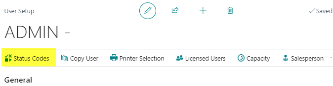
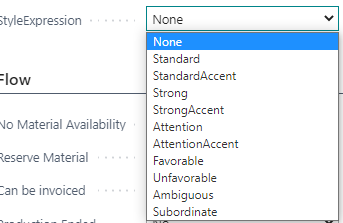
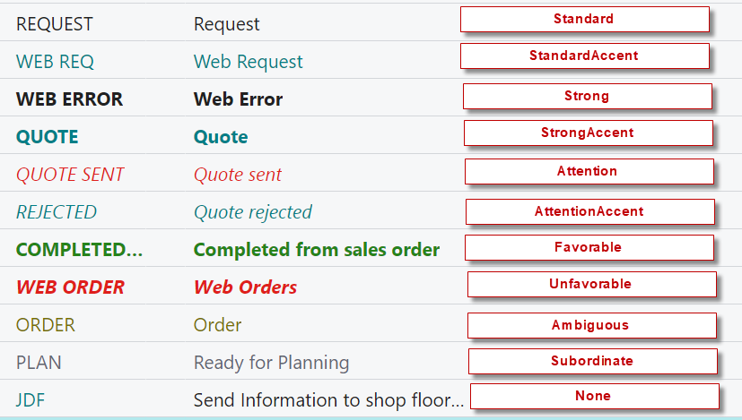
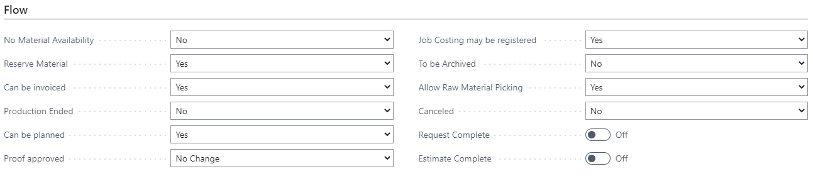
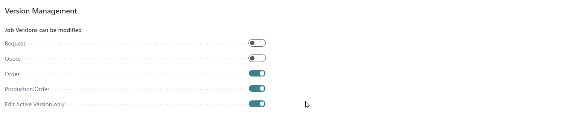
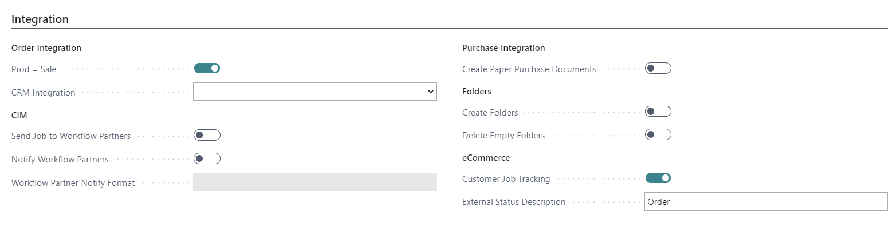
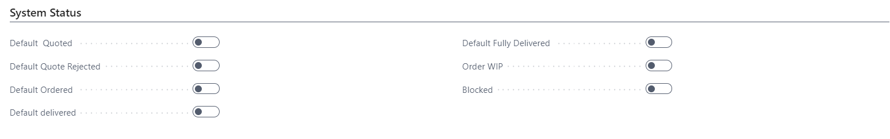
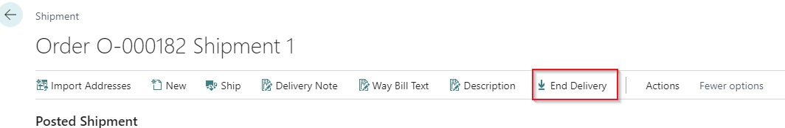
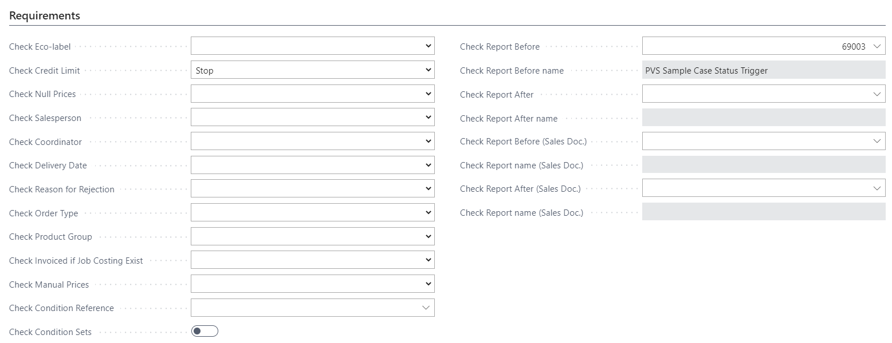

# Status Codes

## Summary

Status Codes are an integrated tool in PrintVis which directs the
workflow of a case through the company on a general level; controlling
whether, for example, you may register job costing, plan, invoice, etc.
 Also, on selected points, it controls whether a case has been created
correctly before it changes status, etc.  Naturally, it is important to
consider how you want to control individual cases when you set up the
company's status codes.  You must also consider the demands made on the
case and what a case is allowed in each individual status.

When the company's status codes have been created, you must also set up
a natural status flow and set up who is to be responsible for a case
when it reaches a given status.  This is done in the Responsibility
Areas window.

Status codes are available to all users by default, but if you want to
limit a user to only be able to change to a select few status codes,
that is possible in the menu of the PrintVis User Setup page:

## Setup

The Status Code Setup can be found by searching "PrintVis Status Codes".

General Tab

<table>
<colgroup>
<col style="width: 13%" />
<col style="width: 86%" />
</colgroup>
<thead>
<tr>
<th><strong>Field</strong></th>
<th><strong>Description</strong></th>
</tr>
</thead>
<tbody>
<tr>
<th>Code</th>
<td>Code is the identification field for the Status Code.  Length is
max. 20 characters.</td>
</tr>
<tr>
<th>Text</th>
<td>Status Code name</td>
</tr>
<tr>
<th>Description</th>
<td>A meaningful description that explains to the user what this
is.</td>
</tr>
<tr>
<th>Deadline Period</th>
<td>
It may be an advantage to control the Deadline field on the Case
card, so that when a case changes to a given status, the system must
automatically suggest a deadline which is not today.

In this field, you can set up a date formula for calculation of a new
deadline that will be calculated when changing to this status code.  For
example:

<ul>
<li>
&lt;2D&gt;: gives a deadline 2 days from today
</li>
<li>
&lt;1W&gt;: gives deadline 1 week from today
</li>
<li>
&lt;1M&gt;: gives a deadline 1 month from today
</li>
<li>
&lt;WD1&gt;: gives a deadline the next Monday (week day
#1)
</li>
<li>
&lt;WD5&gt;: gives a deadline the next Friday (week day
#5)
</li>
<li>
&lt;CM&gt;: gives a deadline the end of the current
month
</li>
</ul></td>
</tr>
<tr>
<th>Next Status</th>
<td>By a look-up in the field, you open the list of Status Codes.  Here,
you choose which status must be suggested as Next status in a standard
sequence.  You can also define this in Responsibility Areas setup.</td>
</tr>
<tr>
<th>Sorting Order</th>
<td>If you indicate a numeric sorting in this field, the Status Codes
are presented in the list within each Order status, sorted by the
entered value.</td>
</tr>
<tr>
<th>Priority</th>
<td>Here, it is possible to award a Priority to this status.  This is
used in Case Management as a filter and sorting.</td>
</tr>
<tr>
<th>Style Expression</th>
<td>This field allows for the status to appear differently in the case
list. 
Possibilities are:  
Examples: 
</td>
</tr>
<tr>
<th>Show in Case Management</th>
<td>Select this field if you want to be able to be able to view cases
with this status in the case list.  This only impacts the Matrix, which
is setup on the PrintVis User Setup page in the Timeline field (when
selecting Status Code value).</td>
</tr>
<tr>
<th>Show in production plan</th>
<td>
Select this field if cases with this status are to be presented
in the Production Plan Page.

The case will still be visible on the Planning Board and, if a start
date exists, it will be also visble in the shop floor production
plan.
</td>
</tr>
<tr>
<th>Editable</th>
<td>
2 options are available:

<ul>
<li>
Yes - The case can be edited if in this status
</li>
<li>
No - The case and all related data (Calculation, Description/
User Fields/Planning) cannot be edited (all Shop Floor related
functions, post time, change status, ..., works)
</li>
</ul></td>
</tr>
<tr>
<th>System Status</th>
<td>
Please note, during creation, a case cannot change to a lower
Order status.  This means you cannot change from a code where Order
status is Order to a code where Order status is Quote.

System Status can be one of the following options:

<table>
<colgroup>
<col style="width: 17%" />
<col style="width: 82%" />
</colgroup>
<thead>
<tr>
<th><strong>Option</strong></th>
<th><strong>Description</strong></th>
</tr>
</thead>
<tbody>
<tr>
<th>Request</th>
<td>This is typically the first status of a case when it is created on
the basis of a customer inquiry.  At this point, the Graphic Order card
only has an ID number for identification.  Typical Status Codes with
status Request may be Request, is Calculated, Calculation
completed.</td>
</tr>
<tr>
<th>Quote</th>
<td>
The case has now been calculated and priced and a quote is/has
been sent to the customer.  The case has now been assigned a quote
number.

On the Graphic Case card, Request lines automatically become Quote
lines when the case reaches this status.  Typical Status codes with
status Quote may be Quote must be submitted, Quote sent, Quote for
follow-up, Quote rejected.
</td>
</tr>
<tr>
<th>Order</th>
<td>
The customer has now contacted the company and made an order.
 The case has now been assigned an Order number.

On the Graphic Case card, there are now one or more quote lines and
one Order line so order history may be preserved.  Typically, you create
a number of Status Codes with the status Order to control the production
flow.  These may be DTP, PrePress, CTP, Print, Finishing, Shipment, Job
costing, Ready for invoicing, and Archive, or Cancelled.

When a case reaches an Order status, the Order DateTime on the case
is filled in.
</td>
</tr>
<tr>
<th>Production Order</th>
<td>
This status is typically used after the order confirmation with
the customer (in status "Order") and modifications must be made by a
planner and the version for the order confirmation should be kept. 
If you want an order version where, for example, you may switch printing
machine, paper, control sub-contracting, etc., without correcting the
version which constitutes the actual order (if, for example, this is
used as basis of invoicing), you may create production order
versions. 
On the Case card, a new version is created, and you could have up to 3
job lines:

<ul>
<li>
1 with status Request or Quote
</li>
<li>
1 with status Order
</li>
<li>
1 with status Production order
</li>
</ul></td>
</tr>
</tbody>
</table></td>
</tr>
</tbody>
</table>

**Please note:** PrintVis requires a status code to start from in case
there is some automation setup or from a role center a case of type
order should be created.

Please make sure to **always **have a status code in "Request" status,
with the lowest sorting number.  You don't have to use that for your
workflow or select it in a setup anywhere, but it must exist!
 Otherwise, a case could be created directly in Order status from a
quote number that is pulled as well.

Flow Tab

In the Flow tab, you set exactly what a case may and may not do in the
status in question.  You have a number of options and for each one you
may choose:

<table>
<colgroup>
<col style="width: 11%" />
<col style="width: 88%" />
</colgroup>
<thead>
<tr>
<th><strong>Option</strong></th>
<th><strong>Description</strong></th>
</tr>
</thead>
<tbody>
<tr>
<th>No Change</th>
<td>
This is the system default setting for all points in connection
with the creation of new Status codes.

The choice indicates that no changes have occurred compared to the
status which a case comes from.  Thus, it is important to select Yes or
No precisely for all points on all Status Codes which a case may start
in or move directly to.
</td>
</tr>
<tr>
<th>Yes</th>
<td>Means that you may do what the heading indicates - see below.</td>
</tr>
<tr>
<th>No</th>
<td>Means that you may not do what the heading indicates - see
below.</td>
</tr>
</tbody>
</table>

<table>
<colgroup>
<col style="width: 21%" />
<col style="width: 78%" />
</colgroup>
<thead>
<tr>
<th><strong>Field</strong></th>
<th><strong>Description</strong></th>
</tr>
</thead>
<tbody>
<tr>
<th>Remove Material Requirements</th>
<td>
The field is used to control exactly when material may be
purchased for an order.

Yes - material requirements do not appear in purchase management.

No - materials are available for purchase.

As the default setting, the purchase of materials takes place at the
time when a case reaches Order status but, via this option, you may
adjust when the purchase may be made.
</td>
</tr>
<tr>
<th>Reserve Material</th>
<td>Enter when materials for an order shall be reserved in the system.
 At default, this will automatically happen when the order status
reaches “Order” but by selecting “No” in this field, you can choose to
wait until the case reaches another status.</td>
</tr>
<tr>
<th>Can be invoiced</th>
<td>You may not post sales invoices for the Order until Yes has been
selected.  Typically, you will want to make sure that the Job costing
has been carried out and that status has changed to, for example, "Ready
for invoicing" before you allow invoicing. 
 
Some companies also need to be able to invoice on account and they often
set up a special Status Code for this purpose.</td>
</tr>
<tr>
<th>Production Ended</th>
<td>
Normally, you select Yes to whether an Order is ended when the
case reaches a status where the Production is completed.  All planning
units from this job now are marked as completed.  Posting consumption on
this job is still allowed.

If you have selected Automatic Job costing in the setup, this is done
when a case is marked Completed.

When a case reaches a status with Production Ended = Yes, the
Production Completed DateTime on the case is filled in.
</td>
</tr>
<tr>
<th>Can be planned</th>
<td>Not until the case reaches a status marked Yes, the system creates
Planning units for an Order.</td>
</tr>
<tr>
<th>Proof approved</th>
<td>This is a special function which is used only in connection with
JDF.  A Status Code with selected YES must be assigned to a planning
unit, indicating at such status, proof is automatically regarded as
approved by the customer.  (See also JDF Setup)</td>
</tr>
<tr>
<th>Job Costing may be registered</th>
<td>If you select Yes, you may perform job costing for an Order.
 Typically, you may not perform job costing until a case reaches Order
status Order.</td>
</tr>
<tr>
<th>To be Archived</th>
<td>When a case is terminated and invoiced, you typically want it to be
transferred to the case archive.  If you select Yes in this field, the
order is filed and if nothing else is set up, the order receives a
Statistics date when it reaches a status where it is filed.</td>
</tr>
<tr>
<th>Allow raw material picking</th>
<td>If you select Yes, items may be released from the inventory for an
Order.  Often raw material pick is not possible until a case reaches the
Status code Print as only paper must be released from the raw material
inventory.</td>
</tr>
<tr>
<th>Canceled</th>
<td>
Sometimes an Order is cancelled.  To be able to create statistics
on how many cases are cancelled, many choose to create an individual
Status Code for this purpose.

In connection with this status, it may be a good idea also to set up
a check of whether job costing but not invoicing has been performed on
the order - see the section on Requirements.
</td>
</tr>
<tr>
<th>Request Complete</th>
<td>When a status code with this checked is reached, the Request
Completed DateTime value is filled in on the case.</td>
</tr>
<tr>
<th>Estimate Complete</th>
<td>When a status code with this checked is reached, the Estimate
Completed DateTime value is filled in on the case.</td>
</tr>
<tr>
<th>Flow Data</th>
<td></td>
</tr>
<tr>
<th>
Department

Cost Center
</th>
<td>By selecting either a Department or a Cost center (or a combination
of both), you may choose that all Orders with this Status Code are to be
displayed in the Production list of employees logged into the selected
department and/or the selected Cost center.</td>
</tr>
<tr>
<th>Auto Job Costing</th>
<td>If this field is ticked, the system will automatically flush the
costs for any time and material in the estimation (calculation lines)
which have a Unit of Measure set up for back flushing. 
The system will look at each line, examine the Unit of Measure, and, if
eligible, create a job costing line with the estimated quantity and the
cost &amp; pricing as per the Unit of Measure setup.</td>
</tr>
<tr>
<th>Create Sales Invoice</th>
<td>Automatically create the sales invoice when the order reaches this
status.</td>
</tr>
</tbody>
</table>

Version Management Tab

Via the Version management tab, you may use Status Codes to control
which job versions may be edited when a Case reaches the status in
question.

If a field is selected, the version in question may be edited.

It is often efficient to establish that Request and Quote version may
not be edited when a case has become an Order.  Or that, for example,
Request, Quote and Order versions may not be edited when a case has
become a Production order.

Finally, you may choose that only active versions may be edited.  This
may prove a great advantage, for example, in the quote stage where there
may be different quote job items.  Thus, you can make sure you are
working on the correct case, so you do not overwrite other versions of
the quote by mistake.

Integration tab

<table>
<colgroup>
<col style="width: 18%" />
<col style="width: 81%" />
</colgroup>
<thead>
<tr>
<th><strong>Field</strong></th>
<th><strong>Description</strong></th>
</tr>
</thead>
<tbody>
<tr>
<th>Prod = Sale</th>
<td>In the Sales order integration section, you may select the field to
ensure that if a sales order changes status to the indicated Status
Code, this automatically entails that the corresponding Production order
gets the same status or vice versa.  This means that the field is only
used if you actually use Sales/Production order integration.</td>
</tr>
<tr>
<th>CRM integration</th>
<td>Here, you can select an Interaction Template.  This is the
connection to Relationship Management from Standard 365 Business
Central.</td>
</tr>
<tr>
<th>CIM</th>
<td>Send Job to Workflow partners, Notify Workflow Partners, Workflow
Partner Notify Format</td>
</tr>
<tr>
<th>Purchase Integration</th>
<td>Create Paper Purchase Documents</td>
</tr>
<tr>
<th>Create Folders</th>
<td>The system creates empty Case Folders based on PV Folder Group
Setup.</td>
</tr>
<tr>
<th>Delete Empty Folders</th>
<td>
The system deletes <strong>empty </strong>Case Folders at this
status.

<strong>Note</strong>: If you have the "Delete Empty Folder" function
on a Status Code which is not ARCHIVE and then click on open "Folders"
at the Case Card, the Folders will be recreated.

Only on status ARCHIVE (this function must be on here) will the
deleted folders not be recreated.
</td>
</tr>
<tr>
<th>Document Management</th>
<td>
In the Document Management section, you may use a look-up in the
Standard document field to select that the system must automatically
generate the selected document when a case is assigned this Status Code.
 The document is not printed but is created and ready to open and
print.

In the Standard document name field, you may, if necessary, set up a
standard document name based on the same principles as in the document
setup window in the document management tool.
</td>
</tr>
<tr>
<th>eCommerce</th>
<td>Customer job tracking, External Status Description</td>
</tr>
</tbody>
</table>

System Status Tab

<table>
<colgroup>
<col style="width: 10%" />
<col style="width: 89%" />
</colgroup>
<thead>
<tr>
<th><strong>Field</strong></th>
<th><strong>Description</strong></th>
</tr>
</thead>
<tbody>
<tr>
<th>Default Quoted</th>
<td>
If you print a report, set up under the Quote section in the
Report setup, from Graphic Production Order, status changes to this
Status code when the report has been created.

In Graphic case card/the Info tab, you checkmark the field Quote
printed on when you print and this checkmark may move status forward to
this Status code.
</td>
</tr>
<tr>
<th>Default Quote Rejected</th>
<td>When using BC CRM Opportunities, this is the status code that is
used when marking an opportunity as lost.</td>
</tr>
<tr>
<th>Default Ordered</th>
<td>When using BC CRM Opportunities, this is the status code that is
used when marking an opportunity as won.</td>
</tr>
<tr>
<th>Default delivered</th>
<td>When all shipments for a Graphic Production Order are marked
shipped, the order is moved to this status code.</td>
</tr>
<tr>
<th>Default fully delivered</th>
<td>
If this is checked on any status, the End Delivery action appears
on the shipment card.  Using the End Delivery action to mark the
shipment as shipped completes all shipments and moves the case to this
status code.

</td>
</tr>
<tr>
<th>Default Invoiced</th>
<td>When an invoice is posted on the Graphic Production Order, the order
is moved to this Status Code.  It is most often used for Status Code
Archive as a case is most often to be filed when it has been
invoiced.</td>
</tr>
<tr>
<th>Order WIP</th>
<td>
This function is only used in connection with system start-up.
 By selecting the field of a specific status code (with Order status
Order), you may allow the users to assign the old order number to these
orders when they create orders WIP from a previous system.

The checkmark in this field should be removed immediately when all
orders WIP have been created and the status code should be
blocked.
</td>
</tr>
<tr>
<th>Blocked</th>
<td>If you want a Status Code to no longer be available, select this
field.  Naturally, you may still work with cases which currently have
the status in question, but the Status Code cannot be assigned to new
cases.</td>
</tr>
</tbody>
</table>

Requirements Tab

Via the requirements tab you may set up a number of check points per
status code.  Common for all points is that the check is performed in
connection with a case changing to the selected Status Code.  In
connection with each option, you may make one of 3 choices:

<table>
<colgroup>
<col style="width: 10%" />
<col style="width: 89%" />
</colgroup>
<thead>
<tr>
<th><strong>Option</strong></th>
<th><strong>Description</strong></th>
</tr>
</thead>
<tbody>
<tr>
<th>Blank</th>
<td>Is regarded as not filled in - so no check is performed.</td>
</tr>
<tr>
<th>Warning</th>
<td>If the desired check is not filled in, the user is warned about what
needs to be filled in, but the case changes status to the selected
Status Code.</td>
</tr>
<tr>
<th>Stop</th>
<td>If the desired check is not filled in, a message is sent to the user
about what needs to be filled in, and the case stays in the present
status.</td>
</tr>
</tbody>
</table>

<table>
<colgroup>
<col style="width: 19%" />
<col style="width: 80%" />
</colgroup>
<thead>
<tr>
<th><strong>Field</strong></th>
<th><strong>Description</strong></th>
</tr>
</thead>
<tbody>
<tr>
<th>Check Eco label</th>
<td>The system checks whether the Eco-label field on Case card is filled
in.</td>
</tr>
<tr>
<th>Check Credit Limit</th>
<td>The system checks whether the customer's credit limit has been
exceeded.  If the Credit limit field is not filled in on the customer
card, this is regarded as empty and the check is not activated.</td>
</tr>
<tr>
<th>Check Null Prices</th>
<td>
The system checks whether there are any calculation details where
quantity or hours are filled in but where the Cost and/or Sales prices
are priced at 0.00.

Please note: If the cost/prices have been manually set to 0.00, this
check is not carried out! 
</td>
</tr>
<tr>
<th>Check Salesperson</th>
<td>The system checks whether the Salesperson code field on Case card is
filled in.</td>
</tr>
<tr>
<th>Check Coordinator</th>
<td>The system checks whether the Order planner field on Case card is
filled in.</td>
</tr>
<tr>
<th>Check Delivery Date</th>
<td>
The system checks whether the Requested Delivery Date field on
Case card is filled in.

The field is either filled in on the Job line or via the Job
window.
</td>
</tr>
<tr>
<th>Check Reason for Rejection</th>
<td>The system checks whether the Rejection Code field on Case card is
filled in.  It is typically used for the Quote rejected or Cancelled
Order status codes where it may be interesting to find out why you did
not get the order or why it was cancelled.</td>
</tr>
<tr>
<th>Check Order Type</th>
<td>The system checks whether the Order type field on Case card is
filled in.</td>
</tr>
<tr>
<th>Check Product Group</th>
<td>The system checks whether the Product group field on Case card is
filled in.</td>
</tr>
<tr>
<th>Check Invoiced if Job Costing Exist</th>
<td>
The system checks whether a Sales invoice has been posted if
there is job costing on the case.

This is meant to ensure that you do not File or Cancel cases where
there is job costing without this job costing being invoiced.
</td>
</tr>
<tr>
<th>Check Manual Prices</th>
<td>
The system checks whether there are calculation details where the
Cost or Sales price has been overridden manually.

Only use this check if the system is set up to automatic calculation
throughout, also in the case of any sub-contracting.
</td>
</tr>
<tr>
<th>Check Condition Reference</th>
<td></td>
</tr>
<tr>
<th>Check Condition Sets</th>
<td>As an extra check that certain things are in order, it is possible
to set conditions for certain parts of the estimate.  The Status Code
can then be set to run through these conditions and throw an error to
the user if these are not met or are violated.  There is a separate
whitepaper available regarding the condition setup. 
The field "Check Condition Reference" will enable you to point out just
1 of the condition sets to be checked at the status code change.  If
this field is blank, all condition sets will be checked. 
This function can serve as an alternative to the Status Code report for
estimation checking purposes.</td>
</tr>
<tr>
<th>
Report Before

Report After

Report Before (Sales Doc.)

Report After (Sales Doc.)
</th>
<td>
If the above-mentioned check options do not meet a specific need
of your company, it is possible to have a report developed which is
activated when the status in question is reached.

As such, there are practically no limits as to what may be checked
via a report but, of course, it is necessary to have a clear definition
to be able to develop the report for the company.
</td>
</tr>
</tbody>
</table>

## User Specific Status Codes

PrintVis provides the possibility to limit status codes per user.  On
each PrintVis User, a set of status codes can be selected from the
existing status codes.  With such setup, it is only possible for the
given user to work on a limited workflow and the user cannot change to
status codes other than the ones selected in the PrintVis user setup.

This could be used if a user should not be able to create orders or
quotes. For more details, check the article about the <a href='https://learn.printvis.com/Legacy/General/UserSetup/'>PrintVis Users</a>
