# Using Power Automate with PrintVis folders 

**Note: For cloud customers with Microsoft 365 account**

**Customer Request**

Have you ever had a customer ask if a template file can be automatically
added to a PrintVis folder when the folder is created?

For example: We have a certification checklist that is needed for all of
John Haddock, Inc. jobs. Is it possible to have this checklist template
added to a Certification folder when a case becomes an order?

**Accomplishing the Request**

While there is no specific way within PrintVis or Business Central to
accomplish this request, with the use of Power Automate you can
accomplish this for your customer.

First, we are going to create a new Folder Group for John Haddock:

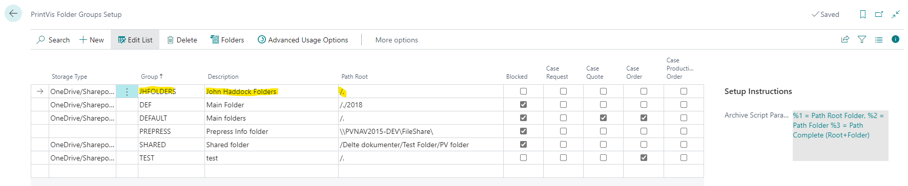

Advanced Usage Options:

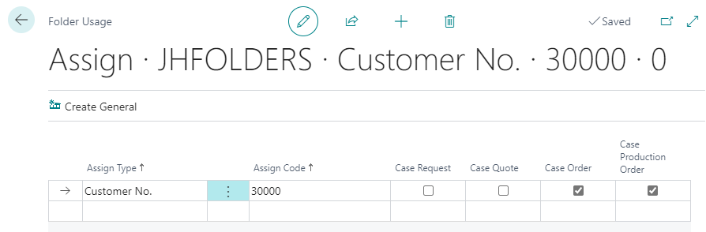

Folders:

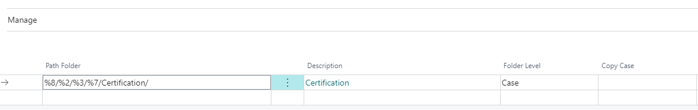

Power Automate can be found by clicking the "waffle" dots in the upper
left corner and selecting Power Automate.

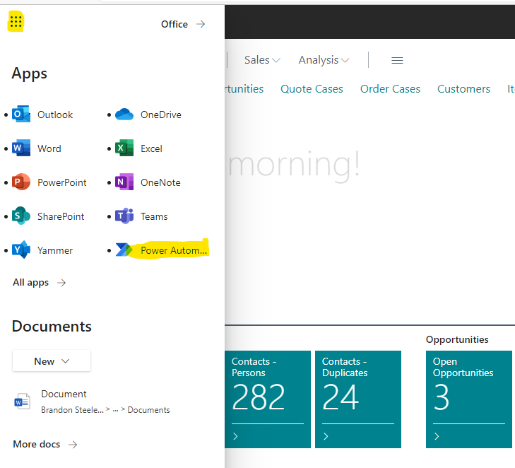

Select My flows:

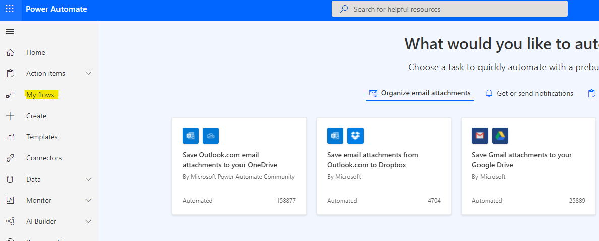

Select New flow, then Automated cloud flow:

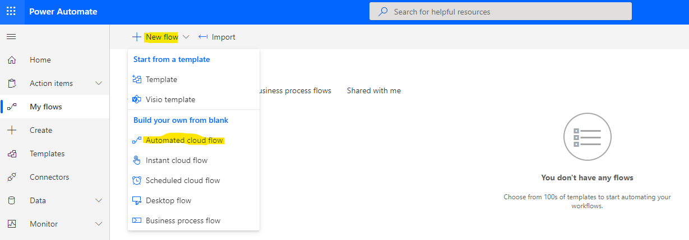

Search “When a file is created (properties)” in the Choose your flow’s
trigger field and select "When a file is created (properties only)
SharePoint," then click the "Create" button.

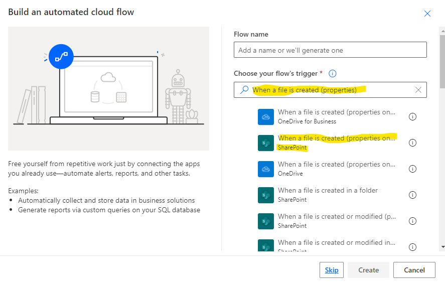

In the Site Address field, select your SharePoint address. In the
Library Name field, select the Documents Drive from your Cloud Storage
Setup page. And in the Folder field, select the Base Folder from the
Cloud Storage Setup page.

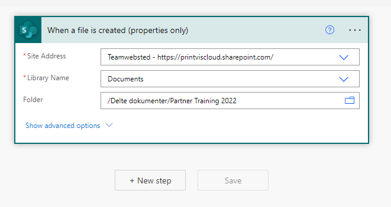

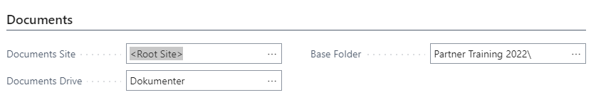

Select the New step button and chose the Condition Control:

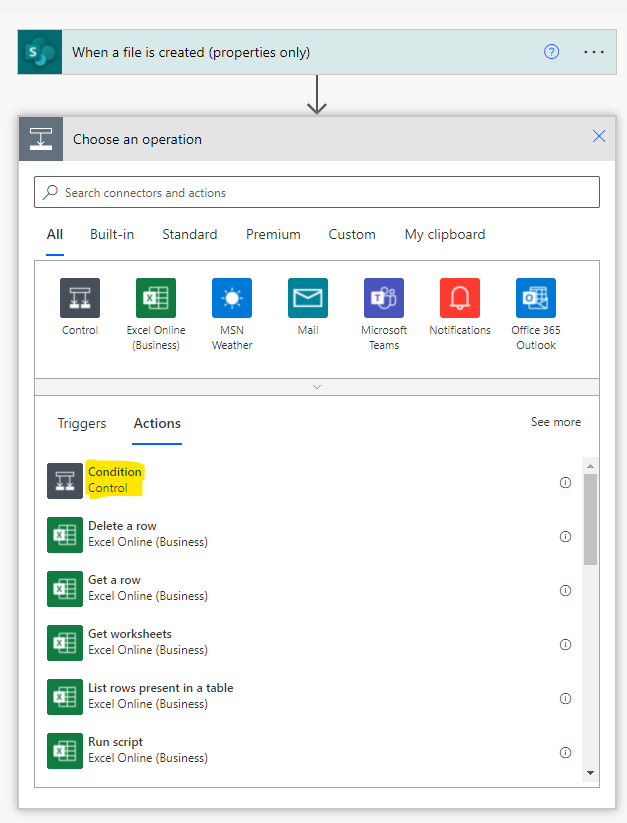

In the Condition filter, choose "IsFolder" dynamic content is equal to
true, and Add Row with Name dynamic content is equal to “Certification”
or the name of the folder where you want the file located.

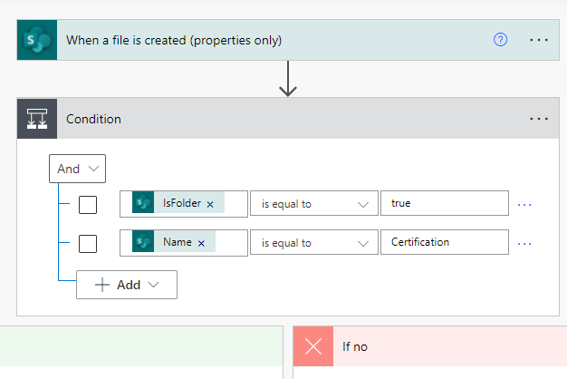

In the "If Yes" section, click Add Action and select Copy file:

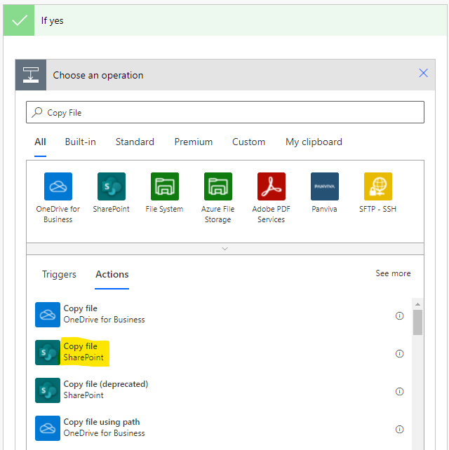

In the Copy file box, fill in the Current Site Address as the SharePoint
location from where to copy the file and the File to Copy as the exact
location where the file resides. In the Destination Site Address, enter
the Document Site from the Cloud Storage Setup page, and in Destination
Folder enter the Full Path dynamic content. In the "If another file" is
already there, select Replace, Copy with a new name, or Fail this
action.

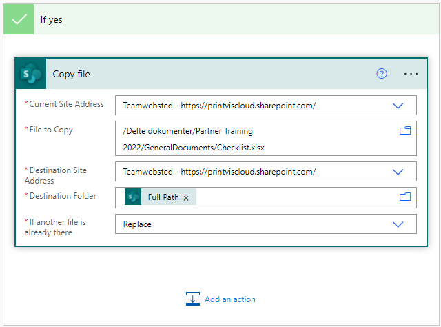

Click Save.

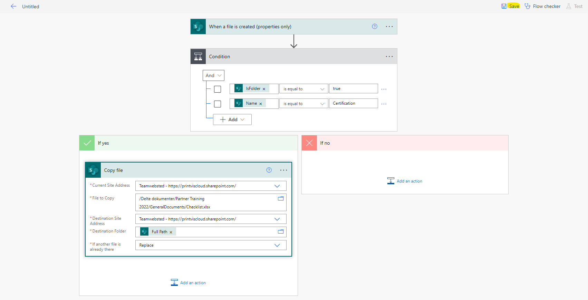

Once this is completed, whenever the Certification folder is created,
the Checklist.xlsx file will automatically be added to that case folder:

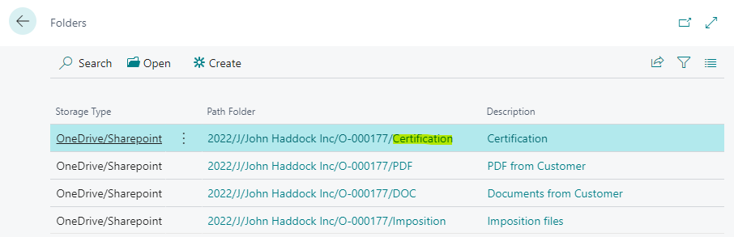

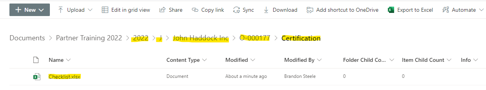
