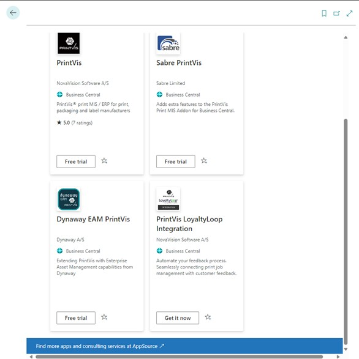
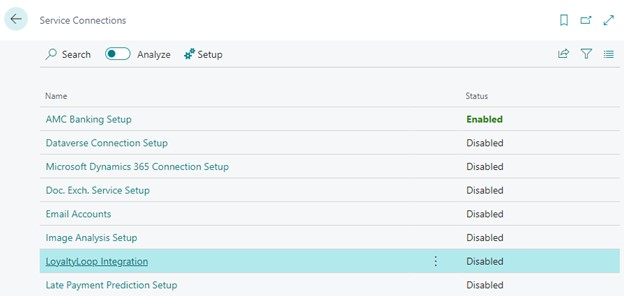
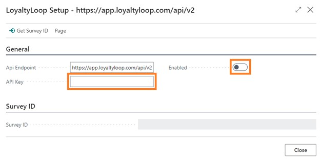
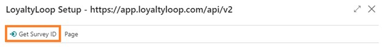
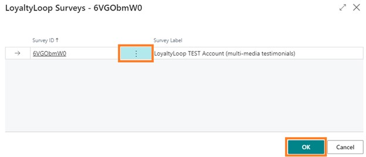
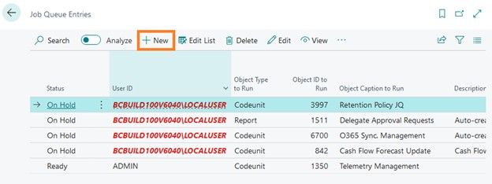
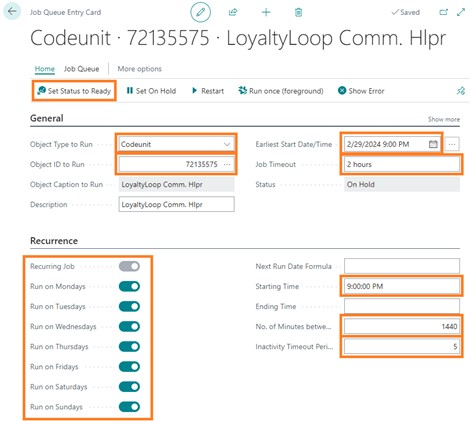
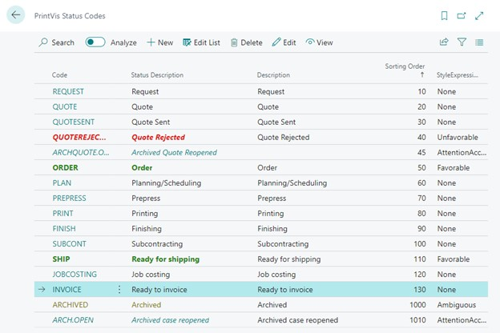
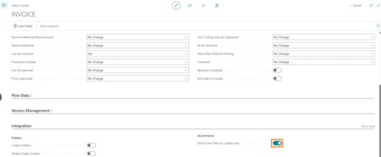

## Connect to the LoyaltyLoop API

These setup steps will make the overall connection to LoyaltyLoop for sending PrintVis data to LoyaltyLoop and getting LoyaltyLoop response data back into PrintVis.

1. **Install PrintVis LoyaltyLoop Integration app** from the Extension Marketplace.

 
2. **Search for the Service Connections** page and select **LoyaltyLoop Integration**.

 
3. **Enter your API key** and click the **Enabled checkbox**.

 
4. Click **Get Survey ID** to display a list of surveys you have set up at LoyaltyLoop.

5. **Select the survey** you want to use when sending new orders to LoyaltyLoop and click **OK**.

 
## Schedule Response Update into PrintVis

If you want to see LoyaltyLoop response data from the customer or contact pages, you will need to set up a job queue and schedule how often you want PrintVis to get updated LoyaltyLoop information.

1. **Search Job Queues Entries** and click **New**.

 
2. **Complete the highlighted fields** and click **Set Status to Ready**. In the below example, PrintVis will receive updated LoyaltyLoop responses at 9:00 pm every day starting February 29, 2024.

 
## Set Status Code that will send data to LoyaltyLoop

To send PrintVis case (order) information to LoyaltyLoop, you will need to set up at which status you want the data sent. 

1. **Search Status Codes** and select the **Status Code** you want to use to send data to LoyaltyLoop.

 
2. In the **Integration section**, click the **Send Case Data to LoyaltyLoop checkbox**.

