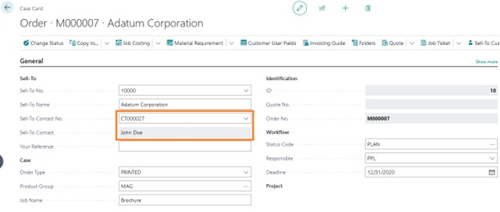
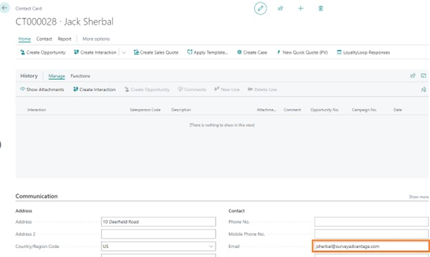
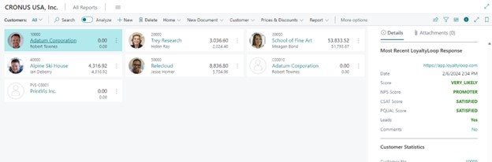
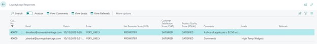
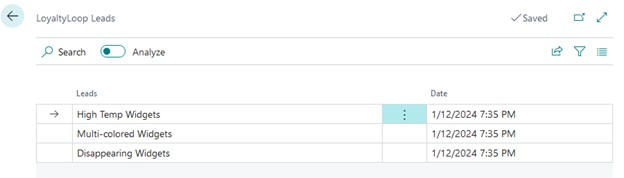

## Sending data to LoyaltyLoop

The LoyaltyLoop integration will use the email address from the Sell-To Contact when sending data to LoyaltyLoop. If the case does not have a contact or the contact email is blank sending to LoyaltyLoop will be skipped.

The email address is setup in the communication section of the contact.

Once the case moves to the Status Code with the LoyaltyLoop checkbox checked, the following case data will automatically be sent to LoyaltyLoop:

* Sell-to contact email
* Sell-to contact name
* Sell-to contact organizational level
* Sell-to contact company name
* Sell-to contact address
* Sell-to contact phone
* Sell-to contact mobile phone
* Send date/time
* Case coordinator
* Case salesperson
* Case sell-to number
* Case order number
* Case order type
* Case job name
* Case your reference (PO)
* Sum of all active order job lines quote price

## Viewing responses within PrintVis:

LoyaltyLoop response data will be sent back into PrintVis based on the frequency setup within the job queue. 

This data can be found on the Customer list, Customer card, Contact list, Contact card, PrintVis Case list, and PrintVis Case card in the factbox. The Contact locations are responses based on the specific email of the contact and the Customer and PrintVis Case locations are based on all the contact email addresses for the customer.

Clicking on any of the scores will bring you to the detailed responses for that customer. Clicking on Leads or Comments from the factbox will bring up the list of leads or comments for the most recent response.

If any comments, leads, or referrals were completed in the response, the first of those values will be displayed on scores response list and any additional entries can be viewed by clicking one of the “View” actions in the menu.

