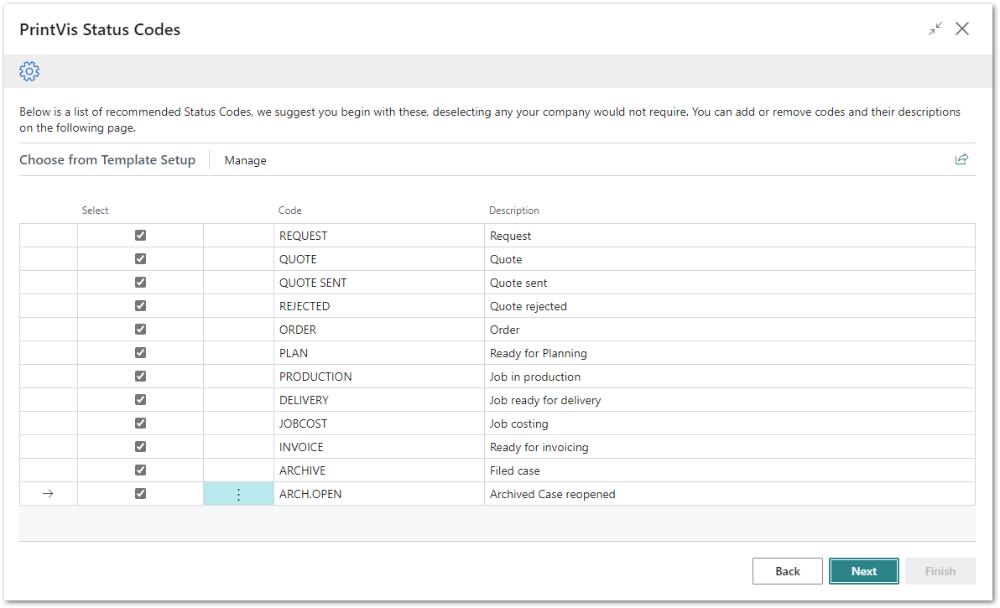

# PrintVis Onboarding – Case Management – Status Codes

This documentation is a supporting manual on how to use the PrintVis
Onboarding Setup. It describes the required setup steps for this module.

# PrintVis Status Codes Setup

Click on “Status Codes” to get started.

The “Welcome” screen will be displayed. Please read the instructions and
hit the “Next” button when you are ready to start.

Please note:  
Plan enough time to be able to finish a full step for each setup. This
may require 5-10 minutes or more.

## Building a set of suggested PrintVis Status Codes

After clicking on “Status Codes” the message below is displayed while
data is imported.

After the import is completed, the list below is displayed.

This is a list of typical Status codes from a request of a prospect or
existing customer. It includes the quoting and production phase until
the order is completed and can be archived.

Status Codes are an integrated tool in PrintVis which directs the
workflow of a job through the company on a general level. It indicates
the current step the job is in. For example, whether it is in
estimating, quoting, printing or shipping, the status would change for
each respectively. Also, on selected points it controls whether a case
has been created with all required data, before it changes status and
could even look for milestones on the case.

Naturally it is important that you consider how you want to control
individual cases or jobs when you set up your company's status codes.
You must consider the requirements made on the case and what is allowed
in each individual status.

## Create your own Status Codes

The list displayed is created from reference data. You can select the
lines that look reasonable for you and change or translate the Status
Code and Description if desired.

Because there is setup behind each code, please use the Status Codes
which have a similar meaning. For example, if you rename “ORDER” into
“QUOTE” it will still create an order and not a quote.

By default, all the standard Status Codes are selected to be imported
into the system. If you do not have a preferred list of Status Codes or
are unsure how those will be used, we recommend you keep the list as it
is.

In the next step you can add additional Status Codes if you are missing
any.

<table>
<colgroup>
<col style="width: 18%" />
<col style="width: 81%" />
</colgroup>
<thead>
<tr>
<th><strong>Field</strong></th>
<th><strong>Description</strong></th>
</tr>
</thead>
<tbody>
<tr>
<th>Select</th>
<td>
The selected line is indicated with a check box. You can disable
the line if you do not want to create it in the setup.

At the top of the page you will find the actions 'Deselect All' and
'Select All'.
</td>
</tr>
<tr>
<th>Status Code</th>
<td>The Code is simply for quick entry on a job. You can change the code
to something that fits with your company.</td>
</tr>
<tr>
<th>Description</th>
<td>This is a full description. You can change the description for the
current line if required.</td>
</tr>
</tbody>
</table>

When the company's status codes have been created, you must also set up
a natural status flow using a *sorting order*, as well as set up who is
to be responsible for a case when it reaches a given status. You will
come to this later in the setup step for the PrintVis Case Management
module.

Hit “Next” when your list is ready to be created.

## Final List and Additional Status Codes 

On this screen there are 3 options:

1.  You can change the sorting of the list.

    -   This may be required if you have added new Status Codes.

2.  You can delete existing lines.

    -   Hit the 3 dots next to the Code column and select “Delete Line”.

3.  Use the button “Add Status Code” at the bottom of the page for the
    ability to create additional codes.

### Adding Status Codes

After you have clicked the button “Add Status Code” you can add your own
codes if any are missing from your workflow. It’s a good idea to keep it
simple to begin with, as more Status Codes can be set up later.

Enter the data for the additional status code.

<table>
<colgroup>
<col style="width: 24%" />
<col style="width: 75%" />
</colgroup>
<thead>
<tr>
<th><strong>Field</strong></th>
<th><strong>Description</strong></th>
</tr>
</thead>
<tbody>
<tr>
<th>Code</th>
<td>Enter a new code</td>
</tr>
<tr>
<th>Text</th>
<td>Enter a description for your new status code</td>
</tr>
<tr>
<th>Status</th>
<td>
With this setup you can set if the new status code is:

<ul>
<li>
Request

<ul>
<li>
No quote number is created, not an order yet.
</li>
</ul></li>
<li>
Quote

<ul>
<li>
A quote number can be created, not an order yet.
</li>
</ul></li>
<li>
Order

<ul>
<li>
An order number can be created, and the status is part of the
flow after an order is confirmed.
</li>
</ul></li>
<li>
Production Order

<ul>
<li>
This is a special status to separate confirmed orders from
production estimates.
</li>
<li>
Recommended for later use.
</li>
</ul></li>
</ul></td>
</tr>
<tr>
<th>Sorting Order</th>
<td>Enter a number for the sequence of the current status.</td>
</tr>
</tbody>
</table>

After entering the information above, hit the back arrow button at the
upper left-hand side of the page. The page will close, and you will see
the new status list.

It could be that the sorting is not properly displayed. In this case,
please press the F5 key to refresh.

Hit next when you are done.

After hitting “Next” then "Finish” the setup is complete and marked as
“Ready.”

