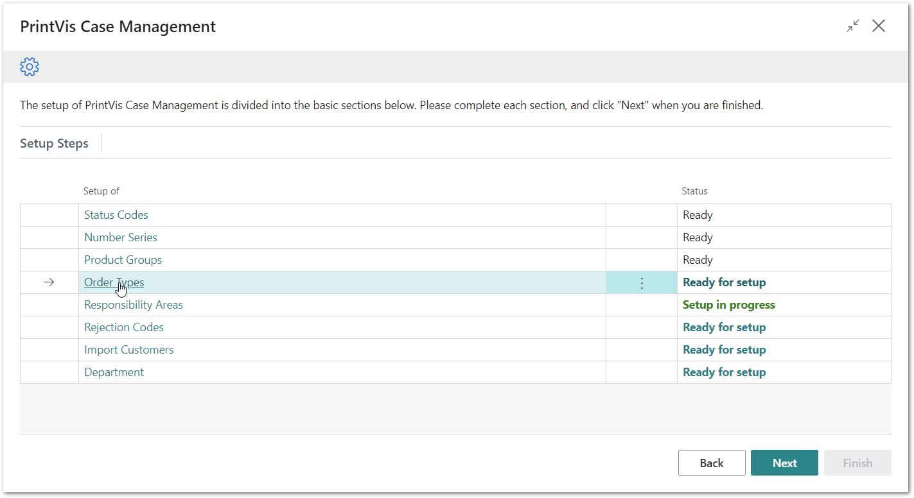
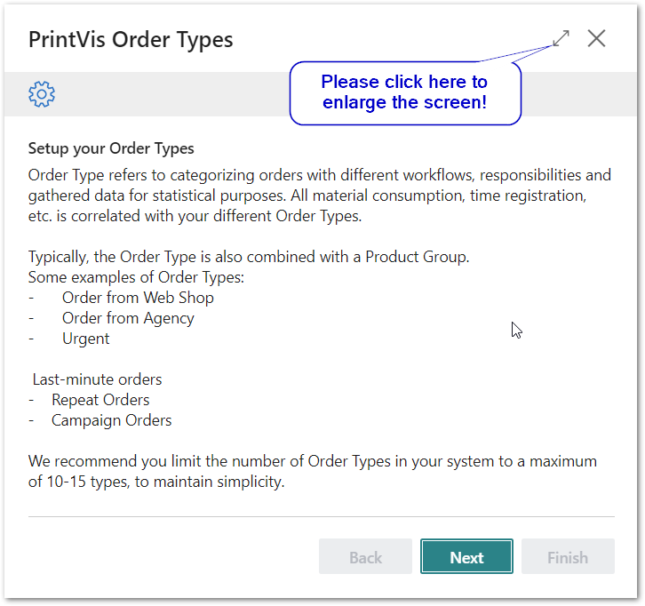
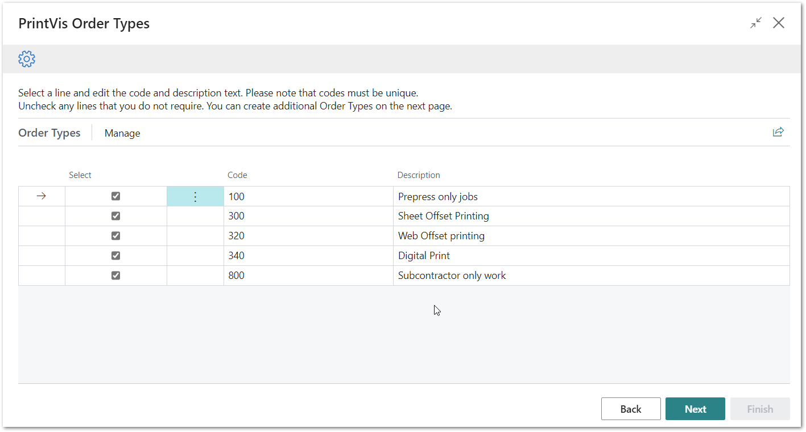
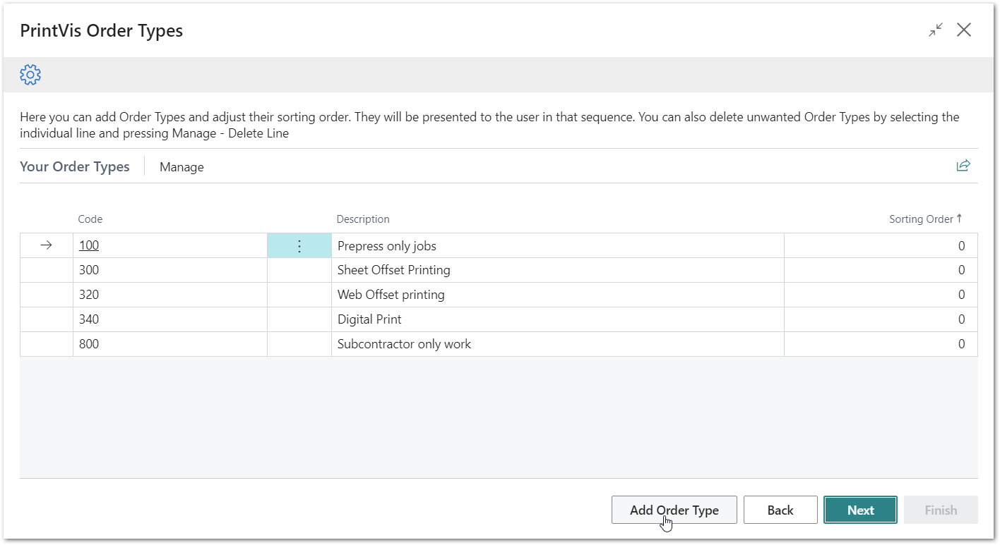
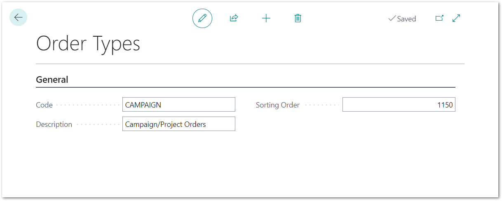
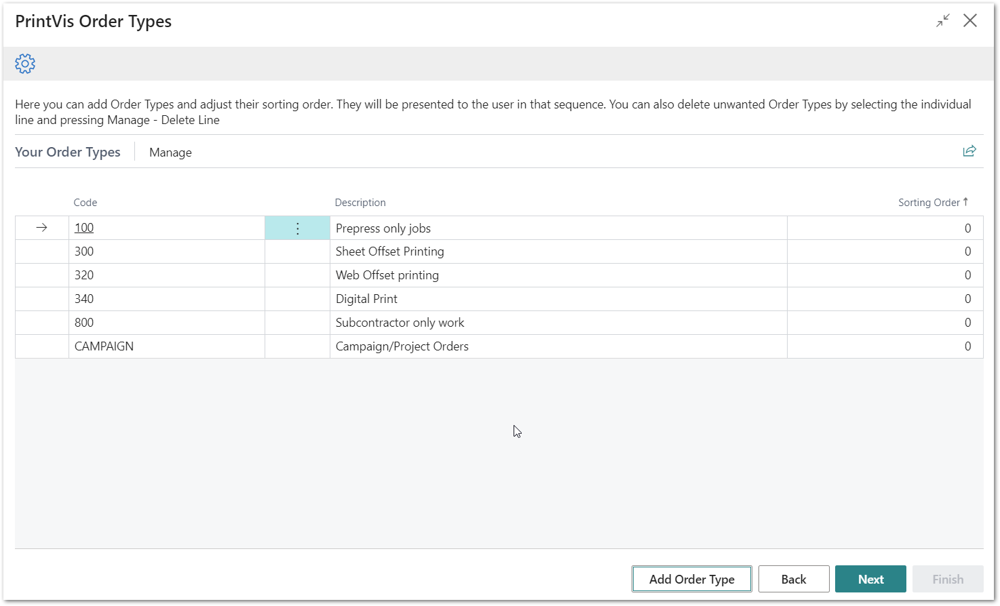
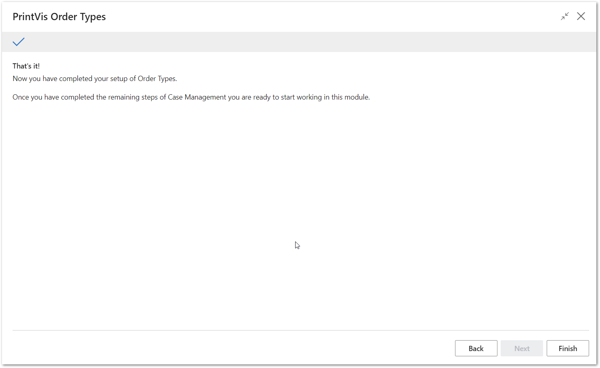

# PrintVis Onboarding – Case Management – Order Types

This documentation is a supporting manual on how to use the PrintVis
Onboarding Setup. It describes the required setup steps for this module.

# PrintVis Order Types Setup

Order Types are used in the system to group job types together for
production statistics. Typically, the Order Type is combined with a
Product Group. Order Types are attached directly to a Case.

Please click on “Order Types” to get started.

The “Welcome” screen will be displayed. Please read the instructions and
hit the “Next” button when you are ready to start.

Please note:  
Plan enough time to be able to finish a full step for each setup. This
may require 15 minutes or more.

## Building a Set of Suggested PrintVis Order Types

After clicking on “Order Types” the message below is displayed while
data is imported.

After the import is completed, the list below is displayed.

You can overwrite the list with your Order Types. The Code can be
numbers or letters or both.

In the next step you can create additional Order Types that are missing.

### Available Fields:

<table>
<colgroup>
<col style="width: 18%" />
<col style="width: 81%" />
</colgroup>
<thead>
<tr>
<th><strong>Field</strong></th>
<th><strong>Description</strong></th>
</tr>
</thead>
<tbody>
<tr>
<th>Select</th>
<td>
The selected line is indicated with a check box. You can disable
the line individually if you do not want to create it in the setup.

Above the list of Order Types, you will find the actions 'Deselect
All' and 'Select All.'
</td>
</tr>
<tr>
<th>Code</th>
<td>The Code is simply for quick entry on a job. You can change the code
to something that fits with your company.</td>
</tr>
<tr>
<th>Description</th>
<td>Change the description for the current line if required.</td>
</tr>
</tbody>
</table>

In the next step you can add additional Order Types if you are missing
any.

Hit “Next” when your list is ready to be created.

## Final List and Additional Order Types 

On this screen there are 3 options:

1.  You can change the sorting of the list.

-   This may be required if you have added new Order Types.

1.  You can delete existing lines.

-   Hit the 3 dots next to the Code column and select “Delete Line.”

1.  You can use the “Add Order Type” button at the bottom of the page to
    create additional Order Types.

### Adding Order Types

After you’ve clicked the button “Add Order Type” you can add your own if
any are missing. It is also easy to add more Order Types later when the
system is already live.

### 

Enter the data for the additional Order Type.

<table>
<colgroup>
<col style="width: 24%" />
<col style="width: 75%" />
</colgroup>
<thead>
<tr>
<th><strong>Field</strong></th>
<th><strong>Description</strong></th>
</tr>
</thead>
<tbody>
<tr>
<th>Code</th>
<td>Enter a new code</td>
</tr>
<tr>
<th>Description</th>
<td>Enter a description for your new Order Type.</td>
</tr>
<tr>
<th>Sorting Order</th>
<td>Enter a no. for the sequence of the current entry.</td>
</tr>
</tbody>
</table>

After entering the information above, hit the back arrow button at the
upper left-hand side of the page, the page will close, and you will see
the new Order Type list. It might be that the sorting is not properly
displayed. In this case, please press the F5 key to refresh the page.

Hit next when you are done.

After hitting “Next” you are done and by hitting “Finish,” the setup is
complete and marked as “Ready.”

