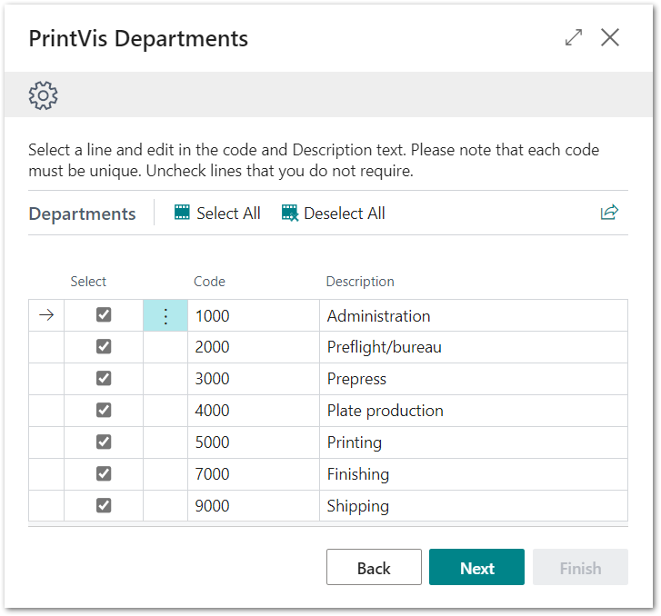

# PrintVis Onboarding – Case Management – Departments

This documentation is a supporting manual, how to use the PrintVis
Onboarding Setup. It describes the required setup steps for this module.

# PrintVis Departments Setup

Departments are used to define where Cost Centers (employees and
machinery) belong. Departments are used throughout the system for
statistical purposes and constitute the primary grouping of the
presentation on the different screens such as the calculation windows,
shop floor, etc. and in certain reports such as the job ticket.

Departments are used to group production or customer information that
can be entered by the user. Make sure also to set up administrative and
shipping departments for service information.

Please click on “Departments” to get started.

The “Welcome” screen will be displayed. Please read the instructions and
hit the “Next” button when you are ready to start.

Please note:  
Plan enough time to be able to finish a full step for each setup. This
may require 15 minutes or more.

## Building a Set of Suggested PrintVis Departments

After clicking on “Departments” the message below is displayed while
data is imported.

After the import is complete, the list below is displayed.

You can just overwrite the list with your departments. The Code can be
letters, numbers, or both. However, the number allows easy sorting and
aids with cost centers that will be set up later.

In the next step you can create additional Departments that are missing
here.

### Available Fields:

<table>
<colgroup>
<col style="width: 18%" />
<col style="width: 81%" />
</colgroup>
<thead>
<tr>
<th><strong>Field</strong></th>
<th><strong>Description</strong></th>
</tr>
</thead>
<tbody>
<tr>
<th>Select</th>
<td>
The selected line is indicated with a check box. You can disable
the line if you do not want to create it in the setup.

Above the list of Departments, you will find the actions 'Select All'
and 'Deselect All'.
</td>
</tr>
<tr>
<th>Code</th>
<td>You can change the code to something that fits your company.</td>
</tr>
<tr>
<th>Description</th>
<td>This is a full description. You can change the description for the
current line if required.</td>
</tr>
</tbody>
</table>

In the next step you can add additional Departments if you are missing
any.

Hit “Next” when your list is ready to be created.

## Final List and Additional Departments 

On this screen you have the following options:

1.  You can change the sorting of the list.

    -   Perhaps required after you have added new ones.

2.  You can delete existing lines.

    -   Hit the 3 dots next to the Code column and select “Delete Line”.

3.  You can click “Add department” at the bottom of the page to create
    additional Departments.

### Adding additional Departments

Click on “Add department” to add your own if any are missing. It is easy
also to add more departments later.

Enter the data for the additional department.

<table>
<colgroup>
<col style="width: 24%" />
<col style="width: 75%" />
</colgroup>
<thead>
<tr>
<th><strong>Field</strong></th>
<th><strong>Description</strong></th>
</tr>
</thead>
<tbody>
<tr>
<th>Code</th>
<td>Enter a new code or number.</td>
</tr>
<tr>
<th>Description</th>
<td>Enter a description for your new department.</td>
</tr>
<tr>
<th>Department Type</th>
<td>Please select a department type that matches your new department. If
there is no matching type, you can leave the option blank.</td>
</tr>
<tr>
<th>Sorting Order</th>
<td>Enter a no. for the sequence of the current entry.</td>
</tr>
</tbody>
</table>

After entering the information above, hit the back arrow button at the
upper left-hand side of the page; the page will close, and you will see
the new Departments list. If the sorting is not properly displayed,
please press the F5 key to refresh the page.

The full list is displayed.

Hit next when you are done.

After hitting “Next” then "Finish,” the setup is complete and marked as
“Ready.”

