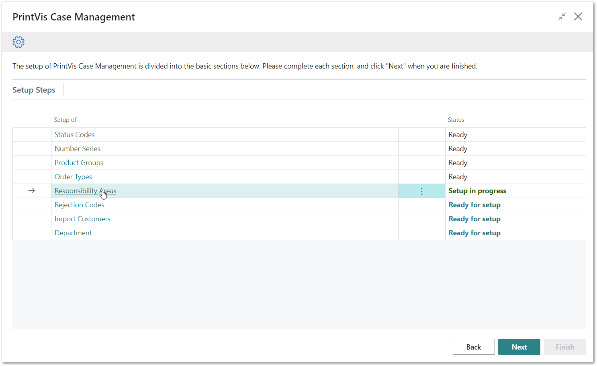
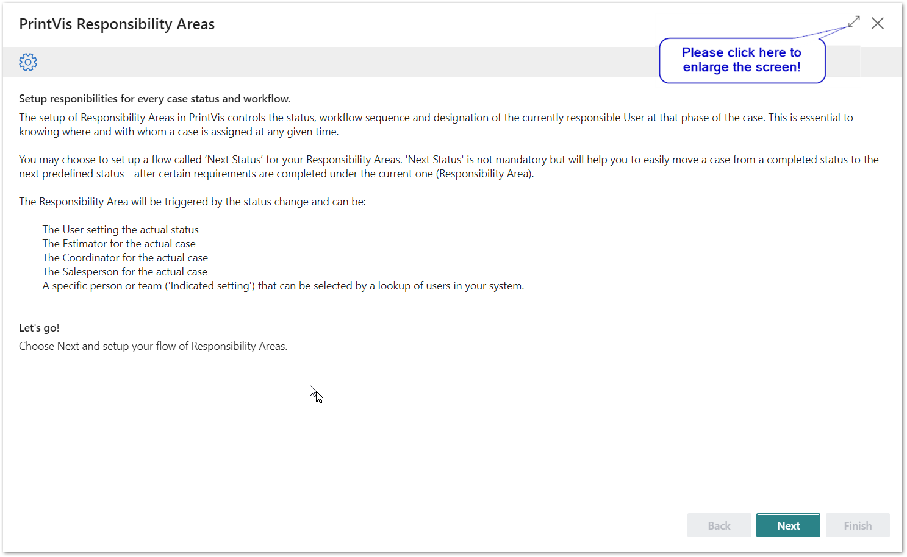
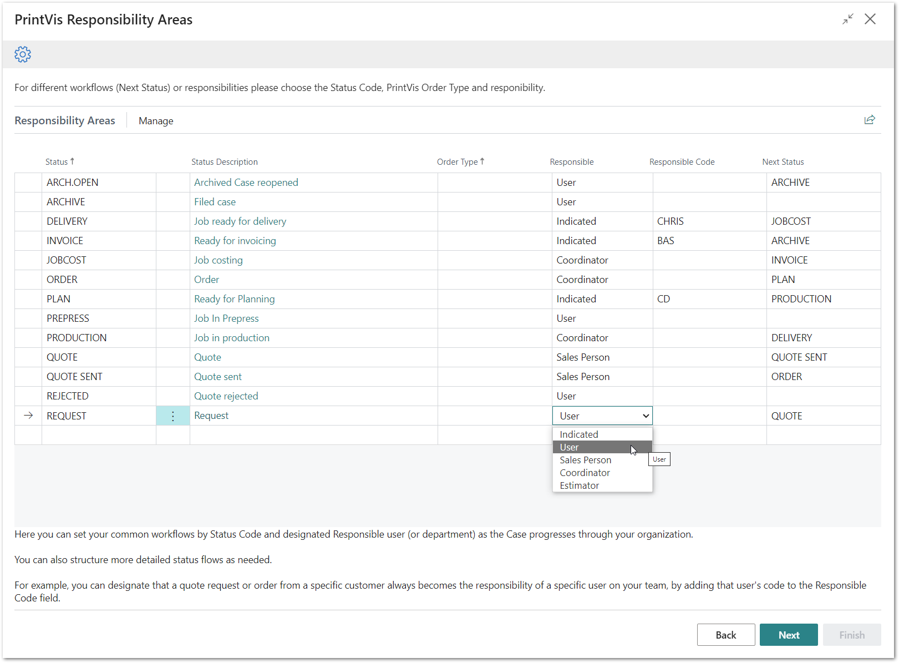
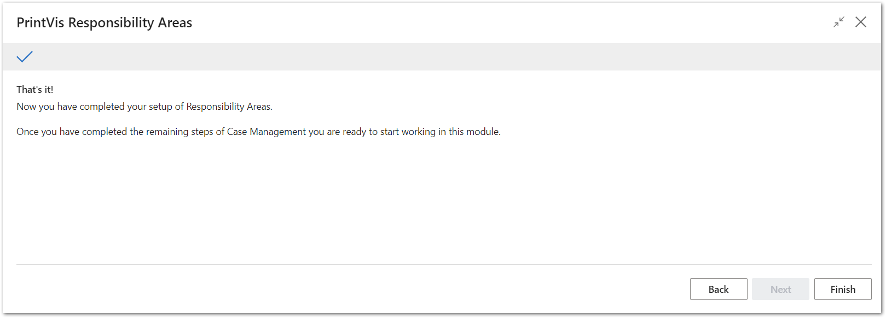

# PrintVis Onboarding – Case Management – Responsibility Areas

This documentation is a supporting manual, how to use the PrintVis
Onboarding Setup. It describes the required setup steps for this module.

# PrintVis Responsibility Areas Setup

In this area you can set up the person responsible for each Status Code.
In general, this function is used to define who is currently responsible
for a case when the case reaches a certain Status Code and to indicate
the next status in the process, which is suggested as “Next Status.”

Setting up areas of responsibility is a general option in controlling
case order and distributing responsibility for the case per Status Code.

Some examples for Responsibility Areas within Case Management could be:

-   A new case with the Status Code REQUEST is created.

    -   In general, an Account Manager will give the Estimator the
        information to create the request. Once the estimating is
        finished including a price, the action “Next Status” on the case
        will be used to change it and move it on.

-   The “Next Status” function changes the case into status QUOTE.

    -   A quote number is assigned.

    -   The CSR for the customer (e.g., assigned on customer card)
        becomes responsible, approves the estimate, and sends the quote.

    -   He would use the action “Next status” on the case to move it on
        again.

-   The “Next Status” function changes the case into status QUOTE SENT.

    -   The account manager for the customer becomes responsible for
        following-up on the quote.

    -   A deadline could be automatically set (e.g., to quote date + 1
        week). The case becomes delayed if the account manager does not
        follow up in time.

Please click on “Responsibility Areas” to get started.

The “Welcome” screen will be displayed. Please read the instructions and
hit the “Next” button when you are ready to start.

Please note:  
Plan enough time to be able to finish a full step for each setup. This
may require 15 minutes or more.

## Building a set of suggested PrintVis Responsibility Areas

PrintVis has produced a list as displayed below.

On this screen you have the following options:

1.  You can change the setting of who is Responsible and the Next
    Status.

2.  You can delete existing lines.

-   Hit the 3 dots next to the Code column and select “Delete Line”.

1.  You can add a line at the bottom of the list for a new combination
    of Status and Order Type. The system might throw an error if you
    leave a line incomplete or double an existing one.

### Available Fields:

<table>
<colgroup>
<col style="width: 18%" />
<col style="width: 81%" />
</colgroup>
<thead>
<tr>
<th><strong>Field</strong></th>
<th><strong>Description</strong></th>
</tr>
</thead>
<tbody>
<tr>
<th>Status</th>
<td>
Status Code

It is possible to add lines in the table and then choose a Status
Code from the look-up
</td>
</tr>
<tr>
<th>Status Description</th>
<td>This field shows the description for the selected Status Code.</td>
</tr>
<tr>
<th>Order Type</th>
<td>
The suggested setup is general for all Order Types, but it is
possible to add lines in case the next status or responsible person
should be different in some workflows, for example, if the case is a
Prepress order only.

It is recommended in the beginning not to set up too many variations
here and learn/work with the general flow first.
</td>
</tr>
<tr>
<th>Responsible</th>
<td>
This is the “Type” of responsibility. Options include:

<ul>
<li>
User

<ul>
<li>
For the current Status Code, the User changing it to the current
one becomes responsible.
</li>
</ul></li>
<li>
Salesperson

<ul>
<li>
For the current Status Code, the salesperson set on the case card
becomes responsible.
</li>
</ul></li>
<li>
Coordinator

<ul>
<li>
For the current Status Code, the Coordinator/CSR set on the case
card becomes responsible.
</li>
</ul></li>
<li>
Estimator

<ul>
<li>
For the current Status Code, the estimator who is set on the case
card becomes responsible.
</li>
</ul></li>
<li>
Indicated

<ul>
<li>
With this setting you choose the responsible person/ resource in
the Responsible code field.
</li>
</ul></li>
</ul></td>
</tr>
<tr>
<th>Responsible Code</th>
<td>For the Responsible type “Indicated” you can choose the responsible
person/ resource from the look-up.</td>
</tr>
<tr>
<th>Next Status</th>
<td>Select the Status Code the Next Status functions should switch to
after the current status.</td>
</tr>
</tbody>
</table>

Hit next when you are done.

After hitting “Next” then “Finish,” the setup is complete and marked as
“Ready.”

