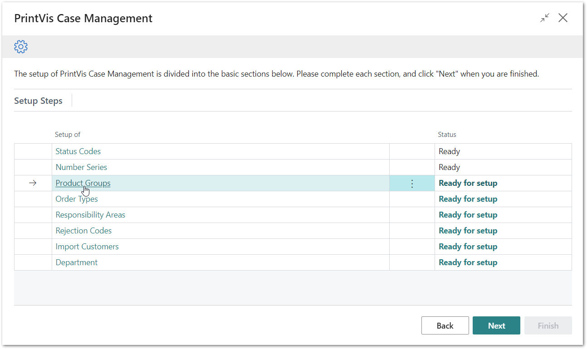
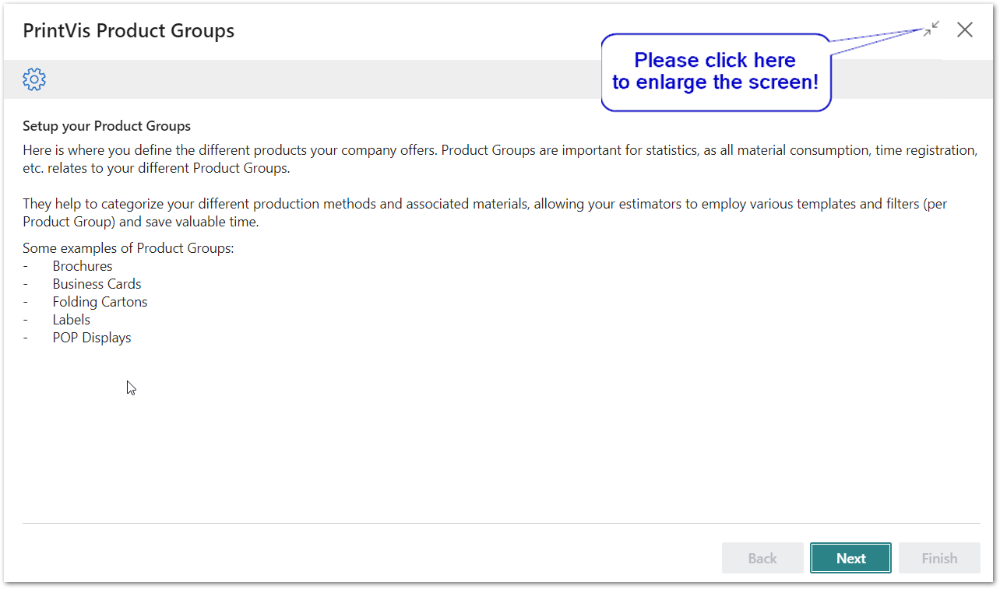
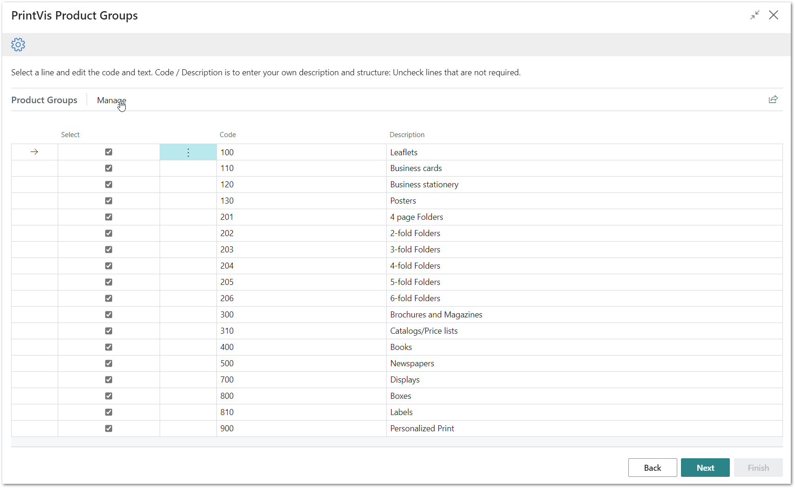
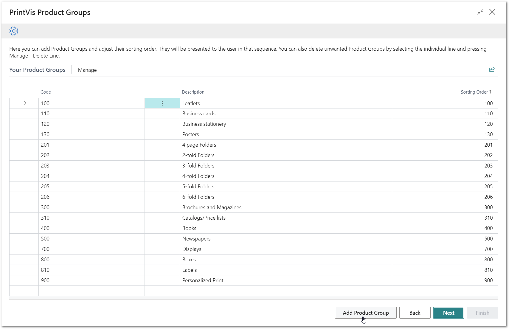
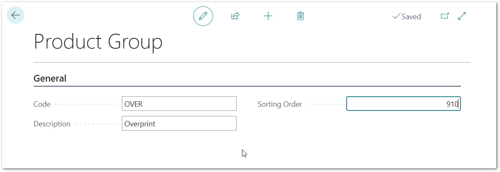
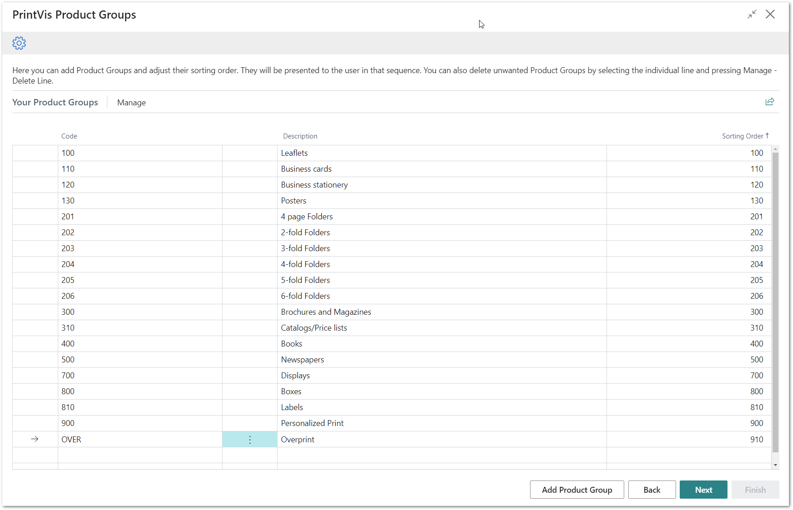
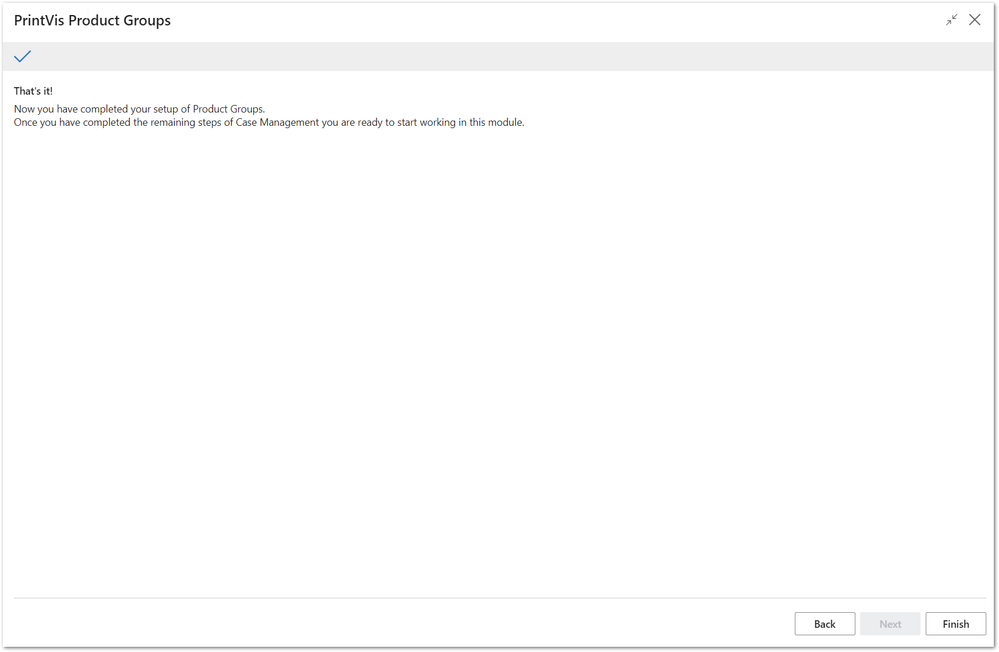

# PrintVis Onboarding – Case Management – Product Groups

This documentation is a supporting manual on ow to use the PrintVis
Onboarding – Case Management – Product Groups. It describes the required
setup steps for this module.

# PrintVis Product Groups Setup

Please click on “Product Groups” to get started.

The “Welcome” screen will be displayed. Please read the instructions and
hit the “Next” button when you are ready to start.

Please note:  
Plan enough time to be able to finish a full step for each setup. This
may require 15-20 minutes.

## Building a set of suggested PrintVis Product Groups

After clicking on “Product Groups” the message below is displayed while
data is imported.

After the import is completed, the list below is displayed.

This is a list of common Product Groups. You can deselect any that are
not required. In the next step you can create additional Product Groups
that are missing.

You can also overwrite the list with your daily Product Groups. The Code
can be letters or numbers - or a combination of both. The code is simply
for quick reference when building a job.

### Available Fields:

<table>
<colgroup>
<col style="width: 18%" />
<col style="width: 81%" />
</colgroup>
<thead>
<tr>
<th><strong>Field</strong></th>
<th><strong>Description</strong></th>
</tr>
</thead>
<tbody>
<tr>
<th>Select</th>
<td>
The selected line is indicated with a check box. You can disable
the line if you do not want to create it in the setup.

In the “Manage” tab at the top of the page you will find the actions
'Deselect All' and 'Select All'.
</td>
</tr>
<tr>
<th>Code</th>
<td>The Code is simply for quick entry of the Product Group on a job.
You can change the code to something that fits with your company.</td>
</tr>
<tr>
<th>Description</th>
<td>This is the full description. You can change the description for the
current line if required.</td>
</tr>
</tbody>
</table>

In the next step you can add additional Product Groups if you are
missing any.

Hit “Next” when your list is ready to be created.

## Final list and Additional Product Groups 

On this screen there are 3 options:

1.  You can change the sorting of the list.

-   This may be required if you have added new Product Groups.

1.  You can delete existing lines.

-   Hit the 3 dots next to the Code column and select “Delete Line”.

1.  Use the button “Add Product Group” at the bottom of the page for the
    ability to create additional groups.

### Adding Product Groups

After you’ve clicked the button “Add Product Group” you can add your own
if any are missing. It is easy also to add more Product Groups later
when the system is already set up.

### 

Enter the data for the additional Product Group.

<table>
<colgroup>
<col style="width: 24%" />
<col style="width: 75%" />
</colgroup>
<thead>
<tr>
<th><strong>Field</strong></th>
<th><strong>Description</strong></th>
</tr>
</thead>
<tbody>
<tr>
<th>Code</th>
<td>Enter a new code</td>
</tr>
<tr>
<th>Description</th>
<td>Enter a description for your new Product Group.</td>
</tr>
<tr>
<th>Sorting Order</th>
<td>Enter a number for the sequence of the current entry.</td>
</tr>
</tbody>
</table>

After entering the information above, hit the back arrow button at the
upper left-hand side of the page, the page will close, and you will see
the new product group list. It might be that the sorting is not properly
displayed. In this case, please press the F5 key to refresh the page.

Hit next when you are done.

After hitting “Next” and then “Finish”, the setup is complete and marked
as “Ready”.

