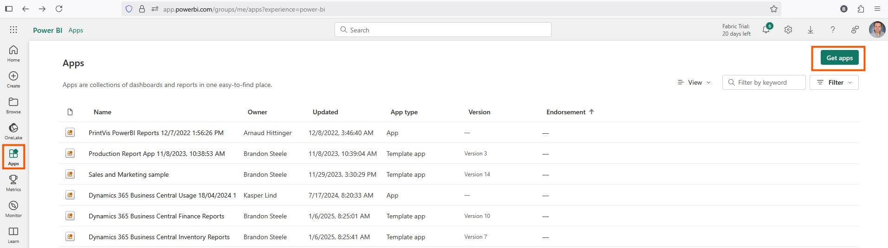
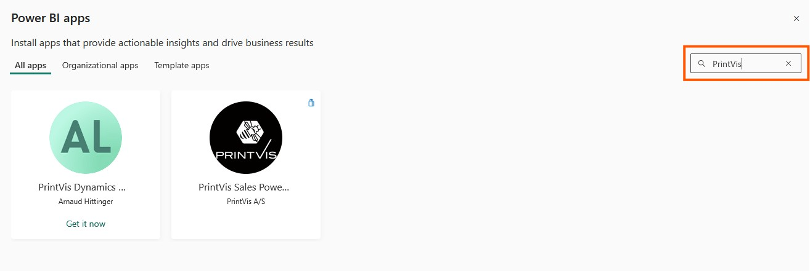

# PrintVis Power BI App Overview

The PrintVis Power BI apps deliver interactive dashboards that transform your print business data into actionable insights. Designed for roles across sales, production, and management, these apps centralize key KPIs—like job profitability, production throughput, and quote-to-order trends—into easy-to-navigate visuals.

## How to get the apps

1. A Power BI pro user will need to go to [https://apps.powerbi.com](https://apps.powerbi.com) to install the apps
2. Click on Apps in the left menu and select Get Apps

3. Search "PrintVis", select the App you want to install, and click Get it Now

- <a href="../SalesApp/" target="_self">Sales App</a>
- <a href="../ProductionApp/" target="_self">Production App</a>