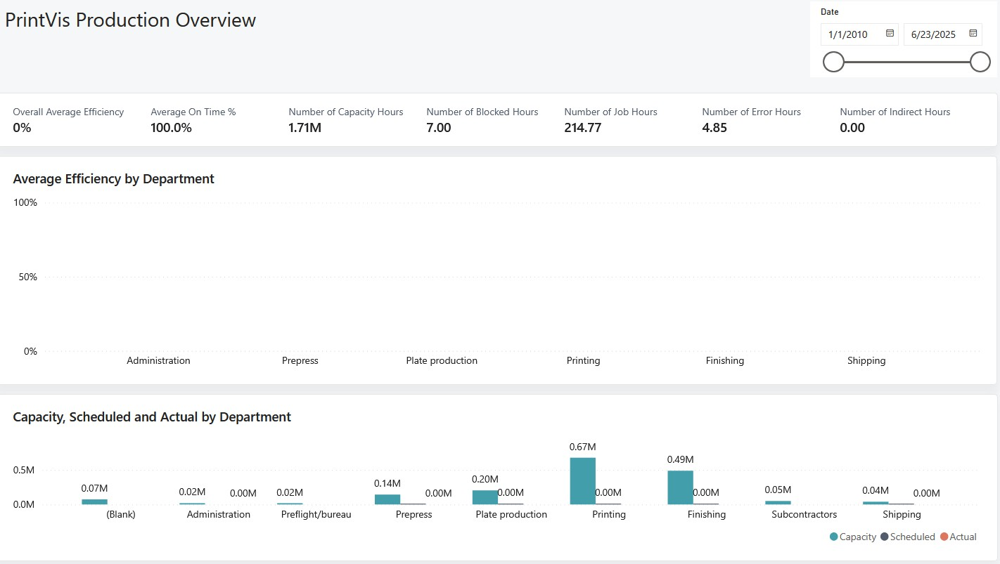

# PrintVis Production Power BI App

The PrintVis Production Power BI App provides powerful analytics to help teams understand performance, identify trends, and drive continuous improvement. Designed for production leaders and operational analysts, it brings together data on job costs, waste, efficiency, and machine utilization into a single, easy-to-use dashboard. By turning completed job data into actionable insights, it helps uncover root causes, improve planning, and boost profitability across the shop floor.

## Setup

1. Follow the instructions on the <a href="../PowerBIOverview/" target="_self">Power BI Overview</a> page to install the Power BI Production App
2. Select Connect your data in the bar at the top of the report and fill in your Environment and company values

The values can be found in your Business Central environment:
    a. The <b>Tenant ID</b> can be found in the Help & Support resource area, Report a problem section. It will be listed as Microsoft Entra tenant ID.
    b. The <b>Environment</b> will be listed next to that tenant ID but exclude the (Production) text.
    c. The <b>Company Name</b> can be found by searching for "Companies" and using the Name value.

Your tenant must have the PrintVis Business Central App already installed.