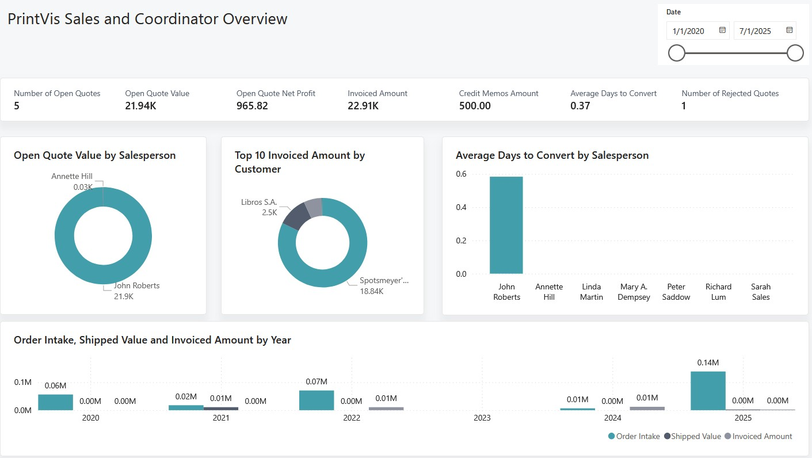

# PrintVis Sales Power BI App

The PrintVis Sales Power BI App offers clear, real-time dashboards for tracking quotes, orders, and customer interactions. Designed for sales reps and account managers, it solves the common pain of disconnected data by centralizing key insights in one easy-to-use view—helping teams respond faster, sell smarter, and improve customer satisfaction.

## Setup

1. Follow the instructions on the <a href="../PowerBIOverview/" target="_self">Power BI Overview</a> page to install the Power BI Sales App
2. Select Connect your data in the bar at the top of the report and fill in your Environment and company values

The values can be found in your Business Central environment:
    a. The <b>Tenant ID</b> can be found in the Help & Support resource area, Report a problem section. It will be listed as Microsoft Entra tenant ID.
    b. The <b>Environment</b> will be listed next to that tenant ID but exclude the (Production) text.
    c. The <b>Company Name</b> can be found by searching for "Companies" and using the Name value.

Your tenant must have the PrintVis Business Central App already installed.

