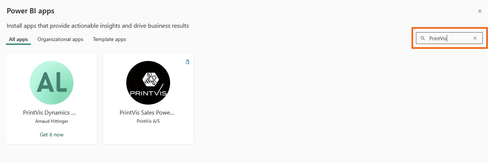

# PrintVis Power BI App Overview

The PrintVis Power BI apps deliver interactive dashboards that transform your print business data into actionable insights. Designed for roles across sales, production, and management, these apps centralize key KPIs—like job profitability, production throughput, and quote-to-order trends—into easy-to-navigate visuals.

## How to get the apps

1. Log into Power BI 
    - Go to [https://app.powerbi.com](https://app.powerbi.com) and log in with your work account

2. Go to Apps > Get Apps
    - On the left menu, Click <b>Apps</b> then <b>Get Apps</b> (top-right)

3. Search for "PrintVis"
    - Find our apps like <b>PrintVis Sales</b> and <b>PrintVis Production</b>

4. Click <b>Get it Now</b> and follow the prompts
    - Choose your workspace and click Install.

5. To connect each report to your own data, follow the guides for each individual report
    - <a href="../SalesApp/" target="_self">Sales App</a>
    - <a href="../ProductionApp/" target="_self">Production App</a>