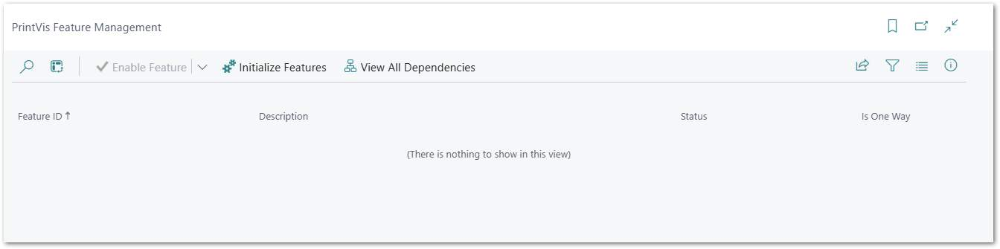

# PrintVis Feature Management

The PrintVis Feature Management is a setup to enable or disable PrintVis standard functionality that is embedded in the base app of PrintVis. Disabling could be necessary to avoid unexpected interaction if that functionality should be replaced with an additionally installed app.

Find the topic in the list and choose Disable or Enable. If a topic is missing, please hit the action **Initialize Features**. This will add new features that have been added.